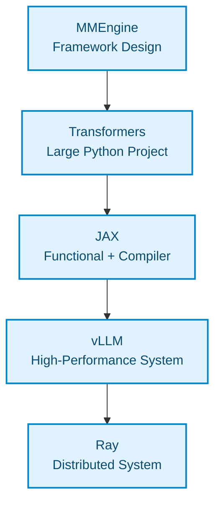
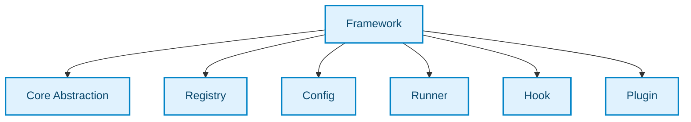
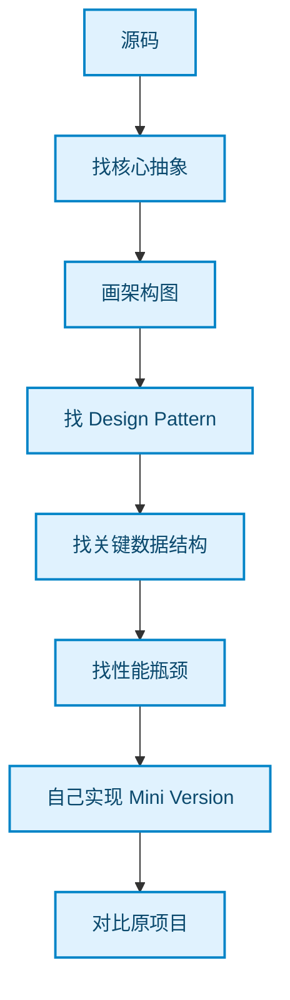

# AI 开源项目源码精读指南

## 一句话理解

> 通过阅读优秀 AI 开源项目源码，学习大型 AI 系统的设计模式、抽象、工程组织、性能优化、分布式训练/推理、测试和开发技巧——而不是只停留在"会调用框架 API"。

## 为什么重要

- PyTorch 用户很多，但能**设计和实现**大型 AI 基础设施的人很少
- 源码精读是从"框架使用者"升级到"AI Systems Engineer"的最短路径
- AI 领域的工程模式（Registry、Scheduler、Plugin、Graph Optimization 等）在传统软件工程教材中很难找到完整案例
- 自动驾驶 / BEV / 数据集场景天然需要借鉴这些项目的架构思想

## 核心推荐：12 个项目

| 项目 | 推荐度 | 最值得学什么 | 源码难度 |
|---|---:|---|---:|
| **JAX** | ⭐⭐⭐⭐⭐ | 函数式设计、Transformation、编译抽象 | ⭐⭐⭐⭐⭐ |
| **vLLM** | ⭐⭐⭐⭐⭐ | 高性能系统、Scheduler、Memory Manager | ⭐⭐⭐⭐⭐ |
| **OpenMMLab/MMEngine** | ⭐⭐⭐⭐⭐ | Framework Design、Registry、Config、插件化 | ⭐⭐⭐ |
| **Hugging Face Transformers** | ⭐⭐⭐⭐⭐ | 大型 Python 项目架构、模型抽象 | ⭐⭐⭐⭐ |
| **Ray** | ⭐⭐⭐⭐⭐ | 分布式系统、Actor、Task、调度 | ⭐⭐⭐⭐⭐ |
| **DeepSpeed** | ⭐⭐⭐⭐⭐ | 分布式训练、内存优化、系统工程 | ⭐⭐⭐⭐⭐ |
| **Triton** | ⭐⭐⭐⭐⭐ | Compiler / GPU Kernel / DSL | ⭐⭐⭐⭐⭐ |
| **llama.cpp** | ⭐⭐⭐⭐⭐ | C/C++ 工程、内存管理、跨平台 | ⭐⭐⭐⭐ |
| **ONNX Runtime** | ⭐⭐⭐⭐⭐ | Graph、Runtime、Execution Provider | ⭐⭐⭐⭐⭐ |
| **TensorRT** | ⭐⭐⭐⭐⭐ | 推理优化、Graph、Kernel、Runtime | ⭐⭐⭐⭐⭐ |
| **Detectron2** | ⭐⭐⭐⭐ | CV Framework Design | ⭐⭐⭐ |
| **Open3D** | ⭐⭐⭐⭐ | 3D 数据结构、算法工程 | ⭐⭐⭐ |

## Top 5 精读路线

如果只选 5 个，按以下顺序：



### 1. MMEngine —— Framework Design

[MMEngine GitHub](https://github.com/open-mmlab/mmengine)

OpenMMLab 的 MMDetection、MMSegmentation、MMPose 等项目建立在它的基础设施之上。重点不是算法，而是：



**重点研究 Registry 模式：**

```python
@MODELS.register_module()
class MyModel:
    ...

model = MODELS.build(cfg)
```

这本质是 **Dependency Injection + Factory + Registry** 的组合。对自己写 BEV Framework / Dataset Framework / Experiment Framework 非常有用。

### 2. Hugging Face Transformers —— 大型 Python 项目

[Transformers GitHub](https://github.com/huggingface/transformers)

重点不要先看具体模型，先看核心抽象：

- `PreTrainedModel` / `PretrainedConfig` / `PreTrainedTokenizer`
- `AutoModel` / `AutoConfig` / `AutoTokenizer`
- `GenerationMixin` / `ModelOutput`

`AutoModel.from_pretrained(...)` 背后是 Factory Pattern + Registry + Configuration Object + Serialization + Plugin Architecture 的完整工程。

### 3. JAX —— 函数式 + Compiler Design

[JAX GitHub](https://github.com/jax-ml/jax)

JAX 的核心是 composable transformations：

```python
grad(loss)              # 求导
jit(grad(loss))         # 求导 + 编译
vmap(jit(grad(loss)))   # 求导 + 编译 + 向量化
```

这背后是 **Functional Programming + Compiler + Transformation System** 的高级 framework design。

### 4. vLLM —— 高性能 AI 系统

[vLLM GitHub](https://github.com/vllm-project/vllm)

核心架构：


这是一个真正的 **Stateful + Concurrent + Resource Scheduling System**。PagedAttention 借鉴操作系统 virtual memory / paging 思路解决 KV cache 内存碎片问题，是系统思维在 AI 中的经典应用。

### 5. Ray —— 分布式系统

[Ray GitHub](https://github.com/ray-project/ray)

```python
@ray.remote
class Worker:
    ...
```

背后是 Client → Ray Core → Global Control Store → Scheduler → Worker → Object Store 的完整分布式架构，比 `torch.distributed` 更适合学习**通用分布式系统设计**。

## Design Pattern 对照表

| Pattern | 去哪里看 |
|---|---|
| Factory | Transformers / MMEngine |
| Registry | MMEngine |
| Dependency Injection | MMEngine / Hydra |
| Strategy | PyTorch / DeepSpeed |
| Plugin | Transformers / ONNX Runtime |
| Observer / Callback | MMEngine / Lightning |
| Pipeline | sklearn / Transformers |
| Composite | sklearn / PyTorch |
| Adapter | ONNX Runtime |
| Scheduler | vLLM / Ray |
| Resource Manager | vLLM |
| Actor Model | Ray |
| State Machine | vLLM |
| Lazy Evaluation | JAX |
| Functional Transformation | JAX |
| Graph Optimization | ONNX Runtime |
| Compiler IR | Triton / JAX |
| Memory Pool | vLLM |
| Object Pool | vLLM |
| Serialization | Transformers |
| Distributed Abstraction | DeepSpeed / Ray |

## 学习路线图

结合 PyTorch / CUDA / Docker / BEV / 自动驾驶 / RL / LLM 背景：

```mermaid
flowchart TD
    ROOT["AI Software Engineering"] --> FW["Framework"]
    ROOT --> RT["Runtime"]
    ROOT -> DS["Distributed"]

    FW --> MM["MMEngine"]
    RT --> ORT["ONNX Runtime"]
    DS --> RAY["Ray"]

    MM --> TF["Transformers"]
    ORT --> VLLM["vLLM"]
    RAY --> DSPEED["DeepSpeed"]

    TF --> JAX["JAX / Triton"]
    VLLM --> JAX

    JAX --> CMP["Compiler / GPU"]
    CMP --> LLP["llama.cpp"]

    classDef step fill:#e0f2fe,stroke:#0284c7,stroke-width:2px,color:#0c4a6e;
    ROOT:::step
    FW:::step
    RT:::step
    DS:::step
    MM:::step
    ORT:::step
    RAY:::step
    TF:::step
    VLLM:::step
    DSPEED:::step
    JAX:::step
    CMP:::step
    LLP:::step
```

## 源码精读方法

**不要从头到尾读源码。** 正确的方法：



例如研究 vLLM：不要从第一行开始看，而是带着问题"100 个并发请求怎么高效跑？"→ 找 Scheduler → Request 数据结构 → Sequence 数据结构 → KV Cache Manager → Block Manager → GPU Worker → 自己写一个 500 行 Mini-vLLM。

## 推荐的源码研究仓库结构

```text
ai-source-reading/
├── 01-mmengine/
│   ├── architecture.md
│   ├── registry.md
│   ├── runner.md
│   └── mini-mmengine/
├── 02-transformers/
│   ├── architecture.md
│   ├── auto-model.md
│   └── mini-transformers/
├── 03-jax/
│   ├── transformation.md
│   └── mini-jax/
├── 04-vllm/
│   ├── scheduler.md
│   ├── kv-cache.md
│   └── mini-vllm/
├── 05-ray/
│   ├── actor.md
│   └── mini-ray/
└── 06-triton/
    ├── kernel.md
    └── mini-kernel/
```

每个项目只回答 5 个问题：

1. 它解决了什么问题？
2. 核心抽象是什么？
3. 最重要的 3 个数据结构是什么？
4. 使用了哪些 Design Pattern？
5. 如果让我重写，我会怎么设计？

## 容易被忽略的项目

| 项目 | 学习价值 |
|---|---|
| **NumPy** | Array / Stride / View / Broadcast / Memory Layout / C Extension——理解 PyTorch Tensor 的基础 |
| **scikit-learn** | Estimator API / Pipeline / Transformer / Fit-Transform——API Design 教科书 |
| **Hydra** | Composition / Configuration / Plugin / Override——实验配置管理 |
| **Lightning** | Training Loop Abstraction / Callback / Strategy / Accelerator |

## 我的理解

这个回答的核心洞察是：**AI 领域的软件工程能力比模型知识更稀缺，也更有长期价值。** 

- 大多数人在"用框架"，少数人在"懂框架"，极少数人在"造框架"
- MMEngine → vLLM → JAX → Ray → Triton 这条路线分别对应 Framework / Runtime / Compiler / Distributed / GPU 五个层次，是非常系统的 AI 基础设施学习路径
- "自己实现 Mini Version"是最有效的源码学习方法——比被动阅读高效得多

## Related

- [PyTorch](../knowledge/pytorch/) — 本项目的 PyTorch 知识体系，是源码精读的前置基础
- [Transformer](../knowledge/ai/) — Transformers 库背后的模型架构
- [PPO](../knowledge/ai/) — DeepSpeed 相关的 RL 训练

## References

- [ChatGPT 对话原文](https://chatgpt.com/share/6a7c1287-8e34-83e8-87f9-a0fce9641689)
- [MMEngine](https://github.com/open-mmlab/mmengine)
- [Transformers](https://github.com/huggingface/transformers)
- [JAX](https://github.com/jax-ml/jax)
- [vLLM](https://github.com/vllm-project/vllm)
- [Ray](https://github.com/ray-project/ray)
- [Triton](https://github.com/triton-lang/triton)
- [DeepSpeed](https://github.com/deepspeedai/DeepSpeed)
- [llama.cpp](https://github.com/ggml-org/llama.cpp)
- [ONNX Runtime](https://github.com/microsoft/onnxruntime)
