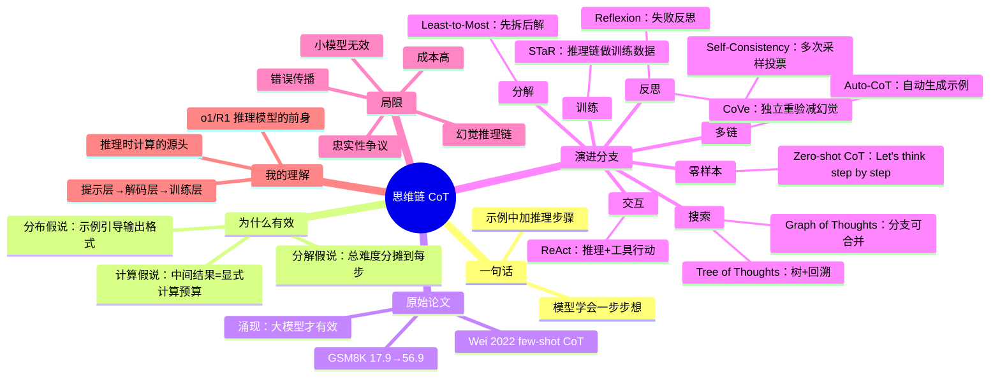

# 思维链（Chain-of-Thought）论文详解

## 一句话理解

思维链（Chain-of-Thought，简称 CoT）的核心发现是：**在给 LLM 的 prompt 里，不只是给它问题，而是先给它"一步步怎么想"的中间推理过程作为示例，模型就能学会自己一步步推理**，在数学、常识、符号推理等任务上大幅提升准确率。

> 类比：就像教人做数学题——只给答案 vs 给完整的解题步骤。给步骤，学生不仅能学会这道题，还能迁移到同类题。

## 为什么重要

在 CoT 出现之前（2022 年前），人们普遍用两种方式提示 LLM：

| 方式 | 做法 | 问题 |
|---|---|---|
| Zero-shot | 直接问："小明有 3 个苹果，又买了 2 个，一共几个？" | 简单题行，复杂题（多步推理）经常错 |
| Few-shot（少样本） | 给几个"问题→答案"的例子，再问新问题 | 例子只有输入输出，模型学不到"推理过程" |

CoT 的突破在于：**示例里加入中间推理步骤**（intermediate reasoning steps），模型就会模仿这种"想一步、写一步"的模式。这不是模型突然变聪明了，而是**提示方式本身改变了模型输出的路径**。

## 一、原始论文：Chain-of-Thought Prompting Elicits Reasoning in Large Language Models

**作者**：Jason Wei et al.（Google Research）
**时间**：2022 年 1 月（NeurIPS 2022）
**论文**：[arXiv:2201.11903](https://arxiv.org/abs/2201.11903)

### 问题

大模型（PaLM 540B 等）在常规 prompt 下，多步数学、常识推理仍然很弱。而且模型越大，只靠"多给几个例子"收益越来越小。

### 关键思想

**在 few-shot 示例中，除了给"问题→答案"，还插入"思考过程"**。例如：

```text
问：罗杰有 5 个网球，他又买了 2 罐网球，每罐有 3 个。他现在有多少个网球？
答：罗杰一开始有 5 个球。2 罐网球，每罐 3 个，就是 2×3=6 个球。
    5+6=11。所以答案是 11。 ✅

问：自助餐厅有 23 个苹果，用了 20 个做午餐，又买了 6 个，现在有多少个？
答：
```

模型会跟着示例的模式，自己写出"23-20=3，3+6=9，答案是 9"这样的推理链。

### 方法（三个关键组件）

1. **推理步骤（reasoning chain）**：示例答案里写入中间计算/推理过程，而不是只给最终答案
2. **少样本（few-shot）**：通常给 8 个左右带推理链的示例，让模型先看到“题目 → 分步思考 → 最终答案”的格式
3. **规模是关键（emergent）**：这种能力在模型达到一定规模后**突然出现**（"涌现"），小模型（如 GPT-3 175B 之前的规模）加 CoT 效果有限

### 具体怎么做

可以把 few-shot CoT 理解成一个很固定的工作流：

1. **挑题目**：选几道和目标任务同类型、但不完全重复的题
2. **写示范**：每道示范都写出中间推理步骤，不要只写答案
3. **保持格式一致**：所有示范尽量用同一种结构，比如“问题 → 推理 → 最终答案”
4. **让模型续写**：遇到新题时，把问题接在示例后面，让模型沿着同样的格式往下写
5. **抽取最终答案**：推理链写完以后，再从最后一句里抽出答案作为输出

一句话说就是：**先教模型“怎么想”，再让它自己照着想**。

```text
示例 1
问：...
答：先算 A，再算 B，所以答案是 C。

示例 2
问：...
答：先拆成两步，再合并结果，所以答案是 D。

新问题
问：...
答：
```

如果想再往上提准确率，后面常见的增强方法就是：

- **Self-Consistency**：同一个问题采样多条推理链，再投票
- **Zero-shot CoT**：不写示例，只加一句“Let's think step by step.”
- **ToT / GoT**：不只走一条链，而是搜索和合并多个分支
- **ReAct**：在推理中插入工具调用和观察结果
- **CoVe / Reflexion / STaR**：让模型自检、反思，甚至把推理链变成训练数据

### 实验结果（PaLM 540B）

| 基准 | 标准 prompting | CoT prompting | 提升 |
|---|---|---|---|
| GSM8K（小学数学） | 17.9% | **56.9%** | +39 个百分点 |
| SVAMP（数学应用题） | 66.5% | **80.9%** | +14 |
| MAWPS（数学） | 78.5% | **91.7%** | +13 |
| MultiArith（数学） | 91.0% | **97.9%** | +7 |
| 常识推理（CSQA） | 68.6% | **75.9%** | +7 |

关键结论：**GSM8K 从 17.9% 跳到 56.9%**——这是当时最轰动的结果之一，因为它证明了"提示词工程"能带来超过模型 scaling 的效果。

### 局限

- 只在**大模型**上涌现（那时约 100B 参数以上），小模型不显著
- 需要手工写示例，成本高（后来被 Auto-CoT 解决）
- 没有理论证明为什么有效（后来有多篇分析论文）

## 二、Zero-shot CoT：让模型自己说出"Let's think step by step"

**作者**：Takeshi Kojima et al.（东京大学 / Google）
**时间**：2022 年 5 月
**论文**：[arXiv:2205.11916](https://arxiv.org/abs/2205.11916)（"Large Language Models are Zero-Shot Reasoners"）

### 关键发现

不需要写任何示例，只要在问题后面加一句魔法咒语：

```text
问：超市有 23 个苹果，用了 20 个，又买了 6 个，现在有几个？
答：让我们一步步思考。（Let's think step by step.）
```

模型就会自己生成推理过程再给答案。

### 方法与结果

- 两阶段：**① 生成推理链**（加"Let's think step by step"）→ **② 从推理链提取答案**
- MultiArith：Zero-shot 17.7% → **78.7%**（+61！）
- GSM8K：10.4% → **40.7%**
- 结论：**推理能力不需要精心设计的示例也能被"唤醒"**，但整体不如带示例的 few-shot CoT

### 为什么有效（这篇论文的分析）

- 第一阶段的输出空间被"引导"到推理路径，而不是直接跳到答案
- 相当于把"一步猜答案"变成"多步搜索"

## 三、Self-Consistency：投票选出最稳的答案

**作者**：Xuezhi Wang et al.（Google Research）
**时间**：2022 年 3 月
**论文**：[arXiv:2203.11171](https://arxiv.org/abs/2203.11171)

### 问题

CoT 是**贪心解码**（greedy decoding），一次只走一条路径。但推理往往有多个分支，一条路径可能走错。

### 关键思想

**让模型多次采样，生成多条不同的推理链，对答案做多数投票**。

```text
问题：鸡和兔共 35 个头，94 只脚，各几只？

采样 1：假设全是鸡 35×2=70 脚，差 24，兔子 24÷2=12 只，鸡 23 只 → 答案 {鸡23,兔12}
采样 2：... 同样算 → {鸡23,兔12}
采样 3：列方程 x+y=35, 2x+4y=94 → 解出 {鸡23,兔12}
采样 5：算错一步 → {鸡20,兔15} ❌
多数投票 → {鸡23,兔12} ✅
```

### 为什么有效

- 一条错误推理链的答案可能是错的，但**多条独立采样中，正确答案出现的频率更高**
- 相当于把"单次推理"变成"蒙特卡洛采样 + 聚合"

### 结果

| 基准 | CoT | Self-Consistency |
|---|---|---|
| GSM8K | 56.9% | **74.4%**（采样 40 次） |
| MultiArith | 97.9% | **100%** |

**局限**：计算成本是采样次数的倍数（40 次采样 = 40 倍推理开销）；对"错误答案也一致"的问题无效（系统偏差）。

## 四、Auto-CoT：自动生成示例，告别手工

**作者**：Zhuosheng Zhang et al.（哈尔滨工业大学 / Google）
**时间**：2022 年 10 月
**论文**：[arXiv:2210.03493](https://arxiv.org/abs/2210.03493)

### 问题

few-shot CoT 需要**手工编写**带推理链的示例，费力且容易引入偏见（示例选得好不好直接影响结果）。

### 关键思想

**两步自动化**：

1. **聚类采样**：把训练问题按相似度聚类，从每个簇里挑代表性问题
2. **让模型自己生成推理链**：对挑出的问题用"Let's think step by step"生成推理链作为示例

### 效果

- 在 10 个推理基准上平均提升（接近甚至超过手工 CoT）
- 消除了"示例选择偏差"：聚类保证示例覆盖不同题型，而不是都偏一类

## 五、Least-to-Most：把难题拆成小题

**作者**：Denny Zhou et al.（Google Research）
**时间**：2022 年 5 月
**论文**：[arXiv:2205.10625](https://arxiv.org/abs/2205.10625)

### 关键思想

**两阶段：先"分解"后"求解"**——这正是人类解决复杂问题的通用策略。

```text
阶段 1（分解）：把问题拆成子问题列表（从易到难）
阶段 2（依次求解）：先解子问题 1，把答案给模型，再解子问题 2（可依赖前面结果）
```

### 例子

```text
"如果地图上 5 个城市，每对城市之间有一条路，总共几条路？"
→ 子问题 1：5 个城市两两组合有多少种？
→ 子问题 2：C(5,2) = 5×4÷2 = 10
→ 答案：10
```

### 结果

- 在符号操作、组合泛化（compositional generalization）任务上效果显著
- 对 SCAN、Last Letter 等需要"组合能力"的基准，是当时最先进的 prompting 方法
- **局限**：分解的质量完全依赖 LLM 的理解；子问题解错会传播

## 六、Tree of Thoughts（ToT）：搜索树上的推理

**作者**：Shunyu Yao et al.（普林斯顿大学）
**时间**：2022 年 12 月
**论文**：[arXiv:2305.10601](https://arxiv.org/abs/2305.10601)

### 问题

CoT 是**单条直线**（chain），一条路走到黑。对需要探索-回溯的问题（游戏、规划、数学证明）力不从心。

### 关键思想

**把推理变成一棵树**：每步生成多个候选"想法"，评估好坏，差的剪掉，好的继续扩展，必要时回溯。

```text
问题
 ├─ 想法 1a ── 评估 0.7 ✅ ── 子想法 ...
 ├─ 想法 1b ── 评估 0.2 ❌（剪枝）
 └─ 想法 1c ── 评估 0.5 ── ...
```

四个组件：
1. **想法生成器**：从当前状态生成多个下一步想法
2. **状态评估器**：对想法打分（可以是"值"评估或"投票"评估）
3. **搜索算法**：BFS 或 DFS（广度/深度优先），带回溯
4. **总收益**：把探索-评估-回溯组合成完整搜索

### 结果

- 24 点游戏：4% → **74%**
- 创意写作：人类评估 7.56% → 最佳到 89%（对比 CoT）
- 迷你填字游戏：10% → **60%**
- **局限**：计算开销大（每步多候选 × 每候选一次 LLM 调用）；评估器质量决定上限

## 七、Graph of Thoughts（GoT）：让思维连成图

**作者**：Maciej Besta et al.（ETH Zürich）
**时间**：2023 年 8 月
**论文**：[arXiv:2308.09687](https://arxiv.org/abs/2308.09687)

### 关键思想

ToT 是一棵树（分支不能合并），GoT 把推理扩展成**图**：允许**合并**不同分支的中间结果（像并行计算的 reduce）。

```text
CoT:    A → B → C → D          （链）
ToT:    A → {B1,B2} → {C1,...} （树，分支）
GoT:    A → {B1,B2} → merge(B1,B2) → C → {D1,D2} → merge （图，可合并）
```

### 优势与结果

- 对"需要组合多个子结论"的问题（如排序、合并、写长文档）更有效
- 在排序任务上相比 ToT 大幅提升质量，成本更低（合并避免了重复计算）
- **局限**：图结构的定义依赖任务；实现复杂

## 八、ReAct：推理 + 行动结合（CoT 的智能体化）

**作者**：Shunyu Yao et al.（普林斯顿）
**时间**：2022 年 10 月
**论文**：[arXiv:2210.03629](https://arxiv.org/abs/2210.03629)

### 关键思想

CoT 只在"脑子里推理"，不接触外部世界。ReAct 让模型**交替进行推理（Thought）和行动（Action）**，行动结果（Observation）再喂回模型：

```text
Question: 巴黎现在温度多少？
Thought 1: 我需要查天气。可以用搜索工具。
Action 1: search("Paris weather")
Observation 1: 22°C，晴
Thought 2: 有了，巴黎现在 22 度。可以回答。
Answer: 巴黎现在 22°C，天气晴朗。
```

### 为什么重要

- 推理过程**可审计**（每一步都解释为什么做这个行动）
- 模型可以**修正错误**（查到的结果和预想不同，就调整）
- 解决 CoT 的**知识时效性**问题（模型知识有截止日期，搜索能补）
- 这也是后来 **Agent 范式**（如 LangChain ReAct agent、各类 Tool Use）的直接先驱

### 结果

- HotpotQA / FEVER / ALFWorld 上显著优于纯 CoT 或纯行动
- **局限**：依赖工具质量；行动失败/工具错误可能误导推理

## 九、Chain-of-Verification（CoVe）：自我验证减少幻觉

**作者**：Shemesh et al.（Meta AI）
**时间**：2023 年 9 月
**论文**：[arXiv:2309.11495](https://arxiv.org/abs/2309.11495)

### 关键思想

**让模型检查自己的答案**，四步：

1. **起草**：先给一个初始回答
2. **生成验证问题**：把回答里的每个关键断言变成问题
3. **回答验证问题**：独立地回答这些问题（**不让模型看原回答**，避免确认偏差）
4. **修订**：根据验证结果修正原回答

### 关键细节

- 第 3 步"不参考原回答"是精髓：如果让模型看着自己的回答去检查，它会倾向于"是的都对"（confirmation bias）
- 通过**独立重算**找出事实性错误

### 结果

- 在幻觉基准上减少约 30-40% 的事实错误（列表问答等）
- **局限**：验证问题的质量影响效果；不能完全消除幻觉

## 十、Reflexion：从失败中学习（带"记忆"的推理）

**作者**：Noah Shinn et al.（东北大学）
**时间**：2023 年 3 月
**论文**：[arXiv:2303.11366](https://arxiv.org/abs/2303.11366)

### 关键思想

**在多次尝试之间加入"反思"**：试错后，让模型总结"我为什么错了"，把反思记下来，下次尝试时参考。

```text
尝试 1：写代码 → 测试失败 ❌
反思：我用了错误的边界条件，没有考虑输入为空的情况。
尝试 2：读反思 → 修改代码 → 测试通过 ✅
```

这是"语言形式的强化学习"（verbal reinforcement learning）：**用自然语言总结教训，而不是梯度更新**。

### 结果

- HumanEval（代码）：失败后自我修正，成功率大幅提升
- 棋类/迷宫推理等决策任务显著改善
- **局限**：反思质量不稳定；需要环境反馈（测试结果、裁判）

## 十一、STaR：让模型自己教自己

**作者**：Eric Zelikman et al.（斯坦福）
**时间**：2022 年 3 月
**论文**：[arXiv:2203.14465](https://arxiv.org/abs/2203.14465)（"STaR: Bootstrapping Reasoning With Reasoning"）

### 关键思想

**Self-Taught Reasoner（自学推理器）**：模型先自己尝试生成推理链，答对了就保留"问题+推理链"作为训练数据，答错了用正确答案反向推理（rationalization）再生成一条，然后**用这些数据微调模型**——迭代进行。

```text
迭代循环：
1. 对一批问题，模型生成推理链+答案
2. 答对的 → 收集为训练样本
3. 答错的 → 给正确答案，让模型反推（rationalize）一条合理推理链 → 也收集
4. 用收集的数据微调模型
5. 回到 1，模型变强了，能解更多题
```

### 意义

- 把 CoT 从"提示技巧"升级为"**训练方法**"：模型不仅会模仿，还内化了推理能力
- 对小学数学（GSM8K）提升显著
- **局限**：简单任务易过拟合（需要 filter）；反推的推理链可能不合逻辑

## 十二、机制分析：为什么 CoT 有效？

学界对"为什么"有多篇分析，主流的三个解释：

### 1. 中间计算把"总难度"分摊了（分解假说）

> 复杂问题 = 若干简单子问题的串联。CoT 强制模型**先输出中间变量**，每步的计算负担小，错误率低，累积起来反而准确。

- 类比：口算"237×481"直接出错率高；分步竖式每一步都简单，最终正确
- 论文证据：CoT 的每步正确率 ≈ 标准 prompt 的简单问题正确率

### 2. 扩大了"计算深度"（深度假说 / 计算假说）

- Transformer 的**每层计算有深度限制**（固定层数），复杂推理需要"更多步骤"
- CoT 通过**让模型把中间结果写出来**，把"隐式计算"变成"显式多步"，等效于给了模型更多层数/步数的计算预算
- 论文证据：给模型加"我再想想"（增加 token 预算）就有效，不需要推理链内容正确——说明**多写本身就在给计算**（模型内部在做工作）

### 3. 提示位置决定了输出分布（示例分布假说）

- 带推理链的示例把输出分布**推向"先推理后回答"的格式**，模型顺着格式走，自然多算了

### 三个解释的共识

**CoT 有效 = 把推理从"一次赌答案"变成"多次小赌"**，每次小赌的失败率低，总成功率自然高。

## 十三、演进图谱（时间线）

```text
2022-01  CoT 原始论文（few-shot + 推理步骤）★ 里程碑
2022-03  Self-Consistency（多次采样投票）
2022-03  STaR（推理链做训练数据）
2022-05  Zero-shot CoT（"Let's think step by step"）
2022-05  Least-to-Most（分解后依次求解）
2022-10  Auto-CoT（自动生成示例）
2022-10  ReAct（推理 + 工具行动）★ 智能体先驱
2022-12  Tree of Thoughts（树搜索）★ 里程碑
2023-03  Reflexion（失败反思 + 语言强化）
2023-08  Graph of Thoughts（图合并）
2023-09  Chain-of-Verification（自我验证减幻觉）
```

```text
演进主线：
  单链（CoT）
    → 多链投票（Self-Consistency）
    → 分解（Least-to-Most / Auto-CoT）
    → 搜索（ToT / GoT）
    → 与外部交互（ReAct）
    → 自我反思（Reflexion / CoVe）
    → 训练内化（STaR）
```

## 十四、局限与批评（论文之外也要知道）

1. **幻觉与错误传播**：推理链中间一步错了，后面全错（error propagation）
2. **"看似合理但错"**：模型会生成逻辑连贯但答案错误的链（hallucinated reasoning）
3. **长度与成本**：CoT 输出的 token 数远超直接回答，推理成本高
4. **涌现能力不稳定**：小模型基本无效，能力随规模突变（"涌现"的争议：也许只是度量方式问题）
5. **安全性**：推理链可能暴露模型内部偏见或有害推理；有研究表明 CoT 也可能放大错误信息
6. **评估困难**：推理链对错没有统一标准，中间步骤算"对"还是"错"难界定
7. **事后合理化**：有些工作质疑模型是否"真在推理"——也许只是生成看起来合理的文本（grokking vs. faithful reasoning 的争论）

## 十五、我的理解

**思维链最本质的贡献，是揭示了大模型的一种"显式计算"能力**：

> 模型内部的计算是隐式的、不可见的。CoT 提供了一条"让它把中间计算写到外面"的通道，既提高了正确率，也第一次让人类能**审计模型的推理过程**。

我把它看作三个层面的递进：

1. **提示层（CoT / Zero-shot CoT / Auto-CoT）**：改变输入格式，唤醒能力——成本最低
2. **解码层（Self-Consistency / ToT / GoT）**：改变采样与聚合策略，把"一次推理"升级为"搜索"——质量更高但更贵
3. **训练层（STaR / 后续 RL 方法）**：把推理链变成训练信号，让能力内化——最根本，也是今天 o1/R1 类模型"系统 2 思考"的前身

今天的 o1 / DeepSeek-R1 等"推理模型"，本质上是把 CoT 的洞察工程化：**用 RL 训练模型自己生成推理轨迹（thinking tokens），并在推理时采样-择优**。可以说，整个"推理时计算（inference-time compute）"研究方向的源头，就是 2022 年的 CoT。

**一句话总结**：CoT 告诉我们——对 LLM 来说，**"怎么问"和"给它多少计算空间"和"让它写下来"同等重要**；而后续所有推理增强方法，都是在"写下来"的基础上加搜索、加交互、加反思、加训练。

## 十六、思维导图（快速回顾）

### Mermaid 思维导图



### 文本缩进版（无图渲染时的备用）

```text
思维链 CoT
├─ 一句话：示例里加推理步骤，模型学会一步步想
├─ 为什么有效
│   ├─ 分解假说：总难度分摊到每步
│   ├─ 计算假说：中间结果 = 显式计算预算
│   └─ 分布假说：示例引导输出格式
├─ 原始论文：Wei 2022（GSM8K 17.9→56.9，涌现能力）
├─ 演进分支
│   ├─ 零样本：Zero-shot CoT（"Let's think step by step"）
│   ├─ 多链：Self-Consistency（投票）、Auto-CoT（自动示例）
│   ├─ 分解：Least-to-Most（先拆后解）
│   ├─ 搜索：ToT（树+回溯）、GoT（分支合并）
│   ├─ 交互：ReAct（推理+工具，Agent 先驱）
│   ├─ 反思：Reflexion（失败反思）、CoVe（独立重验）
│   └─ 训练：STaR（推理链做训练数据）
├─ 局限：错误传播 / 幻觉链 / 成本高 / 小模型无效 / 忠实性争议
└─ 我的理解：提示层 → 解码层 → 训练层；o1/R1 推理模型的前身
```

## Related

- [GRPO](./../knowledge/ai/grpo.md) — 今天推理模型（R1 等）的训练方法，是 CoT 洞察的训练层实现
- [PPO](./../knowledge/ai/ppo.md) — 推理模型 RL 训练的另一个核心算法
- [AI 开源项目源码精读指南](./../knowledge/ai/ai-open-source-source-reading.md) — 推理类项目的源码阅读方法论
- [AI 索引](./../knowledge/ai/index.md)

## References

- [Wei et al. 2022 — Chain-of-Thought Prompting Elicits Reasoning in Large Language Models](https://arxiv.org/abs/2201.11903)
- [Kojima et al. 2022 — Large Language Models are Zero-Shot Reasoners](https://arxiv.org/abs/2205.11916)
- [Wang et al. 2022 — Self-Consistency Improves Chain of Thought Reasoning](https://arxiv.org/abs/2203.11171)
- [Zhang et al. 2022 — Automatic Chain of Thought Prompting](https://arxiv.org/abs/2210.03493)
- [Zhou et al. 2022 — Least-to-Most Prompting](https://arxiv.org/abs/2205.10625)
- [Yao et al. 2023 — Tree of Thoughts](https://arxiv.org/abs/2305.10601)
- [Besta et al. 2023 — Graph of Thoughts](https://arxiv.org/abs/2308.09687)
- [Yao et al. 2022 — ReAct](https://arxiv.org/abs/2210.03629)
- [Dhuliawala et al. 2023 — Chain-of-Verification](https://arxiv.org/abs/2309.11495)
- [Shinn et al. 2023 — Reflexion](https://arxiv.org/abs/2303.11366)
- [Zelikman et al. 2022 — STaR](https://arxiv.org/abs/2203.14465)
