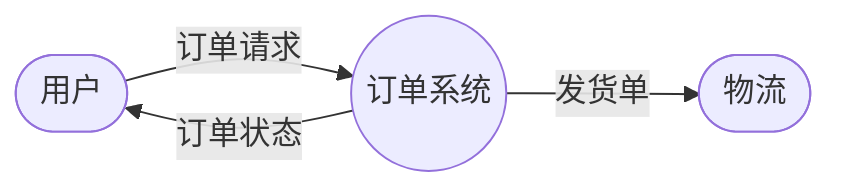
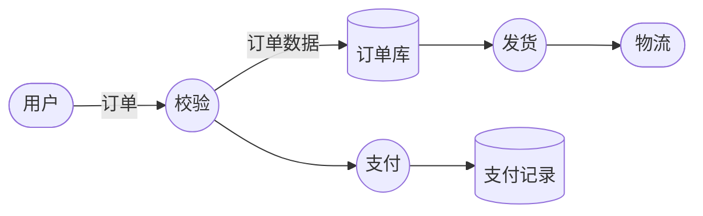

# DFD（数据流图，Data Flow Diagram）

## 一句话理解

> 描述数据在系统中如何流动、被加工、被存储的图，关注"数据流"而非"控制流"。

## 为什么重要

- 结构化分析的代表作（1970s，Yourdon / DeMarco）
- 需求分析阶段理清数据从哪来、到哪去、被谁加工
- 老系统逆向理解遗留系统的数据流

## 核心概念

四个要素：

| 要素 | 含义 | 表示 | 例子 |
|---|---|---|---|
| 外部实体 External Entity | 系统外的数据源/汇 | 矩形 | 用户、第三方支付 |
| 加工 Process | 对数据的处理 | 圆形 / 圆角矩形 | "校验订单"、"计算总价" |
| 数据存储 Data Store | 数据存放处 | 双横线（开口矩形） | "用户表"、"订单库" |
| 数据流 Data Flow | 数据流向 | 带箭头的线 | "订单数据 →" |

## 工作原理

### 分层展开（Leveling）—— DFD 的精髓

从粗到细逐层展开：

- **Context Diagram（顶层图）**：整个系统作为一个加工，只画外部实体和数据流
- **Level 0**：把系统拆成几个主要加工
- **Level 1, 2, …**：每个加工继续往下拆，直到足够清晰

**平衡原则**：每层的输入输出必须保持一致——子图的输入输出之和等于父图该加工的输入输出。

## 示例

**Context Diagram（顶层）**

**Level 0**（拆开）

## 我的理解

（待补）

## 常见误区

- 把控制流画进去（if/loop 不是 DFD 的职责，用时序图/活动图）
- 忘记分层平衡原则，导致父子图不一致
- 加工编号混乱（约定：父图加工 1 拆成子图 1.1, 1.2, 1.3）

## 实践经验

（待补）

## 局限

- 不表达控制流（if / loop / 时序）—— 故意设计，但也是被吐槽的点
- 不表达时间：什么时候发生不知道
- 现代工程里用得少了，但理解数据流思路依然有用

## Related

- [ER 图](./er-diagram.md) — 关注数据结构，DFD 关注数据流动，互补
- [UML 类图](./uml-class-diagram.md) — 关注类结构，DFD 关注过程
- BPMN、UML 时序图 — TODO（现代替代方案）

## References

- DeMarco, "Structured Analysis and System Specification" (1978)
- Yourdon, "Modern Structured Analysis" (1989)
