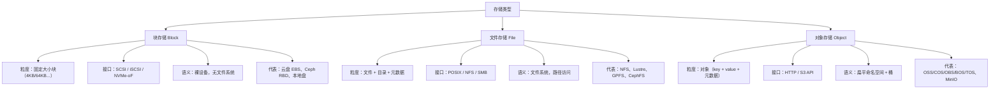
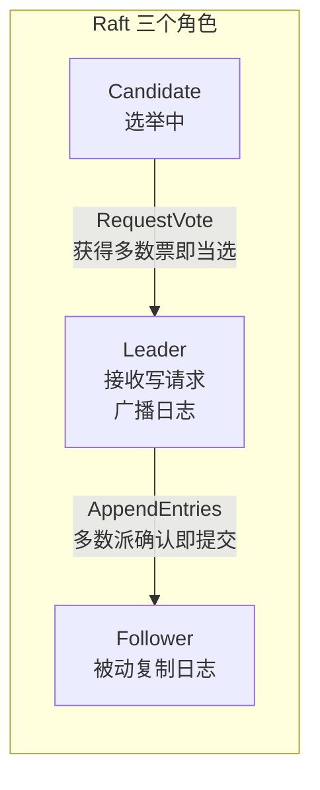
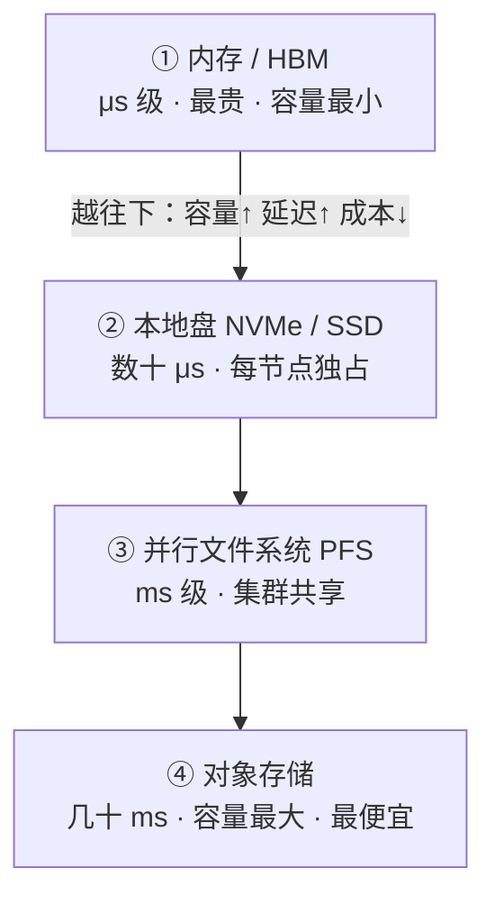
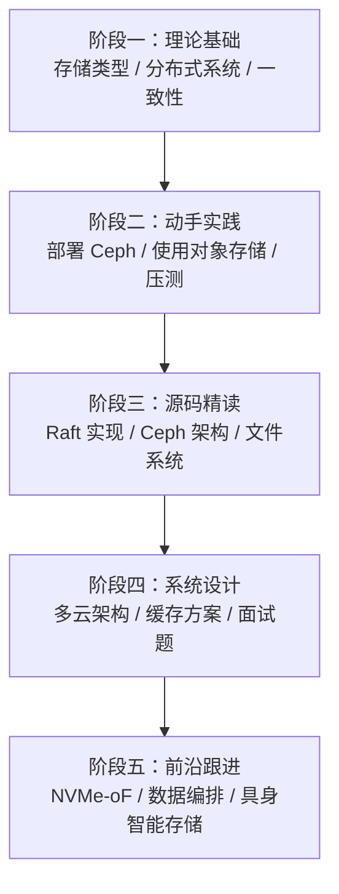

# 分布式存储系统知识地图（面向 AI 训练与多云场景）

> 本文根据一组存储方向岗位 JD（统一存储多云架构、多云对象存储、并行文件系统、AI 训练高速缓存、云原生存储）系统整理而成，覆盖该方向所需的基本概念、子领域与学习路径。

## 一句话理解

存储系统的本质是回答三件事：**数据放哪、怎么组织、怎么高效读写**。在 AI 训练与多云场景下，它进一步演化为：把"数据放哪"变成多级缓存与跨云编排，把"怎么组织"变成对象/文件/块三类语义的选择，把"怎么高效读写"变成一致性、元数据、网络协议与缓存命中率的综合优化。

## 为什么重要

- **AI 训练的本质是数据流动**：模型再强，数据喂不进去就是零。存储决定了训练流水线的吞吐天花板
- **多云是常态**：数据分散在多家云（火山/腾讯/百度/阿里/华为），需要统一抽象与跨云分发
- **存储是稀缺能力**：懂框架的人多，懂存储底层（一致性、元数据、协议、缓存）的人少——这正是 JD 开高薪的原因
- **与你现有知识衔接**：你在 PyTorch/分布式训练上的积累（DataLoader、checkpoint、分布式数据并行）全是存储的下游消费者

## 一、存储三大基本类型



| 维度 | 块存储 | 文件存储 | 对象存储 |
|---|---|---|---|
| 最小单元 | 块（Block） | 文件/目录 | 对象（Object） |
| 访问接口 | SCSI/iSCSI/NVMe-oF | POSIX/NFS/SMB | HTTP/S3 API |
| 典型延迟 | 最低（μs-ms） | 中（ms） | 高（ms-百ms） |
| 扩展性 | 受限于控制器 | 中等（元数据瓶颈） | **最优**（天然水平扩展） |
| 一致性 | 强（单设备） | 依赖实现 | 各家实现差异大（强/最终） |
| 成本 | 高 | 中 | **最低** |
| 适用场景 | 数据库、裸盘 | 共享工作目录、传统应用 | **海量数据、AI 数据集、归档** |
| 云产品 | 云盘（ESSD/SSD） | 文件存储（NAS） | 对象存储（OSS/COS/...） |

**核心判断**：AI 训练数据集天然是"写一次、读很多次、海量、无随机修改"的模式 → **对象存储是数据湖底座，并行文件系统是训练加速层，块存储是数据库/高性能本地场景**。

## 二、分布式存储的核心问题（技术纵深）

### 1. CAP 与一致性模型

分布式存储绕不开 CAP 权衡：

| 一致性模型 | 含义 | 典型场景 |
|---|---|---|
| 强一致（线性一致） | 读必见最新写 | 数据库、元数据、选主 |
| 顺序一致 | 所有进程看到相同顺序 | 某些复制系统 |
| 最终一致 | 无新写后最终一致 | 对象存储（部分）、缓存 |
| 因果一致 | 有因果关系的操作有序 | 社交/日志场景 |

> 一致性定理（来自分布式系统）：在异步网络中，强一致性与可用性不可兼得（CAP）。工程上对象存储常用"写后读一致 + 列/分区内强一致"折中。

### 2. 一致性算法：Paxos / Raft



- **Raft**：可理解性优先（领导者选举 + 日志复制 + 安全）。etcd、Ceph Mon、K8s 均用它
- **Paxos**：理论更普适，工程实现复杂（Multi-Paxos）
- **Quorum**：$W + R > N$ 读法定人数保证读到最新写（Dynamo 风格）

### 3. 高可用与容错

- **副本**：N 副本 + 多数派（如 Raft 3 副本容忍 1 故障）
- **纠删码（Erasure Coding）**：$(k+m)$ 分片，任意 $k$ 片可恢复。如 4+2 容错 2 块盘，存储开销仅 1.5×，远优于 3 副本的 3×——**对象存储降低成本的核心手段**
- **故障域**：机架/可用区感知的副本放置，防单点
- **脑裂处理**：租约、fencing（存储 fencing 防止旧主写坏数据）

### 4. 元数据管理（扩展性瓶颈所在）

| 方案 | 代表 | 优点 | 缺点 |
|---|---|---|---|
| 中心化元数据 | Lustre（MDS）、传统 NFS | 简单、强一致 | 单点瓶颈，集群大时成为热点 |
| 分布式元数据 | CephFS（动态子树分区）、GPFS（独立元数据节点组） | 可扩展 | 复杂，需处理一致性 |
| 无元数据/去中心 | Ceph RBD、对象存储 | 极高扩展性 | 语义弱 |

**关键认知**：文件系统最难扩展的不是数据，而是**元数据 ops**（创建/删除/rename/属性查询）。AI 训练大量小文件时，元数据吞吐直接决定成败。

### 5. 数据完整性

- 校验和（CRC32 / xxhash）端到端校验
- 后台 scrub / 自愈（Ceph 的 scrub 与 PG repair）
- 静默数据损坏（silent corruption）检测

## 三、对象存储深潜

### 各家云厂商对象存储对比

| 厂商 | 产品 | API | 特色 |
|---|---|---|---|
| 阿里云 | OSS | S3 + 阿里自定义 | 生态最全、地域最多 |
| 腾讯云 | COS | S3 兼容 | 与微信生态协同 |
| 百度智能云 | BOS | S3 兼容 | 与 AI 产品线（飞桨）协同 |
| 华为云 | OBS | S3 兼容 | 政企市场强 |
| 火山引擎 | TOS | S3 兼容 | 与字节 AI 训练生态（豆包/vePFS）协同 |

### S3 兼容 = 事实标准

对象存储能力集（桶级）：

- 桶（Bucket）/ 对象（Object）/ 键（Key）
- 版本管理（Versioning）、生命周期（Lifecycle）
- 静态网站托管、跨域（CORS）、加密（SSE）
- 访问控制（IAM / Bucket Policy / ACL）
- 多部分上传（Multipart Upload）：大对象并发分片上传
- 服务器端清单（Inventory）：枚举对象做成本分析

### 降本路径（JD 重点"容量使用率优化"）

1. **冷热分层**：标准 → IA → Archive → 冷归档，按访问频率自动下沉
2. **生命周期策略**：过期删除 / 转储，自动执行
3. **纠删码 vs 副本**：后端 EC 替代副本，降低冗余开销
4. **压缩与去重**：对日志/JSON 类数据收益明显
5. **小对象合并**：海量小对象合并为大对象（控制元数据与请求开销）
6. **数据清单（Inventory）治理**：定期盘点未使用数据，清理无效数据

## 四、并行文件系统（PFS）

### 主流 PFS 对比

| 系统 | 元数据 | 数据分布 | 特点 | 适用 |
|---|---|---|---|---|
| **Lustre** | 中心化 MDS（可双机） | OST 条带化 | 高性能 HPC 首选，POSIX 强 | HPC、科学计算 |
| **GPFS（Scale）** | 分布式（NSD 组） | 条带化 + 复制/EC | 强一致、企业级、AI 场景增长 | 金融、AI、HPC |
| **CephFS** | 动态子树分区 MDS | RADOS 对象（PG） | 开源、与 Ceph 生态统一 | 开源 AI 集群 |
| **BeeGFS** | 分布式元数据 | 条带化 | 易部署、性能好 | 教育、中大规模 |

### AI 训练场景的瓶颈与优化（JD 明确要求）

| 瓶颈 | 现象 | 优化策略 |
|---|---|---|
| 元数据洪峰 | 数百万小文件目录遍历慢 | 小文件打包（TFRecord/WebDataset）、目录结构扁平化 |
| 读放大 | 随机读数据集 | 预取 + 缓存 + 顺序化编排 |
| checkpoint 写 | 大模型周期性全量写 | 异步 checkpoint、共享存储分层（快速盘存最新） |
| 带宽争抢 | 多训练任务共享带宽 | QoS、配额、任务级带宽调度 |
| POSIX 语义成本 | 强一致影响吞吐 | 对训练数据用弱一致挂载，训练产出用强一致 |

### 数据编排与缓存加速层（JD"融合对象存储与 PFS"）

```
训练框架(Dataloader)
    │  POSIX / FUSE
    ▼
┌──────────────────────────────┐
│   数据编排与缓存层            │  ← 全局命名空间
│   JuiceFS / Alluxio / HA3    │  ← 热数据在本地盘/内存，冷数据在对象存储
└──────────┬───────────────────┘
           │  S3 API
           ▼
     对象存储（数据湖底座）
```

- **JuiceFS**：对象存储 + 独立元数据引擎（Redis/MySQL/...），FUSE/POSIX 兼容，自动缓存
- **Alluxio**：内存优先的分布式缓存/虚拟文件系统，跨集群共享热数据
- **核心思想**：**元数据与数据分离**——文件系统语义在缓存层，海量数据落对象存储，训练节点只缓存"近计算"的热数据

## 五、多级缓存与 AI 训练高速缓存系统（JD 核心）

### 存储金字塔



### AI 训练数据流水线

```
数据集(对象存储) ──预取──▶ 缓存层(PFS/本地盘) ──▶ Dataloader(内存) ──▶ GPU
                              ▲
                   近计算缓存：训练节点本地命中率最大化
```

**设计要点**（对应 JD"自研 AI 训练高速缓存系统"）：

1. **近计算缓存**：缓存放在计算节点本地，数据不出机房
2. **多级流水**：预取（prefetch）超前于消费，异步加载隐藏网络/存储延迟
3. **混合云流动**：本地缓存 + 云端对象存储，冷数据按需拉取，训练完可释放
4. **一致性策略**：训练数据只读（不需要强一致），checkpoint/产出需要强一致
5. **容错**：节点失败后缓存失效重拉，而非全量重传

## 六、存储网络协议

| 协议 | 位置 | 原理 | 优点 | 缺点 | 场景 |
|---|---|---|---|---|---|
| **TCP/IP** | L4 | 通用可靠传输 | 通用、便宜 | 延迟高、CPU 开销大 | 控制面、普通文件访问 |
| **iSCSI** | 块 over IP | SCSI 命令封装 TCP | 低成本 SAN | CPU 开销、性能低于 FC | 云盘、虚拟机镜像 |
| **RDMA** | IB/RoCE | 内核旁路 + 零拷贝 + 硬件卸载 | 极低延迟、高带宽、低 CPU | 需要专用网卡/交换机 | **存储服务端内部、HPC、AI 训练** |
| **NVMe-oF** | 块 over Fabric | NVMe 命令走 FC/RDMA/TCP | 协议更简洁、队列深度高 | 生态较新 | 高性能块存储、分布式存储后端 |

> RDMA 的核心价值：**绕过操作系统内核协议栈**，由网卡硬件完成数据传输（kernel bypass + zero-copy），把 CPU 从数据搬运中解放出来。Lustre/GPFS 的客户端与服务端之间、Ceph 的 OSD 之间都受益于此。

## 七、云原生存储（K8s 生态）

```
Pod → PVC → StorageClass → CSI Driver → 存储后端(云盘/NAS/对象存储)
```

| 概念 | 作用 |
|---|---|
| **PV / PVC** | 持久卷（存储实例）与持久卷声明（需求描述）解耦 |
| **StorageClass** | 存储模板：类型（SSD/HDD）、回收策略、参数 |
| **CSI** | 标准接口：K8s 通过 CSI 插件接入任意存储后端 |
| **Operator** | 用 CRD + 控制器把存储系统（如 Ceph、MinIO）作为"应用"自动化运维 |

**JD 要求**：熟悉 CSI / Operator 开发 → 本质是"把存储系统的生命周期（部署、扩容、故障自愈）变成 Kubernetes 原生对象"。

## 八、AI / 具身智能多模态数据场景（JD 提及）

- **数据形态**：图像、视频、点云、传感器日志——体积、格式、访问模式差异巨大
- **自动标签化与版本管理**：数据版本（dataset version）与代码版本同等重要，训练可复现的前提
- **数据平面与调度协同**：与 Airflow/Dagster 深度协同，实现高吞吐摄入 + 低延迟读取 + 生命周期管理
- **清洗/质检流水线**：大规模数据处理任务，读放大严重，依赖缓存与编排

**一句话**：具身智能场景的存储 = 多模态数据湖（对象存储）+ 版本管理（Git 式或数据版本工具）+ 高性能数据平面（PFS/缓存 + 调度系统）。

## 九、如何学习（学习路径）



### 阶段一：理论基础（1-2 周）

- 存储三大类型与接口语义（本文第一节）
- 分布式系统基础：CAP、一致性模型、Raft/Paxos
- 推荐：《数据密集型应用系统设计》第 5-9 章（副本、分区、事务、一致性）、[DDIM 笔记里的数学基础](../inbox/ddim-paper.md)与分布式部分无关但保持体系

### 阶段二：动手实践（2-4 周）

- 用 Docker 单机部署 **MinIO**（对象存储），熟悉 S3 API（boto3）
- 用 Docker Compose 部署 **Ceph**（至少 1 Mon + 3 OSD），体验 RBD/CephFS/S3 三种接口
- 用 Python 写一个"数据集 → 对象存储 → 本地缓存 → DataLoader"的流水线
- 用 `fio` 压测块/文件/对象三种接口的带宽与 IOPS，建立数量级直觉

### 阶段三：源码精读（4-8 周）

| 目标 | 切入点 |
|---|---|
| Raft | 读 etcd/raft 实现，或自己实现一个简化版（选主 + 日志复制） |
| Ceph 架构 | 读 Ceph 文档的 architecture 章节：RADOS → PG → OSD/Mon，再跟 Monitor 选举源码 |
| Lustre 元数据 | 理解 MDS/OST 划分与条带化 |
| 缓存层 | 读 JuiceFS 设计文档（元数据引擎 + 对象存储 + 本地缓存） |

### 阶段四：系统设计（长期）

- 练手题：设计"跨云统一存储抽象层"、"AI 训练数据缓存系统"、"多云对象存储成本优化方案"
- 结合你已有的分布式训练知识（DDP checkpoint、DataLoader 多进程），思考存储如何服务它们

### 阶段五：前沿跟进

- NVMe-oF 与 RDMA 落地方案
- 数据编排（Alluxio/JuiceFS/HA3）与调度系统（Airflow/Dagster）协同
- 具身智能/多模态数据管理

## 常见坑点

1. **用对象存储当 POSIX 用**：大量小文件 + 频繁 rename/append 会打爆性能，应先合并或加缓存层
2. **忽略元数据压力**：文件数千万级时，PFS 的元数据成为瓶颈，早做小文件打包
3. **副本与 EC 混用成本失控**：明确哪些数据需要低延迟（副本）哪些需要低成本（EC）
4. **缓存一致性想当然**：训练数据只读可用弱一致，训练产出必须强一致，统一设计必出问题
5. **网络协议选择凭感觉**：RDMA 不是银弹，需要考虑交换机/网卡支持与运维成本
6. **多云"统一"做成"套壳"**：统一抽象层若只转发 API 而不解决数据流动与一致性，价值有限

## 我的理解

从这组 JD 能提炼出一条清晰的行业主线：**AI 训练正在把存储从"容量问题"变成"流动问题"**。过去存储比拼容量与可靠性，现在比拼的是数据在混合云多级存储间**流动的速度、成本与一致性**。所以 JD 反复出现的不是某个具体存储系统，而是三组能力：

1. **抽象能力**（统一存储抽象层、多云统一）：把异构的 OSS/COS/PFS 收敛成单一语义
2. **流水线能力**（数据编排、缓存、多级流动）：让数据在对象存储 ↔ PFS ↔ 本地盘 ↔ 内存之间高效流转
3. **底层原理**（一致性、元数据、协议、EC）：所有上层设计最终都受这些物理与理论约束

对学习者的启示：不要一上来背 OSS/COS 的 API 差异，那是最表层的东西。**先吃透分布式系统原理（一致性、复制、分片、元数据），再选一个系统（Ceph 或 MinIO 或 Lustre）深入源码，最后用"数据流动"的视角串联所有子领域**——这正是本笔记结构（类型 → 原理 → 子系统 → 协议 → 场景 → 路径）想传达的骨架。

## Related

- [AI 开源项目源码精读指南](./ai-open-source-source-reading.md) — 源码精读方法论（阶段三可复用）
- [RVV 算子开发必备基础知识](./rvv-operator-development.md) — 存储服务端高性能计算（RDMA/向量化）相关
- [PyTorch](../knowledge/pytorch/) — 存储的下游消费者（DataLoader、checkpoint、DDP）
- [Second Brain 迭代路线图](./second-brain-iteration-roadmap.md) — 本文可作为"自动驾驶/数据流水线"方向的内容种子

## References

- [Raft 论文](https://raft.github.io/) / [etcd](https://etcd.io/)
- [Ceph 架构文档](https://docs.ceph.com/en/latest/architecture/)
- [Lustre 文档](https://wiki.lustre.org/)
- [GPFS (IBM Storage Scale) 文档](https://www.ibm.com/docs/en/storage-scale)
- [JuiceFS 设计文档](https://juicefs.com/docs/zh/community/architecture/)
- [Alluxio 文档](https://www.alluxio.io/docs/)
- [AWS S3 API 参考](https://docs.aws.amazon.com/AmazonS3/latest/API/Welcome.html)
- [CSI 规范](https://github.com/container-storage-interface/spec)
- [《数据密集型应用系统设计》(DDIA)](https://dataintensive.net/)
