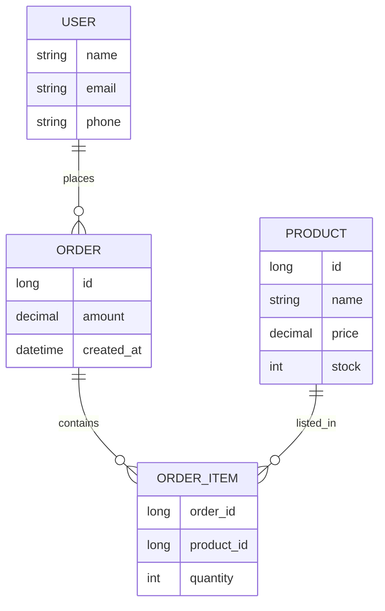

# ER 图（实体-关系图）

## 一句话理解

> 用图形化方式描述现实世界中的实体及其关系，主要用于数据库概念设计阶段。

## 为什么重要

- 数据库设计三阶段（概念→逻辑→物理）的第一步，把业务需求翻译成实体关系
- 业务方、产品、开发之间沟通的通用语言
- 后续推导关系模式、SQL 表结构的依据

## 核心概念

三个核心要素：

| 要素 | 含义 | 图形表示 | 例子 |
|---|---|---|---|
| 实体 Entity | 现实世界中可独立存在的对象 | 矩形 | 用户、订单、商品 |
| 属性 Attribute | 实体的特征 | 椭圆（连到实体） | 用户.姓名、订单.价格 |
| 关系 Relationship | 实体之间的关联 | 菱形 | 用户"购买"订单 |

关系的基数（Cardinality）：

- 1:1 一对一
- 1:N 一对多
- M:N 多对多

## 工作原理

设计流程：

1. 识别实体（业务名词）
2. 识别属性（每个实体的特征）
3. 识别关系（实体之间的动词）
4. 标注基数
5. 检查范式（1NF/2NF/3NF/BCNF）

## 示例

电商系统（M:N 通过"订单项 OrderItem"拆成两个 1:N）：

关系基数：

- 用户 1:N 订单（一个用户多个订单）
- 订单 1:N 订单项，商品 1:N 订单项（M:N 通过 OrderItem 拆解）

## 我的理解

（待补——需要结合实际项目经验）

## 常见误区

- 把"行为"画进 ER 图（ER 只管静态结构，行为用 UML 时序图/活动图）
- M:N 关系不拆：直接画 M:N 而不引入中间实体（如"订单项"），导致关系模式有冗余
- 过度设计：把每个细节都画进去，反而看不清主结构

## 实践经验

（待补）

## Related

- [UML 类图](./uml-class-diagram.md) — 面向对象的静态结构图，功能部分重叠
- [DFD 数据流图](./dfd.md) — 关注数据流动，和 ER 互补
- 数据库范式（1NF/2NF/3NF/BCNF）— TODO

## References

- Peter Chen, "The Entity-Relationship Model—Toward a Unified View of Data" (1976)
