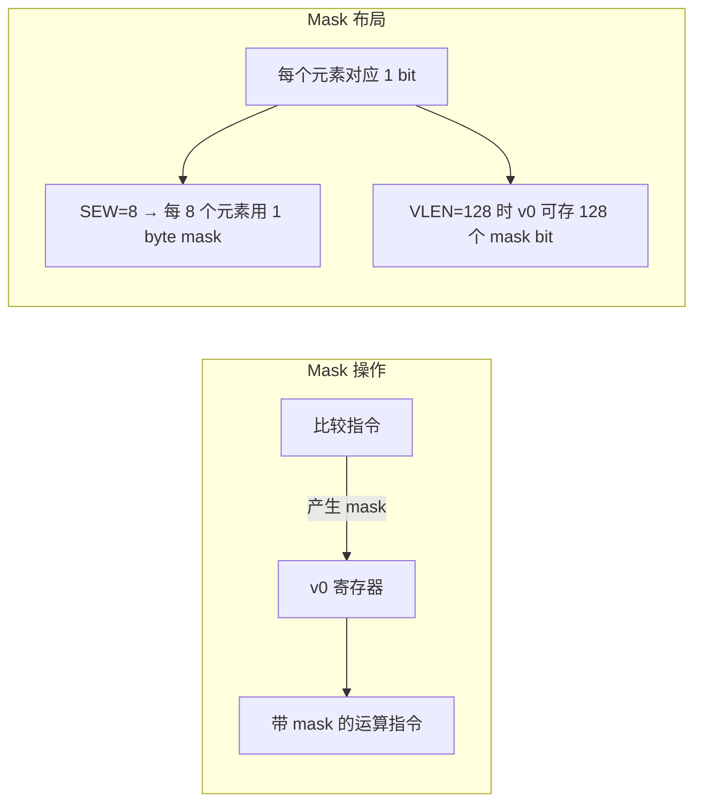
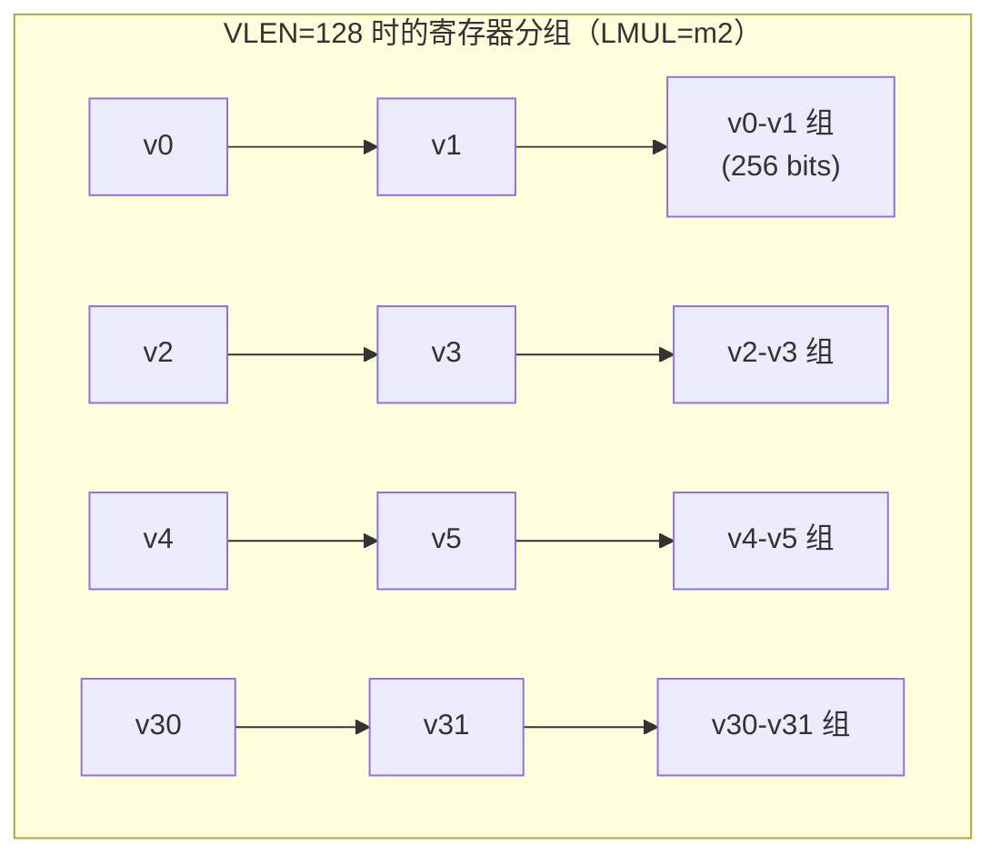
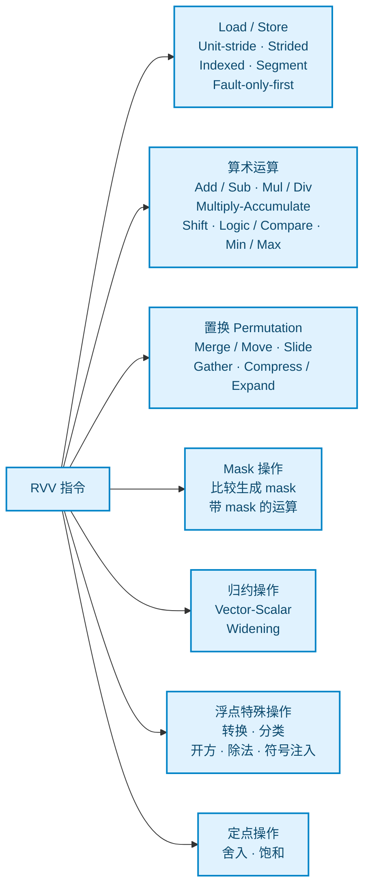
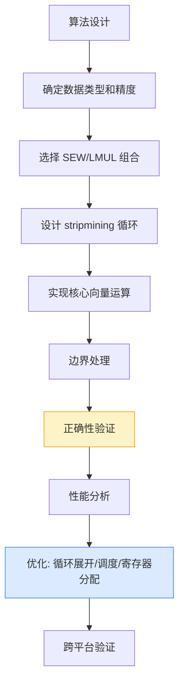
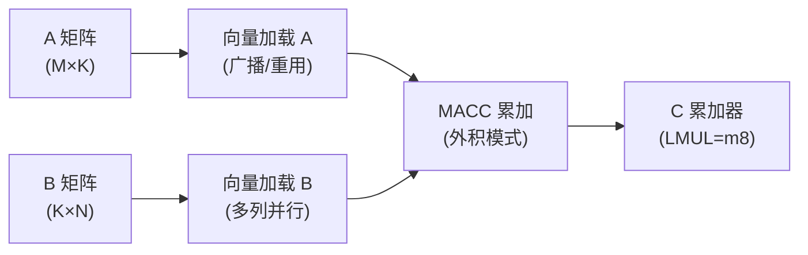

# RVV 算子开发必备基础知识

## 一句话理解

RVV（RISC-V Vector Extension）是 RISC-V 架构的向量扩展标准，采用可变向量长度（Vector Length Agnostic, VLA）设计，通过一套指令支持从 128 位到数千元位的向量长度，是 AI、HPC、信号处理等高性能计算场景在 RISC-V 平台的核心加速技术。

## 为什么重要

- **向量长度无关**：同一套程序无需重新编译即可在不同 VLEN 的硬件上运行，从嵌入式 MCU 到服务器级 CPU 全覆盖
- **AI 推理核心**：大语言模型、CNN、Transformer 等算子主要依赖矩阵/向量运算，RVV 是 RISC-V 平台 AI 加速的基础
- **生态成熟**：LLVM/GCC 已支持 RVV 1.0 intrinsics，OpenBLAS、ONEDNN、TVM、MLIR 等主流框架都在适配
- **国产替代**：国内多家 RISC-V 厂商（平头哥、赛昉、算能等）都已推出支持 RVV 的芯片

## RVV 版本演进

| 版本 | 状态 | 代表芯片 | 特点 |
|---|---|---|---|
| 0.7.1 | 旧版稳定 | 平头哥 C906/C910 | 非标准 intrinsics，指令格式不同，已逐步淘汰 |
| 1.0 | 正式标准（RVA22 必备） | 平头哥 C920/C908、玄铁 C910V2、算能 SG2380 | 冻结的指令集，标准 intrinsics，推荐学习和开发使用 |

**注意**：0.7.1 和 1.0 不兼容！新开发请直接基于 RVV 1.0。

## 核心概念

### 1. 关键控制与状态寄存器（CSR）

RVV 通过几个关键 CSR 控制向量操作的行为：

| CSR | 全称 | 作用 |
|---|---|---|
| `vtype` | Vector Type | 配置向量元素宽度、LMUL、tail/mask 策略 |
| `vl` | Vector Length | 本次向量操作实际处理的元素个数 |
| `vstart` | Vector Start | 从第几个元素开始执行（用于中断恢复） |
| `vxrm` | Vector Fixed-Point Rounding Mode | 定点舍入模式 |
| `vxsat` | Vector Fixed-Point Saturate Flag | 定点饱和标志 |
| `vcsr` | Vector Control and Status Register | vxrm 和 vxsat 的组合访问 |

### 2. SEW — 标准元素宽度

**SEW (Standard Element Width)** 指定单个向量元素的位宽：

| SEW 值 | 位宽 | 典型数据类型 |
|---|---|---|
| 8 | 8 bits | int8, uint8, fp8 (需 Zvfh/Zfbfmin 扩展) |
| 16 | 16 bits | int16, uint16, fp16, bf16 |
| 32 | 32 bits | int32, uint32, float32 |
| 64 | 64 bits | int64, uint64, float64 |

通过 `vsetvli`/`vsetvl` 指令设置：

```c
// SEW=32, LMUL=1
vsetvli t0, a0, e32, m1, ta, ma
```

### 3. LMUL — 向量寄存器分组倍数

**LMUL (Length Multiplier)** 控制多少个向量寄存器组成一个向量寄存器组，从而影响每个向量可容纳的元素数量：

| LMUL 值 | 寄存器数/组 | 当 VLEN=128, SEW=32 时元素个数 |
|---|---|---|
| mf8 | 1/8 | 0.5（不推荐） |
| mf4 | 1/4 | 1 |
| mf2 | 1/2 | 2 |
| m1 | 1 | 4 |
| m2 | 2 | 8 |
| m4 | 4 | 16 |
| m8 | 8 | 32 |

LMUL 的核心约束：
- **LMUL ≥ SEW / ELEN**（ELEN 是硬件支持的最大元素宽度，通常 64）
- LMUL = mf8/mf4/mf2 时为"分数 LMUL"，每个寄存器拆分成多个独立向量
- LMUL 越大，一次处理元素越多，但占用寄存器也越多（m8 占用全部 32 个寄存器）

### 4. VL — 向量长度

**VL (Vector Length)** 是当前配置下，一条向量指令实际处理的元素个数，由 `vsetvl[i]` 指令自动计算：

$$VL = \max\left(1, \min\left(AVL, \frac{VLEN \times LMUL}{SEW}\right)\right)$$

其中：
- **VLEN**：硬件向量寄存器位宽（128/256/512/1024...）
- **AVL**：应用程序请求处理的元素个数（Application Vector Length）

```c
size_t avl = n;
while (avl > 0) {
    size_t vl = vsetvl_e32m1(avl);  // 自动计算 vl
    vfloat32m1_t a = vle32_v_f32m1(ptr_a);
    vfloat32m1_t b = vle32_v_f32m1(ptr_b);
    vfloat32m1_t c = vfadd_vv_f32m1(a, b);
    vse32_v_f32m1(ptr_c, c);
    ptr_a += vl; ptr_b += vl; ptr_c += vl;
    avl -= vl;
}
```

这就是 RVV 经典的 **stripmining 循环**模式，自动适配任意向量长度。

### 5. Tail/Mask 策略

vtype 中的 `ta`/`ma` 和 `tu`/`mu` 控制尾部元素和被 mask 的元素如何处理：

| 策略 | 含义 | 性能影响 |
|---|---|---|
| `ta` (Tail Agnostic) | 尾部元素值未定义，硬件可以自由处理 | 通常更快，推荐 |
| `tu` (Tail Undisturbed) | 尾部元素保持原值不变 | 可能需要额外寄存器读取，较慢 |
| `ma` (Mask Agnostic) | 被 mask 的元素值未定义 | 通常更快，推荐 |
| `mu` (Mask Undisturbed) | 被 mask 的元素保持原值 | 可能较慢 |

**算子开发原则**：除非特殊需求，始终使用 `ta, ma` 获得最佳性能。

### 6. Mask 机制

RVV 使用 v0 寄存器作为默认 mask 寄存器，支持 predication：



```c
// 比较 a[i] > b[i] 得到 mask
vbool32_t mask = vmfgt_vv_f32m1_b32(a, b, vl);
// 仅 mask 为真的位置执行 c = a + b，其他位置保持 dst 原值
vfloat32m1_t c = vfadd_vv_f32m1_m(mask, dst, a, b, vl);
```

Mask 类型与 SEW/LMUL 对应关系：

| Mask 类型 | 每个 bit 对应 | 适用 SEW/LMUL 组合 |
|---|---|---|
| `vbool1_t` | 1 bit 元素 | e8,mf8 |
| `vbool8_t` | 8 bit 元素 | e8,m1; e16,mf2; e32,mf4; e64,mf8 |
| `vbool16_t` | 16 bit 元素 | e16,m1; e32,mf2; e64,mf4 |
| `vbool32_t` | 32 bit 元素 | e32,m1; e64,mf2 |
| `vbool64_t` | 64 bit 元素 | e64,m1 |

## 向量寄存器组织

RVV 有 32 个向量寄存器 v0–v31，每个位宽为 VLEN bits：



寄存器分组规则：
- m1：每个寄存器独立使用，v0–v31 共 32 个
- m2：偶寄存器为组起始，v0+v1, v2+v3, ... 共 16 个组
- m4：v0+v1+v2+v3, ... 共 8 个组
- m8：v0-v7, v8-v15, ... 共 4 个组
- mf2：一个寄存器拆成 2 个独立向量
- mf4：拆成 4 个
- mf8：拆成 8 个

**重要约束**：使用 LMUL=m2/m4/m8 时，起始寄存器必须对齐到组边界。

## 数据类型命名规则

RVV intrinsics 使用统一的类型命名约定：

```
v<sew><f|u|i|bf>m<lmul>_t

示例：
vint8m1_t    — 8-bit 有符号整数，LMUL=1
vuint16m2_t  — 16-bit 无符号整数，LMUL=2
vfloat32m4_t — 32-bit 浮点数，LMUL=4
vbool32_t    — 32-bit 元素对应的 mask 类型
```

## 指令分类概览



### 寻址方式详解

| 模式 | 指令后缀 | 示例 | 适用场景 |
|---|---|---|---|
| Unit-stride | `e` | `vle32.v` | 连续内存访问（最常用，最友好 cache） |
| Strided | `se` | `vlse32.v` | 等间隔步长访问（如图像行步长） |
| Indexed (Gather) | `x` | `vluxei32.v` | 随机索引访问（如 Embedding 查表） |
| Segment | `seg<n>` | `vlseg3e32.v` | 多通道交织数据（如 RGB 图像、复数） |
| Fault-only-first | `ff` | `vle32ff.v` | 字符串/数据长度未知时安全访问 |

## RVV 编程模型

### Stripmining 循环模板

所有 RVV kernel 的基本骨架：

```c
void vector_add(const float *a, const float *b, float *c, size_t n) {
    size_t avl = n;
    while (avl > 0) {
        // 1. 设置向量配置，自动计算 vl
        size_t vl = vsetvl_e32m1(avl);
        
        // 2. 加载向量
        vfloat32m1_t va = vle32_v_f32m1(a, vl);
        vfloat32m1_t vb = vle32_v_f32m1(b, vl);
        
        // 3. 向量运算
        vfloat32m1_t vc = vfadd_vv_f32m1(va, vb, vl);
        
        // 4. 存储结果
        vse32_v_f32m1(c, vc, vl);
        
        // 5. 指针和计数推进
        a += vl; b += vl; c += vl;
        avl -= vl;
    }
}
```

### 配置指令选择

| Intrinsic | 作用 |
|---|---|
| `vsetvl_e<sew>m<lmul>(avl)` | 静态指定 SEW/LMUL，最常用 |
| `vsetvl_i<type>(avl)` | 通过类型推导 SEW/LMUL |
| `vsetvli(rd, rs1, vtypei)` | 原始指令形式 |
| `vsetvl(rd, rs1, rs2)` | 从寄存器读取 vtype |

### Widening/Narrowing 操作

RVV 支持宽度伸缩操作，适合混合精度计算：

```c
// Widening: 32-bit × 32-bit → 64-bit
vfloat64m2_t acc = vfmul_vv_f64m2(
    vfwcvt_f_f_v_f64m2(a_32, vl),  // 宽化转换
    vfwcvt_f_f_v_f64m2(b_32, vl),
    vl
);

// 直接 widening multiply-add: 2*SEW × SEW + 2*SEW → 2*SEW
vfloat64m2_t acc = vfwmacc_vf_f64m2(acc, scalar, a_32, vl);
```

Widening 后缀规则：
- `vwxxx`：输出宽度翻倍（如 `vwadd.vv` 16+16→32）
- `vwxxxu`：无符号宽化
- `vwxxx_w`：一个操作数已是宽类型
- `vnxxx`：narrowing，输出宽度减半

## Intrinsics API 命名规则

RVV intrinsics 遵循系统化命名：

```
v<op><modifiers>_<args>_<type><mask>{_tu}

分解示例：
vfadd_vv_f32m1
│    │  │  └── 类型：f32=float32, m1=LMUL=1
│    │  └───── 参数组合：vv=两个向量, vx=向量+标量, vf=向量+浮点标量
│    └──────── 修饰符
└───────────── 操作符：fadd=浮点加

带 mask：
vfadd_vv_f32m1_m(mask, maskedoff, op1, op2, vl)
                                └── mask 为假时保持此值
```

常用 modifier：

| Modifier | 含义 |
|---|---|
| `v`/`x`/`f` | 第二个操作数是向量/整数标量/浮点标量 |
| `w` | widening |
| `n` | narrowing |
| `u` | 无符号 |
| `m` | mask 版本 |
| `_tu` | tail undisturbed 策略 |

## 算子开发流程



### Step 1: 选择 SEW/LMUL 组合

**经验原则**：
- 元素多时优先大 LMUL（m4/m8）提高吞吐
- 寄存器压力大（需同时保存多个中间向量）时用小 LMUL（m1/m2）
- 混合精度时 widening/narrowing 前后 SEW/LMUL 必须匹配
- LMUL 选择受寄存器数量约束：m8 只能用 4 个寄存器组

LMUL 选择参考表（以 VLEN=128 为例）：

| SEW | LMUL | 每组元素数 | 可用寄存器组数 | 典型应用 |
|---|---|---|---|---|
| 8 | m1 | 16 | 32 | int8 量化算子 |
| 8 | m4 | 64 | 8 | int8 GEMM 微内核 |
| 16 | m2 | 16 | 16 | fp16/bf16 推理 |
| 32 | m1 | 4 | 32 | float32 通用算子 |
| 32 | m4 | 16 | 8 | float32 大规模计算 |
| 64 | m1 | 2 | 32 | float64/int64 |

### Step 2: Load/Store 优化

1. **尽量使用 unit-stride**：连续访问对 cache 和内存控制器最友好
2. **Segment load/store**：对 RGB、复数、xy 坐标等交织数据直接用 `vlsegneb`
3. **数据对齐**：大多数 RVV 硬件对对齐访问性能更好（但指令不强制要求）
4. **提前预取**：使用 `vle*ff` 或软件预取指令

### Step 3: 计算优化

1. **使用 MACC（乘加）**：`vmacc`/`vfnmacc`/`vfwmacc` 等融合指令吞吐更高
2. **选择合适的舍入/饱和模式**：定点算子合理设置 `vxrm`
3. **利用 slide 操作做归约**：`vredsum`/`vredusum` 等直接归约
4. **Mask 稀疏计算**：ReLU 等使用 mask 避免无效计算，但注意 mask 开销

### Step 4: 归约操作模式

```c
// 向量归约模板：向量求和
vfloat32m1_t vec_sum(vfloat32m1_t vec, size_t vl) {
    // 树状归约: slide1by1 逐步折叠
    while (vl > 1) {
        size_t half = vl / 2;
        vsetvl_e32m1(half);
        vfloat32m1_t vec2 = vslidedown_vx_f32m1(vec, half, half);
        vec = vfadd_vv_f32m1(vec, vec2, half);
        vl = half;
    }
    return vec;
}

// 或使用专用归约指令（更高效）
float sum_all(vfloat32m1_t vec, size_t vl) {
    vfloat32m1_t zero = vfmv_v_f_f32m1(0.0f, vl);
    vfloat32m1_t res = vfredusum_vs_f32m1_f32m1(zero, vec, zero, vl);
    return vfmv_f_s_f32m1_f32(res);
}
```

## 常见算子 RVV 映射示例

### GEMM 微内核思路



核心思路：
1. 每个向量寄存器组 hold C 的一列
2. 沿 K 方向循环，broadcast A 的一个标量到向量，与 B 的整列做 fma
3. 注意 LMUL 选择和寄存器分配

### ReLU

```c
vfloat32m1_t relu(vfloat32m1_t x, size_t vl) {
    vfloat32m1_t zero = vfmv_v_f_f32m1(0.0f, vl);
    // mask = x > 0
    vbool32_t mask = vmfgt_vf_f32m1_b32(x, 0.0f, vl);
    // mask=true 取 x，mask=false 取 zero
    return vfmerge_vfm_f32m1(zero, x, 0.0f, mask, vl);
}
```

### 元素级乘法 + 加偏置

```c
// c[i] = a[i] * b[i] + bias
vfloat32m1_t mul_add(vfloat32m1_t a, vfloat32m1_t b, float bias, size_t vl) {
    return vfmacc_vf_f32m1(b, bias, a, vl);  // b + a * bias
}
```

## 工具链与开发环境

| 工具 | 最低版本 | 说明 |
|---|---|---|
| GCC | 12+ | 支持 RVV 1.0 intrinsics |
| Clang/LLVM | 16+ | RVV 支持较完善，推荐开发使用 |
| Spike | 最新 | RISC-V 官方模拟器，支持 RVV |
| QEMU | 8.0+ | 支持 RVV 1.0 用户态模拟 |
| NMSIS | - | 平头哥 SDK，含 C906/C908/C920 RVV 库 |
| OpenBLAS | develop 分支 | 已加入 RVV 1.0 优化 |

编译选项：

```bash
# RVV 1.0
clang -march=rv64gcv_zvl128b -O2 kernel.c -o kernel
gcc -march=rv64gcv -mabi=lp64d -O2 kernel.c -o kernel

# 指定 VLEN（用于自动向量化指导）
-mllvm -riscv-v-vector-bits-min=128
```

## 性能优化要点

### 1. 循环展开（Unrolling）

```c
// 4x 展开：隐藏 load 延迟
for (size_t i = 0; i < n; i += vl*4) {
    size_t vl = vsetvl_e32m1(n - i);
    vfloat32m1_t a0 = vle32_v_f32m1(a + i + 0*vl, vl);
    vfloat32m1_t a1 = vle32_v_f32m1(a + i + 1*vl, vl);
    vfloat32m1_t a2 = vle32_v_f32m1(a + i + 2*vl, vl);
    vfloat32m1_t a3 = vle32_v_f32m1(a + i + 3*vl, vl);
    // ... 计算和交错存储
}
```

### 2. 指令调度

- 避免连续使用同一寄存器（写后读依赖）
- Load 和计算交错排布
- 注意不同指令的 latency/throughput（查硬件优化手册）

### 3. 掩码优化

- 简单 predication 优先用 merge 指令
- Mask 生成开销大时，考虑尾部单独标量处理
- 尾端循环：当 n < 元素数时，`vsetvl` 自动处理，但需注意 agnostic 策略

### 4. Tail 处理策略对比

| 策略 | 实现方式 | 性能 | 复杂度 |
|---|---|---|---|
| 标量 tail | 循环后标量处理剩余元素 | 好 | 低 |
| Mask tail | 用 mask 处理尾元素 | 中 | 最低 |
| 足够大 LMUL | 用足够大的 LMUL 一次处理完 | 最好 | 需 n 不大 |

**推荐**：通用 kernel 使用标量 tail 或直接依赖 stripmining。

## 常见坑点

1. **0.7.1 vs 1.0 intrinsics 混淆**：1.0 标准 intrinsics 是 `vle32_v_f32m1` 这种函数式写法，而 0.7.1 旧教程常用 `vfloat32m1_t v = *(vfloat32m1_t*)ptr` 直接解引用指针的风格，两者不通用
2. **忘记传 vl 参数**：RVV 1.0 intrinsics 最后一个参数总是 `vl`
3. **LMUL 寄存器对齐错误**：m2/m4/m8 起始寄存器必须对齐
4. **Mask 类型不匹配**：`vbool32_t` vs `vbool16_t` 等必须与 SEW/LMUL 匹配
5. **tail/mask 策略误用**：`tu`/`mu` 有性能代价，默认用 `ta`/`ma`
6. **宽度转换溢出**：widening 操作注意源和目标类型宽度关系
7. **编译器自动向量化**：GCC/Clang 可自动向量化，但手写 intrinsics 性能更可控

## 子扩展概览（RVV 1.0 之外）

| 扩展 | 功能 | 应用场景 |
|---|---|---|
| Zvfh | FP16 支持 | fp16 推理 |
| Zvfbfmin | BF16 支持 | bf16 推理、训练 |
| Zvbb | Vector Bitmanip | 密码学、位操作 |
| Zvbc | Vector Carry-less Multiply | 密码学 |
| Zvkg | Vector GCM | AES-GCM |
| Zvkned/zvknh | NIST 算法 | 加密 |
| Zvksed/zvksh | ShangMi 算法 | 国密 SM2/SM3/SM4 |
| Zve32x/Zve64x | 嵌入式最小向量配置 | MCU 场景 |

## 我的理解

RVV 的 VLA（Vector Length Agnostic）设计是它与 ARM SVE/SVE2 共享的核心思想，也是与 x86 AVX/ARM NEON 固定长度 SIMD 最大的区别：

- **软件可移植性**：一次编译，任意 VLEN 运行——这对碎片化的 RISC-V 生态至关重要
- **编程模型抽象**：开发者只需要关心"有多少元素"，不需要关心"向量寄存器多少位"
- **stripmining 是核心模式**：所有向量 kernel 都是那个 while 循环模板，理解了这个就理解了 RVV 编程的 80%
- **LMUL 是最大的灵活点也是最大的坑**：LMUL 选择直接影响性能，需要在吞吐（大 LMUL）和寄存器压力（小 LMUL）之间权衡
- **1.0 版本是分水岭**：2024 年后的芯片基本都支持 1.0，没有理由再学 0.7.1

算子开发的学习曲线：
1. **入门**：理解 vsetvl/stripmining/load-compute-store 基本流程，能写简单向量算子
2. **进阶**：掌握 widening/narrowing/mask/slide/归约，能写卷积、GEMM 等复杂算子
3. **精通**：理解硬件微架构（指令 latency/throughput、load 队列、寄存器端口），手写调度优化的微内核

## Related

- [PyTorch](../knowledge/pytorch/) — 深度学习框架后端需要 RVV 适配
- [AI 开源项目源码精读指南](./ai-open-source-source-reading.md) — ONNX Runtime、vLLM 等项目有 SIMD 优化参考

## References

- [RISC-V "V" Vector Extension 1.0 Specification](https://github.com/riscv/riscv-v-spec)
- [RISC-V Vector Intrinsics Documentation](https://dzaima.github.io/rvv-intrinsics/)
- [RVV Intrinsics Viewer (在线查询)](https://dzaima.github.io/rvv-intrinsics/)
- [LLVM RISC-V Vector Support](https://llvm.org/docs/RISCV/RISCVVectorExtension.html)
- [RISC-V Vector Examples by andes-tech](https://github.com/andestech/riscv-v-spec)
