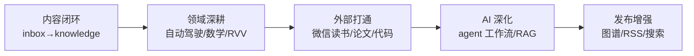

# Second Brain 迭代路线图

## 一句话理解

当前 second-brain 的**系统和规则层已经很完整**（VitePress + 模板 + `.trae/agents` + AGENTS.md + GitHub Actions），迭代的短板在**内容闭环**和**自动化**——下一步的核心是"把知识流动起来"而不是继续堆规则。

## 为什么需要迭代

- inbox 里 8 篇 seed 笔记没有"消化 → 沉淀"的闭环，会越积越多
- `knowledge/` 只有 pytorch 成体系，autonomous-driving / mathematics 是空目录，与背景（BEV / 自动驾驶 / RL / LLM）严重不匹配
- reading / projects / ideas / archives 四个区域只有 index 骨架
- 已有的 taker / connector / architect 三个 agent 角色未固化成可复现工作流

## 现状盘点

| 区域 | 状态 | 问题 |
|---|---|---|
| `knowledge/pytorch/` | 🟢 16 篇，最丰富 | 唯一成体系的领域 |
| `knowledge/ai/` | 🟡 grpo + ppo | 与 LLM 主线相比太薄 |
| `knowledge/autonomous-driving/`、`mathematics/` | 🔴 空目录 | 与背景（BEV/自动驾驶）不匹配 |
| `inbox/` | 🟡 8 篇，多为 seed | 没有消化闭环 |
| `reading/`、`projects/`、`ideas/`、`archives/` | 🔴 只有 index | 骨架搭好没内容 |
| 模板 + `.trae/agents` | 🟢 已有 | 工作流未固化 |

## 迭代路线图

### 阶段一：内容闭环（当前最该做）

1. **inbox 消化管线**：inbox 中 DDIM / RVV / AI 源码精读等属于知识，提炼成原子概念进 `knowledge/`（如 `knowledge/ai/diffusion.md`、`knowledge/hpc/rvv.md`），inbox 只留流动入口。可固化为 `knowledge-architect` 的每周例行任务
2. **补两个空领域**：`autonomous-driving/`（BEV 感知、数据集）和 `mathematics/`（概率、信息论——DDIM 里的 KL 散度就是引子），各 3-5 篇起步
3. **读书记录**：打通微信读书 → `reading/`，用 `templates/book.md` 模板带 frontmatter 导入

### 阶段二：外部数据打通

- **微信读书**：`weread-cli` 增量同步到 `reading/`（API key 走环境变量 / GitHub Secrets，不硬编码）
- **论文笔记**：`templates/paper.md` 已有，可加 `papers/` 或并入 reading，用脚本从 arXiv 拉元数据生成骨架
- **代码经验**：`git-on-nfs` 已有范例，把工程踩坑沉淀为 `experience.md` 体系

### 阶段三：AI 深度集成（差异化优势）

1. **agent 工作流固化**：taker（捕获）→ connector（建链）→ architect（归档）流水线写成可复现指令，每周让 TRAE 跑一遍
2. **语义搜索 / RAG**：VitePress 本地搜索只是关键词匹配；加 embedding 索引脚本把全部 `.md` 向量化，TRAE 提问时先检索自己的知识库
3. **技能沉淀**：`proxy-web-fetch` 已有先例，weread、arXiv、RSS 等都可沉淀为 `.trae/skills/`

### 阶段四：发布与治理（锦上添花）

- **知识图谱页**：VitePress 页面内用 Mermaid / cytoscape 渲染笔记间链接图（已有 mermaid 基建，成本低）
- **回链 / 索引自动化**：脚本扫描所有 `` 相对链接，自动生成"相关笔记"区块，落地 AGENTS.md 的"连接 > 收集"
- **健康度检查**：CI 里加死链检查 + 孤立笔记检查（无入链的笔记提示连接）
- **站内搜索升级 + RSS**（可选）

## 优先级建议

如果只挑 3 件现在做：

1. **inbox 消化一轮**（8 篇 seed → 提炼 3-4 篇原子知识，清空 / 归档其余）——立竿见影
2. **打通微信读书 → reading/**——方案已讨论，可直接落地
3. **补 autonomous-driving 2-3 篇**——核心背景领域，目前完全空白

这三件都不依赖换平台，在当前 VitePress 架构内就能完成。

## 平台评估备忘

曾评估过 Obsidian + Quartz 等替代方案，结论：

- 若主要诉求是"更好的编辑 / 连接体验" → Obsidian 系（双链 + 图谱）
- 若主要诉求是"更好的发布效果" → 保持 SSG 或换 Astro Starlight
- 当前约束（Markdown 真相源 + 本地 Git + TRAE 直接读写文件）下，**不换平台**依然是最稳的路径，Obsidian 可零成本试点（直接打开 `docs/` 目录）

## 我的理解

迭代的本质不是换工具，而是**把"收集"变成"流动"**。这个仓库最不缺的是规则（AGENTS.md、模板、agents），最缺的是让规则运转起来的内容管线。下一步所有动作都应围绕：让笔记从 inbox → knowledge 有明确出口，让空目录有种子内容，让 TRAE 从"被动执行"变成"每周例行"。

## Related

- [Second Brain 工作流](./second-brain-workflow.md) — capture 到 knowledge 的完整流程
- [AI 开源项目源码精读指南](./ai-open-source-source-reading.md) — knowledge/ai 扩展的方向参考
- [uv — 极速 Python 包管理工具](./uv-python-package-manager.md) — 工具链自动化的基础
- [RVV 算子开发必备基础知识](./rvv-operator-development.md) — 建议沉淀到 knowledge/hpc/ 的候选笔记
