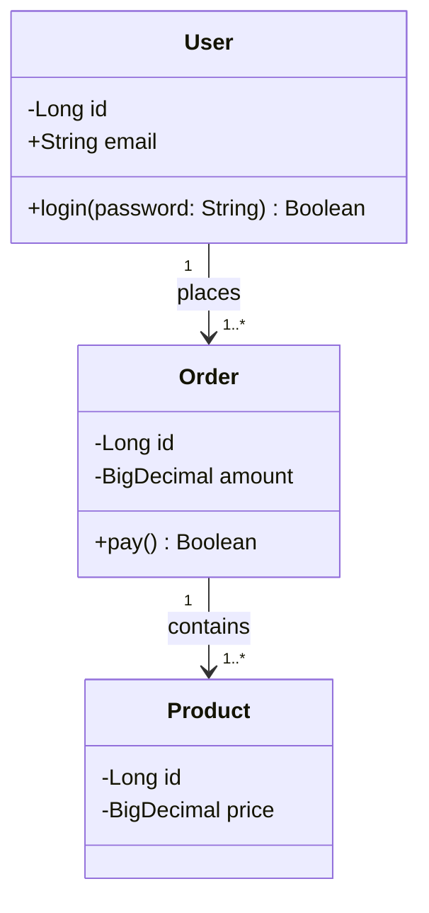

# UML 类图（Class Diagram）

## 一句话理解

> UML 中描述类及其关系的静态结构图，用于面向对象设计阶段。

## 为什么重要

- OO 设计的通用语言，团队评审时用
- 代码逆向工程：从已有代码反推类结构
- 比 ER 图更丰富——能表达访问权限、方法、继承层次

## 核心概念

### 类的表示

三层矩形：

- 上层：类名
- 中层：属性（`+`公开 `-`私有 `#`受保护）
- 下层：方法

### 六种关系（按强度从弱到强）

| 关系 | 含义 | 箭头 | 代码形态 |
|---|---|---|---|
| 依赖 Dependency | 用到了但不是成员 | 虚线箭头 | 方法参数、局部变量 |
| 关联 Association | 有引用，是成员 | 实线箭头 | 成员变量 |
| 聚合 Aggregation | 整体-部分，部分可独立存在 | 空心菱形 | `List<Wheel> wheels` |
| 组合 Composition | 整体-部分，部分不能独立存在 | 实心菱形 | `Engine engine` |
| 实现 Realization | 类实现接口 | 虚线+空心三角 | `implements` |
| 继承 Generalization | 子类继承父类 | 实线+空心三角 | `extends` |

## 工作原理

设计流程：

1. 识别类（业务名词 + 行为）
2. 识别属性和方法
3. 识别关系（先看继承/实现，再看关联/聚合/组合）
4. 标注访问权限和多重性

## 示例

电商系统：

**聚合 vs 组合**（最容易混）：

- 聚合：球队解散了，球员还在 → 球队 ◇— 球员
- 组合：公司解散了，部门也没了 → 公司 ◆— 部门

## 我的理解

（待补——可结合实际项目经验，比如 PyTorch 源码里 Module / Optimizer / DataLoader 的关系可以用类图表达）

## 常见误区

- 过度设计：画了一堆类但实际写代码用不上
- 聚合和组合分不清（看生命周期是否同步）
- 把依赖画成关联（仅方法参数不算关联）

## 实践经验

（待补）

## Related

- [ER 图](./er-diagram.md) — 数据库视角的静态结构，和 UML 类图部分重叠（类 vs 实体）
- [DFD 数据流图](./dfd.md) — 关注数据流，和类图互补
- UML 时序图、状态图 — TODO（表达动态行为）

## References

- UML 官方规范：https://www.omg.org/spec/UML
