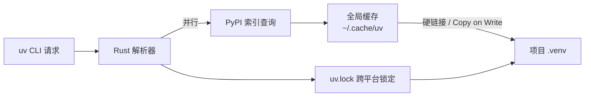

# uv — 极速 Python 包管理工具

## 一句话理解

> uv 是 Astral 用 Rust 写的一体化 Python 包/项目/解释器管理工具，单一二进制替代 `pip` / `pip-tools` / `pipx` / `poetry` / `pyenv` / `virtualenv` / `twine`，在缓存命中时比 `pip` 快 10–100 倍。

## 为什么重要

Python 工具链长期处于「多工具拼装」状态：`pip` 装包、`venv` 建环境、`pip-tools` 锁依赖、`pipx` 装命令行工具、`pyenv` 切解释器版本、`twine` 发包。每个工具只解决一段问题，组合起来配置成本高、CI 慢、新人上手陡。

uv 的价值在于：

1. **统一**：一个命令同时覆盖项目、环境、依赖、解释器、工具、发布六大场景。
2. **快**：Rust 实现 + 全局缓存 + 并行解压解析，冷启动 10×、缓存命中 100× 于 `pip`。
3. **兼容**：保留 `uv pip ...` 子命令作为 `pip` 的 drop-in 替代，老项目零迁移成本。
4. **可复现**：跨平台 universal lockfile（`uv.lock`），一次锁定，多平台同步。
5. **现代**：原生支持 `pyproject.toml`、PEP 723 内联脚本依赖、workspaces、dev/optional 依赖组。

到 2026 年 8 月，uv 已在 PyPI 稳定发布到 0.9.x 系列，被 Ruff、FastAPI 等主流项目采用为开发/CI 工具。

## 核心特性

| 特性 | 说明 | 替代的传统工具 |
|---|---|---|
| 极速安装 | Rust + 并行下载 + 全局缓存去重 | `pip install` |
| 项目管理 | `pyproject.toml` + 锁文件 + 工作区 | `poetry` / `pdm` / `hatch` |
| 虚拟环境 | 内置 `uv venv`，自动绑定项目 | `virtualenv` / `venv` |
| 依赖锁定 | 跨平台 `uv.lock` | `pip-tools` / `pipenv` |
| 解释器管理 | 下载/切换 CPython、PyPy | `pyenv` / `python-build` |
| 工具安装 | `uv tool` / `uvx` 全局命令行工具 | `pipx` |
| 脚本运行 | PEP 723 内联依赖单文件脚本 | 手动建 venv |
| 包发布 | `uv build` / `uv publish` | `build` / `twine` |
| pip 兼容层 | `uv pip ...` 全兼容 pip 语法 | `pip` 本身 |
| 工作区 | Cargo-style 多包 monorepo | `poetry` 多项目插件 |

## 安装

uv 是单一二进制，无需 Rust 或 Python 即可安装。

```bash
# macOS / Linux
curl -LsSf https://astral.sh/uv/install.sh | sh

# Windows (PowerShell)
powershell -ExecutionPolicy ByPass -c "irm https://astral.sh/uv/install.ps1 | iex"

# 通过 pip / pipx（不推荐作为主安装方式，但可用于受限环境）
pip install uv
pipx install uv
```

安装后通过 standalone installer 装的 uv 可以自更新：

```bash
uv self update
```

配置国内镜像（解决下载慢）：

```bash
# 设置环境变量（也可写入 ~/.config/uv/uv.toml）
export UV_DEFAULT_INDEX="https://pypi.tuna.tsinghua.edu.cn/simple"
# 或 https://mirrors.aliyun.com/pypi/simple/
```

## 工作原理

uv 的速度来自三层设计：



1. **Rust 解析器**：用 PubGrub 算法并行解析依赖图，比 pip 的回溯快几十倍。
2. **全局缓存**：每个包版本只下载/构建一次，跨项目通过硬链接（macOS/Linux）或 reflink（Windows）共享，几乎零拷贝。
3. **跨平台锁文件**：`uv.lock` 同时记录多平台（Linux/macOS/Windows × x86/arm）的解析结果，CI 与本地一致。

## 常用命令

### 1. 项目初始化：`uv init`

```bash
# 在当前目录初始化一个新项目
uv init my-app
cd my-app

# 生成 lib 模式（带 src/ 布局）
uv init --lib my-lib

# 生成 app 模式（带 main.py）
uv init --app my-app

# 指定 Python 版本
uv init --python 3.12 my-app
```

产物：`pyproject.toml`、`.python-version`、`src/` 或 `main.py`、`README.md`、`.gitignore`。

### 2. 添加/移除依赖：`uv add` / `uv remove`

```bash
# 添加运行时依赖
uv add requests

# 指定版本约束
uv add "fastapi>=0.110,<0.120"

# 添加开发依赖（不进入发布产物）
uv add --dev pytest ruff mypy

# 添加可选依赖组（PEP 735）
uv add --group docs mkdocs mkdocs-material

# 从 git 添加
uv add "git+https://github.com/encode/httpx"

# 添加本地路径依赖
uv add --editable ../my-local-lib

# 移除
uv remove requests
```

每次 `uv add` / `uv remove` 都会自动更新 `pyproject.toml`、`uv.lock` 并同步 `.venv`。

### 3. 同步环境：`uv sync`

```bash
# 按 uv.lock 安装到 .venv（默认行为）
uv sync

# 仅安装生产依赖（不含 dev/group）
uv sync --no-dev

# 仅安装某个 group
uv sync --only-group docs

# 强制重新解析（忽略 lock）
uv sync --refresh

# 不修改环境，只校验一致性
uv sync --frozen
```

### 4. 运行命令：`uv run`

`uv run` 会在执行前自动确保环境同步，是日常最常用命令：

```bash
# 运行项目入口
uv run python main.py

# 运行模块
uv run python -m http.server

# 运行已安装的命令行工具（无需手动激活 venv）
uv run ruff check .
uv run pytest -v

# 带额外 env
uv run --env-file .env python main.py
```

`uv run` 解决了「忘记 `activate` 就执行」的痛点——直接 `uv run` 即可。

### 5. 锁定依赖：`uv lock`

```bash
# 重新解析并更新 uv.lock（不改环境）
uv lock

# 升级所有包到允许的最新版本
uv lock --upgrade

# 仅升级某个包
uv lock --upgrade-package httpx
```

`uv.lock` 是跨平台的：包含所有 marker（OS、arch、Python 版本）下的解析结果，团队成员用不同系统也能复现。

### 6. 依赖树：`uv tree`

```bash
# 打印当前环境的依赖树
uv tree

# 显示反向依赖（谁依赖了 X）
uv tree --invert httpx

# 只显示某个 group
uv tree --group dev

# 显示版本冲突详情
uv tree --duplicates
```

### 7. pip 兼容层：`uv pip`

对老项目零迁移成本，语法完全兼容 `pip`：

```bash
uv pip install -r requirements.txt
uv pip install .
uv pip install -e .
uv pip uninstall requests
uv pip list
uv pip freeze > requirements.txt
uv pip show requests
uv pip cache purge
```

注意：`uv pip` 不更新 `pyproject.toml` / `uv.lock`，是「裸装」模式。新项目优先用 `uv add`。

### 8. 全局工具：`uv tool` / `uvx`

类似 `pipx`，把命令行工具装到隔离环境但暴露命令本身：

```bash
# 临时运行（不安装，用完即走）
uvx pycowsay "hello"
uvx ruff check .        # 等价于 uv tool run ruff check .

# 永久安装
uv tool install ruff
uv tool install black

# 列出已装工具
uv tool list

# 升级
uv tool upgrade ruff
uv tool upgrade --all

# 卸载
uv tool uninstall ruff
```

`uvx` 是 `uv tool run` 的别名，常用于 CI 一次性跑工具。

### 9. 虚拟环境：`uv venv`

虽然 `uv sync` / `uv run` 会自动管理 venv，但显式创建也常用：

```bash
# 默认在当前目录建 .venv
uv venv

# 指定路径
uv venv .venv-custom

# 指定 Python 版本（自动下载）
uv venv --python 3.11

# 继承系统 site-packages
uv venv --system-site-packages

# 清空重建
uv venv --clear
```

激活方式（与传统 venv 一致）：

```bash
# macOS / Linux
source .venv/bin/activate

# Windows PowerShell
.venv\Scripts\Activate.ps1

# Windows cmd
.venv\Scripts\activate.bat
```

### 10. Python 版本管理：`uv python`

替代 `pyenv`，由 uv 自身管理解释器（不需编译）：

```bash
# 安装某个版本（Astral 维护的 standalone 构建）
uv python install 3.12
uv python install 3.11 3.13 pypy@3.11

# 列出已装版本
uv python list

# 仅显示当前项目用的版本
uv python find

# 固定项目 Python 版本（写入 .python-version）
uv python pin 3.12

# 卸载
uv python uninstall 3.11
```

uv 的 Python 发行版来自 `python-build-standalone`，下载即用，无需本地编译链。

### 11. 单文件脚本：PEP 723

给脚本声明依赖，无需项目结构：

```bash
# 给脚本添加内联依赖声明
uv add --script example.py requests rich

# 运行（自动在隔离环境装依赖）
uv run example.py
```

生成的脚本头部：

```python
# /// script
# requires-python = ">=3.12"
# dependencies = [
#     "requests",
#     "rich",
# ]
# ///
import requests
from rich import print
print(requests.get("https://astral.sh").json())
```

适合写一次性脚本、demo、运维工具。

### 12. 构建与发布：`uv build` / `uv publish`

```bash
# 构建源码包和 wheel
uv build

# 仅 wheel
uv build --wheel

# 发布到 PyPI（需 token）
uv publish --token pypi-xxxxxxxx

# 发布到私有源
uv publish --publish-url https://upload.pypi.org/legacy/
```

## 与其他工具对比

| 维度 | uv | pip + venv | poetry | pdm | conda | hatch |
|---|---|---|---|---|---|---|
| 实现语言 | Rust | Python | Python | Python | C/Python | Python |
| 速度 | ⚡ 10–100× | 1× | ~1× | 2–3× | 慢 | ~1× |
| 项目管理 | ✅ | ❌ | ✅ | ✅ | ⚠️ | ✅ |
| 锁文件 | ✅ 跨平台 | ❌ | ✅ 单平台 | ✅ 跨平台 | ❌ | ✅ |
| 解释器管理 | ✅ | ❌ | ❌ | ⚠️ | ✅ | ❌ |
| 工具安装（类 pipx）| ✅ | ❌ | ❌ | ❌ | ❌ | ❌ |
| pip 兼容 | ✅ | ✅ | ❌ | 部分 | ❌ | 部分 |
| 单文件脚本 | ✅ PEP 723 | ❌ | ❌ | ❌ | ❌ | ❌ |
| 工作区/monorepo | ✅ | ❌ | ⚠️ | ✅ | ❌ | ⚠️ |
| 非 Python 包（C 库）| ❌ | ❌ | ❌ | ❌ | ✅ | ❌ |
| 生态成熟度 | 上升期（0.9.x）| 极成熟 | 成熟 | 成熟 | 成熟 | 较新 |

**何时仍选别的工具：**

- **conda**：项目强依赖科学计算二进制（如 CUDA、MKL、特定 NumPy 构建）。
- **poetry**：已有大量 poetry 项目、依赖其插件生态。
- **pip**：CI 镜像极小、只用 `requirements.txt`、不想引入新工具。
- **pdm**：偏好 PEP 582 `__pypackages__`、不喜欢 venv。

## 典型工作流场景

### 场景 1：从零开始的新项目

```bash
uv init my-app --python 3.12
cd my-app
uv add fastapi uvicorn
uv add --dev pytest httpx ruff mypy
uv run uvicorn main:app --reload
```

### 场景 2：迁移已有 pip 项目

```bash
# 老项目目录
cd existing-pip-project

# 初始化 pyproject.toml（保留现有代码）
uv init --no-readme --no-pin-python .

# 从 requirements.txt 导入依赖
uv add -r requirements.txt

# 删除老 venv，让 uv 接管
rm -rf .venv
uv sync

# 验证
uv run python -c "import sys; print(sys.executable)"
```

### 场景 3：单文件脚本（无需项目）

```bash
# 写一个用 requests + rich 的脚本
cat > fetch.py <<'EOF'
# /// script
# requires-python = ">=3.11"
# dependencies = ["requests", "rich"]
# ///
import requests
from rich import print
print(requests.get("https://api.github.com/repos/astral-sh/uv").json()["stargazers_count"])
EOF

uv run fetch.py   # 自动隔离环境，无需手动 venv
```

### 场景 4：CI 中用 uv

```bash
# GitHub Actions 示例
- uses: astral-sh/setup-uv@v3
  with:
    enable-cache: true
- run: uv sync --frozen
- run: uv run pytest
- run: uv build
- run: uv publish --token ${{ secrets.PYPI_TOKEN }}
```

CI 关键技巧：用 `--frozen` 保证不重解析（避免 lock 漂移），用 `setup-uv` action 启用缓存。

### 场景 5：Monorepo（workspaces）

```toml
# 根 pyproject.toml
[tool.uv.workspace]
members = ["packages/*"]
```

```bash
# 在根目录同步所有子包
uv sync

# 在某个子包运行命令
uv run --package my-lib pytest
```

## 常见误区

1. **`uv add` vs `uv pip install` 混用**：前者更新 `pyproject.toml` + `uv.lock`，后者只动 `.venv`。新项目统一用 `uv add`。
2. **直接 `python xxx.py` 而非 `uv run`**：会用到系统 Python，可能不是 `.venv` 里的。除非主动 `activate`，否则用 `uv run`。
3. **手动改 `uv.lock`**：锁文件由 `uv lock` 生成，不要手改。要固定版本改 `pyproject.toml` 的约束再 `uv lock`。
4. **以为 uv 只是快 pip**：它实际是整套工具链（poetry + pyenv + pipx + twine 的合集）。
5. **用 `pip install uv` 作为主安装方式**：会导致 uv 自身被绑在某个 Python 上，更新困难。优先 standalone installer。
6. **`uv sync` 后还跑 `pip install -r requirements.txt`**：双重安装可能冲突，二选一。
7. **删 `.venv` 后忘了 `uv sync`**：项目无环境，跑代码会失败。`uv run` 会自动同步，但 `python xxx.py` 不会。

## 实践经验

- **统一入口 `uv run`**：把 README 里所有 `python xxx` 改成 `uv run python xxx`，新成员 clone 后 `uv sync && uv run ...` 就能跑。
- **`.python-version` 提交进 git**：保证团队用相同解释器，uv 会自动下载。
- **`uv.lock` 必须提交**：它是可复现性的核心，不要 gitignore。
- **`.venv/` 必须 gitignore**：由 `uv sync` 重建。
- **CI 用 `--frozen`**：防止 PR 没更新 lock 导致 CI 静默重解析。
- **dev 依赖分组**：测试用 `--group test`、文档用 `--group docs`，CI 按需 `uv sync --only-group` 加快构建。
- **镜像源**：国内开发把 `UV_DEFAULT_INDEX` 写进 shell rc 或 `uv.toml`，避免每次手动 `--index-url`。
- **缓存清理**：`uv cache clean` 释放磁盘；`uv cache prune` 清理未被引用的条目。

## 我的理解

uv 的意义不只是「快」。它真正改变的是 Python 项目的心智模型：

- **从「工具拼装」到「单一入口」**：以前一个项目要装 pip + venv + pyenv + pipx + pip-tools，现在一个 `uv` 二进制全包了。新人上手成本接近零。
- **从「环境为中心」到「项目为中心」**：venv 是隐式的，用户更应该关心 `pyproject.toml` + `uv.lock`。`uv run` 让「激活环境」这个动作变得可选。
- **从「单平台锁定」到「跨平台锁定」**：`uv.lock` 同时记录多平台解析，是真正的可复现。`requirements.txt` 没有这个能力。
- **跟 Cargo 学到的设计**：workspaces、`Cargo.lock` 风格、`uv run` 类似 `cargo run`、`uv add` 类似 `cargo add`，对 Rust 背景的人非常自然。

风险与边界：

- uv 仍在 0.x（虽然 API 已稳定），偶尔会有 breaking change，关注 release notes。
- 不替代 conda 在科学计算二进制生态的定位。
- `pyproject.toml` 是真理之源，`uv.lock` 是快照，`uv` 是工具——三者要分清。

类比：uv 之于 Python，就像 Cargo 之于 Rust、npm 之于 Node——一个「项目级」的统一管理器，而不仅是「包安装器」。

## Related

- [Python Packaging 用户指南](https://packaging.python.org/) — 理解 `pyproject.toml`、PEP 517/518/621 标准，uv 实现这些标准
- [PEP 723 — Inline script metadata](https://peps.python.org/pep-0723/) — uv 单文件脚本依赖声明的标准来源
- [PEP 735 — Dependency groups](https://peps.python.org/pep-0735/) — uv `--group` 实现的标准
- [Ruff](https://github.com/astral-sh/ruff) — 同为 Astral 出品的 Rust 实现的 Python linter/formatter，常与 uv 配合
- [Cargo](https://doc.rust-lang.org/cargo/) — uv 的设计灵感来源（lockfile、workspaces、CLI 风格）
- [pyproject.toml 标准](https://packaging.python.org/en/latest/specifications/pyproject-toml/) — uv 项目配置的载体

## References

- [uv 官方文档](https://docs.astral.sh/uv/)
- [uv GitHub 仓库](https://github.com/astral-sh/uv)
- [uv 性能基准](https://github.com/astral-sh/uv/blob/main/BENCHMARKS.md)
- [Astral 官网](https://astral.sh/)
- [uv 0.9.x PyPI 页面](https://pypi.org/project/uv/)
- [setup-uv GitHub Action](https://github.com/astral-sh/setup-uv)
