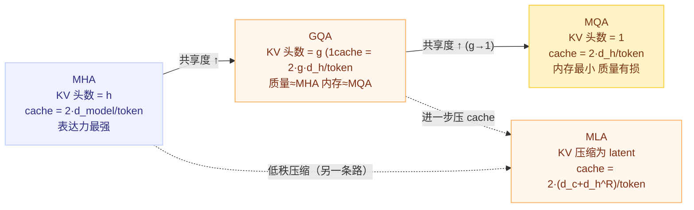

# Attention 头变体：MHA / MQA / GQA / MLA

## 一句话理解

MHA、MQA、GQA、MLA 是同一个 softmax attention 公式在 **"KV 头共享程度"** 这个维度上的不同采样点：

- **MHA**：每个 Q 头一套独立的 K/V 头，表达能力最强，KV cache 最大
- **MQA**：所有 Q 头共享唯一一套 K/V 头，KV cache 最小，但质量有损
- **GQA**：中间档，$g$ 个 Q 头共享一套 K/V 头，质量接近 MHA、内存远小于 MHA
- **MLA**：换个思路——不缓存 K/V 头本身，而是缓存低秩压缩的 latent 向量，进一步压 KV cache

它们的核心动机几乎都是同一个：**省 KV cache 内存、加快自回归解码**。

## 为什么重要

- KV cache 是 LLM 推理时最大的内存瓶颈，基本决定了可服务的**序列长度**和**并发 batch 大小**
- 从 MHA → GQA → MQA → MLA 是工业界用"一点表达能力/质量"换"巨大内存收益"的典型权衡
- 读 FlashAttention 源码时，`num_heads / num_heads_k`、`seqlenq_ngroups_swapped`、`dk_expanded / dv_expanded` 这些概念都建立在理解这套谱系之上

## 共同底座：MHA（Multi-Head Attention）

### 公式

$$
\mathrm{Attention}(Q,K,V)=\mathrm{softmax}\!\left(\frac{QK^\top}{\sqrt{d_h}}\right)V
$$

$h$ 个并行头，每个头独立线性投影后各算一次 attention，最后拼接再过 $W^O$：

$$
Q_h = XW^Q_h,\qquad K_h = XW^K_h,\qquad V_h = XW^V_h
$$

$$
\mathrm{MHA}(X)=\mathrm{Concat}(\mathrm{head}_1,\dots,\mathrm{head}_h)\,W^O
$$

其中 $d_{model} = h \times d_h$。

### 推理时的瓶颈：KV cache

自回归解码每生成一个 token，都要让新的 query 与**之前所有 token 的 K/V** 做注意力。于是把每层的 K/V 缓存在显存里：

$$
\text{KV cache (MHA)} = 2 \times h \times d_h = 2 \times d_{model} \quad \text{每 token 每层}
$$

总占用 $\approx 2 \times d_{model} \times \text{layers} \times \text{seqlen}$，随序列长度**线性增长**。70B 级模型 80 层、8k 序列时 KV cache 可达数 GB，是推理显存的最大头。这正是所有后续变体要攻击的目标。

## MQA：所有 Q 头共享一套 K/V

**论文**：Shazeer, *Fast Transformer Decoding: One Write-Head is All You Need*（2019）

- 只保留 **1 个 K 头 + 1 个 V 头**，所有 Q 头共享
- KV cache 降到 MHA 的 $1/h$：

$$
\text{KV cache (MQA)} = 2 \times d_h \quad \text{每 token 每层}
$$

- **优点**：KV cache 极小、cache 读写带宽大幅下降，解码吞吐提升明显
- **缺点**：K/V 表达被压缩到一个头，**质量有损**（尤其在长序列、复杂任务上）
- **代表模型**：Falcon、StarCoder、PaLM（decoder 部分用 MQA）

## GQA：折中的分组共享

**论文**：Ainslie et al., *GQA: Training Generalized Multi-Query Transformer Models from Multi-Head Checkpoints*（2023）

- 把 $h$ 个 Q 头分成 $g$ 组，每组共享一套 K/V 头，即 KV 头数 $= g$
- **极端情形**：$GQA(1) = MQA$，$GQA(h) = MHA$——GQA 是两者的连续插值
- KV cache：

$$
\text{KV cache (GQA)} = 2 \times g \times d_h \quad \text{每 token 每层}
$$

- **优点**：
  - 质量接近 MHA（表达能力损失很小），内存远小于 MHA
  - 可以从已有的 **MHA checkpoint 升级（uptraining）**而来，不用从头训练
- **代表模型**：LLaMA-2-70B、LLaMA-3（8 个 KV 头）、Mistral-7B（8 组）、Qwen-2、Gemma-2
- 自 2023 年起，GQA 成为开源 LLM 的**主流默认选择**

## MLA：低秩 latent 压缩

**论文**：DeepSeek-V2（2024），DeepSeek-V3 沿用

MHA/GQA/MQA 都在"共享多少 KV 头"上做文章；MLA 换了一条路——**不缓存 K/V 头，缓存低维压缩向量**。

1. **压缩**：把输入 $h_t$ 压成低秩 latent：

$$
c^{KV}_t = W^{DKV} h_t
$$

2. **解压**：用时再展开成 K/V：

$$
k^C_t = W^{UK} c^{KV}_t,\qquad v_t = W^{UV} c^{KV}_t
$$

3. **RoPE 解耦**：位置编码只作用于一个低维分支 $k^R_t$：

$$
k^R_t = \mathrm{RoPE}(W^{KR} h_t)
$$

这样 $c^{KV}_t$ 与位置无关、可跨 token 复用，KV cache 只需存 $c^{KV}_t$（维度 $d_c$）和 $k^R_t$（维度 $d_h^R$）：

$$
\text{KV cache (MLA)} = 2 \times (d_c + d_h^R) \quad \text{每 token 每层}
$$

4. **权重吸收**（推理技巧）：把 $W^{UK}/W^{UV}$ 乘进 $W^Q/W^O$，解码时**无需显式解压**，既省显存又省计算。

- **优点**：KV cache 比 GQA 再小一个量级；DeepSeek-V2 报告 1M 上下文窗口时该收益非常关键
- **代表模型**：DeepSeek-V2 / V3 / R1

## 统一视角：KV 头共享谱系

### 对比表

| 变体 | KV 头数/层 | KV cache/token/层 | 表达能力 | 解码速度 | 代表模型 |
|---|---|---|---|---|---|
| MHA | $h$ | $2hd_h = 2d_{model}$ | 最高 | 最慢（内存最大） | BERT、GPT-2、LLaMA-2 7B/13B |
| GQA | $g$ | $2gd_h$ | 接近 MHA | 快 | LLaMA-2 70B、LLaMA-3、Mistral、Qwen-2 |
| MQA | $1$ | $2d_h$ | 有损 | 最快 | Falcon、StarCoder、PaLM |
| MLA | latent | $2(d_c + d_h^R)$ | 接近 MHA | 快 | DeepSeek-V2/V3 |

## 相关但独立的变体

这些不是"头共享"变体，而是**正交的另一个维度**，常与 MHA/GQA 叠加使用：

- **Sliding Window Attention（局部注意力）**：Longformer（2020）、Mistral 使用。每个 query 只看 $[i-\text{left}, i+\text{right}]$ 窗口内的 key，复杂度从 $O(S^2)$ 降到 $O(S \cdot w)$。对应 flash-attn 的 `window_size` 参数。
- **ALiBi（Attention with Linear Biases）**：Press et al.（2021）。不加位置编码，而是给注意力分数加与相对距离成正比的线性偏置 $-\text{slope}_h \cdot |i-j|$，不同头用不同斜率，支持**长度外推**。对应 flash-attn 的 `alibi_slopes` 参数。
- **Cross-Attention**：Q 来自当前序列，K/V 来自**另一个序列**（如编码器输出、文本条件），是 Encoder-Decoder 与扩散模型文本条件的基础结构。
- **MoA（Mixture of Attention Heads）**：DeepSeek-V3 引入，允许**不同的 Q 头路由到不同的 KV 头组**，比固定分组更灵活（组选择本身可学习）。

## 在 FlashAttention 代码中的体现

- [flash_api.cpp](file:///Users/weijunzhang/project/pytorch/third_party/flash-attention/csrc/flash_attn/flash_api.cpp) 中 `TORCH_CHECK(num_heads % num_heads_k == 0)`：合法 GQA 的约束
- `const int ngroups = num_heads / num_heads_k;`：KV 头数 = Q 头数 / 组大小
- `seqlenq_ngroups_swapped`：decode（$seqlen\_q = 1$）时把 q 从 `(b, 1, num_heads_k·ngroups, d)` 重排成 `(b, ngroups, num_heads_k, d)`，**把 ngroups 当序列维**提供并行度
- kernel 侧 `h / h_k / h_h_k_ratio`：同一份内核同时支持 MHA / GQA / MQA
- backward 侧 `dk_expanded / dv_expanded`：先把 KV 梯度按组展开计算，再 reduce 回共享头

## My Understanding

- 这四个变体**不是四种不同的数学**，而是"KV 头共享程度"这一个旋钮上的不同位置；软注意力公式从未变过
- 质量损失不是来自注意力计算本身，而是来自 **K/V 投影表达被压缩**；GQA 在实践中几乎无可感知损失，所以成了主流默认
- 选型时要把**训练期内存**和**推理期内存**分开看：训练瓶颈是激活 + 优化器状态，KV cache 主要影响推理
- MLA 的本质是**给 KV cache 做低秩近似**，并靠 RoPE 解耦让 latent 与位置无关、可跨 token 复用——这是它能比 GQA 再小一个量级的关键
- GQA 的 `ngroups` 与"头共享"无关的 `window_size`（局部性）是两个正交维度，理解代码时别混淆

## 开放问题 / 待深挖

- MLA 权重吸收（$W^{UK} \to W^Q$）的完整推导
- MoA 可学习路由对稀疏激活与硬件亲和性的影响
- KV cache 量化（paged attention、fp8 cache）与 head 变体如何叠加

## Related Knowledge

- [FlashAttention 源码精读](./flash-attention-source-reading.md) — MQA/GQA 通过 `h / h_k` 处理
- [FlashAttention PyTorch ATen 接入层](./flash-attention-pytorch-aten-integration.md) — `num_heads % num_heads_k`、`seqlenq_ngroups_swapped`、`dk_expanded / dv_expanded`
- [FlashAttention 接口与 Autograd](./flash-attention-interface-and-autograd.md) — packed qkv `(B, S, 3, H, D)`、varlen 场景
- [FlashAttention 术语表与关键状态表](./flash-attention-glossary-and-state-table.md) — MQA/GQA 相关状态项

## References

- Vaswani et al. *Attention Is All You Need*（2017）— https://arxiv.org/abs/1706.03762
- Shazeer. *Fast Transformer Decoding: One Write-Head is All You Need*（2019）— https://arxiv.org/abs/1911.02150
- Ainslie et al. *GQA: Training Generalized Multi-Query Transformer Models from Multi-Head Checkpoints*（2023）— https://arxiv.org/abs/2305.13245
- DeepSeek-AI. *DeepSeek-V2: A Strong, Economical, and Efficient Mixture-of-Experts Language Model*（2024）— https://arxiv.org/abs/2405.04434
- Beltagy et al. *Longformer: The Long-Document Transformer*（2020）— https://arxiv.org/abs/2004.05150
- Press et al. *Train Short, Test Long: Attention with Linear Biases Enables Input Length Extrapolation*（2021）— https://arxiv.org/abs/2108.12409
