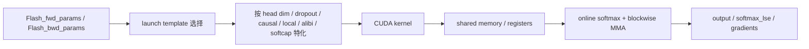

# FlashAttention Kernel 与 Launch 机制

## 一句话理解

FlashAttention 的真正核心在 kernel 层：
它不是一次性算完整个 `N × N` attention，而是通过 tile 化、在线 softmax、共享内存复用、模板特化和 split-KV 调度，把 attention 变成一组适合 GPU 的局部计算任务。

## 为什么重要

如果只看 interface，你会知道怎么调用；
如果只看论文，你会知道为什么省显存；
但只有读 kernel，你才会真正明白：

- 为什么它能 exact
- 为什么它比普通 attention 快
- 为什么它对 head dim、causal、local、dropout、varlen 都有很多约束
- 为什么编译时间很长、模板很多、不同 GPU 还会有不同 path

## 核心文件

- `csrc/flash_attn/src/flash.h`
- `csrc/flash_attn/src/flash_fwd_launch_template.h`
- `csrc/flash_attn/src/flash_bwd_launch_template.h`
- `csrc/flash_attn/src/flash_fwd_kernel.h`
- `csrc/flash_attn/src/flash_bwd_kernel.h`
- `csrc/flash_attn/src/flash_fwd_hdim*.cu`
- `csrc/flash_attn/src/flash_bwd_hdim*.cu`

## 总体数据流



## 关键设计 1：params struct 把所有运行时信息打包

`flash.h` 中的 `Flash_fwd_params` / `Flash_bwd_params` 是 kernel 的“世界观”。
它们包含：

- Q/K/V/O 指针
- stride 信息
- batch / seq / head / head dim
- `cu_seqlens_*`
- `block_table`
- `window_size_left/right`
- `softcap`
- `dropout` 与 `PhiloxCudaState`
- `alibi_slopes`
- `deterministic`
- `unpadded_lse`
- `seqlenq_ngroups_swapped`

这让 kernel 可以只接受一个参数对象，然后靠模板和条件编译处理不同路径。

## 关键设计 2：forward kernel 的本质是“分块在线 softmax”

FlashAttention forward 可以理解为：

1. 取一小块 Q
2. 依次加载 K / V 的小块到共享内存
3. 计算局部 score
4. 用在线方式维护每一行的 max / sum
5. 同步更新输出累积
6. 最后写出 O 和 `softmax_lse`

这和普通 attention 的区别在于：

- 普通 attention 会显式保存完整 score matrix
- FlashAttention 只保留当前 tile 的局部状态

### 在线 softmax 的核心直觉

若某行之前的最大值是 `m_old`，新 tile 的最大值是 `m_new`，则旧累积需要按比例缩放：

$$
\text{scale} = e^{m_{old} - m_{new}}
$$

然后把新 tile 的贡献加进去。
这样就可以在遍历 K/V 时保持 softmax 归一化正确。

## 关键设计 3：kernel specialization 是性能来源之一

`flash_fwd_launch_template.h` / `flash_bwd_launch_template.h` 会根据：

- `Is_dropout`
- `Is_causal`
- `Is_local`
- `Has_alibi`
- `Is_even_MN`
- `Is_even_K`
- `Is_softcap`
- `Return_softmax`
- `deterministic`
- head dim

来实例化不同 kernel。

这意味着：

- 运行时分支尽量少
- 热路径被模板展开
- 编译器可以更激进地做寄存器分配和常量折叠

代价是：

- 编译慢
- 二进制大
- 阅读成本高

但 FlashAttention 用性能证明了这笔账是值得的。

## 关键设计 4：forward 和 backward 的思路不同，但都在做局部块化

### Forward

forward 主要关心：

- 局部 score
- softmax 归一化
- 输出累积

### Backward

backward 要额外处理：

- `dO` → `dQ / dK / dV`
- dropout mask 重建
- `softmax_lse` 反向使用
- deterministic / seq-parallel 路径

backward 的结构比 forward 更复杂，常常会分成：

- dot / preprocess
- sequence-parallel 或 normal path
- 结果写回与 accumulation

## 关键设计 5：split-KV 是 FA2 的重要工程优化

在 `flash_fwd_launch_template.h` 里，`run_flash_splitkv_fwd` 说明：
如果单个 kernel 的并行度不够，就把 KV 分片，让多个 CTA 并行计算，然后再 combine。

这是 FlashAttention-2 更强调的部分：

- 不是只在一个大 tile 里死算
- 而是按 workload 调整切分方式
- 尤其适合推理 / 小 query / 大 KV 的场景

### 何时触发 split-KV

大体逻辑是：

- 先根据 GPU SM 数、batch/head 数、block 数估一个 `num_splits`
- 如果 `num_splits > 1`，就走 split path
- 最后再用 combine kernel 合并部分结果

这就是“work partitioning”的具体实现。

## 关键设计 6：head dim 决定 kernel 形状

你会发现源码里有大量 `hdim32/64/96/128/160/192/256` 的文件。

这说明 head dim 不是一个普通参数，而是 kernel 形状设计的一部分。

原因很直接：

- 影响每个 block 需要读多少元素
- 影响 shared memory / register 压力
- 影响 warp / MMA 的布局
- 影响 occupancy 和 memory throughput

所以 FlashAttention 不是“支持任意 head dim 的一个函数”，而是“**针对有限 head dim 集合的高性能实现族**”。

## 关键设计 7：forward / backward 都要考虑 causal / local 边界

`flash_fwd_kernel.h` 和 `flash_bwd_kernel.h` 里会对：

- causal mask
- local window
- varlen 边界
- head dim 未对齐

做细粒度判断。

这类边界处理的共同原则是：

- 尽量在 kernel 外做 shape 整理
- kernel 内只保留少量必要分支
- 用 predicate / mask 避免越界读写

## 关键设计 8：共享内存布局本身就是算法的一部分

在 kernel 代码里，`cute` / `cutlass` 不只是“辅助库”，而是在定义：

- 线程块如何分配矩阵 tile
- `Q/K/V` 如何映射到 shared memory
- MMA 矩阵如何做 warp 级别切分
- 哪些缓冲区可以复用

也就是说，FlashAttention 的性能并不只来自“少读写”，还来自**极其精细的数据布局设计**。

## 你可以把 forward 想成一个状态机

```text
state = {m, l, O}
for K/V tile in sequence:
    scores = Q @ K_tile^T
    update m and l online
    rescale O
    accumulate O += softmax(scores) @ V_tile
return O, lse
```

这个抽象非常接近 FlashAttention 的实际实现逻辑。

## PyTorch 内部的接入

PyTorch vendored 版本位于：

- `aten/src/ATen/native/transformers/cuda/flash_attn/flash_api.cpp`
- `aten/src/ATen/native/transformers/cuda/flash_attn/flash_api.h`

这层会把 FlashAttention 接进 ATen 的 transformer attention backend 中。
它的意义是：

- PyTorch 自己也能直接调用 FlashAttention fast path
- 上层调用者不需要知道 kernel 细节
- 只需要通过标准 attention API 触发 fast path

## 和论文的对应关系

| 论文概念 | kernel 对应 |
|---|---|
| IO-aware | tile 化 + on-chip 复用 |
| exact attention | 不近似，不稀疏，仍然算完整 softmax |
| online softmax | 分块更新 max/sum |
| work partitioning | split-KV / `num_splits` |
| better parallelism | CTA / warp 分工和 launch policy |
| inference optimization | query 很短时的特殊 split 路径 |
| causal / local | mask / block range 限制 |
| ALiBi / softcap | 参数化 bias / clamp 路径 |
| dropout | Philox RNG + backward 重建 |

## 我的理解

1. **FlashAttention 最本质的创新是“计算图重排 + 数据流重排”**
   - 它把 attention 从“矩阵代数”改写成“流式块处理”

2. **FA2 的关键词是 parallelism，而不是单纯 memory saving**
   - 它更关注如何把 GPU 吃满

3. **kernel 特化是性能和维护成本的交换**
   - 但对于 hot path 来说，这种交换很合理

4. **head dim / causal / varlen / dropout 不是附加功能，而是 kernel 设计约束**
   - 因为它们会直接影响 memory layout 和调度策略

## 建议的下一步阅读

- `flash.h`：先彻底理解参数结构
- `flash_fwd_launch_template.h`：理解 forward 的模板派发
- `flash_bwd_launch_template.h`：理解 backward 的模板派发
- `flash_fwd_kernel.h`：理解在线 softmax 与 tile 计算
- `flash_bwd_kernel.h`：理解梯度重建与 accumulation

## References

- `third_party/flash-attention/csrc/flash_attn/src/flash.h`
- `third_party/flash-attention/csrc/flash_attn/src/flash_fwd_launch_template.h`
- `third_party/flash-attention/csrc/flash_attn/src/flash_bwd_launch_template.h`
- `third_party/flash-attention/csrc/flash_attn/src/flash_fwd_kernel.h`
- `third_party/flash-attention/csrc/flash_attn/src/flash_bwd_kernel.h`
