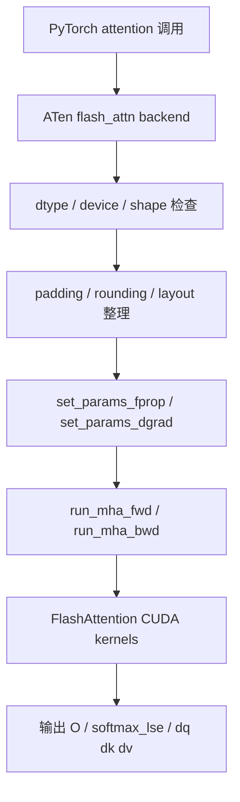

# FlashAttention PyTorch ATen 接入层

## 一句话理解

这层不是在“重新实现 FlashAttention”，而是在 PyTorch 的 ATen 运行时里，把 FlashAttention 变成一个可直接调度的 attention backend：
负责参数检查、形状整理、dtype/device 约束、参数打包、RNG/ALiBi 处理，以及 forward / backward 的 kernel 派发。

## 为什么重要

如果只看 `third_party/flash-attention`，你会觉得 FlashAttention 是一个外部 CUDA 扩展；
但 PyTorch 内部 vendored 的这层接入说明，FlashAttention 已经不仅是“第三方包”，而是可以进入 PyTorch transformer backend 的系统能力。

它的重要性主要在于：

- 让标准 PyTorch attention 路径可以直接走 fast path
- 把 FlashAttention 变成 ATen 生态中的 backend，而不是孤立依赖
- 让模型层不需要知道 kernel 细节，只需要走标准张量 API
- 把 dtype / shape / layout / dropout / ALiBi / local window 等约束统一封装起来

## 仓库位置

PyTorch 内部对应文件是：

- `aten/src/ATen/native/transformers/cuda/flash_attn/flash_api.cpp`
- `aten/src/ATen/native/transformers/cuda/flash_attn/flash_api.h`

它们和 `third_party/flash-attention/csrc/flash_attn/flash_api.cpp` 的角色很像，都是“C++ 组装层”，只是一个在外部仓库，一个在 PyTorch 主仓库内部。

## 数据流总览

## 这层提供的核心入口

我这次重点读到的入口是：

- `mha_fwd`
- `mha_varlen_fwd`
- `mha_bwd`
- `mha_varlen_bwd`

从命名就能看出来，它覆盖的是：

- dense batch 的 forward / backward
- varlen batch 的 forward / backward
- 训练态主链路
- 和 FlashAttention kernel 之间的桥接

## 这层具体做什么

### 1. 做硬约束检查

这里首先不是算 attention，而是做大量前置校验：

- GPU 架构是否支持
- dtype 是否是 `fp16` / `bf16`
- `q / k / v / out / dout` 是否同 dtype
- last dimension 是否连续
- batch size 是否大于 0
- head dim 是否满足上限与对齐约束
- `num_heads % num_heads_k == 0`
- varlen 场景下 `cu_seqlens_*` 是否是 `int32`
- paged KV 场景下 `block_table` 是否是 `int32`

这说明 ATen 接入层的职责之一，是把用户输入变成 kernel 可接受的严格输入。

### 2. 做 shape 和 layout 整理

这里会统一处理很多和 kernel 相关但不适合留给 kernel 的事情：

- head dim padding 到 8 的倍数
- round 到 `128` 的 sequence 长度
- round 到 `32` 或 `256` 的 head dim
- 某些路径下把 `q` reshape / transpose 成更适合并行的布局
- 推理式的 `seqlenq_ngroups_swapped` 优化

其中最典型的是短 query + grouped heads 的优化：

- dense 路径里，如果 `seqlen_q == 1` 且满足特定条件，会把 Q 重新布局以提高吞吐
- varlen 路径里，如果 `max_seqlen_q == 1` 且满足条件，也会做类似变换

这类逻辑说明：**ATen 层不是在做数学，而是在做数据表示法转换。**

### 3. 做 forward/backward 需要的中间状态分配

forward 会分配：

- `out`
- `softmax_lse`
- 可选的 `p`
- dropout 需要的 `rng_state`

backward 会分配：

- `dq / dk / dv`
- `softmax_d`
- `dq_accum`
- MQA / GQA 场景下的 `dk_expanded / dv_expanded`

这说明 ATen 层不仅传 tensor，还负责准备 backward 所需的工作缓冲区。

### 4. 处理 dropout RNG

这里用的是 Philox 相关状态。

forward 会：

- 从默认 CUDA generator 里拿 `PhiloxCudaState`
- 根据 `batch_size * nheads * 32` 之类的规则推进 counter
- 保存到 `params.rng_state` / `params.philox_args`

backward 会：

- 接收 `philox_seed` / `philox_offset`
- 用相同 RNG 语义重建 dropout mask

这和 FlashAttention 的 exact backward 紧密相关：它不是猜一个近似梯度，而是要复现和 forward 一致的随机路径。

### 5. 处理 ALiBi、causal、local window、softcap

这层会在进 kernel 之前把 feature flags 统一进参数：

- `set_params_alibi`
- `window_size_left / window_size_right`
- `is_causal`
- `softcap`

代码里还有一些统一化处理，比如：

- `seqlen_q == 1` 时，causal 和 non-causal 在没有 ALiBi 的情况下等价
- 如果 `is_causal`，就把右窗口直接设成 `0`
- 当窗口大于序列长度时，转换成 `-1`

这说明很多 feature 都被提前规范化了，kernel 看到的是更简单的输入状态。

## forward 路径的关键点

### dense forward

`mha_fwd` 的流程大致是：

1. 读设备属性，确认架构支持
2. 检查 dtype / shape / stride
3. 处理 head dim padding 和 sequence rounding
4. 分配 `out`、`softmax_lse`、可选 `p`
5. 填充 `Flash_fwd_params`
6. 配置 dropout RNG
7. 配置 ALiBi
8. 调 `run_mha_fwd`
9. 处理空序列和特殊形状
10. 返回 `out`、`softmax_lse`、`rng_state` 等上下文

### varlen forward

`mha_varlen_fwd` 比 dense 版更重，因为它还要处理：

- `cu_seqlens_q`
- `cu_seqlens_k`
- `seqused_k`
- `block_table`
- paged KV cache
- `zero_tensors`

它会把变长 batch 的 token 边界和 cache 组织方式都塞进参数结构体，再交给 kernel。

### MQA / GQA

如果 `num_heads_k != num_heads`，就意味着是 MQA / GQA：

- Q 的头数更多
- K/V 头数更少
- forward 和 backward 都要按头组关系做额外处理

ATen 层会把这类结构差异显式编码进参数，而不是让上层调用者自己想办法对齐。

## backward 路径的关键点

### dense backward

`mha_bwd` 的流程大致是：

1. 检查 `dout / q / k / v / out / softmax_lse`
2. 统一 head dim 和 rounded size
3. 分配 `dq / dk / dv`
4. 分配 `softmax_d`
5. 准备 `dq_accum`
6. 如果是 MQA / GQA，准备 `dk_expanded / dv_expanded`
7. 填充 `Flash_bwd_params`
8. 写入 Philox RNG 信息
9. 配置 ALiBi
10. 调 `run_mha_bwd`
11. 必要时对 `dk / dv` 做 group reduce

### varlen backward

`mha_varlen_bwd` 和 dense backward 类似，但它的张量布局是：

- `q / k / v / dout / out` 都是 unpadded token 展开形式
- `softmax_lse` 是按 `h x total_q` 的形式组织
- `cu_seqlens_*` 决定每个 batch item 的边界

所以它更像是在 token 级而不是 batch 级做回传。

## 我特别注意到的几个实现细节

### 1. `softmax_lse` 是 backward 的桥

ATen 层会显式保留 `softmax_lse`，而不是只保留输出 `out`。

这是因为 backward 要靠它恢复 softmax 归一化信息。

### 2. `dq_accum` 的设计是为了避免巨大临时张量

代码里明确写了：

- 不想分配一个完整的 `(batch, seqlen_q_rounded, num_heads, head_size_rounded)` 浮点缓存
- 因为长序列 batch 会让这个缓冲区非常大

所以它改成更紧凑的累计布局，并用偏移量确保不同 sequence 之间有足够间隔。

### 3. deterministic 会改变 accumulation 策略

当 `deterministic=True` 时，`dq_accum` 会变成多 split 缓冲区，代价是更大，但换来可复现性。

这说明 deterministic 不是一个简单开关，而是会影响整个 backward 的内存与调度方式。

### 4. `zero_tensors` 是显式支持的

在某些路径里，ATen 层会主动把输出或梯度 buffer 清零。

这通常用于需要固定输出语义或空输入语义的情况。

## 这层和外部 FlashAttention C++ bridge 的关系

外部仓库里的 `third_party/flash-attention/csrc/flash_attn/flash_api.cpp` 和这里的 ATen 版本在职责上是同构的：

- 都负责参数检查
- 都负责把张量和 flag 压成 params struct
- 都负责选择 forward / backward / split 路径
- 都负责 RNG、ALiBi、local mask 等边界条件

区别只是：

- 外部仓库面向独立包
- ATen 版本面向 PyTorch 内部 backend 接入

所以你可以把它理解成：**同一套 FlashAttention 逻辑，在 PyTorch 核心里有了一份原生接入。**

## 我自己的理解

1. **ATen 接入层的本质是“把 FlashAttention 变成 PyTorch 运行时的一部分”**
2. **这层最重要的工作不是计算，而是把各种复杂输入规整成 kernel 友好的状态**
3. **`softmax_lse` 和 Philox 状态是 exact backward 的关键上下文**
4. **MQA / GQA、varlen、paged KV、local window 都是表示法问题，不是单独的数学问题**
5. **PyTorch 接入层和外部 bridge 的代码思路高度一致，说明 FlashAttention 的设计已经足够稳定，可以被多处复用**

## 和论文/系统的对应关系

| 能力 | ATen 接入层对应 |
|---|---|
| exact attention | 保留 backward 所需上下文，而不是做近似 |
| online softmax | 交给 kernel，但 `softmax_lse` 要被保存和传递 |
| dropout | Philox RNG / `rng_state` |
| causal / local | `is_causal` / `window_size_left/right` |
| varlen attention | `cu_seqlens_q / cu_seqlens_k` |
| MQA / GQA | `num_heads / num_heads_k` + expansion/reduction |
| paged KV cache | `block_table` |
| deterministic backward | `deterministic` + split accumulation |
| PyTorch backend | ATen `flash_attn` 路径 |

## 相关阅读

- [FlashAttention 源码精读](./flash-attention-source-reading.md)
- [FlashAttention 接口与 Autograd](./flash-attention-interface-and-autograd.md)
- [FlashAttention Kernel 与 Launch 机制](./flash-attention-kernel-and-launch.md)
- [FlashAttention 系统地图](./flash-attention-system-map.md)

## References

- `aten/src/ATen/native/transformers/cuda/flash_attn/flash_api.cpp`
- `aten/src/ATen/native/transformers/cuda/flash_attn/flash_api.h`
- `third_party/flash-attention/csrc/flash_attn/flash_api.cpp`
- `third_party/flash-attention/csrc/flash_attn/src/flash.h`
