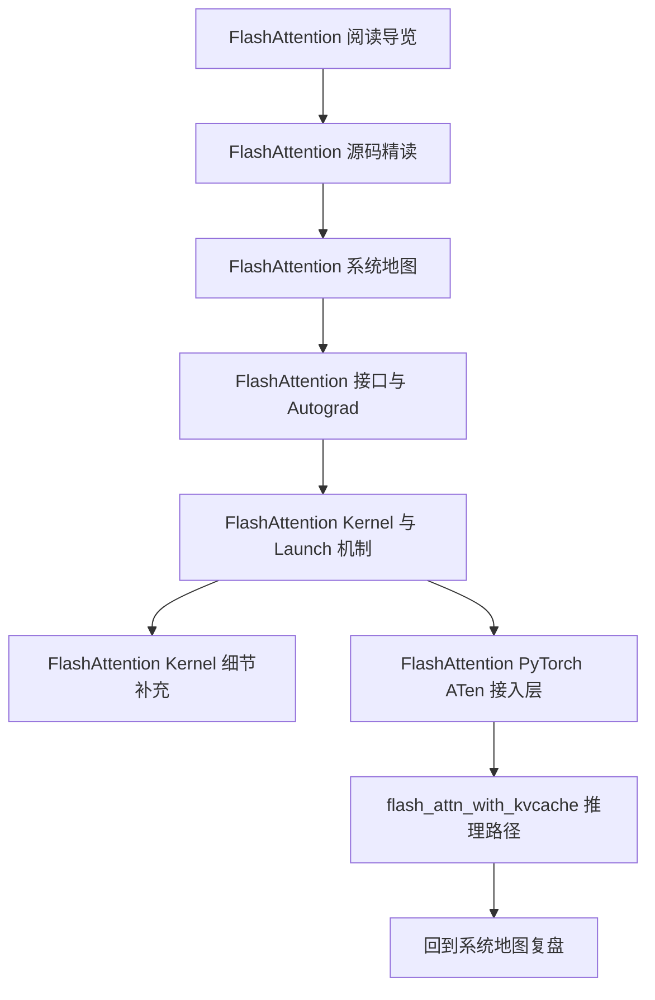

# FlashAttention 阅读导览

## 一句话理解

这是一篇给自己回看的路线图：
它不再解释 FlashAttention 的某一个细节，而是把整套笔记串起来，告诉我应该按什么顺序读、每一篇笔记解决什么问题、什么时候该从训练态切到推理态、什么时候该从系统图切到 kernel 细节。

## 这篇导览适合什么时候看

- 刚开始重新回顾 FlashAttention 时
- 想从“知道它快”回到“知道它为什么快”时
- 想在训练路径和推理路径之间切换时
- 已经读过细节，但忘了各篇笔记之间怎么串时
- 想把源码理解整理成一个可复用的记忆索引时

## 先记住三件事

1. **FlashAttention 不是一个 kernel，而是一条链路**
   - Python API
   - Autograd
   - C++ bridge
   - Launch templates
   - CUDA kernels
   - PyTorch ATen 接入
   - KV cache 推理路径

2. **训练态和推理态是两条互补主线**
   - 训练态围绕 `softmax_lse`、`rng_state`、`ctx`、backward 重建
   - 推理态围绕 `kvcache`、`cache_seqlens`、`block_table`、rotary、ALiBi、window 处理

3. **接口层、调度层、kernel 层都重要**
   - 接口层决定“能不能用”
   - 调度层决定“喂给谁”
   - kernel 层决定“怎么快”

## 总体阅读顺序

## 每篇笔记在解决什么问题

| 笔记 | 它回答的问题 | 适合什么时候读 |
|---|---|---|
| [FlashAttention 源码精读](./flash-attention-source-reading.md) | 这整个仓库到底在解决什么问题 | 第一遍建立全局印象 |
| [FlashAttention 系统地图](./flash-attention-system-map.md) | 各层之间怎么连起来 | 想把碎片串成图时 |
| [FlashAttention 接口与 Autograd](./flash-attention-interface-and-autograd.md) | Python API、ctx、训练态保存了什么 | 看调用入口时 |
| [FlashAttention Kernel 与 Launch 机制](./flash-attention-kernel-and-launch.md) | params、launch template、tile 计算怎么组织 | 想知道“怎么快”时 |
| [FlashAttention Kernel 细节补充](./flash-attention-kernel-details.md) | split combine、sequence-parallel、tile 级 RNG | 想钻进实现细节时 |
| [FlashAttention PyTorch ATen 接入层](./flash-attention-pytorch-aten-integration.md) | PyTorch 内部怎么接进 backend | 看 PyTorch 集成时 |

## 推荐的三种阅读模式

### 1. 快速回顾模式

如果我只想在 5 分钟内恢复记忆：

1. 先看这篇导览
2. 再看 [FlashAttention 系统地图](./flash-attention-system-map.md)
3. 再扫一遍 [FlashAttention 源码精读](./flash-attention-source-reading.md)

### 2. 训练态深读模式

如果我想重点理解训练态：

1. [FlashAttention 源码精读](./flash-attention-source-reading.md)
2. [FlashAttention 接口与 Autograd](./flash-attention-interface-and-autograd.md)
3. [FlashAttention Kernel 与 Launch 机制](./flash-attention-kernel-and-launch.md)
4. [FlashAttention Kernel 细节补充](./flash-attention-kernel-details.md)

重点抓四个状态：

- `softmax_lse`
- `rng_state`
- `dq / dk / dv`
- `deterministic`

### 3. 推理态深读模式

如果我想重点理解推理路径：

1. [FlashAttention 源码精读](./flash-attention-source-reading.md)
2. [FlashAttention PyTorch ATen 接入层](./flash-attention-pytorch-aten-integration.md)
3. `flash_attn_with_kvcache`
4. `MHA._apply_rotary_update_kvcache_attention`
5. 再回到 [FlashAttention 系统地图](./flash-attention-system-map.md)

重点抓四个状态：

- `cache_seqlens`
- `cache_batch_idx`
- `block_table`
- rotary / ALiBi / window 的位置语义

## 这套笔记的主线理解

### 主线 1：从论文到实现

论文回答的是：

- 为什么可以 exact attention 但不 materialize `N × N` matrix
- 为什么 tile 化 + 在线 softmax 可以降显存
- 为什么 FA2 需要更好的 parallelism

代码回答的是：

- 这些思想如何落到 Python API、C++ params、launch template、kernel

### 主线 2：从训练到推理

训练态最重要的是：

- `softmax_lse`
- dropout RNG
- backward 重建
- MQA / GQA
- varlen batch

推理态最重要的是：

- KV cache 更新
- rotary embedding
- cache 索引与分页布局
- causal / local window
- 一步 kernel 合并 update + attention

### 主线 3：从“能读懂”到“能复用”

当我以后再看类似项目时，我真正想复用的是这套阅读框架：

- 先找总图
- 再找入口
- 再找参数与状态
- 再找调度
- 最后再看 kernel

## 如果只想记住一句话

FlashAttention 的核心不是“一个快的 attention 实现”，而是**把 attention 变成一条可训练、可推理、可调度、可接入 PyTorch 的完整运行时链路**。

## 我的回看清单

下次再打开这套笔记时，我会先问自己四个问题：

1. 这次是在看训练态还是推理态？
2. 现在卡在接口、调度还是 kernel？
3. 有没有忘记 `softmax_lse` 或 `cache_seqlens` 这类状态？
4. 这次需要回到系统图，还是直接钻到某一篇专题？

## 关联笔记

- [FlashAttention 源码精读](./flash-attention-source-reading.md)
- [FlashAttention 系统地图](./flash-attention-system-map.md)
- [FlashAttention 接口与 Autograd](./flash-attention-interface-and-autograd.md)
- [FlashAttention Kernel 与 Launch 机制](./flash-attention-kernel-and-launch.md)
- [FlashAttention Kernel 细节补充](./flash-attention-kernel-details.md)
- [FlashAttention PyTorch ATen 接入层](./flash-attention-pytorch-aten-integration.md)

## References

- `third_party/flash-attention/README.md`
- `third_party/flash-attention/flash_attn/flash_attn_interface.py`
- `third_party/flash-attention/flash_attn/modules/mha.py`
- `third_party/flash-attention/csrc/flash_attn/flash_api.cpp`
- `third_party/flash-attention/csrc/flash_attn/src/flash_fwd_launch_template.h`
- `third_party/flash-attention/csrc/flash_attn/src/flash_bwd_launch_template.h`
- `third_party/flash-attention/csrc/flash_attn/src/flash_fwd_kernel.h`
- `third_party/flash-attention/csrc/flash_attn/src/flash_bwd_kernel.h`
- `aten/src/ATen/native/transformers/cuda/flash_attn/flash_api.cpp`
- `aten/src/ATen/native/transformers/cuda/flash_attn/flash_api.h`
