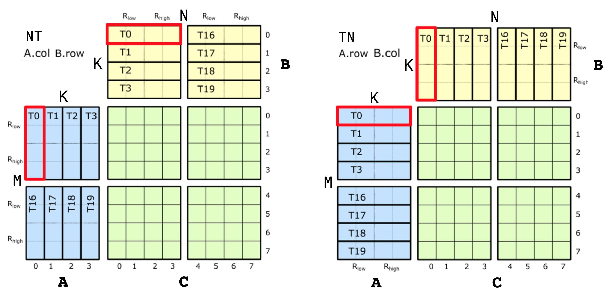
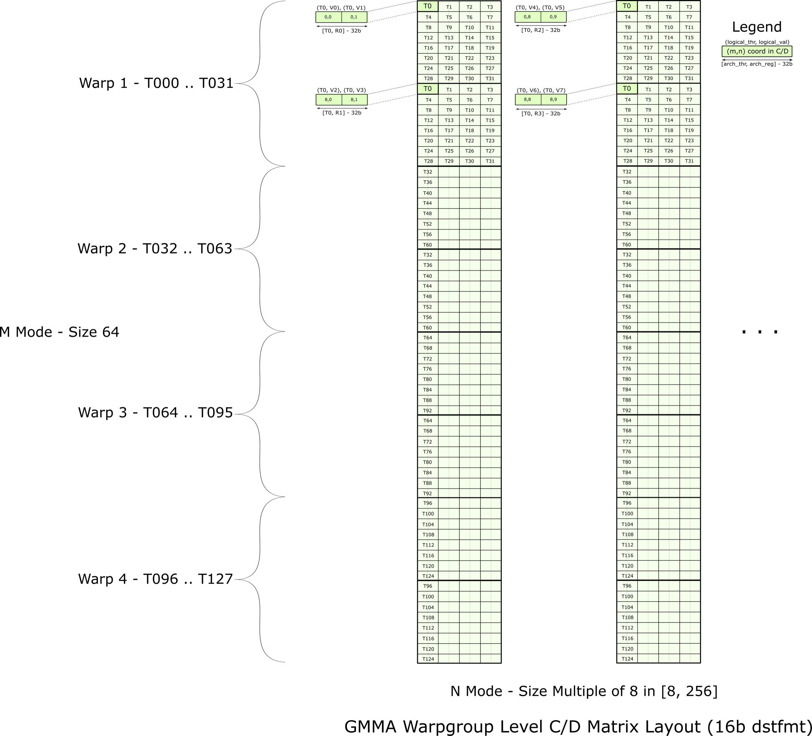
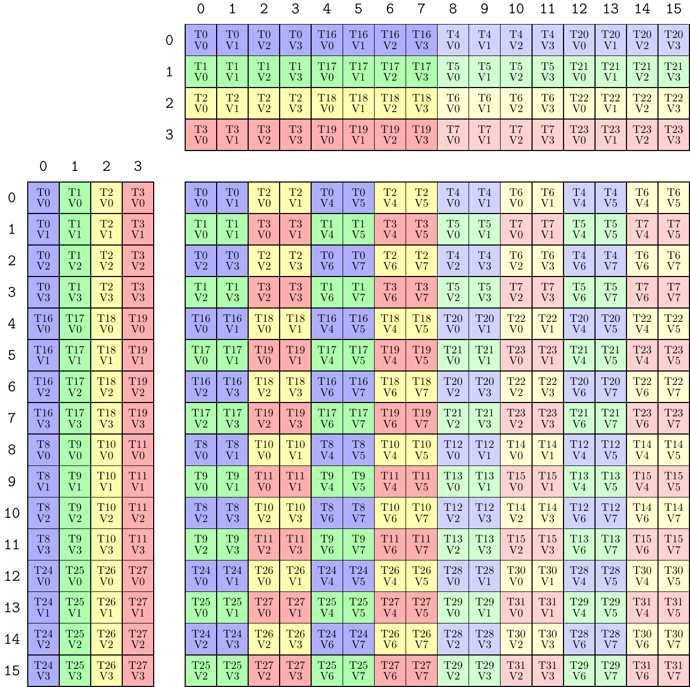
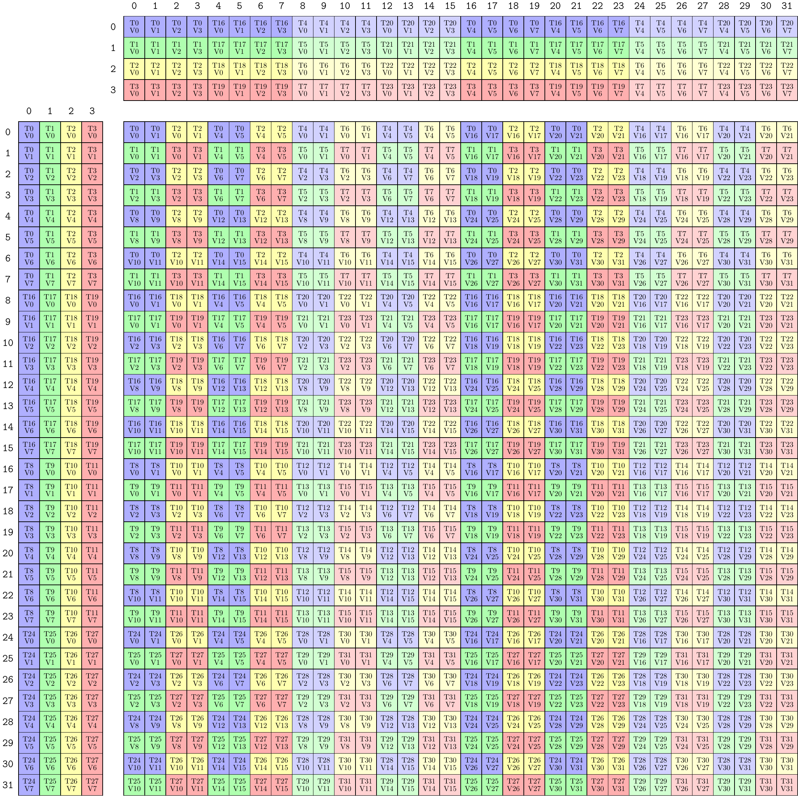

# CuTe 对矩阵乘累加（MMA）指令的支持

> 本文译自 CUTLASS 官方文档 `media/docs/cpp/cute/0t_mma_atom.md`。代码结构保持不变，注释译为中文。原文配图已复制到本笔记同目录的 `images/`（源自 CUTLASS 仓库 `media/images/cute/`，BSD-3-Clause），使用相对路径引用，便于在 GitHub 网页、编辑器预览与 VitePress 站点中一致显示。文末 License 为原文附带，不再翻译。凡以「译注」标记处为译者补充说明，非原文内容。

本文详细说明 CuTe 如何支持 GPU 的矩阵乘累加（Matrix Multiply-Accumulate, MMA）硬件指令。

MMA 是与架构强相关的：不同代际的 GPU 架构引入不同的 MMA 指令集。而 CuTe 的 `Layout` 等特性让这些 MMA 能够暴露给通用的 CUDA C++ 代码使用。我们分几步做到这一点：

1. 把每条 MMA 的 PTX 指令封装进一个 "Operation" 结构体。
2. 为每个 Operation 结构体定义一个 "Traits" 结构体，描述使用该 Operation 所需的全部元信息。
3. 二者组合为 "Atom"：PTX Operation 结构体 + 元信息 Traits 结构体。Atom 提供为该 Operation 构造 `cute::Tensor`「片段（fragment）」的方法，以及在已有 `cute::Tensor` 上使用该 Operation 的方法。
4. 把多个 Atom 组合起来，"TiledMMA" 通过建立 Atom 的布局与交错（interleaving）模式，提供构建更复杂分区（partitioning）模式的工具。

## CuTe MMA Atom

CuTe 把每个 MMA 以一对结构体暴露给通用 CUDA C++ 代码：一个 "Operation" 结构体，以及一个以该 Operation 结构体类型为模板参数的 `MMA_Traits` 结构体。

"Operation" 结构体暴露该操作对应的 PTX 指令，定义它期望的参数与接口。Operation 结构体的软件依赖极少——不使用 Layout、Tensor 或非标准数值类型——它只描述该指令**物理上的**输入与输出。不同结构体有不同的名字，用于描述该 MMA 指令做什么。命名规则见下文。

对应的 `MMA_Traits` 特化定义了该 Operation 的元信息，例如逻辑计算类型、该操作的逻辑形状、以及该操作内部线程与值的 `Layout`。`MMA_Traits` 以 Operation 作为模板参数，CuTe 为它支持的每个 Operation 类型特化 `MMA_Traits`。

这两者合起来构成一个 "Atom"，它把线程与数据布局的复杂度从 PTX 指令的调用点解耦出来。Atom 的 Traits 结构体所暴露的信息，只与**单个 MMA 操作**相关，与它在什么粒度上运算无关。

CuTe MMA Atom 表达的是「单个 MMA 操作」的语义——无论该 MMA 工作在哪个硬件层级。CuTe 支持多种硬件层级的 MMA Atom，包括：

- 单个线程（例如 fused multiply-add，FMA 指令）；
- 一个 quadpair（四线程组，Volta）；
- 单个 warp（Ampere）；
- 一个 warpgroup（Hopper）。

### Operation 结构体

#### 文件位置

CuTe 的 Operation 结构体位于 `include/cute/arch` 目录下，文件名以 `mma` 开头。

#### Operation 结构体的名字

CuTe Operation 结构体的名字主要编码它所封装的 PTX 指令，通常包括：

- 最早支持它的架构；
- 它接受的 M、N、K 维度；
- 它使用的类型；
- A、B 输入的排布方式。

例如下文 Volta 一节会提到 `SM70_8x8x4_F32F16F16F32_NT`，它定义在 `include/cute/arch/mma_sm70.hpp` 中：

- **"SM70"** 指 Volta。
- **"8x8x4"** 指 M = 8、N = 8、K = 4，即该 quadpair 执行的 MMA 操作的维度（见下文）。在 PTX 中体现为 `.m8n8k4.`。
- **"F32F16F16F32"** 指四个矩阵操作数 A、B、C、D 的元素类型。MMA 计算 $D = C + A \times B$，因此类型按从左到右读取：D 是 F32（`float`）、A 是 F16（half）、B 是 F16（half）、C 是 F32（`float`）。在 PTX 指令名中体现为 `.f32.f16.f16.f32`。
- **"NT"** 表示该 PTX 指令针对 A 输入为 M-major（不转置、列主序）、B 输入为 N-major（转置、行主序）。在 PTX 指令名中体现为 `.col.row.`。

#### 内容

Operation 结构体包含以下成员。

##### 类型别名

Operation 结构体有四个公开类型别名：`DRegisters`、`ARegisters`、`BRegisters`、`CRegisters`。例如 `include/cute/arch/mma_sm70.hpp` 中的 `SM70_8x8x4_F32F16F16F32_NT` 定义如下：

```c++
using DRegisters = float[8];
using ARegisters = uint32_t[2];
using BRegisters = uint32_t[2];
using CRegisters = float[8];
```

这表示每个线程会为 A、B、C、D 各传递多少个值给 PTX 指令。对该 Operation 而言，每个线程为 C 和 D 各传 8 个 F32 值（故为 `float[8]`），为 A 和 B 各传 4 个 F16 值（故为 `uint32_t[2]`；该指令把两个 16 位 F16 值打包进每一个 32 位 `uint32_t` 中）。

##### `fma` 静态成员设备函数

Operation 结构体定义了一个公开的 `static void fma` 函数。它标记了 `CUTE_HOST_DEVICE` 宏，即加上 `__host__ __device__` 注解。不同 Operation 的 `fma` 参数个数不同，取决于具体的 PTX MMA 指令。其实现用宏保护了对 PTX 指令的使用，并在宏未定义却调用 `fma` 时触发 `assert`。这样即使 PTX 指令不可用，测试与示例中使用该 Atom 的代码依然可以编译。

### Traits

#### 文件位置

CuTe 的 Traits 结构体位于 `include/cute/atom` 目录下，文件名以 `mma_traits` 开头。

#### 内容

`MMA_Traits` 特化定义如下公开类型别名：

- `ValTypeD`：D 矩阵的逻辑计算类型
- `ValTypeA`：A 矩阵的逻辑计算类型
- `ValTypeB`：B 矩阵的逻辑计算类型
- `ValTypeC`：C 矩阵的逻辑计算类型
- `Shape_MNK`：该 MMA 操作的逻辑 MxNxK 形状
- `ThrID`：单个 MMA 操作内的逻辑线程映射（指明是线程、quadpair、warp 还是 warpgroup 视角）
- `ALayout`：(线程, 值) 对到 MxK 的 A 矩阵坐标的映射
- `BLayout`：(线程, 值) 对到 NxK 的 B 矩阵坐标的映射
- `CLayout`：(线程, 值) 对到 MxN 的 C 矩阵坐标的映射

#### 示例

`SM70_8x8x4_F32F16F16F32_NT` 的 `MMA_Traits` 特化位于 `include/cute/atom/mma_traits_sm70.hpp`，内容如下：

```c++
template <>
struct MMA_Traits<SM70_8x8x4_F32F16F16F32_NT>
{
  using ValTypeD = float;
  using ValTypeA = half_t;
  using ValTypeB = half_t;
  using ValTypeC = float;

  using Shape_MNK = Shape<_8,_8,_4>;
  using ThrID   = SM70_QuadPair;
  using ALayout = SM70_8x4_Col;
  using BLayout = SM70_8x4_Col;
  using CLayout = SM70_8x8_32b;
};
```

下一节将详细解释这些类型别名。

## Volta

本节及后续几节展示如何构造 MMA Atom 的示例。我们并不试图解释所有 GPU 架构与 MMA，而是挑选若干例子来说明**开发一个新 Atom 的过程**。

Volta 架构实现了 HMMA 指令：一组 8 个线程（称为 quadpair，QP）协作共享数据并执行 8x8x4（fp32 或 fp16）的矩阵乘累加（由于一个 warp 宽 32 线程，它会在 4 个 QP 上执行 MMA，从而覆盖 16x16x4 的 tile 大小）。

我们首先看 HMMA 指令在 ISA 层面的线程与数据划分语义，并把它编码进 Traits 结构体。HMMA NT 指令的线程-数据布局如下：


### 类型

上面的 HMMA NT 使用的类型是：

```cpp
  using ValTypeD = float;
  using ValTypeA = half_t;
  using ValTypeB = half_t;
  using ValTypeC = float;
```

`MMA_Traits` 的其余部分都以这些类型为单位来描述。

### 形状

上面的 HMMA NT 形状为 8x8x4：

```cpp
  // MMA 的逻辑形状
  using Shape_MNK = Shape <_8,_8,_4>;
```

### 线程 ID

若 warp 中的 32 个线程在逻辑上以 [0 ... 31] 编号，则上图包含线程 [0,1,2,3] ∪ [16,17,18,19]。这些线程组成第 0 个 quadpair。我们可以写一个线程映射，把 MMA 的 8 个逻辑线程 id [0,1,2,3,4,5,6,7] 映射到 warp 中 quadpair 的线程索引 [0,1,2,3] ∪ [16,17,18,19]。该 layout 函数有 4 个步长为 1 的元素，以及 2 个步长为 16 的元素。据此写出表示一个 quadpair 的 layout：

```cpp
  // 映射：(逻辑线程 id) -> (线程索引)
  using ThrID = Layout<Shape <_4, _2>,
                       Stride<_1,_16>>;
```

这个 layout 函数把 MMA 操作的逻辑线程 id [0,8) 映射到 warp 中 quadpair 的线程索引 [0,4) ∪ [16,20)。

### 累加器映射

我们来看一个 QP 内的 8 个线程究竟如何映射到 A、B、C 矩阵。对 C、D 矩阵，上图可进一步拆解如下：左侧是 QP 层级的整体视图，右侧只是线程 0 所拥有的值。


这个「单指令层级视图」的元信息正是我们要编码进 CuTe 的东西。具体来说，图中的 QP 层级视图对应 `SM70_F32F16F16F32` 的四个 MMA traits。这些结构体包含 `Element` 类型、`Shape_MNK`，以及上面构造的 `ThrID` 映射。接下来看 `CLayout` 的定义——累加器的线程-数据布局。`CLayout` 的任务是建立 `(logical_thr_id, logical_val_id)` 到 C 矩阵中 `(m, n)` 坐标的映射，进而用于构建更复杂的布局与操作，比如 16x16x4 的 WMMA。

我们可以从上面的图开始构造 `CLayout`。与任何 CuTe layout 一样，它是一对 `Shape` 与对应的 `Stride`。先看 shape。已知 HMMA 使用 8 个线程、每个线程拥有 8 个值，因此映射的 shape 在两个 mode 上都必须是 8，即：

```cpp
  // (T8,V8) -> (m,n)
  using CLayout = Layout<Shape <_8, _8>,
                         Stride<_?, _?>;  // stride 待填
```

译注：这里的 8×8 是「8 线程 × 8 值」，不要与 C 矩阵逻辑上的 8×8 形状混淆。

现在要把它们映射到 (m,n) 坐标。由于 CuTe layout 返回的是索引而不是坐标，我们选择对 (m,n) 坐标做列主序编码：

```
(logical_thr_id, logical_val_id) -> (m, n) == m + n * M
```

有了这些，就可以开始考虑 `CLayout` 的 stride 怎么构造。先看线程之间的 stride。注意：

- `(T0,V0)` 位于 `(m,n) = (0,0) = 0`
- `(T1,V0)` 位于 `(m,n) = (1,0) = 1`
- `(T2,V0)` 位于 `(m,n) = (0,2) = 16`
- `(T3,V0)` 位于 `(m,n) = (1,2) = 17`
- `(T4,V0)` 位于 `(m,n) = (4,0) = 4`
- `(T5,V0)` 位于 `(m,n) = (5,0) = 5`
- `(T6,V0)` 位于 `(m,n) = (4,2) = 20`
- `(T7,V0)` 位于 `(m,n) = (5,2) = 21`

其中 `T4`、`T5`、`T6`、`T7` 是 MMA 的第 4、5、6、7 个逻辑线程 id，对应 warp 中线程索引 16、17、18、19（记录在 `ThrID` 映射里）。

可以看出这个模式可以转写成一个 layout。这 8 个线程的位置可表示为：

```cpp
  using CLayout = Layout<Shape <Shape <_2,  _2, _2>, _8>,
                         Stride<Stride<_1, _16, _4>, _?>;
```

用完全相同的思路，可以构造 `logical value id` mode 上的 stride：

- `(T0,V0)` 位于 `(m,n) = (0,0) = 0`
- `(T0,V1)` 位于 `(m,n) = (0,1) = 8`
- `(T0,V2)` 位于 `(m,n) = (2,0) = 2`
- `(T0,V3)` 位于 `(m,n) = (2,1) = 10`
- `(T0,V4)` 位于 `(m,n) = (0,4) = 32`
- `(T0,V5)` 位于 `(m,n) = (0,5) = 40`
- `(T0,V6)` 位于 `(m,n) = (2,4) = 34`
- `(T0,V7)` 位于 `(m,n) = (2,5) = 42`

这个模式同样可以转写为 layout，8 个值的位置可表示为：

```cpp
  // (T8,V8) -> (m,n)
  using CLayout = Layout<Shape <Shape <_2, _2,_2>, Shape <_2,_2, _2>>,
                         Stride<Stride<_1,_16,_4>, Stride<_8,_2,_32>>>;
```

就这样。可以验证该 layout 中每个 `(tid,vid)` 坐标都能可靠地映射到正确的（编码后的）`(m,n)` 坐标。

对于 F16 累加器，布局要简单得多：累加器的每一行 `(m, :)` 都由单个线程持有，于是布局为：

```cpp
  using CLayout = Layout<Shape <_8,_8>,
                         Stride<_1,_8>>;
```

### A 与 B 的 Layout 映射

A、B 矩阵的布局取决于源是否转置。下图展示了 NT 与 TN 两种转置情形下 A、B 矩阵的线程 ID 到数据归属的映射。



先看 TN 情形下 A 矩阵的布局（图中右侧）。同样是那 8 个逻辑线程，但这次每个线程只拥有 4 个元素，因此 `ALayout` 的 shape 是 `Shape<_8, _4>`。至于 stride，仍需在 `(m, k) == m + k * M` 之间建立类似映射。沿 `M` mode 往下，从 `(T0, V0)` 到 `(T1, V0)`，对全部 8 个线程 stride 都是 1。沿 `K` mode 横向，从 `(T0, V0)` 到 `(T0, V1)`，对全部 4 个值 stride 都是 8。因此 A 的 layout 是：

```cpp
  // (T8,V4) -> (m,k)
  using ALayout = Layout<Shape <_8,_4>,
                         Stride<_1,_8>>;
```

TN HMMA 下 B 源布局的构造方式类似，只是为方便写成了 `(N,K)` 而非 `(K,N)`。stride 方面：沿 `N` mode 横向，从 `(T0, V0)` 到 `(T1, V0)`，对全部 8 个线程 stride 为 1；沿 `K` mode 往下，`(T0, V0)` 到 `(T0, V1)`，对全部 4 个值 stride 为 8。所以 B 布局与 A 相同：

```cpp
  // (T8,V4) -> (n,k)
  using BLayout = Layout<Shape <_8,_4>,
                         Stride<_1,_8>>;
```

NT 情形下的布局略复杂（图中左侧）。沿 A 的 `M` mode 往下，先看到 `T0` 的 4 个值，然后看到 `T4` 的 4 个值。这意味着：先有 4 个值 stride 为 1，随后从 `T0` 到 `T4` stride 为 4。因此在 `M` mode 上有两个子 stride。对 `K` mode，横向推进时只需递增 `thr_id`、保持 `val_id` 不变，因此对 4 个线程 stride 为 8。于是 A 的 layout 是：

```cpp
  // (T8,V4) -> (m,k)
  using ALayout = Layout<Shape <Shape <_4,_2>,_4>,
                         Stride<Stride<_8,_4>,_1>>;
```

B 采用 `(N,K)` 顺序时，布局相同：

```cpp
  // (T8,V4) -> (n,k)
  using BLayout = Layout<Shape <Shape <_4,_2>,_4>,
                         Stride<Stride<_8,_4>,_1>>;
```

至于 NN 与 TT 转置，它们只是上面已见的 A、B 两种布局的组合。

## Hopper

现在来看 Hopper 架构首次引入的更大规模操作——GMMA（Group MMA）。这些 MMA 指令以 128 个线程（4 个 warp）为粒度运算，这 4 个 warp 合称一个 warpgroup。

### 线程 ID

在 Hopper GMMA 中，线程 ID 按简单的 1D 连续布局分配，因此 `thrID` 非常平凡：

```cpp
using ThrID = Layout<_128, _1>;
```

### 累加器映射

GMMA 中的累加器是分层映射的：从「core matrix（核心矩阵）」的概念出发，逐层构建出整个 C 矩阵 tile 的布局。先看这个 core matrix。这里只考虑 fp16 累加器，fp32 的扩展稍后会看到，很简单。

每个 core matrix 的布局如下图所示：


与 Volta 的例子一样，线程 ID 只是逻辑上的，它们属于 warpgroup 中四个 warp 的哪一个并不重要。

随后 GMMA 沿 `M` mode 先垂直平铺这个 core matrix，再沿 `N` mode 重复这一列 core matrix，从而构造完整的 MxN tile。这个平铺过程如下图所示：



有了这张图，就可以开始为 `SM90_64x128x16_F16F16F16F16_TN` atom 构建 `CLayout` 了。与之前一样，我们构造 `(logical_thr_id, logical_val_id) -> (m, n)` 坐标空间之间的映射。

先跟踪前几个线程与值。可以看到它们沿 `N` mode 排布，形式是「成对的值 + 4 个线程」，于是有：

```cpp
// (T128,V4) -> (M64,N8)
using CLayout = Layout<Shape <Shape <  _4, ...>, Shape < _2, ...>>,
                       Stride<Stride<_128, ...>, Stride<_64, ...>>>;
```

为完成第一个 8x8 的 core matrix，这 4 个线程沿 `M` mode 重复 8 次：

```cpp
// (T128,V4) -> (M64,N8)
using CLayout = Layout<Shape <Shape <  _4, _8, ...>, Shape < _2, ...>>,
                       Stride<Stride<_128, _1, ...>, Stride<_64, ...>>>;
```

接着进入下一个 core matrix 时，我们又绕回到 `T0`，但这次是 `(T0, V2)`：

```cpp
// (T128,V4) -> (M64,N8)
using CLayout = Layout<Shape <Shape <  _4, _8, ...>, Shape < _2, _2>>,
                       Stride<Stride<_128, _1, ...>, Stride<_64, _8>>>;
```

最后，整个模式沿 `M` mode 重复 4 次（每个 warp 一次），起点为 `(m,n) = (16,0) = 16`，其中属于同一个 warp 的两个 core matrix 上下堆叠。于是 M 最后一个 sub-mode 的大小是 4；至于 stride，这次到达 `(T32, V0)`，故 stride 为 32：

```cpp
// (T128,V4) -> (M64,N8)
using CLayout = Layout<Shape <Shape <  _4, _8,  _4>, Shape < _2, _2>>,
                       Stride<Stride<_128, _1, _16>, Stride<_64, _8>>>;
```

这就是 64x8 累加器的完整 `CLayout`。GMMA 指令包含 64xN 的变体，其中 `N = [16,32,64,128,256]`，即重复这个 64x8 模式，使每个线程获得额外的值。由于它起始于 `(m,n) = (0,8) = 512`，在 `CLayout` 中很容易处理。例如 64x128 的 `CLayout` 是：

```cpp
// (T128,V64) -> (M64,N128)
using CLayout = Layout<Shape <Shape <  _4, _8,  _4>, Shape < _2, _2,  _16>>,
                       Stride<Stride<_128, _1, _16>, Stride<_64, _8, _512>>>;
```

其中可见 16 份 64x8 tile 的副本。

### A 与 B 的 Layout 映射

直接从共享内存消费 A、B 源的 GMMA atom 有点特殊：GMMA Descriptor 是构建在共享内存中**整块** A 和/或 B 数据之上的，而不是由线程分区得来。也就是说，每个线程都看到整块数据，且这块数据不会被重排，以便能在其上构造 descriptor。用 `ALayout` 形式可表达为：

```cpp
// (T128,V64x16) -> (M64,K16)
using ALayout = Layout<Shape <_128, Shape <_64,_16>>,
                       Stride<  _0, Stride< _1,_64>>>;
```

即所有线程都映射到 `(m,k) = (0,0) = 0` 这个元素（stride 为 0），而值（及值的形状）保持不变。GMMA Descriptor Constructor 随后可以检查这份数据的 `(M,K)` 布局，构造出合适的 GMMA Descriptor，或者报错指出该数据的布局对 GMMA 无效。

## `TiledMMA`

通过组合与交错多个 Atom，我们可以构造更复杂的模式。

从 `SM70_8x8x4_F32F16F16F32_NT` 开始：

```cpp
MMA_Atom mma = MMA_Atom<SM70_8x8x4_F32F16F16F32_NT>{};
print_latex(mma);
```


上面等价于：

```cpp
    TiledMMA mma = make_tiled_mma(SM70_8x8x4_F32F16F16F32_NT{},
                                  Layout<Shape<_1,_1,_1>>{},   // Atom 的布局
                                  Tile<_8,_8,_4>{});           // Tiler
    print_latex(mma);
```

因为它是单个 atom，天然 tile 大小就是 8x8x4。

用四个这样的 quadpair MMA，可以构造出类似 WMMA 的对象：

```cpp
    TiledMMA mma = make_tiled_mma(SM70_8x8x4_F32F16F16F32_NT{},
                                  Layout<Shape <_2,_2>,
                                         Stride<_2,_1>>{});   // 2x2、n-major 的 Atom 布局
    print_latex(mma);
```



这个 `TiledMMA` 把 `MMA_Atom` 沿线程方向复制——可以看到 `C` 矩阵中出现了此前未使用的 `T4`、`T8`、`T12` 线程。`C` 矩阵的每个象限都是该 atom 分区模式在一个新 quadpair 上的副本，复制遵循 `(2,2):(2,1)` 布局。

上面代表的是 16x16x4 的 MMA，我们还可以立刻把这个「tile 大小」扩展到 32x32x4：

```cpp
    TiledMMA mma = make_tiled_mma(SM70_8x8x4_F32F16F16F32_NT{},
                                  Layout<Shape <_2,_2>,
                                         Stride<_2,_1>>{},  // 2x2、n-major 的 Atom 布局
                                  Tile<_32,_32,_4>{});      // 32x32x4 tiler
    print_latex(mma);
```


这个 `TiledMMA` 把前一个 `TiledMMA` 沿**值**方向（而非线程方向）复制——可以看到 `C` 矩阵中出现了此前未使用的 `T0V8`、`T16V8`、`T8V8` 值。`C` 矩阵的每个象限都是前一个 `TiledMMA` 分区模式在一组新值上的副本。

继续看，`T0` 从 `A` 矩阵收到 8 个值，这些读取发生在坐标：

```
T0V0 => ( 0,0)
T0V1 => ( 1,0)
T0V2 => ( 2,0)
T0V3 => ( 3,0)
T0V4 => (16,0)
T0V5 => (17,0)
T0V6 => (18,0)
T0V7 => (19,0)
```

它们是分散的，而我们可能希望它们彼此相邻。也就是说，我们希望对 `M` mode 做一次排列（permute），从而得到另一个合法的 `TiledMMA`：

```cpp
    TiledMMA mma = make_tiled_mma(SM70_8x8x4_F32F16F16F32_NT{},
                                  Layout<Shape <_2,_2>,
                                         Stride<_2,_1>>{},       // 2x2、n-major 的 Atom 布局
                                  Tile<Layout<Shape <_4,_4,_2>,
                                              Stride<_1,_8,_4>>, // M 上的排列，大小 32
                                       _32,                      // N 上的排列，大小 32（单位排列）
                                       _4>{});                   // K 上的排列，大小 4（单位排列）
    print_latex(mma);
```



那个 layout `(4,4,2):(1,8,4)` 应读作一个 **scatter 排列**，它告诉原图中各 m 坐标在新图中应该去哪里：

```
old m-coord:  0  1  2  3  4  5  6  7  8  9 10 11 12 13 14 15 16 17 18 19 20 21 22 23 24 25 26 27 28 29 30 31
new m-coord:  0  1  2  3  8  9 10 11 16 17 18 19 24 25 26 27  4  5  6  7 12 13 14 15 20 21 22 23 28 29 30 31
```

这仅对 `M` mode 做排列（A 与 C 中相应如此），并让所有线程在 `A` 矩阵中的访问在 m 坐标上变得连续。这在设计共享内存或寄存器布局时会很方便。上图所包含的 MMA 指令现在在逻辑 m 坐标上实际上变成了交错的。当然，`N` mode 与 `K` mode 上的排列也是合法的。

要了解这些 `TiledMMA` 如何用于对数据张量做分区，见 `0x_gemm_tutorial.md`。

> 译注：本译文对应的 Permutation Layout 机制，详见本站 [06 混合精度 MMA 与自定义 FP8 MMA op](./06-cute-mixed-precision-mma.md) 与 [03 TiledMMA 与 fragment](./03-cute-tiled-mma.md)；源码定义见 `include/cute/atom/mma_atom.hpp` 的 `TiledMMA` / `permutation_mnk`。

## License

原文附带 BSD-3-Clause 许可：

```
Copyright (c) 2017 - 2025 NVIDIA CORPORATION & AFFILIATES. All rights reserved.
SPDX-License-Identifier: BSD-3-Clause
```

完整的许可条款与免责声明见原文档 `media/docs/cpp/cute/0t_mma_atom.md` 末尾。

## Related

- [03 TiledMMA 与 fragment](./03-cute-tiled-mma.md) — TiledMMA 的 ThrExpand / ValExpand 与本文的 Atom 层对应
- [06 混合精度 MMA 与自定义 FP8 MMA op](./06-cute-mixed-precision-mma.md) — MMA op / Traits / TV Layout 与 Permutation
- [01 Tensor 与 Layout](./01-cute-tensor-and-layout.md) — 读懂本文所有 Layout 表示法的前置
