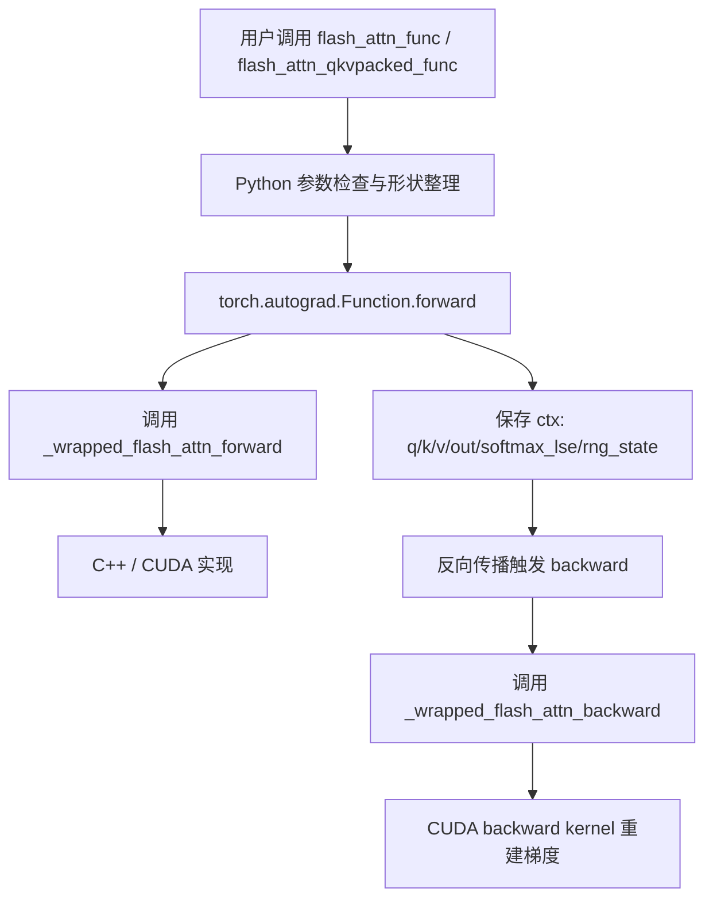

# FlashAttention 接口与 Autograd

## 一句话理解

FlashAttention 的 Python 接口层负责把“注意力”这个高性能 CUDA 算子包装成标准 PyTorch API：
它既要照顾 `qkv` / `q,k,v` / varlen / KV cache 等多种输入形态，又要把 forward 期间需要的 `softmax_lse`、`rng_state`、padding 信息保存下来，供 backward 精确重建梯度。

## 为什么重要

如果只看 CUDA kernel，很容易以为 FlashAttention 只是一个“快的 attention 内核”。
但真正工程化的难点在于：

- 让它像普通 `torch.autograd.Function` 一样可微
- 支持 packed / unpacked / varlen / inference cache 等多种数据形态
- 把 dropout、causal、local attention、ALiBi、softcap 统一到同一套接口
- 在 PyTorch 2.4+ 里同时兼容 custom op / fake tensor / torch.compile

也就是说，**接口层决定 FlashAttention 能不能真正进入模型代码。**

## 仓库中的核心入口

### Python 对外 API

`flash_attn/flash_attn_interface.py` 暴露了 4 个最常用入口：

- `flash_attn_qkvpacked_func`
- `flash_attn_func`
- `flash_attn_varlen_func`
- `flash_attn_with_kvcache`

它们分别覆盖：

- QKV 已经打包在一起的场景
- Q / K / V 分开输入的场景
- 变长 batch 的场景
- 推理时 KV cache 更新 + attention 的场景

### 模块级封装

`flash_attn/modules/mha.py` 把这些函数包进了更像 PyTorch 层的模块：

- `FlashSelfAttention`
- `FlashCrossAttention`
- `MHA`

这层负责：

- 在训练 / 推理之间切换 dropout
- 处理 rotary embedding
- 处理 `inference_params`
- 决定是否走 flash-attn fast path 或 fallback attention

## 数据流总览



## 关键设计 1：用 autograd Function 把 CUDA 算子接入 PyTorch

接口层最重要的模式是 `torch.autograd.Function`。

例如 `FlashAttnFunc.forward()` 会：

1. 判断是否需要梯度
2. 检查 `softmax_scale`
3. 对 head dim 做 8 对齐 padding
4. 调用 `_wrapped_flash_attn_forward`
5. 保存 backward 所需上下文到 `ctx`
6. 截断 padding 后返回结果

`backward()` 则会：

1. 读取 `ctx.saved_tensors`
2. 对 `dout` 做同样的 padding
3. 调用 `_wrapped_flash_attn_backward`
4. 去掉 padding 后返回 `dq/dk/dv`

这意味着 FlashAttention 的 backward 不是“临时推导一个近似梯度”，而是**用同样的中间状态、同样的 mask / dropout / softmax 信息，精确重建梯度路径。**

## 关键设计 2：forward 保存的不是“结果”，而是“梯度重建所需最小集合”

从 `FlashAttnFunc` / `FlashAttnQKVPackedFunc` / `FlashAttnVarlenFunc` 看，保存上下文的核心对象通常是：

- `q, k, v`
- `out_padded`
- `softmax_lse`
- `rng_state`
- 变长路径下的 `cu_seqlens_q / cu_seqlens_k`

这里的选择很讲究：

- `softmax_lse` 用来在 backward 中重建 softmax 的归一化信息
- `rng_state` 用来复现 dropout mask
- `cu_seqlens_*` 用来保持变长 batch 的 token 边界

所以 interface 层不是“把输出返回给用户”这么简单，**它同时在做训练态缓存设计。**

## 关键设计 3：padding 是为了满足 kernel 的硬约束

代码里有一个很常见的模式：

- head dim 如果不是 8 的倍数，就补齐到 8
- 计算完再切掉多余部分

这样做的原因是 CUDA kernel 内部通常会按对齐向量访问、warp tile、tensor core 对齐来实现。

同样，`flash_attn_interface.py` 还会根据 `head_dim`、`causal`、`dropout`、`window_size` 选择不同的 `_get_block_size_n()` 路径。

这说明：**接口层做的不是“业务逻辑”，而是把用户自由输入变成 kernel 可接受的受约束输入。**

## 关键设计 4：packed / unpacked / varlen 是不同的内存组织方式

FlashAttention 接口最容易让人迷糊的一点，是它看起来有很多“功能重复”的 API。
其实这些差别主要来自输入布局：

### 1. `flash_attn_qkvpacked_func`

输入是 `qkv: (B, S, 3, H, D)`。

适合 QKV 已经一次性投影并打包好的场景。
优点是 backward 时避免显式拼接 Q/K/V 的梯度。

### 2. `flash_attn_func`

输入是 `q, k, v` 分开的标准 attention 形式。

适合一般模型结构，尤其是 MQA / GQA。

### 3. `flash_attn_varlen_func`

输入是 unpadded token 序列，配合 `cu_seqlens_q / cu_seqlens_k`。

适合：

- padding 很多的 batch
- ragged / packed 数据
- 更高效的 token 级 attention

### 4. `flash_attn_with_kvcache`

适合推理阶段：

- 先更新 KV cache
- 再用 cache 做 attention
- 支持 rotary / causal / local / page table

这条路径本质上是把“生成第 t 步 token”变成一个高吞吐的 kernel 问题。

## 关键设计 5：MHA 模块是“集成层”，不是另一个 attention 实现

`flash_attn/modules/mha.py` 里的 `MHA` 不是在重新发明 attention。
它做的是系统集成：

- `use_flash_attn=True` 时，走 FlashAttention fast path
- 否则 fallback 到普通 `SelfAttention` / `CrossAttention`
- `rotary_emb`、`use_alibi`、`window_size`、`inference_params` 都在这一层组装

这让 FlashAttention 可以作为一个“可替换后端”嵌入到真实模型代码里。

### 训练态 vs 推理态

- 训练：通常会走 `flash_attn_func` / `flash_attn_qkvpacked_func`
- 推理：优先走 `flash_attn_with_kvcache`

推理路径里还有一个关键优化：
当 `seqlen_q == 1` 时，会尝试把 Q 的形状变换成更适合 KV 分块的布局，以提升并行度。

## 对 PyTorch 编译栈的意义

接口层还承担了和 PyTorch 新编译机制兼容的任务：

- `torch.library.custom_op`
- `register_fake`
- fake tensor / compile support

这让 FlashAttention 不只是“手写 CUDA 扩展”，而是能进入 PyTorch 的 dispatch / tracing / compile 体系。

## 你可以把它理解成三层责任

```text
用户 API
  ├── 输入形态统一
  ├── 训练/推理分支
  └── 和模型层对接

Autograd Function
  ├── 保存 ctx
  ├── 串接 forward/backward
  └── 兼容 compile / fake tensor

CUDA bridge
  ├── 传递参数
  ├── 选择 kernel
  └── 执行 forward/backward
```

## 我自己的理解

1. **FlashAttention 的接口设计和 kernel 一样重要**
   - kernel 解决“怎么快算”
   - interface 解决“怎么在真实模型里用”

2. **保存 `softmax_lse` 是关键**
   - 它是 backward 重建 softmax 的桥梁
   - 也是 FlashAttention 仍然 exact 的重要原因之一

3. **packed / varlen / kvcache 不是杂乱 API，而是对不同 memory layout 的抽象**
   - 本质是把 attention 计算适配到不同数据组织方式

4. **MHA 模块体现了工程上的真正价值**
   - 它把 FlashAttention 变成了“可插拔的 attention backend”，而不是孤立 kernel

## 和论文的对应关系

| 论文/能力 | 接口层对应 |
|---|---|
| exact attention | `torch.autograd.Function` 保留 exact backward 路径 |
| dropout | `rng_state` / `dropout_p` |
| causal / local | `causal` / `window_size` |
| varlen attention | `cu_seqlens_*` |
| MQA / GQA | `q, k, v` 头数不同 |
| inference optimization | `flash_attn_with_kvcache` |
| FlashAttention-2 work partitioning | `num_splits` / `block_size_n` 选择 |
| compile integration | custom op / fake implementation |

## 相关阅读顺序

建议与这些笔记一起看：

- [FlashAttention 源码精读](./flash-attention-source-reading.md)
- [PyTorch C++ 核心模块](../pytorch/pytorch-cpp-core.md)
- [PyTorch 依赖关系](../pytorch/pytorch-dependencies.md)
- [AI 开源项目源码精读指南](../ai-open-source-source-reading.md)

## References

- `third_party/flash-attention/flash_attn/flash_attn_interface.py`
- `third_party/flash-attention/flash_attn/modules/mha.py`
- `third_party/flash-attention/README.md`
