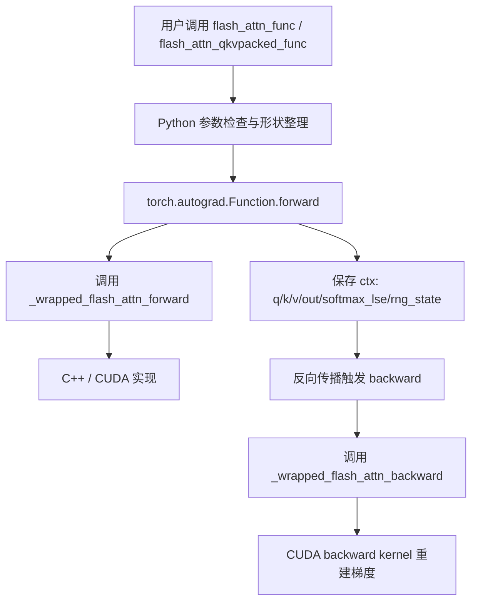

# FlashAttention 接口与 Autograd

## 一句话理解

FlashAttention 的 Python 接口层负责把“注意力”这个高性能 CUDA 算子包装成标准 PyTorch API：
它既要照顾 `qkv` / `q,k,v` / varlen / KV cache 等多种输入形态，又要把 forward 期间需要的 `softmax_lse`、`rng_state`、padding 信息保存下来，供 backward 精确重建梯度。

## 为什么重要

如果只看 CUDA kernel，很容易以为 FlashAttention 只是一个“快的 attention 内核”。
但真正工程化的难点在于：

- 让它像普通 `torch.autograd.Function` 一样可微
- 支持 packed / unpacked / varlen / inference cache 等多种数据形态
- 把 dropout、causal、local attention、ALiBi、softcap 统一到同一套接口
- 在 PyTorch 2.4+ 里同时兼容 custom op / fake tensor / torch.compile

也就是说，**接口层决定 FlashAttention 能不能真正进入模型代码。**

## 仓库中的核心入口

### Python 对外 API

`flash_attn/flash_attn_interface.py` 暴露了 4 个最常用入口：

- `flash_attn_qkvpacked_func`
- `flash_attn_func`
- `flash_attn_varlen_func`
- `flash_attn_with_kvcache`

它们分别覆盖：

- QKV 已经打包在一起的场景
- Q / K / V 分开输入的场景
- 变长 batch 的场景
- 推理时 KV cache 更新 + attention 的场景

### 模块级封装

`flash_attn/modules/mha.py` 把这些函数包进了更像 PyTorch 层的模块：

- `FlashSelfAttention`
- `FlashCrossAttention`
- `MHA`

这层负责：

- 在训练 / 推理之间切换 dropout
- 处理 rotary embedding
- 处理 `inference_params`
- 决定是否走 flash-attn fast path 或 fallback attention

## 数据流总览



## 关键设计 1：用 autograd Function 把 CUDA 算子接入 PyTorch

接口层最重要的模式是 `torch.autograd.Function`。

例如 `FlashAttnFunc.forward()` 会：

1. 判断是否需要梯度
2. 检查 `softmax_scale`
3. 对 head dim 做 8 对齐 padding
4. 调用 `_wrapped_flash_attn_forward`
5. 保存 backward 所需上下文到 `ctx`
6. 截断 padding 后返回结果

`backward()` 则会：

1. 读取 `ctx.saved_tensors`
2. 对 `dout` 做同样的 padding
3. 调用 `_wrapped_flash_attn_backward`
4. 去掉 padding 后返回 `dq/dk/dv`

这意味着 FlashAttention 的 backward 不是“临时推导一个近似梯度”，而是**用同样的中间状态、同样的 mask / dropout / softmax 信息，精确重建梯度路径。**

## 关键设计 2：forward 保存的不是“结果”，而是“梯度重建所需最小集合”

从 `FlashAttnFunc` / `FlashAttnQKVPackedFunc` / `FlashAttnVarlenFunc` 看，保存上下文的核心对象通常是：

- `q, k, v`
- `out_padded`
- `softmax_lse`
- `rng_state`
- 变长路径下的 `cu_seqlens_q / cu_seqlens_k`

这里的选择很讲究：

- `softmax_lse` 用来在 backward 中重建 softmax 的归一化信息
- `rng_state` 用来复现 dropout mask
- `cu_seqlens_*` 用来保持变长 batch 的 token 边界

所以 interface 层不是“把输出返回给用户”这么简单，**它同时在做训练态缓存设计。**

`ctx.save_for_backward` 只用来保存**张量**，标量/元组（`dropout_p`、`softmax_scale`、`causal`、`window_size`、`softcap`、`alibi_slopes`、`deterministic`）则直接存成 `ctx` 属性：

- `save_for_backward` 会记录张量的**版本计数**，backward 时校验——若保存后该张量被 in-place 修改会直接报错，防止静默使用被篡改的数据；直接赋给 `ctx` 属性则无此保护
- 只有经它保存的张量才能被 `torch.utils.checkpoint` / `saved_tensors_hooks`（释放内存、反向重算）等机制接管，存成普通属性这些机制看不见
- backward 中按 `ctx.saved_tensors` 顺序取回，且保存后不可重新赋值，避免误覆盖
- 普通 Python 标量不参与梯度、不会被修改、无需内存管理，直接存属性最简洁

## 关键设计 3：padding 是为了满足 kernel 的硬约束

代码里有一个很常见的模式：

- head dim 如果不是 8 的倍数，就补齐到 8
- 计算完再切掉多余部分

这样做的原因是 CUDA kernel 内部通常会按对齐向量访问、warp tile、tensor core 对齐来实现。

具体机制（以 `FlashAttnQKVPackedFunc.forward` 为例）：先记录原始维度 `head_size_og`，当 `head_size_og % 8 != 0` 时用 `F.pad(q, [0, 8 - head_size_og % 8])` 在**最后一维右侧**补零到下一个 8 的倍数；内核返回 `out_padded` 后截回 `out_padded[..., :head_size_og]`，backward 侧对 `dqkv` 同样截回 `dqkv[..., :dout.shape[-1]]`——**pad 只发生在传给内核的前后，对外部调用者完全不可见**。

同样，`flash_attn_interface.py` 还会根据 `head_dim`、`causal`、`dropout`、`window_size` 选择不同的 `_get_block_size_n()` 路径。

### 三个注意力约束参数（forward 入参）

- **`causal`**：因果遮罩。开启后位置 $i$ 的 query 只能 attend 到 $j \le i$ 的 key，用于自回归/Decoder；默认 `False`。
- **`window_size`**：`(left, right)` 滑动窗口局部注意力，位置 $i$ 只能 attend 到 $[i-\text{left}, i+\text{right}]$；`(-1, -1)` 表示不加限制。与 `causal` 组合常用 `(window, -1)` / `(window, 0)`。实现的是 Longformer / Mistral 式的局部注意力。
- **`softcap`**：注意力 logits 软上限，`> 0` 时启用 $score' = softcap \cdot \tanh(score/softcap)$，把分数压缩到 $(-softcap, softcap)$，防止长序列注意力分数过大导致 softmax 饱和；`0.0` 表示不启用（Gemini/Gemma 风格）。

三者都在 CUDA kernel 内部生效，**不产生额外 mask 张量**，分别传入 `causal` / `window_size_left/right` / `softcap`。

这说明：**接口层做的不是“业务逻辑”，而是把用户自由输入变成 kernel 可接受的受约束输入。**

## 关键设计 4：packed / unpacked / varlen 是不同的内存组织方式

FlashAttention 接口最容易让人迷糊的一点，是它看起来有很多“功能重复”的 API。
其实这些差别主要来自输入布局：

### 1. `flash_attn_qkvpacked_func`

输入是 `qkv: (B, S, 3, H, D)`。

适合 QKV 已经一次性投影并打包好的场景。
优点是 backward 时避免显式拼接 Q/K/V 的梯度。

### 2. `flash_attn_func`

输入是 `q, k, v` 分开的标准 attention 形式。

适合一般模型结构，尤其是 MQA / GQA。

### 3. `_flash_attn_forward`：规整的 dense 路径

底层 `_flash_attn_forward` 接收形如 `q: (B, S_q, H_q, D)`、`k/v: (B, S_k, H_k, D)` 的四维张量。它从张量形状直接得到 batch size 和序列长度，因此适合：

- batch 内每条序列本来就等长；
- 或上层已经把短序列 padding 到统一长度。

它调用 CUDA 后端的 `flash_attn_gpu.fwd(...)`。这种规整布局便于常规模型接口使用，但如果 batch 中的真实序列长度差异很大，padding 位置仍会占用激活内存和部分计算资源。

```text
q.shape = (B, S, H, D)

sample 0: token token token PAD   PAD
sample 1: token token token token token
```

这里的 `S` 是每个样本共享的物理长度；mask 可以保证 padding 不影响语义，但不能自动消除其存储和调度成本。

### 4. `_flash_attn_varlen_forward`：压缩的变长路径

`_flash_attn_varlen_forward` 服务于变长 batch。它把每个样本的**有效 token** 在第 $0$ 维连续拼接，输入布局变为：

```text
q.shape = (total_q, H_q, D)
k/v.shape = (total_k, H_k, D)
```

由于 `q.shape` 本身不再包含每条序列的边界，调用方必须传入 `cu_seqlens_q` 与 `cu_seqlens_k`（cumulative sequence lengths，累计序列长度 / 前缀和）。例如 batch 的 query 长度为 `[3, 5, 2]` 时：

```text
cu_seqlens_q = [0, 3, 8, 10]

sample 0 → q[0:3]
sample 1 → q[3:8]
sample 2 → q[8:10]
```

对第 $i$ 个样本，kernel 按如下规则恢复边界：

$$
\text{start}_i = \text{cu\_seqlens}[i],\qquad
\text{end}_i = \text{cu\_seqlens}[i + 1]
$$

它还需要 `max_seqlen_q / max_seqlen_k`，用于描述当前 batch 的最大 Q/K 序列长度；kernel 可据此进行 tile、grid 和临时布局相关的安排。实际计算走另一个 CUDA 后端入口：`flash_attn_gpu.varlen_fwd(...)`。

varlen 的收益在于跳过 padding。比如真实长度为 `[128, 512, 2048]`：

```text
padding 后的 dense token 槽位 = 3 × 2048 = 6144
实际有效 token 数             = 128 + 512 + 2048 = 2688
padding 槽位                  = 3456（约 56.25%）
```

因此，在长度差异大的训练 batch 或 sequence packing 中，varlen 通常能减少激活内存、内存访问和无效 attention 工作。

**重要：**varlen 只是把样本在内存中物理拼接，**不会**让不同样本之间彼此 attention；kernel 根据 `cu_seqlens_*` 恢复边界，让每个样本的 Q 只访问自身对应的 K/V。

### 5. `flash_attn_varlen_func`

`flash_attn_varlen_func` 是对变长路径的公开 Python API。它在 autograd 层保存 `cu_seqlens_q / cu_seqlens_k`，并在 forward / backward 中转交给 `_flash_attn_varlen_forward` / `_flash_attn_varlen_backward`。

适合：

- padding 很多的 batch；
- ragged / packed 数据；
- 更高效的 token 级 attention。

### 6. `flash_attn_with_kvcache`

适合推理阶段：

- 先更新 KV cache
- 再用 cache 做 attention
- 支持 rotary / causal / local / page table

这条路径本质上是把“生成第 t 步 token”变成一个高吞吐的 kernel 问题。

## 关键设计 5：MHA 模块是“集成层”，不是另一个 attention 实现

`flash_attn/modules/mha.py` 里的 `MHA` 不是在重新发明 attention。
它做的是系统集成：

- `use_flash_attn=True` 时，走 FlashAttention fast path
- 否则 fallback 到普通 `SelfAttention` / `CrossAttention`
- `rotary_emb`、`use_alibi`、`window_size`、`inference_params` 都在这一层组装

这让 FlashAttention 可以作为一个“可替换后端”嵌入到真实模型代码里。

### 为什么 forward 里要 detach q/k/v

`FlashAttnQKVPackedFunc.forward` 中（`flash_attn_interface.py`）：

- `qkv` 形状为 `(batch_size, seqlen, 3, nheads, headdim)`，dim=2 是 q/k/v 打包维度；切片后 `q/k/v: (batch_size, seqlen, nheads, headdim)`
- `q, k, v = qkv[:, :, 0].detach(), qkv[:, :, 1].detach(), qkv[:, :, 2].detach()`

为什么 detach（梯度完全由本类手写的 backward 负责）：

1. 避免内部 slice/pad 以及内核（内核本身也是自定义 Function）为带梯度的 q/k/v 重复建图、保存无用 ctx
2. 防止 backward 中 `dqkv` 的 view 原地写入与图内张量共享存储而触发 in-place 修改报错
3. `ctx.save_for_backward` 保存的 q/k/v 只是供手动 backward 复算梯度的数据载体，无需保留梯度连接

本质规律：**手写 backward 的自定义 Function，forward 里的内部算子只应“用数据”，不应“建图”。**

### ALiBi slopes 为什么要转成 fp32

`mha.py` 的 `FlashSelfAttention.forward` 里：

- `alibi_slopes` 注册为 `persistent=False` 的 buffer（不进 state_dict）
- 传给内核前强制 `.to(torch.float32)`，因为 CUDA kernel 在 fp32 精度下把该偏置加到注意力 logits 上（参数类型 `float*`）
- 在 forward 而非 `__init__` 中转，是因为模型可能被 `.half()` / `.to(dtype)` 整体移动过导致 buffer 变 fp16；转换后写回 self，保证本次及后续调用都正确

### 训练态 vs 推理态

- 训练：通常会走 `flash_attn_func` / `flash_attn_qkvpacked_func`
- 推理：优先走 `flash_attn_with_kvcache`

推理路径里还有一个关键优化：**`seqlenq_ngroups_swapped`（维度互换）**。

- 适用条件：`seqlen_q == 1`（单 token 解码）+ GQA/MQA（`num_heads > num_heads_k`，即 `ngroups = num_heads / num_heads_k > 1`）+ 无 window / dropout / ALiBi
- 动机：此时 q 形状为 `(b, 1, num_heads_k·ngroups, d)`，序列维度只有 1，内核在序列维上几乎没有并行度
- 做法：因为所有 query head 位置相同（都是位置 0），注意力模式完全一致，所以把 q 重排为 `(b, num_heads_k, ngroups, d)` 再 `transpose` 成 `(b, ngroups, num_heads_k, d)`，**把 ngroups 当作"序列"维度提供并行度**，解码更快
- 代价：交换后 `seqlen_q = ngroups`、`num_heads = num_heads_k`，后续 check / 分配都用新值

详见 [FlashAttention PyTorch ATen 接入层](./flash-attention-pytorch-aten-integration.md)。

## 对 PyTorch 编译栈的意义

接口层还承担了和 PyTorch 新编译机制兼容的任务：

- `torch.library.custom_op`
- `register_fake`
- fake tensor / compile support

这让 FlashAttention 不只是“手写 CUDA 扩展”，而是能进入 PyTorch 的 dispatch / tracing / compile 体系。

## 你可以把它理解成三层责任

```text
用户 API
  ├── 输入形态统一
  ├── 训练/推理分支
  └── 和模型层对接

Autograd Function
  ├── 保存 ctx
  ├── 串接 forward/backward
  └── 兼容 compile / fake tensor

CUDA bridge
  ├── 传递参数
  ├── 选择 kernel
  └── 执行 forward/backward
```

## 我自己的理解

1. **FlashAttention 的接口设计和 kernel 一样重要**
   - kernel 解决“怎么快算”
   - interface 解决“怎么在真实模型里用”

2. **保存 `softmax_lse` 是关键**
   - 它是 backward 重建 softmax 的桥梁
   - 也是 FlashAttention 仍然 exact 的重要原因之一

3. **packed / varlen / kvcache 不是杂乱 API，而是对不同 memory layout 的抽象**
   - 本质是把 attention 计算适配到不同数据组织方式

4. **MHA 模块体现了工程上的真正价值**
   - 它把 FlashAttention 变成了“可插拔的 attention backend”，而不是孤立 kernel

## 和论文的对应关系

| 论文/能力 | 接口层对应 |
|---|---|
| exact attention | `torch.autograd.Function` 保留 exact backward 路径 |
| dropout | `rng_state` / `dropout_p` |
| causal / local | `causal` / `window_size` |
| varlen attention | `cu_seqlens_*` |
| MQA / GQA | `q, k, v` 头数不同 |
| inference optimization | `flash_attn_with_kvcache` |
| FlashAttention-2 work partitioning | `num_splits` / `block_size_n` 选择 |
| compile integration | custom op / fake implementation |

## 相关阅读顺序

建议与这些笔记一起看：

- [Attention 头变体：MHA/MQA/GQA/MLA](./attention-head-variants.md)
- [FlashAttention 源码精读](./flash-attention-source-reading.md)
- [PyTorch C++ 核心模块](../pytorch/pytorch-cpp-core.md)
- [PyTorch 依赖关系](../pytorch/pytorch-dependencies.md)
- [AI 开源项目源码精读指南](../ai-open-source-source-reading.md)

## References

- `third_party/flash-attention/flash_attn/flash_attn_interface.py`
- `third_party/flash-attention/flash_attn/modules/mha.py`
- `third_party/flash-attention/README.md`
