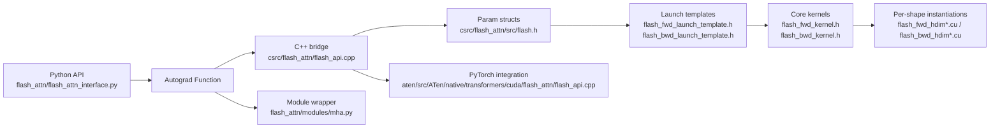

# FlashAttention 源码精读

## 一句话理解

FlashAttention 不是“把 attention 写得更快一点”，而是**重新设计 attention 的计算与数据流**：
把 `QK^T`、softmax、`PV` 拆成块级别的流式计算，在 on-chip memory 里完成中间归一化与累积，避免显式 materialize `N × N` attention matrix，从而把显存占用从二次降到线性，并把瓶颈从 HBM 访存推回到算力、共享内存和寄存器调度。

## 为什么重要

- 它是理解高性能 LLM 训练 / 推理的经典案例
- 它把论文里的 IO-aware 思想完整落到了 CUDA、C++、PyTorch autograd、ATen、测试和 benchmark 里
- 它能顺带解释一整套工程问题：在线 softmax、kernel specialization、varlen attention、MQA/GQA、paged KV cache、dropout RNG、split-KV work partitioning

## 论文脉络

### FlashAttention-1：IO-aware exact attention

原始目标是 **exact attention**，但减少 HBM 读写。
核心思想是按 tile 处理 `Q / K / V`，在 SRAM / shared memory / registers 中完成局部 `QK^T`、max、sum、`PV`。

标准 attention 是：

$$
\mathrm{Attention}(Q, K, V) = \mathrm{softmax}\left(\frac{QK^T}{\sqrt{d}}\right)V
$$

FlashAttention 的关键不是改公式，而是把 softmax 做成**可流式更新**。对每一行维护在线状态：

$$
m_i^{(t)} = \max\left(m_i^{(t-1)}, \max_j s_{ij}^{(t)}\right)
$$

$$
l_i^{(t)} = e^{m_i^{(t-1)} - m_i^{(t)}} l_i^{(t-1)} + \sum_j e^{s_{ij}^{(t)} - m_i^{(t)}}
$$

这样就可以边算边归一化，而不用把整张注意力矩阵先写回显存。

### FlashAttention-2：更好的并行与 work partitioning

FA2 的重点不是“换了数学”，而是**更好的并行切分**：

- 更少的非 matmul 开销
- 更好的 CTA / warp 负载均衡
- 更灵活的 split-KV / split sequence 调度
- 对小 batch、短 query、推理场景更友好

如果说 FA1 主要解决“能不能省显存地做 exact attention”，那 FA2 更像是在问“**怎么把这件事跑满 GPU**”。

### FlashAttention-3：Hopper / H100 路径

FA3 是面向 Hopper 的独立 beta 路径，重点放在 H100/H800、FP8、FP16/BF16 的新硬件能力上。
在这个仓库里，它和 FA2 主线是并列存在的：
- 主线：`flash_attn/` + `csrc/flash_attn/`
- FA3 beta：`hopper/`

## 仓库地图

### 你可以把这个仓库分成 5 层

1. **接口层**：`flash_attn/flash_attn_interface.py`
2. **模块层**：`flash_attn/modules/mha.py`
3. **C++ 组装层**：`csrc/flash_attn/flash_api.cpp`
4. **参数与调度层**：`csrc/flash_attn/src/flash.h`、`flash_fwd_launch_template.h`、`flash_bwd_launch_template.h`
5. **核函数层**：`flash_fwd_kernel.h`、`flash_bwd_kernel.h`、`flash_*_hdim*.cu`

## 代码里的关键链路

### 1. Python 侧：先包装成 autograd Function

FA2 主要入口在 `flash_attn/flash_attn_interface.py`：

- `flash_attn_qkvpacked_func`
- `flash_attn_func`
- `flash_attn_varlen_func`
- `flash_attn_with_kvcache`

这几层会做几件事：

- 统一参数形态
- 处理 `causal`、`window_size`、`softcap`、`alibi_slopes`
- 对 head dim 做 padding 到 8 的倍数
- 保存 `softmax_lse`、`rng_state` 等 backward 所需上下文

这里的设计点很典型：**把复杂性前移到 Python / C++，让 CUDA kernel 专注于核心数学与数据访问。**

### 2. C++ 侧：把“注意力”压成一组参数

`csrc/flash_attn/flash_api.cpp` 的工作是：

- 做 device / dtype / shape 检查
- 计算 `seqlen_q_rounded`、`seqlen_k_rounded`、`head_size_rounded`
- 准备 dropout RNG / Philox state
- 把所有指针、stride、shape、flag 塞进 `Flash_fwd_params` / `Flash_bwd_params`
- 交给 `run_mha_fwd` / `run_mha_bwd` 去选择合适 kernel

这一步很重要，因为 FlashAttention 的 kernel 不是“一个函数打天下”，而是**大量模板特化**。

### 3. 参数结构：把 kernel 需要的所有上下文一次性打包

`csrc/flash_attn/src/flash.h` 里最重要的是两个 struct：

- `Flash_fwd_params`
- `Flash_bwd_params`

里面不仅有 `q/k/v/o` 指针和 stride，还包括：

- `h` / `h_k` / `h_h_k_ratio`：支持 MQA / GQA
- `cu_seqlens_q` / `cu_seqlens_k`：支持 varlen
- `block_table`：paged KV cache
- `window_size_left` / `window_size_right`：sliding window local attention
- `softcap`
- `alibi_slopes_ptr`
- `philox_args` / `rng_state`
- `deterministic`
- `unpadded_lse`

这意味着：**kernel 本身只管算，不管上层的表示法。**

### 4. Launch templates：按 shape / feature 选最合适的 kernel

`flash_fwd_launch_template.h` 和 `flash_bwd_launch_template.h` 做的是“**编译期 + 运行期双重派发**”：

- 按 head dim 选模板
- 按 `is_causal` / `is_dropout` / `is_local` / `Has_alibi` / `Is_softcap` 选路径
- 按 `is_even_MN` / `is_even_K` 决定是否要走 padding / mask 分支
- 在 backward 中还会考虑是否 sequence-parallel、是否 deterministic

这也是它编译时间很长的原因之一：**性能是靠 specialization 换来的。**

### 5. Kernel 层：blockwise exact attention

`flash_fwd_kernel.h` / `flash_bwd_kernel.h` 是真正的核心。
它们大量使用 `cute` / `cutlass` 的 layout 和 tiled copy / mma 抽象，把 Q、K、V 分块搬进 shared memory，再做局部 softmax 和累积。

你可以把 forward 想成：

1. 读一小块 Q
2. 迭代读取 K / V 的块
3. 更新每行的 `max` 和 `sum`
4. 同步更新输出累积
5. 最后写回 O 和 `softmax_lse`

Backward 则是在这些中间量上重建梯度路径，分别算 `dQ / dK / dV`，并用额外的 preprocessing / accumulation 路径处理分块、dropout 和 deterministic 需求。

## 关键实现细节

### 1. 在线 softmax 是核心数学技巧

FlashAttention 的“省显存”并不是靠近似，而是靠**在线归一化**。
每次只看一个 tile，就更新当前行的最大值和归一化常数，再把输出重标定到同一尺度上。

这件事的价值在于：

- 不用存完整 `N × N` attention matrix
- 仍然保持 exact attention
- 把显存访问从“写大矩阵再读回来”变成“边算边流式更新”

### 2. dropout 依赖 Philox RNG 状态

代码里会保存 `rng_state`，backward 需要重建同样的 dropout mask。
这也是为什么 forward 不只是返回 `out`，还会额外返回 `softmax_lse`、`rng_state` 之类的上下文。

### 3. MQA / GQA 通过 `h / h_k` 处理

Q 的头数可以大于 KV 的头数，代码里会预先算 `h_h_k_ratio`。
这对应大模型里很常见的 MQA / GQA：

- Q 保持多头
- K/V 共享较少的头
- 既省显存又省算力

### 4. varlen / paged cache 都是“布局问题”

FlashAttention 很多 feature 看起来像“功能”，但本质上都是数据布局：

- `cu_seqlens_*`：变长 batch
- `block_table`：paged KV cache
- `cache_batch_idx`：推理时缓存索引
- `leftpad_k` / `seqused_k`：稀疏或截断场景

这说明 attention 的高性能实现很大程度上是**内存组织问题**，不是单纯公式问题。

### 5. split-KV 是“并行度优先”的路径

当 query 很短、KV 很长，或者 batch / head 数不足以喂满 GPU 时，FA2 会把 KV 切成多个分块并行处理，再做 combine。
这对应代码里的 `run_mha_fwd_splitkv_dispatch`、`num_splits` 等逻辑。

### 6. backward 的确定性是可选代价

`deterministic=True` 时，backward 会更保守，通常更慢、占更多资源，但能换来可复现性。
这在研究与生产调试里很重要。

## PyTorch 集成怎么理解

仓库外，PyTorch 自己也 vendored 了一份相关逻辑，路径在：
`aten/src/ATen/native/transformers/cuda/flash_attn/flash_api.cpp`

这份代码的意义是：

- PyTorch 内部可以直接走 FlashAttention fastpath
- 不是只有第三方包才能用这套 kernel
- 它把 FlashAttention 作为 ATen 生态里的一个高性能 attention backend

你可以把它理解为：
**外部仓库负责“实现”，PyTorch 内部负责“接入与调度”。**

## 这个仓库和论文的对应关系

| 论文概念 | 代码对应 |
|---|---|
| IO-aware exact attention | `flash_fwd_kernel.h` / `flash_bwd_kernel.h` 的 tiled 计算 |
| 在线 softmax | forward kernel 中的分块 max / sum 更新 |
| FA2 work partitioning | `num_splits`、split-KV、launch templates |
| varlen attention | `cu_seqlens_q` / `cu_seqlens_k` |
| MQA / GQA | `h_k`、`h_h_k_ratio` |
| KV cache inference | `flash_attn_with_kvcache`、`MHA._apply_rotary_update_kvcache_attention` |
| ALiBi | `alibi_slopes` |
| Sliding window | `window_size_left/right` |
| Dropout | `PhiloxCudaState`、`rng_state` |
| Deterministic backward | `deterministic` |

## 我对这个仓库的理解

1. **FlashAttention 的本质是“把 softmax 变成流式算法”**，不是一个简单的 CUDA 优化
2. **FA2 的核心是并行切分策略**，而不只是再压缩一点显存
3. **推理优化的核心往往是 KV cache 布局**，而不是 attention 公式本身
4. **这个仓库不是一个函数，而是一套 attention 运行时**：接口、参数、布局、kernel、测试、benchmark 全都在里面
5. **源码阅读的关键不是逐行看 CUDA，而是先建立“数据流视角”**：Q/K/V 怎么进来、状态怎么更新、O 怎么出去、backward 怎么重建中间量

## 建议的阅读顺序

如果想真正读懂它，我建议按这个顺序走：

1. `README.md`：先看 feature matrix 和支持范围
2. `flash_attn/flash_attn_interface.py`：看 Python API 和 autograd 封装
3. `flash_attn/modules/mha.py`：看它如何嵌入到模型层，以及 inference cache 怎么接
4. `csrc/flash_attn/flash_api.cpp`：看 C++ 参数打包和 kernel dispatch
5. `csrc/flash_attn/src/flash.h`：看 params 结构体
6. `csrc/flash_attn/src/flash_fwd_launch_template.h` / `flash_bwd_launch_template.h`：看 kernel 选择逻辑
7. `csrc/flash_attn/src/flash_fwd_kernel.h` / `flash_bwd_kernel.h`：看真正的 blockwise attention 实现
8. `aten/src/ATen/native/transformers/cuda/flash_attn/flash_api.cpp`：看 PyTorch 是怎么把它接进内核体系的

## 局限与代价

- 强依赖 GPU 架构和编译环境
- head dim、dtype、causal/local/dropout 等特性都有明确限制
- 模板展开很多，编译时间长
- FA2 / FA3 / ROCm / CUDA 的路径差异比较大，阅读时要先确认自己看的是哪条分支

## Related Knowledge

- [AI 开源项目源码精读指南](../ai-open-source-source-reading.md) — 源码阅读方法论与项目选择路线
- [PyTorch C++ 核心模块](../../../pytorch/pytorch-cpp-core.md) — FlashAttention 接入 PyTorch 运行时的底座
- [PyTorch 依赖关系](../../../pytorch/pytorch-dependencies.md) — 了解 `aten`、`torch/csrc`、第三方库之间的关系

## References

- FlashAttention README: `third_party/flash-attention/README.md`
- FlashAttention paper: https://arxiv.org/abs/2205.14135
- FlashAttention-2 paper: https://tridao.me/publications/flash2/flash2.pdf
- FlashAttention-3 paper: https://tridao.me/publications/flash3/flash3.pdf
