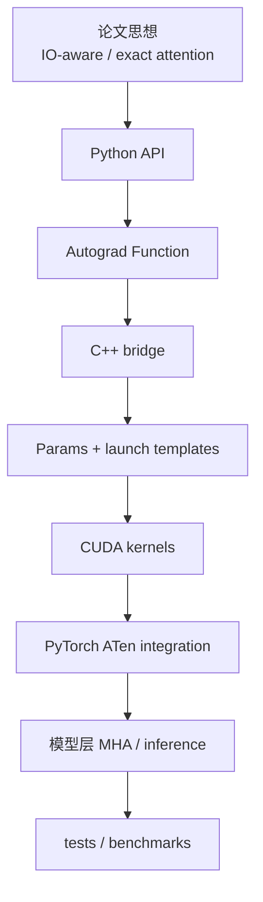
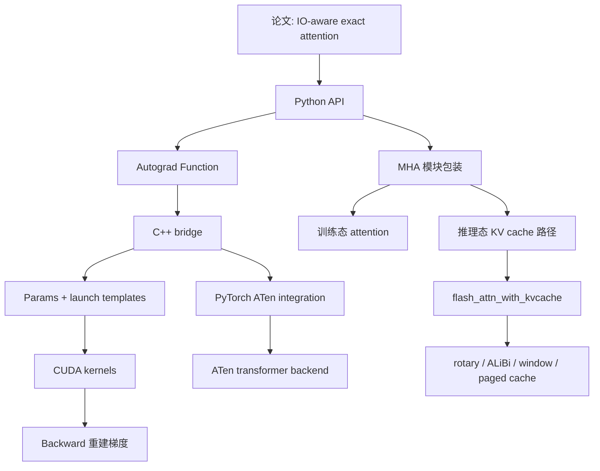

# FlashAttention 系统地图

## 一句话理解

FlashAttention 不是一个单点 kernel，而是一整套 attention 运行时：
从论文里的 IO-aware 思想，到 Python 接口、Autograd、C++ 参数打包、CUDA kernel、PyTorch ATen 接入、KV cache 推理路径、测试和 benchmark，形成了完整的工程闭环。

这张图把前面几篇笔记合并成一个更完整的总览，重点补上了推理链路和各层之间的连接关系。

## 这张总图想回答什么

- 哪一层负责什么
- 训练路径和推理路径分别怎么走
- `softmax_lse`、`rng_state`、`cache_seqlens`、`block_table` 这些状态在哪些层之间传递
- 哪些能力来自论文，哪些来自工程实现
- 如何把源码知识组织成一套可复用的认知结构

## 为什么要单独做一张系统地图

因为 FlashAttention 的学习难点不在“知道它快”，而在于：

- 哪一层负责什么
- 哪些功能属于接口层，哪些属于 kernel 层
- 哪些能力来自论文思想，哪些来自工程实现
- 如何把源码知识组织成可复用的认知结构

这篇笔记就是为这个目的服务的。

## 分层总览



## 代码层次

### 1. 论文层

- FlashAttention: IO-aware exact attention
- FlashAttention-2: better parallelism and work partitioning
- FlashAttention-3: Hopper / H100 方向

这一层回答的是：

- 为什么要重写 attention
- 为什么能省显存
- 为什么 exact 还能更快

### 2. Python 接口层

文件：`flash_attn/flash_attn_interface.py`

作用：

- 向用户暴露 `flash_attn_func` / `flash_attn_qkvpacked_func` / `flash_attn_varlen_func` / `flash_attn_with_kvcache`
- 处理 packed / unpacked / varlen / cache 等数据形态
- 封装成 `torch.autograd.Function`
- 保存 backward 所需的上下文

### 3. 模块封装层

文件：`flash_attn/modules/mha.py`

作用：

- 让 FlashAttention 像标准 attention 层一样被使用
- 处理训练 / 推理 / rotary / ALiBi / cache
- 在 flash-attn 与普通 attention 之间 fallback

### 4. C++ 组装层

文件：`csrc/flash_attn/flash_api.cpp`

作用：

- 检查 dtype / shape / device
- 计算 rounding 和 padding
- 构造 `Flash_fwd_params` / `Flash_bwd_params`
- 处理 dropout RNG / ALiBi / local mask
- 选择 forward / backward / split-KV 路径

### 5. 参数与调度层

文件：`csrc/flash_attn/src/flash.h`

作用：

- 把 kernel 所需上下文集中成参数结构体
- 让不同 kernel 共享统一参数接口
- 把 feature flag 变成可被模板和 launch 读取的状态

### 6. Launch 模板层

文件：

- `flash_fwd_launch_template.h`
- `flash_bwd_launch_template.h`

作用：

- 按 head dim / dropout / causal / local / alibi / softcap 等条件选择 kernel
- 控制是否走 split-KV
- 控制 kernel 的 shared memory 配置和 launch 配置

### 7. CUDA kernel 层

文件：

- `flash_fwd_kernel.h`
- `flash_bwd_kernel.h`

作用：

- 实现 tile 化的 exact attention
- 做在线 softmax
- 做共享内存复用
- 做梯度重建与 accumulation

### 8. PyTorch 内部接入层

文件：

- `aten/src/ATen/native/transformers/cuda/flash_attn/flash_api.cpp`
- `aten/src/ATen/native/transformers/cuda/flash_attn/flash_api.h`

作用：

- 把 FlashAttention 接入 ATen 运行时
- 让 PyTorch 直接支持 flash-attn fast path

## 关键认知图

### 不是“attention 一个函数”，而是“attention 一条链路”

```text
训练态
输入形态
  -> 参数整理
  -> ctx 保存
  -> C++ 组装
  -> kernel dispatch
  -> tile 计算
  -> backward 重建

推理态
输入 x / cache / rotary
  -> KV cache 更新
  -> rotary / ALiBi / window 处理
  -> kvcache kernel
  -> 输出 context
```

### 不是“一个函数入口”，而是“多条互补 API”

- `flash_attn_qkvpacked_func`：QKV 打包输入
- `flash_attn_func`：标准 Q/K/V 输入
- `flash_attn_varlen_func`：变长 batch
- `flash_attn_with_kvcache`：推理与 KV cache 更新

### 不是“一个优化”，而是三类优化叠加

1. **算法优化**：在线 softmax、exact attention
2. **并行优化**：work partitioning、split-KV
3. **内存优化**：tile 化、shared memory 复用、避免 materialize score matrix

### 不是“单独的 CUDA 包”，而是“PyTorch backend”

它能插进真实模型训练 / 推理链路，靠的是：

- autograd
- packed / varlen API
- 模块封装
- KV cache 推理路径
- ATen 接入
- tests / benchmarks

## 总图：从训练到推理



## 适合怎样学习

我建议按这个顺序建立认知：

1. 先看 `README.md` 和论文，建立“它解决什么问题”
2. 再看 `flash_attn_interface.py`，建立“API 如何暴露”
3. 再看 `mha.py`，建立“如何嵌进模型”
4. 再看 `flash_api.cpp` 和 `flash.h`，建立“参数如何传给 kernel”
5. 再看 launch template 和 kernel，建立“它到底怎么快”
6. 再看 `flash_attn_with_kvcache`，建立“推理与 KV cache 怎么合流”
7. 最后回到 PyTorch ATen 接入，理解“为什么这能成为系统能力”

## 和前面几篇笔记的关系

- [FlashAttention 源码精读](./flash-attention-source-reading.md)：总览和论文→代码链路
- [FlashAttention 接口与 Autograd](./flash-attention-interface-and-autograd.md)：Python API 和训练态 ctx
- [FlashAttention Kernel 与 Launch 机制](./flash-attention-kernel-and-launch.md)：params、launch、tile 计算
- [FlashAttention Kernel 细节补充](./flash-attention-kernel-details.md)：split combine、sequence-parallel、tile 级 RNG
- [FlashAttention PyTorch ATen 接入层](./flash-attention-pytorch-aten-integration.md)：ATen backend 与内部接入

## 我的理解

1. **FlashAttention 的价值不只在 kernel，而在完整工程闭环**
2. **接口层和 kernel 层是同等重要的**，因为它们共同决定“能不能被真实模型采用”
3. **FlashAttention 是 attention 的系统化重构**，不是局部 patch
4. **FA2 的关键词是 parallelism，FA1 的关键词是 IO-awareness**
5. **学习它最重要的视角是 dataflow，而不是单个函数**

## 关联笔记

- [FlashAttention 源码精读](./flash-attention-source-reading.md)
- [FlashAttention 接口与 Autograd](./flash-attention-interface-and-autograd.md)
- [FlashAttention Kernel 与 Launch 机制](./flash-attention-kernel-and-launch.md)
- [AI 开源项目源码精读指南](../ai-open-source-source-reading.md)
- [PyTorch C++ 核心模块](../pytorch/pytorch-cpp-core.md)

## References

- `third_party/flash-attention/README.md`
- `third_party/flash-attention/flash_attn/flash_attn_interface.py`
- `third_party/flash-attention/csrc/flash_attn/flash_api.cpp`
- `third_party/flash-attention/csrc/flash_attn/src/flash_fwd_launch_template.h`
- `third_party/flash-attention/csrc/flash_attn/src/flash_bwd_launch_template.h`
