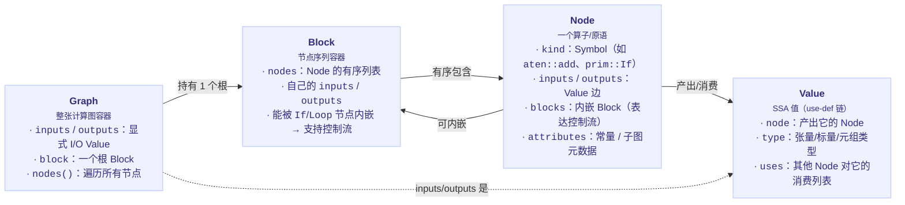

# torch.jit — TorchScript

## 一句话理解

> TorchScript 是 PyTorch 的可运行、可序列化、可优化的模型 IR：通过 **scripting**（解析 Python 源码）或 **tracing**（运行示例输入记录算子）两条路径，把 `nn.Module`/Python 函数 lowering 到 C++ JIT IR（`Graph`/`Node`/`Value`/`Block`），经优化 pass 后可在无 Python 的 C++/移动端运行时执行。

## 为什么重要

TorchScript 是 PyTorch 从"研究友好"走向"可部署"的桥梁。它让训练好的模型脱离 Python 解释器、GIL 与依赖链，直接在 C++（libtorch）、移动端（lite interpreter）、TorchServe 等环境运行，并应用图级优化（算子融合、常量折叠、冻结、卷积-BN 合并）。虽然在训练/推理优化领域，新的 `torch.compile`（Dynamo+Inductor）已基本取代 TorchScript，但 TorchScript 仍是 **C++/移动端部署的 IR 格式**——`torch.jit` 的源码是理解 PyTorch 编译器谱系（IR、pass、序列化）的最好起点，FX 与 Export 都借鉴了它的设计教训。

## 核心概念

### 两条捕获路径

| 路径 | API | 机制 | 控制流 | 适用 |
| ---- | ---- | ---- | ---- | ---- |
| **scripting** | `@torch.jit.script`、`torch.jit.script(module)` | `frontend.py` 解析 Python AST → JIT tree-views → IR emitter 发射 SSA IR | 完整捕获（`if`/`for`/`while` 译为 IR 节点） | 含数据依赖控制流的模型、需要精确语义 |
| **tracing** | `torch.jit.trace(module, example_input)` | 在示例输入上运行模块，记录实际执行的算子序列为 IR | 不捕获（只记录走过的路径） | 控制流固定或与输入无关的模型、ONNX 导出 |

两者最终都 lowering 到同一套 C++ JIT IR，并共用后续的 `passes/` 优化与序列化。

### JIT IR（`torch/csrc/jit/ir/ir.h`）

> **组合关系：** Graph ≡ 1 个 Block → 多个 Node，Node 产出/消费多个 Value，且 Node 可再内嵌 Block（`prim::If` 的 then/else、`prim::Loop` 的 body）——这就是 scripting 能完整保留 Python 控制流的 IR 基础。

- **`Graph`**：整张计算图，有显式 inputs/outputs 与一个根 `Block`。
- **`Node`**：一个算子节点，`kind` 是 interned symbol（如 `aten::add`、`prim::If`、`prim::Loop`），含属性（常量、子图引用）。
- **`Value`**：SSA 值，由某个 `Node` 产出，被其他 `Node` 使用，有 `uses` 列表（use-def 链）。
- **`Block`**：节点序列的容器，`If`/`Loop` 节点内嵌子 `Block` 表达控制流——这是 scripting 能保留控制流的 IR 基础。

### 关键子系统

| 子系统 | 职责 | 位置 |
| ---- | ---- | ---- |
| frontend | Python AST → JIT IR：parser、lexer、tree_views、ir_emitter、schema_matching | `torch/jit/frontend.py`、`torch/csrc/jit/frontend/` |
| passes | 优化与 lowering pass：constant_propagation、dead_code_elimination、peephole、graph_fuser、freeze_module、fuse_linear、fold_conv_bn、loop_unrolling、onnx/、quantization/ | `torch/csrc/jit/passes/` |
| codegen | 内核融合代码生成：CPU fuser、CUDA fuser、onednn | `torch/csrc/jit/codegen/` |
| serialization | 模型保存/加载（flatbuffer） | `torch/jit/_serialization.py`、`torch/csrc/jit/serialization/` |
| mobile | lite 移动端运行时：flatbuffer_loader、interpreter、parse_bytecode、quantization、compatibility/、nnc/、train/ | `torch/csrc/jit/mobile/` |
| backends | 委托后端：coreml/、nnapi/、xnnpack/ | `torch/csrc/jit/backends/` |
| operator_upgraders | 版本化算子升级映射（旧模型兼容新算子语义） | `torch/csrc/jit/operator_upgraders/` |
| runtime（Python 侧） | `@script`、`ScriptModule`、`RecursiveScriptModule`、`CompilationUnit`、`Attribute`、`interface` | `torch/jit/_script.py` |

## 工作原理

### 捕获 → IR → 优化 → 部署的完整管线

```mermaid
flowchart LR
    subgraph CAP["① 捕获（两条路径）"]
        CAP_in["<b>nn.Module / Python fn</b>"]:::step
        CAP_script["<b>@script：</b>解析 Python AST → ScriptModule<br/><small>完整控制流</small>"]:::branchNo
        CAP_trace["<b>trace：</b>跑示例输入 → TracedModule<br/><small>只记录执行路径</small>"]:::branchNo
    end

    subgraph IR["② IR & 优化（共用 C++ JIT IR）"]
        IR1["<b>Step 1：</b>生成 JIT IR（Graph / Node / Value / Block）"]:::step
        IR2["<b>Step 2：</b>canonicalize / constant_pooling"]:::step
        IR3["<b>Step 3：</b>peephole · fuse_linear · fold_conv_bn"]:::step
        IR4["<b>Step 4：</b>freeze_module · dead_code_elim"]:::step
        IR5["<b>Step 5：</b>codegen fuser（CPU / CUDA / onednn）"]:::action
    end

    subgraph DEP["③ 部署（无 Python）"]
        DEP_ser["<b>序列化为 flatbuffer</b><br/><small>含 IR + 权重 + schema 版本</small>"]:::step
        DEP_libtorch["→ C++ <b>libtorch 解释器</b>（服务端推理）"]:::branchNo
        DEP_mobile["→ 移动端 <b>lite interpreter</b>（selective build 裁剪）"]:::branchNo
        DEP_serve["→ TorchServe / 自定义硬件后端委托"]:::branchNo
    end

    CAP_in -- "@script" --> CAP_script
    CAP_in -- "trace" --> CAP_trace
    CAP_script --> IR1
    CAP_trace --> IR1
    IR1 --> IR2 --> IR3 --> IR4 --> IR5
    IR5 --> DEP_ser
    DEP_ser --> DEP_libtorch
    DEP_ser --> DEP_mobile
    DEP_ser --> DEP_serve

    classDef step     fill:#eef2ff,stroke:#c7d2fe,color:#312e81,stroke-width:1.5px
    classDef action   fill:#fff7ed,stroke:#fdba74,color:#7c2d12,stroke-width:1.5px
    classDef decide   fill:#fef3c7,stroke:#fcd34d,color:#78350f,stroke-width:1.5px
    classDef branchNo fill:#f0fdf4,stroke:#86efac,color:#166534,stroke-width:1.5px
    classDef branchYes fill:#eef2ff,stroke:#c7d2fe,color:#3730a3,stroke-width:1.5px
```

### scripting vs tracing 的取舍

- **scripting 保留控制流**：`if`/`for`/`while` 译为 `prim::If`/`prim::Loop` 节点，运行时按实际数据走分支。代价是对 Python 子集有限制（需类型注解、不能用任意 Python 库），且复杂模型常需改写以通过 scripting。
- **tracing 简单但丢控制流**：只记录一次前向实际执行的算子，控制流被"烧死"成固定路径。若模型对输入形状/值有数据依赖分支，trace 后模型在其它输入上可能出错。ONNX 导出传统上基于 trace。
- 实践中常**混合**：用 trace 捕获无控制流的子模块，用 script 捕获含控制流的部分，再组合。

### 优化 pass 的作用

`passes/` 对 IR 做图变换提升运行效率：

- **constant_pooling / constant_propagation**：把可静态求值的常量折进图，减少运行时计算。
- **peephole**：局部模式替换（如 `x + 0 → x`）。
- **fuse_linear / fold_conv_bn**：算子融合（Linear+ReLU、Conv+BN 融合为单 kernel）减少 launch 与访存。
- **freeze_module**：把训练模式的 `BatchNorm` 等冻结为推理常量，消除运行时分支。
- **dead_code_elimination**：删除未被使用的节点。
- **loop_unrolling**：展开固定次数循环，便于后续融合。
- **quantization/**：插入量化/反量化 observer、量化感知训练的图改写。
- **onnx/**：把 IR 符号化为 ONNX opset 算子。

### 序列化与移动端

模型以 **flatbuffer** 格式保存（`_serialization.py`），含 IR 节点、权重、算子 schema 版本。移动端使用 **lite interpreter**（`torch/csrc/jit/mobile/`）——一个精简解释器，只加载 flatbuffer 字节码并按 `parse_bytecode` 执行，体积比完整 TorchScript 小得多，支持选择性算子注册（selective build）进一步裁剪。`operator_upgraders/` 处理版本兼容：旧模型加载时把过时算子映射到新版本，保证向后兼容。

## 我的理解

- TorchScript 与 FX/Export 的根本差异是 **IR 语言**：TorchScript IR 是 C++ 内部的 SSA 图，能直接被 C++ 解释器执行，适合"无 Python 部署"；FX IR 是 Python 代码对象（`Graph` 可发射回 Python 源码），适合"Python 内的图变换"，但不脱离 Python。这也是为什么部署用 TorchScript/Export，而量化/编译用 FX。
- scripting 的难点是**覆盖 Python 子集**：torch.jit 有自己的类型系统（`torch.jit.Attribute`、`List`/`Dict`/`Tuple`/`Optional`），不支持的 Python 特性会报错。这是 TorchScript 在社区推广的最大痛点，也是 Dynamo（"不改用户代码即可捕获"）出现的关键动机。
- "TorchScript 已被取代"是**部分误解**：在训练优化与 eager 加速上，`torch.compile` 确实取代了它；但作为**可序列化、跨语言部署的 IR 格式**，TorchScript 仍是 libtorch C++ 推理与移动端的主流路径。`torch.export` 正在补位"无 Python 部署"的新方案，但生态迁移需要时间。
- trace 的"烧死控制流"是经典陷阱：一个含 `if x.sum() > 0` 的模型 trace 后，部署到不同输入可能静默给出错误结果。官方建议对含控制流的模块用 script 或在 trace 后做 graph diff 校验。
- passes/ 目录是学习"图优化编译器"的极好样本：constant folding、peephole、dead code elim、fusion 这些经典编译 pass 在 IR 上都有对应实现，理解它们有助于后续看 Inductor 的 `fx_passes/`。
- `operator_upgraders` 体现了**生产级 ML 框架的版本治理**：算子语义会演进（如 `aten::div` 的舍入模式），但已序列化的旧模型不能改，只能通过加载时升级映射保持兼容——这是研究框架常忽视、但部署必备的能力。

## Related

- [torch.fx](./pytorch-fx.md) — Python 原生 IR，与 TorchScript C++ IR 互补
- [torch.compile 编译栈](./pytorch-compile.md) — Dynamo+Inductor 取代 TorchScript 的训练优化角色
- [torch.autograd](./pytorch-autograd.md) — TorchScript 捕获含 autograd 边的模型
- [程序导出 export](./pytorch-export.md) — 新一代无 Python 部署 IR（ExportedProgram）

## References

- `torch/jit/`（Python 侧）、`torch/csrc/jit/`（C++ 侧）
- `torch/csrc/jit/ir/ir.h` — IR 核心定义
- `torch/jit/_script.py`、`torch/jit/_trace.py` — scripting/tracing 入口
- `torch/jit/frontend.py` — AST 解析器
- `torch/csrc/jit/passes/` — 优化 pass
- `torch/csrc/jit/mobile/` — lite interpreter
- `torch/jit/_freeze.py` — `freeze`、`optimize_for_inference`
