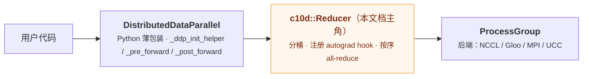
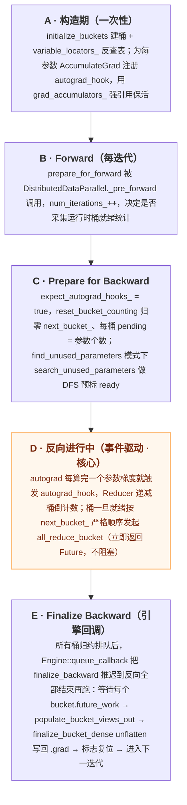
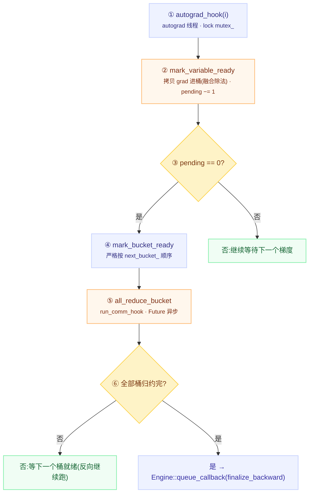

# Reducer 类设计详解（DDP 的 C++ 心脏）

## 一句话理解

> `c10d::Reducer` 是 DistributedDataParallel 在 C++ 层的事件驱动梯度归约协调器：它在构造期给每个参数的 AccumulateGrad 节点挂钩，反向时被动等"梯度就绪"事件，把事件翻译成"某桶可 all-reduce"，最后在反向结束时统一收尾写回 `.grad`。

## 为什么重要

`Reducer` 是 DDP 的"心脏"：所有梯度分桶、autograd 钩子注册、反向时按桶触发 all-reduce、结果写回 `.grad` 都压在它身上。DDP 的性能（通信/计算重叠）、正确性（未使用参数、静态图、跨 rank 死锁规避）、可扩展性（通信钩子）都由它决定。读懂它就读懂了 DDP。

源文件：`torch/csrc/distributed/c10d/reducer.hpp`（类定义，约 580 行）、`torch/csrc/distributed/c10d/reducer.cpp`（实现，约 2428 行）、`reducer_cuda.cpp`（CudaTimer）、`reducer_timer.hpp`（计时器）。

## 核心概念

### 定位：事件驱动的归约协调器
用户写 `nn.parallel.DistributedDataParallel(model)` 时，构造函数经 `_ddp_init_helper` 在 C++ 侧 `new c10d::Reducer(...)`。Python 的 `DistributedDataParallel` 只是一层薄包装，真正的活儿都在 Reducer 里。它被动等 autograd 钩子告诉它"某参数梯度好了"，把这些事件翻译成"某桶可以 all-reduce 了"，反向结束时统一收尾。

它要解决的七个问题：逐个 allreduce 太慢（合并成桶）、等全部梯度再通信浪费 GPU（桶一就绪就发起，与反向重叠）、怎么知道某参数梯度算完（给 AccumulateGrad 挂 post hook）、有些参数没参与 forward（DFS 找未使用参数预标 ready）、跨 rank 桶顺序不一致会死锁（按 `next_bucket_` 严格顺序归约）、想自定义通信（CommHook 接口）、归约结果怎么回 `param.grad`（unflatten 写回或让 grad 直接是桶视图）。

### 数据结构 1：Bucket（桶）
`Bucket` 是 Reducer 的嵌套 struct（`reducer.hpp:345-401`）。一个桶 = 一组同 dtype、同 device 的参数梯度，被打包进一个**扁平化的一维连续缓冲区**。关键字段：

| 字段 | 作用 |
|------|------|
| `gradients` | 扁平化 1D 缓冲区，桶内所有梯度连续存放；allreduce 直接作用于它 |
| `bucket_views_in` | 每个梯度在 `gradients` 中的视图，用于把 grad `copy_` 进桶 |
| `bucket_views_out` | 归约结果写出的视图；默认与 in 相同，注册钩子后可能重建 |
| `variables` | 桶内参与的参数（引用计数保活） |
| `offsets`/`lengths`/`sizes_vec` | 每参数在扁平张量中的偏移、元素数、原始 shape（用于 unflatten） |
| `pending` | **倒计数器**：还差几个梯度就绪才可归约此桶 |
| `variable_indices` | 桶内参数的全局索引 |
| `future_work` | 该桶 allreduce 的异步句柄 |
| `expect_sparse_gradient` | 是否期望稀疏梯度（稀疏必须独占一桶） |

**为什么用 in/out 两套视图**：默认两者指向同一块内存；当用户注册通信钩子（如 FP16 压缩），钩子返回的是**新分配**的张量，`populate_bucket_views_out` 用返回值重建 out 视图，而 in 视图仍指向原始桶缓冲区用于下次拷入——两套视图让"拷入"与"拷出"解耦。

**扁平化 + 视图布局契约**（`initialize_bucket_views`，`reducer.cpp:1264`）：若参数 `is_non_overlapping_and_dense()`，用 `as_strided(sizes, strides, offset)` 匹配参数 strides（支持 channels_last）；否则用 `narrow + view` 退化为 C 连续。这样梯度零拷贝"贴"到桶缓冲区，拷入/拷出布局一致避免转置。

### 数据结构 2：VariableLocator（参数定位器）
`reducer.hpp:406-419`，反向查找表：`variable_locators_[全局参数索引] = {bucket_index, intra_bucket_index}`。当钩子报告"参数 i 的梯度好了"，Reducer 用它 $O(1)$ 定位参数在哪个桶的哪个位置，递减对应 `bucket.pending`。

### 数据结构 3：Reducer 自身关键成员
- `params_`：所有参数（const，构造后不变）
- `buckets_`：所有桶，按归约顺序排列
- `variable_locators_`：参数 → 桶位置反查表
- `grad_accumulators_`：每参数的 AccumulateGrad 节点（**强引用**保活）
- `hooks_`：注册的 (handle, grad_accumulator)，析构时摘钩
- `process_group_`：通信后端
- `comm_hook_`：用户注册的通信钩子（可为空）
- `logger_`：**弱引用**日志器（打破循环引用）

## 工作原理

### 状态机：bool 标志 + 计数器
这是读懂 `reducer.cpp` 最关键的一把钥匙。Reducer 没有用显式状态枚举，而是用一组 bool/计数器组合表达状态，一次反向的生命周期就是这些标志的翻转过程。

**Bool 标志生命周期**：

| 状态标志 | 初值 | 置真时机 | 置假时机 | 含义 |
|---------|------|---------|---------|------|
| `expect_autograd_hooks_` | false | `prepare_for_backward` | `finalize_backward` | 是否处于"反向进行中，期待钩子触发"窗口 |
| `require_finalize_` | false | 首个 `mark_variable_ready` | `finalize_backward` | 本迭代已启动归约，必须 finalize 才能进下一迭代 |
| `first_autograd_hook_called_` | false | 首个 `autograd_hook` | `finalize_backward` | 用于 `num_bwd_calls_++` 只在每个反向首次触发时累加 |
| `has_marked_unused_parameters_` | false | 首个 `autograd_hook` 标记完未使用参数 | `prepare_for_backward` | 本迭代是否已把未使用参数预先标 ready |
| `local_used_map_reduced_` | false | `finalize_bucket_dense` wait 后 | `finalize_backward` 末尾 | local_used_map 的 allreduce 是否完成（懒等待优化） |
| `has_rebuilt_bucket_` | false | `rebuild_buckets` 成功 | —（只发生一次） | 是否已按真实就绪顺序重建过桶 |
| `static_graph_` | false | `set_static_graph` | — | 用户声明训练图静态 |

**计数器**：
- `num_iterations_`：训练迭代数（`prepare_for_forward` 时 ++），决定是否采集运行时统计（前 10 迭代 + 之后每 100 次）。
- `num_bwd_calls_`：反向调用数（首个 hook 时 ++），区分 static_graph 首迭代 vs 后续。
- `next_bucket_`：下一个待归约桶索引，**严格递增**保证桶按序归约，归零在 `reset_bucket_counting`。
- `bucket.pending`：桶内还差几个梯度就绪，每个 `mark_variable_ready` 递减，归零触发 `mark_bucket_ready`。
- `numGradHooksTriggeredMap_`：static_graph 首迭代统计每参数 hook 触发次数，后续迭代倒计数。

```mermaid
flowchart LR
    I1(["Idle"]):::step
    F["Forwarding"]:::step
    B["BackwardPrep"]:::step
    R["Reducing"]:::action
    FI(["Finalizing"]):::step
    I2(["Idle"]):::step

    I1 -- "prepare_for_forward<br/>num_iterations_++" --> F
    F -- "prepare_for_backward<br/>标志复位, next_bucket_=0" --> B
    B -- "首个 autograd_hook<br/>require_finalize_=true" --> R
    R -- "桶 pending 归零 →<br/>all_reduce_bucket Future" --> R
    R -- "queue_callback → finalize_backward" --> FI
    FI -- "wait future_work<br/>unflatten 写回 .grad" --> I2

    classDef step     fill:#eef2ff,stroke:#c7d2fe,color:#312e81,stroke-width:1.5px
    classDef action   fill:#fff7ed,stroke:#fdba74,color:#7c2d12,stroke-width:1.5px
    classDef decide   fill:#fef3c7,stroke:#fcd34d,color:#78350f,stroke-width:1.5px
    classDef branchNo fill:#f0fdf4,stroke:#86efac,color:#166534,stroke-width:1.5px
    classDef branchYes fill:#eef2ff,stroke:#c7d2fe,color:#3730a3,stroke-width:1.5px
```

> **归约约束**：桶按 `next_bucket_` 严格递增归约，避免跨 rank 同一时刻在 allreduce 不同桶导致死锁；`all_reduce_bucket` 立即返回 Future 不阻塞，通信与反向计算重叠。

> 每个状态转移同步修改的标志/计数器，见上文 "状态机: bool 标志 + 计数器" 表格。

### 核心流程：构造 → forward → backward → finalize

**（1）五阶段高层概览**

**（2）阶段 D 事件驱动调用链（反向核心）**

> **两层异步**: 桶级 `all_reduce_bucket` 返回 `Future` 不阻塞反向; 收尾 `finalize_backward` 经引擎回调推迟到所有反向节点跑完, 通信 / 反向最大重叠。

**两处关键异步点**:
1. **桶级异步**:`all_reduce_bucket` 立即返回 `Future`,autograd 线程不阻塞,继续算下一个梯度。
2. **收尾异步**:`finalize_backward` 不在最后一个桶就绪时立即调用,而是经 `Engine::queue_callback` 推迟到 autograd 引擎**所有反向计算**结束后回调,让通信与计算最大化重叠。

### 并发与同步
- **线程模型**：autograd 线程（执行反向、触发 `autograd_hook`，Reducer 绝大多数逻辑在此）、autograd 引擎回调线程（`finalize_backward`）、通信后端线程（NCCL watchdog/工作线程）。
- **mutex_**：几乎所有公开方法第一行 `std::lock_guard<std::mutex> lock(mutex_)`。多设备场景下 autograd 可并发触发多个 hook，用户也可能从主线程调 `prepare_for_forward/backward`，`mutex_` 是线程安全基石。
- **CUDA Stream 隐式默认流约定**：reducer.cpp **不显式管理 stream**。`all_reduce_bucket`（`reducer.cpp:957-964`）注释："As long as autograd uses the default stream for every device, these operations are implicitly sequenced"。假设 autograd 引擎在每个设备默认流上跑梯度，则"拷入桶"与"allreduce"在同一默认流自然排序，无需显式同步。
- **异步 H2D 竞态规避**（`all_reduce_local_used_map`，`reducer.cpp:737`）：若直接把 CPU 上的 `local_used_map_` 异步拷到 GPU，GPU 积压时 `copy_` 被推到很远的未来，而 `finalize_backward` 会先清零 `local_used_map_`，导致 GPU 端读到全零。**解法**：先拷到 pinned memory 临时张量，再从 pinned 拷到设备——pinned 内存由 caching allocator 异步供给，规避主机改写与设备读取的竞态。
- **懒等待优化**：`finalize_bucket_dense` 判 `global_unused` 时先看本地 `local_used_map_`，只有本地判定"未使用"才 wait 全局 allreduce 复核；大多数模型（所有参数都被使用）可完全跳过此同步点。

## 关键设计决策（为什么这么写）

1. **桶必须按序归约**（`next_bucket_` 严格递增）：`mark_bucket_ready` 中 `if (bucket_index > next_bucket_) return;`——即使桶 N 提前就绪，也要等桶 0..N-1 都归约完。**原因**：跨 rank 桶顺序必须一致，否则 allreduce 死锁（rank A 在 allreduce 桶 0，rank B 在 allreduce 桶 1）。按序保证所有 rank 同一时刻都在 allreduce 同一个桶。
2. **梯度扁平化进一个 1D 缓冲区**：(1) 一次大 allreduce 比多次小 allreduce 的内核启动和通信轮次开销低得多；(2) 扁平连续内存对 NCCL 更友好；(3) `as_strided` 视图零拷贝贴入。
3. **除法融合进拷贝**：无自定义钩子时，`mark_variable_ready_dense` 用 `at::mul_out(bucket_view, grad, 1.0/div_factor_)` 把"除以 world_size"融合进"拷入桶"，省一次全参数扫描。相应地默认内部钩子用 `_AllReduceBySumCommHook`（只 sum 不除），公开的 `AllReduceCommHook` 自己在钩子里除。
4. **finalize 推迟到引擎回调**：最后一个桶就绪 ≠ 反向结束（autograd 图可能还有非梯度节点在跑）。推迟到引擎真正空闲，让剩余反向计算与已发起 allreduce 充分重叠。
5. **grad_accumulator 强引用保活**：autograd 元数据中对 `grad_accumulator` 是 `weak_ptr`，Reducer 必须用 `grad_accumulators_` 强引用持有，否则 post hook 的 raw pointer 会悬空。
6. **logger 用 weak_ptr**：Logger 反过来引用 Reducer，用 weak 打破循环引用，避免内存泄漏。
7. **首桶小 + 桶反转**：`first_bucket_bytes_cap = 1MB`（小于默认 25MB）让最早就绪梯度尽快触发首次通信，减少反向启动到首次通信空窗；Python 侧把 `bucket_indices` `reversed` 后传入——参数按 forward 使用顺序定义，梯度按反向产生，反转后桶顺序≈梯度产生顺序，使 `next_bucket_` 递增时正好按就绪顺序归约。

## 三大可配选项

| 选项 | 默认 | 解决的问题 | 代价 | Reducer 内关键位置 |
|------|------|-----------|------|-------------------|
| `find_unused_parameters` | False | 模型有未参与 loss 的参数 | 每迭代 DFS autograd 图 + 额外 allreduce local_used_map | `search_unused_parameters`、`initialize_local_used_map`、`all_reduce_local_used_map` |
| `gradient_as_bucket_view` | False | 省显存、省拷贝 | grad 是视图，`detach_()` 不可用；首迭代无收益 | `initialize_bucket_views`、`mark_variable_ready_dense`、`finalize_bucket_dense` |
| `static_graph` | False | 图静态时省去每迭代 DFS；支持 reentrant backward/checkpoint | 首迭代需 delay_all_reduce 统计，无重叠 | `delay_all_reduce`、`numGradHooksTriggeredMap*`、`static_graph_first/after_first_iteration` |

**三种未使用参数检测模式**：
- **动态**（`!static_graph_ && find_unused_parameters_`）：每迭代 DFS 搜图，检测图静态性提示。
- **静态首迭代**（`static_graph_ && num_bwd_calls_==1`）：统计 hook 触发次数，`delay_all_reduce` 统一归约。
- **静态后续**（`static_graph_ && num_bwd_calls_>1`）：按首迭代统计倒计数，无图遍历。

**自动静态检测**：即使用户没设 `static_graph`，`search_unused_parameters` 也会比较 `prev_iteration_unused_parameters_`，多迭代不变则 `ddp_graph_static_=true`，日志提示 `can_set_static_graph=True`，建议用户切换以省去图遍历开销。

## 扩展点：通信钩子（Comm Hook）

通过 `register_comm_hook`/`register_builtin_comm_hook` 注册钩子替换默认 allreduce。

**接口层次**：
- `CommHookInterface`（`comm.hpp`）：纯虚 `runHook(GradBucket&) → Future` + `parseHookResult(IValue) → Tensor`。
- `CppCommHookInterface<T>`：模板基类，持有 `state_`，提供默认 `parseHookResult`。
- `PythonCommHook`（`python_comm_hook.h`）：持 `py::object`，`runHook` 在 GIL 下调 Python 函数。

**内置钩子**：
- `AllReduceCommHook`：先 `/= size` 再 allreduce（防 FP16 溢出）。
- `FP16CompressCommHook`：转 fp16 + 除 size，allreduce 后 `then(decompress)` 拷回原 buffer。
- `_AllReduceBySumCommHook`：**不除**，仅 allreduce，是无用户钩子时的**内部默认**（因为除法已在 `mark_variable_ready_dense` 融合进拷贝）。

**注册钩子的副作用**：注册后 Reducer **不再除以 world_size**——除法责任完全交给用户钩子。`mark_variable_ready_dense` 中 `comm_hook_ != nullptr` 分支只做 `bucket_view.copy_(grad)`，不乘 `1.0/div_factor_`。典型应用：梯度压缩、GossipGrad、optimizer-in-backward、混合精度。

## 我的理解

理解 Reducer 的三把钥匙：
1. **数据结构**——Bucket + VariableLocator。Bucket 的扁平化 1D 缓冲区 + in/out 双视图是性能与可扩展性的基础；VariableLocator 让"参数就绪"事件 $O(1)$ 映射到"桶倒计数"。
2. **状态机**——那组 bool/计数器。读任何方法时先问三个问题：(1) 这个方法读/写了哪些状态标志？(2) 这些标志当前什么值？(3) 方法最后是否翻转了某标志（阶段切换）？带着这三个问题读 `autograd_hook`、`mark_variable_ready`、`finalize_backward` 会清晰很多。
3. **调用链**——`autograd_hook → mark_variable_ready → mark_bucket_ready → all_reduce_bucket → finalize_backward`。这是反向的核心，花最多时间在这里。

最精巧之处在于**按序归约 + 两层异步**：`next_bucket_` 严格递增规避跨 rank 死锁，桶级 `Future` 与引擎回调级 `queue_callback` 让通信与计算最大化重叠——这是 DDP 性能的精髓。而 `local_used_map_` 的 pinned-memory 双拷贝则是异步 H2D 竞态规避的教科书级案例。

## 读码路线图

推荐由易到难、由外到内：
1. `reducer.hpp` 类声明，关注 Bucket 与 VariableLocator 嵌套结构。
2. 构造函数 `Reducer::Reducer`（`reducer.cpp:90-248`），重点看钩子注册循环。
3. `initialize_buckets` + `initialize_bucket_views`（`reducer.cpp:1065-1314`），理解桶与视图物理布局。
4. `prepare_for_forward` + `prepare_for_backward`（`reducer.cpp:1345-1487`），理解每次迭代入口与状态重置。
5. `autograd_hook → mark_variable_ready → mark_bucket_ready → all_reduce_bucket → run_comm_hook`（`reducer.cpp:650-977`），反向核心调用链，花最多时间。
6. `mark_variable_ready_dense/sparse`（`reducer.cpp:355-490`），理解梯度拷入桶与除法融合。
7. `finalize_backward` + `finalize_bucket_dense`（`reducer.cpp:1538-1726`），理解归约结果写回 `.grad`。
8. `search_unused_parameters` + `all_reduce_local_used_map`（`reducer.cpp:737-796, 1376-1454`），理解 find_unused_parameters 与竞态规避。
9. `delay_all_reduce` + `numGradHooksTriggeredMap*`（`reducer.cpp:574-641`），理解 static_graph 首迭代统计与后续倒计数。
10. `rebuild_buckets` + `compute_bucket_assignment_by_size` + `sync_bucket_indices`（`reducer.cpp:1758-2262`），理解桶重建优化与跨 rank 一致性。

## Related

- [torch.autograd 自动微分](./pytorch-autograd.md) — AccumulateGrad 钩子与 autograd 引擎是 Reducer 的工作基础
- [torch.distributed 分布式训练](./pytorch-distributed.md) — Reducer 所处的整体分布式栈，c10d/DDP/FSDP/RPC 协作
- [torch.compile 编译栈](./pytorch-compile.md) — Inductor 的 `ddp_fusion.py` 与 DDP 协同优化
- [torch.export 程序导出](./pytorch-export.md) — DDP 训练侧与 export 部署侧互补

## References

- 源文件 `torch/csrc/distributed/c10d/reducer.hpp`、`reducer.cpp`、`reducer_cuda.cpp`、`reducer_timer.hpp`
- `torch/csrc/distributed/c10d/comm.hpp`、`python_comm_hook.h`、`default_comm_hooks.cpp`
- `torch/nn/parallel/distributed.py`（Python 侧 `DistributedDataParallel` + `_ddp_init_helper`）
