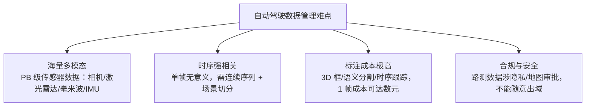

# 自动驾驶训练数据管理最佳实践

## 一句话理解

自动驾驶数据管理 = **存储分层 + 版本控制 + 标注质量 + 流水线闭环** 四件事的复合工程。它比通用 AI 数据管理更难，因为海量多模态（PB 级）、时序强相关、标注成本极高、合规要求严格四重压力叠加——核心原则是**用"清单/引用"而非"文件拷贝"驱动训练**，让数据像代码一样可版本化、可回溯、可复现。

## 为什么重要

- **数据决定上限**：自动驾驶模型的长尾问题（corner case）只能靠数据迭代收敛，数据管理能力直接决定算法天花板
- **成本巨大**：PB 级存储 + 每帧数元的标注成本，管理不善等于烧钱
- **合规硬约束**：路测数据涉隐私与地图审批，不能随意出域，必须可审计可回溯
- **与代码管理同等重要**：训练不可复现的根因 90% 是数据版本混乱

## 四个独特挑战



## 数据全生命周期（核心实践框架）

```text
采集 → 清洗/筛选 → 标注 → 版本化 → 存储/分层 → 训练消费 → 评估回传 → 再采集
  │                                                                       │
  └────────────────────── 闭环：corner case 驱动迭代 ──────────────────────┘
```

| 环节 | 关键实践 | 典型问题 |
|---|---|---|
| **采集** | 按场景打标签（晴天/夜间/高速/路口），记录车辆/传感器配置作为元数据 | 采集完无法追溯配置 |
| **筛选** | 基于多样性采样（Active Learning / 场景覆盖度）挑数据，而非全量入库 | 90% 数据是"容易样本"，浪费标注预算 |
| **标注** | 标注质检流水线（一致性检查、交叉验证）、标注版本管理 | 标注错误未检测就进训练集 |
| **版本化** | 数据集版本 = 数据版本 + 标注版本，二者绑定可复现 | 训练不可复现，"上次那个数据集呢？" |
| **存储分层** | 冷热分层：原始数据→冷存储，训练子集→PFS/本地盘缓存 | 全量 PB 级数据直接进训练存储，成本爆炸 |
| **训练消费** | DataLoader 直接从"数据版本清单"读，不直接读原始目录 | 数据漂移后训练结果无法归因 |
| **评估回传** | 训练失败样本 / 评测失败场景自动回传采集队列 | 长尾问题不收敛 |

## 存储架构：分层是关键

```
                    自动驾驶数据分层
┌─────────────────────────────────────────────────┐
│ L1 原始数据湖   对象存储(OSS/COS/OBS)  PB 级     │  ← 全量保留，冷存储
├─────────────────────────────────────────────────┤
│ L2 精选数据集   并行文件系统(PFS/GPFS) TB 级     │  ← 标注完成、进训练
├─────────────────────────────────────────────────┤
│ L3 训练热数据   本地 NVMe/内存缓存               │  ← 当前训练用，近计算
└─────────────────────────────────────────────────┘
```

**关键原则**：

1. **全量原始数据永不删除**（合规 + 可回溯），但只把"精选子集"送进热路径
2. **数据清单（manifest）驱动**：训练消费的是"清单 + 引用"，不是文件拷贝——同一数据可同时属于多个训练集，零冗余
3. **生命周期自动流转**：标注完成后自动从 L1 提升到 L2，训练集过期自动降级

对应通用存储体系详见 [分布式存储系统知识地图](../engineering/distributed-storage-knowledge-map.md)（对象存储/PFS/缓存加速的底层原理）。

## 数据版本管理（对标代码 Git）

数据集版本 = 数据版本 + 标注版本，绑定后可复现：

```text
数据集版本 2026-08_v3
├── data_manifest.json      # 包含哪些场景/文件引用 + 哈希
├── labels_v2               # 标注版本引用
├── sensor_config           # 传感器配置
└── metadata                # 采集时间/天气/地区/车辆
```

| 工具 | 定位 | 适用 |
|---|---|---|
| **DVC** | 数据版本控制，Git 友好，存引用+哈希 | 团队小、已用 Git、起步选择 |
| **LakeFS** | Git 式数据湖版本控制（分支/回滚） | 已有对象存储数据湖 |
| **FiftyOne** | CV 数据集可视化 + 筛选 + 版本管理（Python） | **标注质检与场景筛选**，业界口碑很好 |
| **自有元数据服务** | 采集-标注-训练全链路 ID 打通 | 规模化后自建 |

## 标注与数据质量（成本与精度的平衡）

1. **场景驱动采样**：用场景覆盖矩阵（天气 × 时段 × 路况 × 车型）指导选数据，别均匀采样
2. **主动学习**：用模型的不确定性挑"模型会错的样本"优先标注，标注预算效率提升 3-5×
3. **标注质检**：至少 5-10% 标注做双重校验，标注版本和算法版本解耦
4. **一致性校验**：同一场景不同批次标注做一致性检查，防止标注漂移

## 与流水线系统的协同（Airflow/Dagster）

```text
Dagster/Airflow 调度
   │
   ├── 采集入库 job      → 原始数据 → L1 对象存储
   ├── 场景筛选 job      → 精选样本 → 标注队列
   ├── 标注回收 job      → 标注结果 → L2 PFS + 版本化
   ├── 训练数据构建 job  → manifest → 训练集群
   └── 评估回传 job      → 失败样本 → 再采集队列
```

**关键设计**：数据管线状态用"清单/指针"而非文件移动表达，这样调度系统重试、回溯都便宜。

## 落地优先级建议

如果从零开始，按投入产出比递减顺序做：

1. **数据版本化**（DVC 或 LakeFS）——立刻解决"训练不可复现"，成本最低
2. **清单驱动消费**——改动 DataLoader 读 manifest，为后续全部优化打基础
3. **场景筛选 + 主动学习**——直接省标注预算
4. **冷热分层存储**——降存储成本
5. **FiftyOne 质检流水线**——提升标注质量
6. **评估回传闭环**——长尾收敛

## 常见坑点

1. **把原始数据当训练数据直接用**：应先筛精选子集，否则存储与训练成本失控
2. **数据与标注版本脱钩**：标注更新后旧训练集不可复现，必须绑定版本
3. **用文件拷贝而非清单引用组织数据集**：同一数据多份拷贝，存储浪费且不同步
4. **忽略传感器配置元数据**：换传感器后数据分布漂移无法归因
5. **均匀采样代替场景采样**：长尾场景永远学不到
6. **数据出域无审计**：合规风险，必须记录访问与导出日志

## 我的理解

自动驾驶数据管理的本质，是把数据从"一堆文件"升级为"可版本化的资产"。它的核心设计哲学和代码管理一样：**引用与内容分离**——manifest 存引用，实际文件按层存放；版本控制管引用，内容靠哈希校验。这样数据可以像 Git 一样分支、回溯、可复现，而无需复制 PB 级文件。

另一个关键认知：**数据管理是闭环而非流水线**。采集 → 训练 → 评估 → 回传再采集，只有闭环跑起来，corner case 才会持续收敛。很多团队把数据管理做成单向流水线，长尾问题就永远解决不了。

## Related

- [分布式存储系统知识地图](../engineering/distributed-storage-knowledge-map.md) — 对象存储/并行文件系统/多级缓存的底层原理
- [AI 开源项目源码精读指南](../ai/ai-open-source-source-reading.md) — 数据管线相关开源项目（FiftyOne/DVC）源码精读方向
- [Semantica 知识图谱](../ai/semantica.md) — 数据血缘/溯源（PROV-O）在数据治理中的应用

## References

- [DVC 文档](https://dvc.org/doc)
- [LakeFS](https://lakefs.io/)
- [FiftyOne](https://fiftyone.ai/)
- [Argoverse / nuScenes 数据集规范](https://www.nuscenes.org/)
