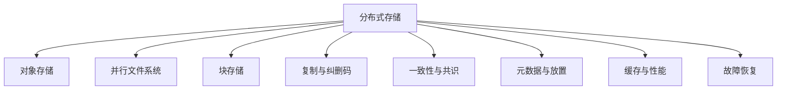

# 分布式存储基础总览

## 一句话理解

分布式存储要解决的问题很朴素：**把数据放在多台机器上，还要让人感觉像在用一个可靠的“大硬盘”**。难点在于：机器会坏、网络会抖、磁盘会慢、节点会重启、机房会分区，所以系统必须在**一致性、可用性、性能、成本、扩展性**之间做取舍。

## 先建立一个最重要的直觉

你可以把分布式存储想成三个层次：

1. **对外提供什么语义**：像文件一样访问，像对象一样访问，还是像块设备一样访问
2. **数据怎么放**：复制几份、切成什么块、放到哪些节点、如何跨故障域分布
3. **坏了怎么办**：节点宕机、网络分区、数据损坏、版本冲突、主从切换、重建恢复

如果你先记住这三层，后面的所有系统都能往里套。

## 分布式存储的目标

### 1）可靠性（Durability）

数据写成功之后，不应该因为某一块盘坏了、某一台机器宕机了就丢掉。

常见手段：
- 多副本
- 纠删码（Erasure Coding）
- 校验和
- 后台修复（rebuild / repair）

### 2）高可用（Availability）

即使有节点故障、网络抖动、局部机房异常，系统尽量还能读写。

常见手段：
- 多副本分布在不同故障域
- 读写法定人数（quorum）
- 选主与自动故障转移
- 降级服务

### 3）可扩展（Scalability）

容量、吞吐和请求量增长时，系统应该能通过加节点继续工作，而不是推倒重来。

常见手段：
- 分片（sharding）
- 放置算法（placement）
- 去中心化元数据
- 自动重平衡

### 4）性能（Performance）

分布式系统不是只要“能用”，还要“够快”。

常见指标：
- 延迟：单次读写多久返回
- 吞吐：每秒能处理多少数据
- IOPS：每秒能处理多少小 IO
- 尾延迟：最慢那一小撮请求有多慢

### 5）成本（Cost）

分布式存储的成本不只是硬盘钱，还包括：
- 额外副本和冗余空间
- 网络带宽
- 运维复杂度
- 故障恢复期间的资源消耗

## 分布式存储的三种常见语义

| 类型 | 像什么 | 优点 | 缺点 | 常见场景 |
|---|---|---|---|---|
| 块存储 | 裸硬盘 | 延迟低、语义简单 | 需要自己管理文件系统 | 数据库、虚拟机、云盘 |
| 文件存储 | 共享文件夹 | 直观、POSIX 友好 | 元数据压力大 | 共享工作目录、HPC、训练数据 |
| 对象存储 | 海量键值仓库 | 最容易水平扩展、成本低 | 语义弱，不像本地文件系统 | 数据湖、备份、归档、训练数据 |

## 一个最重要的架构图

```text
客户端
  │
  ├─ 控制面：查元数据、选副本、申请租约、选主
  │
  └─ 数据面：读写数据块、上传对象、拉取分片、校验校验和
        │
        ├─ 元数据服务：目录、文件、对象索引、权限、版本
        └─ 数据节点：真正存放数据块 / 对象分片 / 副本
```

### 控制面 vs 数据面

- **控制面**负责“去哪读、去哪写、谁是主、权限是什么、版本是什么”
- **数据面**负责“把字节真的传过去”

很多系统的性能瓶颈不在数据面，而在控制面，比如：
- 创建大量小文件
- list 很多目录
- 元数据查询过频繁
- 选主和租约切换太频繁

## 分布式存储中最常见的角色

### 1）客户端（Client）

客户端发起读写请求，有时还会参与缓存、重试、路由计算。

### 2）元数据节点（Metadata Server / MDS）

管理“名字”和“位置”的映射：
- 文件名到 inode
- 路径到目录项
- 对象 key 到分片位置
- 版本号和权限信息

### 3）数据节点（Data Node / OSD / Chunk Server）

真正保存用户数据。

### 4）协调节点（Coordinator / Master / Monitor）

负责选主、配置管理、集群成员关系、故障检测。

## 先记住的 12 个核心概念

1. **副本（Replication）**：把同一份数据保存多份
2. **纠删码（Erasure Coding）**：把数据切片加冗余编码，省空间
3. **分片（Sharding）**：把数据切到不同节点
4. **故障域（Failure Domain）**：同一机架、同一可用区、同一机房
5. **元数据（Metadata）**：描述数据的数据
6. **放置（Placement）**：数据应该落在哪些节点上
7. **重平衡（Rebalance）**：集群变化后重新分配数据
8. **修复（Repair / Rebuild）**：副本损坏后恢复
9. **一致性（Consistency）**：读到的数据是不是最新、顺序对不对
10. **租约（Lease）**：带时间限制的写权限
11. **脑裂（Split Brain）**：多个节点都以为自己是主
12. **尾延迟（Tail Latency）**：最慢请求决定用户体验

## 为什么元数据这么重要

很多初学者会以为“存储就是把文件放盘上”，其实真正难的是**管理这些文件在哪里、谁在用、怎么查、怎么改、怎么恢复**。

元数据通常包括：
- 名称
- 路径
- 所属目录或桶
- 权限
- 大小
- 校验和
- 版本号
- 副本位置
- 时间戳
- 标签和生命周期策略

元数据越多，系统越像“数据库”；元数据越少，系统越像“对象仓库”。

## 你应该先形成的总图



## 建议学习顺序

如果你是初学者，建议按这个顺序看：

1. 先看 [对象存储](./object-storage.md)
2. 再看 [并行文件系统](./parallel-file-systems.md)
3. 然后看 [副本、纠删码与放置](./replication-erasure-coding-placement.md)
4. 接着看 [一致性、共识与故障恢复](./consistency-consensus-failure.md)
5. 最后看 [元数据与性能瓶颈](./metadata-and-performance.md)

## 这一套知识的底层逻辑

分布式存储的本质不是“把一份文件分到多台机器”，而是：

- 把**数据安全**问题变成**冗余设计**问题
- 把**单机容量有限**问题变成**分片与放置**问题
- 把**机器会坏**问题变成**自动恢复**问题
- 把**大家同时访问**问题变成**一致性控制**问题
- 把**系统变大**问题变成**元数据和控制面扩展**问题

## Related

- [分布式系统核心理论基础](../distributed-systems-foundations.md) — CAP、FLP、一致性模型、共识算法的理论底座
- [分布式存储系统知识地图](../../engineering/distributed-storage-knowledge-map.md) — 面向 AI 训练与多云场景的工程版总图
- [工程索引](../../engineering/index.md) — 同目录下的工程知识入口
