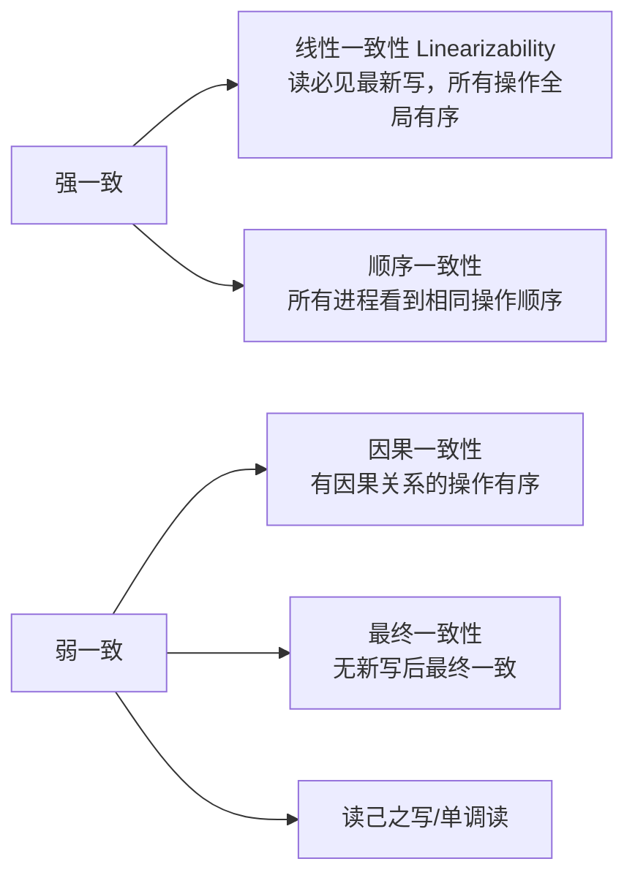

# 分布式系统核心理论基础

## 一句话理解

分布式系统理论回答一个根本问题：**当多个节点通过网络协作时，如何保证系统的正确性、可用性与可扩展性**。核心内容包括系统模型假设（CAP/FLP 的前提）、一致性模型谱系、共识算法（Raft/Paxos/Quorum）、时钟与排序、复制与分区、分布式事务、故障检测——这些是存储、数据库、分布式训练（DDP/FSDP）共用的底层地基。

## 为什么重要

- 存储 JD 反复要求的"高并发、高可靠、高可用、多副本一致性、元数据、数据完整性"，全部建立在这些理论上
- **理论是硬约束**：CAP、FLP 不是可选项，任何分布式系统都在其边界内做工程折中
- 你在 PyTorch 分布式训练中的 DDP/FSDP 本质也是分布式系统：集合通信、同步语义、容错都是同一套理论的实例
- 理解理论 → 才能判断工程方案"为什么这么设计"，而不是背 API

## 一、系统模型假设（一切理论的前提）

讨论分布式理论前，先明确假设：

| 模型维度 | 分类 | 含义 |
|---|---|---|
| 同步性 | 同步 / 异步 / **部分同步** | 消息延迟是否有界；现实系统是部分同步 |
| 失败模型 | 崩溃（crash）/ 拜占庭（byzantine） | 节点是宕机还是可能作恶/发错消息 |
| 网络 | 可靠 / 分区 | 消息是否可能丢失、网络可能断成两半 |
| 进程 | 顺序 / 并发 | 进程内操作顺序是否已知 |

**工程意义**：存储系统通常假设"崩溃失败 + 部分同步 + 可分区"，这是 Paxos/Raft 等算法成立的前提；拜占庭模型只用于区块链等场景。

## 二、CAP 定理与 PACELC

**CAP**：在异步网络中，一致性（Consistency）、可用性（Availability）、分区容忍性（Partition tolerance）三者**不可兼得**。由于网络分区必然发生（P 是物理现实），实际是 **C 与 A 的取舍**：

```text
网络分区发生时：
  - 选择 C（放弃 A）：拒绝部分请求，保证读到一致数据（如：强一致存储、ZooKeeper）
  - 选择 A（放弃 C）：所有节点继续服务，允许暂时不一致（如：Cassandra、部分对象存储）
```

**PACELC 扩展**（更精确的表述）：

```text
If Partition (P) → choose Availability (A) or Consistency (C)
Else (无分区时)   → choose Latency (L) or Consistency (C)
```

**工程意义**：无分区时也要权衡延迟与一致性——对象存储"写后读一致 + 分区内强一致"就是 PACELC 的实例。

## 三、FLP 不可能性

**FLP（Fischer-Lynch-Paterson）**：在**纯异步**系统中，即使只有一个进程可能崩溃，也不存在**确定性的一致性问题算法**能保证终止。

```text
异步模型下：无法区分"节点很慢"和"节点已崩溃"
→ 任何共识算法都可能无限期等待
```

**为什么 Raft/Paxos 仍能工作**：它们假设"部分同步"——消息最终会到达，或用超时/租约打破僵局。**FLP 的结论是：超时与心跳不是工程细节，而是打破不可能性的必要条件。**

## 四、一致性模型谱系

一致性不是"有/无"，而是一个谱系：



| 模型 | 保证 | 代价 | 典型场景 |
|---|---|---|---|
| 线性一致性 | 最强，像单机 | 延迟高、可用性受限 | 选主、元数据、数据库事务 |
| 顺序一致性 | 全局有序但不实时 | 中 | 某些复制系统 |
| 因果一致性 | 因果关系有序 | 低 | 社交、日志 |
| 最终一致 | 弱 | 最低 | 缓存、部分对象存储 |

**工程意义**：训练数据只读场景用弱一致（缓存/对象存储），checkpoint 与训练产出必须强一致（PFS）。

## 五、共识算法：Paxos / Raft / Quorum

### 共识问题定义

多个节点就某个值达成一致，且满足：一致性（只有一个值被接受）、终止（最终达成）、有效性（接受的值来自提议）。

### Raft（可理解性优先）


核心机制：
- **领导人选举**：任期（term）+ 随机超时，避免平局
- **日志复制**：只由 Leader 写日志，复制到多数派即提交
- **安全性**：任期号 + 日志匹配保证"已提交日志不会被覆盖"
- 3 节点容忍 1 故障，5 节点容忍 2 故障（多数派原则）

### Paxos

理论最优雅但工程复杂（Multi-Paxos），是 Raft 的前身。Raft 是 Paxos 的"工程化重述"，二者**正确性等价**，Raft 更易实现。

### Quorum 法定人数

不依赖 Leader，通过读写法定人数保证一致性：

$$W + R > N \quad \Rightarrow \quad \text{读至少读到一份最新写}$$

- $N$：副本数，$W$：写副本数，$R$：读副本数
- 例：$N=3, W=2, R=2$ → 读写副本必有交集，读到最新值
- 对象存储/键值库常用（Dynamo 风格）

## 六、时钟与排序

分布式系统无法依赖物理时钟做全局排序（NTP 有误差），需要逻辑时钟：

| 时钟 | 原理 | 能力 |
|---|---|---|
| Lamport 时钟 | 事件计数 + 传播 | 偏序（happened-before） |
| 向量时钟 | 每进程一个计数器 | 完整因果关系，可检测并发 |
| 混合逻辑时钟 HLC | 物理 + 逻辑 | 物理近似 + 因果完整 |

**工程意义**：存储的"版本管理/冲突检测"本质是向量时钟问题；"因果一致"需要逻辑时钟支持。

## 七、复制与分区

### 复制模式

| 模式 | 写路径 | 一致性 | 场景 |
|---|---|---|---|
| 单 Leader | 全写 Leader | 可强一致 | 数据库主从、元数据服务 |
| 多 Leader | 多节点可写 | 需冲突解决 | 多数据中心、离线可用 |
| 无 Leader（Quorum） | 多节点并发写 | 读时调解 | Dynamo 风格存储 |

### 分区（Sharding）

- **范围分区**：键有序分区，利于范围查询，但有热点
- **哈希分区**：均匀分布，牺牲范围查询
- **一致性哈希**：减少重平衡时的数据迁移（存储集群扩容核心）

### CRUSH 与 PG（Ceph 的数据放置）

Ceph 不用一致性哈希，而是用 **CRUSH（Controlled Replication Under Scalable Hashing）**：

```text
对象 obj --hash--> PG 编号 --CRUSH--> [OSD1, OSD2, OSD3]   ← 副本落在不同故障域
```

- **PG（Placement Group）**：对象 → PG（哈希取模），PG → OSD 集合（CRUSH 计算），PG 是复制/迁移的最小单位
- **确定性**：相同输入（key、副本数、拓扑）→ 相同输出，**客户端本地即可算出 OSD 位置**，无需查中心路由表
- **故障域感知**：副本按机架/机房层级分布，避免同故障域数据全丢
- **权重与重平衡**：OSD 增删只迁移部分 PG，可用权重控制放置比例

| 维度 | 一致性哈希 | CRUSH |
|---|---|---|
| 定位方式 | 环查找，需分布式路由/虚拟节点 | 纯函数计算，客户端本地可算 |
| 故障域 | 无内建概念 | 内建层次化故障域 |
| 权重 | 虚拟节点近似 | 显式权重控制 |
| 代表 | Dynamo / Redis Cluster | Ceph |

## 八、分布式事务

| 协议 | 思路 | 局限 |
|---|---|---|
| 2PC | 协调者 + 两阶段提交（prepare/commit） | 协调者单点、阻塞 |
| 3PC | 增加 canCommit 阶段，减少阻塞 | 仍非完全容错 |
| Saga | 长事务拆成子事务 + 补偿 | 无隔离保证，最终一致 |
| 幂等 + 重试 | 服务端幂等键 + 客户端重试 | 最简单可靠 |

**工程意义**：存储跨节点事务昂贵，工程上倾向"单分区事务 + 最终一致 + 补偿"。

## 九、故障检测与容错

- **心跳**：Leader 定期发送，超时判定故障
- **租约（Lease）**：带期限的授权，防脑裂（fencing：旧 Leader 用过期租约时被拒绝写入）
- **脑裂处理**：多数派原则 + fencing token，确保同一时刻只有一个活跃 Leader
- **优雅降级**：副本降级、读写分离、熔断

## 十、理论 → 存储系统映射表

| 理论概念 | 存储系统中的体现 |
|---|---|
| CAP / PACELC | 对象存储"写后读一致 + 分区内强一致" |
| FLP + 部分同步 | 存储元数据服务用超时/租约实现共识 |
| Raft | Ceph Monitor、etcd（存储调度器）、元数据选主 |
| Quorum | Dynamo 风格对象存储、Ceph 的读写法定人数 |
| 线性一致性 | 元数据操作、checkpoint 写入 |
| 最终一致 | 训练数据缓存、日志类数据 |
| 一致性哈希 | 存储集群扩缩容时的数据迁移 |
| 2PC/Saga | 跨对象事务（少用）、多级存储生命周期流转 |
| 租约/fencing | 分布式锁、防脑裂写 |

## 常见坑点

1. **把 CAP 当"三选二"**：实际是"分区时二选一"，P 不可选
2. **以为最终一致"最终"很快**：无上界，需要工程手段（读修复、反熵）加速收敛
3. **忽视 FLP 含义**：认为共识算法能"无限等待"——必须配超时/租约
4. **Quorum 不等于强一致**：W+R>N 只保证读到最新写，不保证顺序
5. **物理时钟做全局排序**：NTP 漂移导致错误

## 我的理解

分布式系统理论给我的最大启发是：**它不是一个"算法集合"，而是一套"在不可能性边界内做折中"的思维框架**。CAP 告诉你哪里不能兼得，FLP 告诉你为什么需要超时，Quorum 告诉你多数派的数学含义，Raft 告诉你如何把共识做成可工程实现。

对存储学习者：**理论决定你能设计什么，工程决定你能交付什么**。先吃透这些理论，再读 Ceph/Raft 源码时，你会看到每一个工程决策背后的理论约束——这就是"知其所以然"。

## Related

- [分布式存储系统知识地图](../engineering/distributed-storage-knowledge-map.md) — 本理论的服务对象，存储子领域全景
- [PyTorch](../pytorch/) — DDP/FSDP 是分布式理论的训练场景实例
- [Fenwick Tree 与动态加权采样](../engineering/fenwick-tree-weighted-sampling.md) — 二进制/位运算思维与分布式版本向量的底层思维相通

## References

- [《数据密集型应用系统设计》(DDIA) 第 5-9 章](https://dataintensive.net/)
- [Raft 论文 / 交互演示](https://raft.github.io/)
- [FLP 不可能性论文](https://groups.csail.mit.edu/tds/papers/Lynch/jacm85.pdf)
- [PACELC（Dynamo 论文的扩展）](https://en.wikipedia.org/wiki/PACELC)
- [向量时钟](https://en.wikipedia.org/wiki/Vector_clock)
