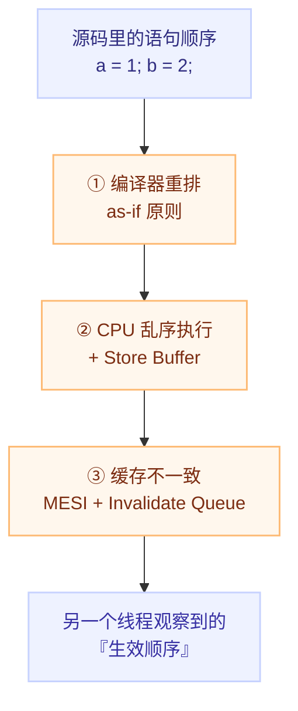

# 以为的顺序不成立：编译器重排、CPU 乱序执行与缓存一致性

## 一句话理解

C++ 内存顺序要解决的是**可见性**与**有序性**问题，不是原子性问题。而"顺序"之所以会"看不见地"变化，是因为从源码到另一个线程的观察结果之间，插了三层各自为政的优化：



**结论先行：在弱内存模型下，"写入的生效顺序"不等于"代码的执行顺序"。**

## 为什么重要

这段代码看起来天经地义：

```cpp
int a = 0;
int b = 0;

void thread_1() {
    a = 1;      // 先写 a
    b = 2;      // 后写 b
}

void thread_2() {
    while (b != 2);   // 等到 b 变成 2
    assert(a == 1);   // 于是断言 a 一定是 1
}
```

**断言可能失败。** 不是因为 `a = 1` 没执行，而是因为 thread_2 看到 `b == 2` 时，`a` 的写入**还没对它生效**。

理解这件事是理解 `memory_order_*` 的前提——否则六种内存顺序只能靠背。

---

## 一、来源 ①：编译器重排

### 1.1 编译器的唯一准则：as-if 原则

C++ 标准规定只要**单线程的可观察行为**不变，编译器可以做任何变换。编译器看到的不是"两条顺序执行的指令"，而是"一堆优化机会"。

```cpp
int x = 0;
int y = 0;

void func() {
    x = 10;
    y = 20;
    x = x + 1;
}
```

`-O2` 下的典型结果：

```asm
mov DWORD PTR [y], 20     ; y = 20 被提到了前面
mov DWORD PTR [x], 11     ; x = 10 与 x = x + 1 被合并
```

两件事同时发生了：**交换了 `x = 10` 和 `y = 20` 的顺序**，并把 `x = 10; x = x + 1` 折叠成 `x = 11`。

常见的重排/优化手法：

| 手法 | 说明 |
|---|---|
| 循环外提 | 把循环不变量提到循环外 |
| 公共子表达式消除 | 重复计算只做一次 |
| 死存储删除 | 被后写覆盖的写直接删掉 |
| 指令调度 | 为填满流水线而改变指令顺序 |

**"多线程下另一个线程会怎么看"不在编译器的考虑范围内**——因为标准只要求单线程语义正确。

### 1.2 `volatile` 为什么不管用

```cpp
volatile int flag = 0;
int data = 0;

// 线程 1
data = 42;
flag = 1;

// 线程 2
while (flag != 1);
assert(data == 42);   // 仍然可能失败
```

`volatile` 能阻止编译器对 **`flag` 这一个变量自己**的优化与重排，但它：

- **不阻止 `data` 与 `flag` 之间的重排**——`volatile` 只保证自身，不影响其他变量；
- **完全不管 CPU 的乱序执行**；
- **完全不管缓存一致性**；
- **不建立任何跨线程的 happens-before 关系**。

> **结论：多线程编程里 `volatile` 没有用处**（它真正的用途是 memory-mapped I/O、`setjmp`/`longjmp` 场景）。跨线程同步必须用原子操作 + 内存顺序。

---

## 二、来源 ②：CPU 乱序执行与 Store Buffer

### 2.1 乱序执行：为了不让流水线停顿

现代 CPU 只要"最终结果在单线程视角下正确"，就可以任意调整指令的执行顺序。

```asm
LOAD  R1, [X]
ADD   R2, R1, 1
STORE [Y], R2
LOAD  R3, [Z]     ; 不依赖前面任何指令
```

CPU 的处境：

1. 第一条 `LOAD` 发出后要等内存返回（约 50–100 个周期）；
2. `ADD` 依赖第一条，只能干等；
3. `STORE` 依赖 `ADD`，同样阻塞；
4. **第四条 `LOAD` 不依赖前面任何指令** → CPU 会先把它执行掉。

这就是乱序执行（out-of-order execution）。它带来的直接后果是：**不同核心看到的执行顺序可以不同。**

### 2.2 Store Buffer：写操作不会立刻进 Cache

一个核心执行写操作时，**不会立即把数据写进 L1 Cache**，而是先放进一个叫 **Store Buffer** 的高速队列，然后继续执行后面的指令。

- Store Buffer 对**本地核心可见**（本地后续读能读到自己的写）；
- 对**其他核心不可见**（别人还看不到）。

于是就出现了 **StoreLoad 重排**（本核心的 store 尚未对其他核心生效，但本核心已经执行了更后面的 load）。通俗地讲就是"写还没传出去，读已经跑掉了"。

### 2.3 对应的硬件屏障指令

| 方向 | x86 | ARM | 作用 |
|---|---|---|---|
| 写屏障 | `sfence` | `dmb st` | 把 Store Buffer 里的写全部刷入 Cache，保证屏障之前的写对后续的读可见 |
| 读屏障 | `lfence` | `dmb ld` | 处理完 Invalidate Queue，保证屏障之后的读能看到最新值 |
| 全屏障 | `mfence` | `dmb sy` | 兼具读写屏障功能 |

> 更详细的指令族与作用域（ARM 的 `DMB ish/nsh/osh`、PowerPC 的 `sync/lwsync/isync`）见 [各架构的内存模型与屏障指令](./03-barriers-by-architecture.md)。

---

## 三、来源 ③：缓存一致性协议（MESI）

### 3.1 MESI 的四种状态

| 状态 | 含义 |
|---|---|
| **M** (Modified) | 已被本核心修改，且只有本核心持有该缓存行（与内存不一致） |
| **E** (Exclusive) | 只有本核心持有，且未被修改（与内存一致） |
| **S** (Shared) | 多个核心持有相同数据（均未被修改） |
| **I** (Invalid) | 数据已过时，不可用 |

一个核心要写一个处于 **S** 状态的缓存行，必须先向其他核心广播 **Invalidate** 消息，把它们对应行置为 **I**，**收到所有核心的 Acknowledgement 之后**才能写入。

### 3.2 关键点：MESI 保证的是"最终一致"，不是"实时一致"

问题出在 Invalidate 的处理过程本身要花时间。而且为了加速，CPU 还有 **Invalidate Queue**：

> 核心收到 Invalidate 消息后**不立刻处理**，而是把消息丢进 Invalidate Queue，**立即回复确认**，真正的失效处理稍后做。

后果：**本核心可能在一段时间内仍然读到自己缓存里的旧值**——这正是"读屏障"要解决的问题（读屏障 = 强制清空 Invalidate Queue）。

### 3.3 三层来源的分工

| 来源 | 谁在优化 | 典型重排类型 | 对应屏障 |
|---|---|---|---|
| 编译器重排 | 编译器 | 任意（受 as-if 约束） | 编译屏障（原子操作自带） |
| Store Buffer | CPU 核心 | StoreLoad | 写屏障 / 全屏障 |
| Invalidate Queue | CPU 缓存子系统 | LoadLoad / LoadStore | 读屏障 / 全屏障 |

---

## 四、这三层怎么被 C++ 抽象掉

C++ 用**一个原子变量 + 内存顺序**把这套乱七八糟的硬件细节收敛成两条规则：

- **`memory_order_release`**：保证**在此之前的所有写操作**（包括普通非原子变量），都在这次写之前对其他线程可见；
- **`memory_order_acquire`**：保证**在此之后的所有读操作**，都能看到与它配对的那个 `release` 线程在 release 之前写入的所有内容。

细节与六种内存顺序的完整对照见 [C++ 六种内存顺序](./02-six-memory-orders.md)。

---

## 我的理解

- 这三层来源可以按"**谁做了决定**"重新分组：**编译器**做的是文本级变换（受 as-if 掩护），**CPU** 做的是流水线调度（受单线程正确性掩护），**缓存子系统**做的是异步消息传播（受"最终一致"掩护）。三者各自都"没错"，**错的是程序员以为存在一个全局时间轴**。
- 一个我原来会搞错的地方：**屏障不是"让写变快"或"让缓存刷新"，而是给编译器和硬件划出一条不允许跨越的线**。屏障本身不搬运数据，它只是限制重排的自由度。
- `volatile` 的误区值得记住"为什么"而不只是"不行"：它给的是**对单个对象的访问顺序**保证，而跨线程同步需要的是**多个对象之间**的 happens-before 关系——**这是两种不同强度的承诺，前者无法推出后者**。
- 反过来看，这三层来源正好解释了下一节要讲的结论：**x86 的 TSO 已经把 StoreLoad 之外的四种重排都禁掉了**，所以 `acquire` / `release` 在 x86 上几乎不产生额外指令——"同一段 C++，在不同架构上代价不同"的根源就在这里。

## Related

- [C++ 六种内存顺序全景](./02-six-memory-orders.md) — `relaxed / acquire / release / acq_rel / seq_cst` 的语义与选择
- [各架构的内存模型与屏障指令](./03-barriers-by-architecture.md) — 同一段 C++ 在 x86 / ARM / PowerPC 上生成的指令差多少
- [无锁实战：自旋锁、SPSC 队列与 RCU](./04-lock-free-patterns.md) — 这些原理怎么落到可用的同步原语
- [检测、验证与查看真实指令](./05-detection-and-tools.md) — 怎么证明自己没写错
- [C++ 专题总览](./index.md) — 本专题的定位与学习路径

## References

- 微信公众号《看不见的执行顺序：C++内存顺序详解》，Lion 莱恩呀：<https://mp.weixin.qq.com/s/X3gnwfz0hsfWi8Z-BDKRFA>
- Paul E. McKenney, *Memory Barriers: a Hardware View for Software Hackers*：<http://www.puppetmastertrading.com/images/hwViewForSwHackers.pdf>
- C++ 标准草案 [\[atomics.order\]](http://eel.is/c++draft/atomics.order)；WG21 [N3716](http://www.open-std.org/jtc1/sc22/wg21/docs/papers/2013/n3716.html)（内存顺序设计说明）
- 本笔记对原文做了重组与补充：三层来源的"谁在做决定"分组、屏障的作用是"划边界"而非"刷数据"、`volatile` 与 happens-before 的强度对比，为本人整理。
