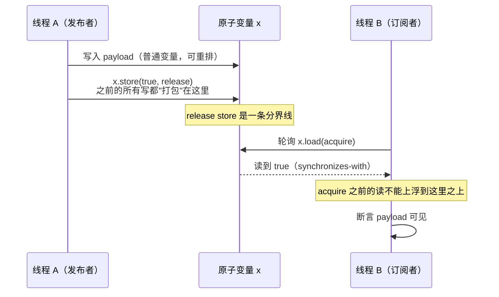
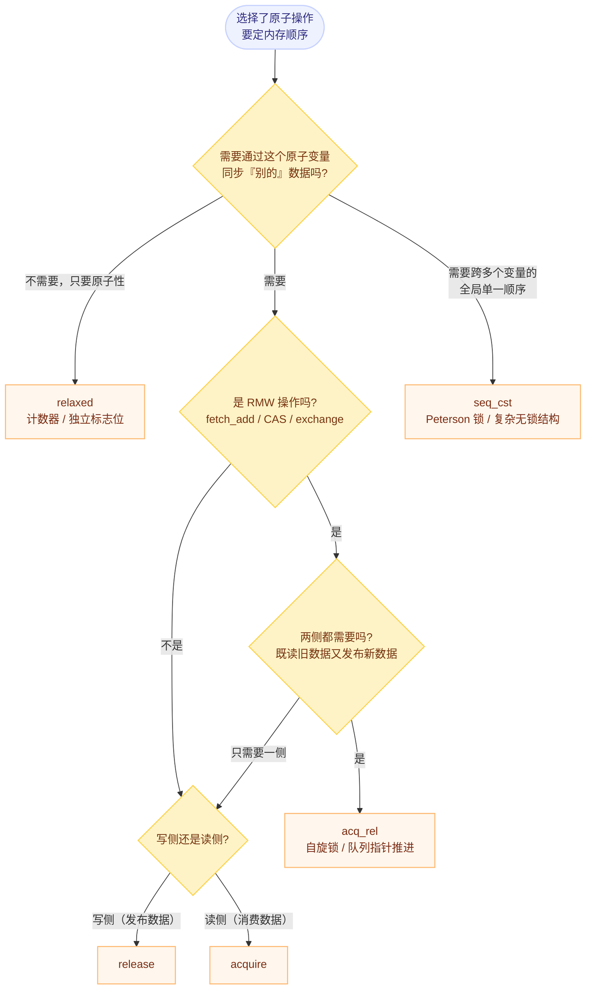

# C++ 六种内存顺序全景

> 前置：先看 [以为的顺序不成立](./01-reordering-and-cache-coherence.md)，理解编译器重排 / Store Buffer / Invalidate Queue 这三层"看不见的执行顺序"。否则本文只能靠背。

## 一句话理解

内存顺序是挂在**原子操作**上的一个参数，它决定这次原子操作**顺带建立多强的顺序约束**。它不改变原子性（原子性由 `std::atomic` 本身保证），只改变"这个操作能不能被重排、以及它能搭载多少其他内存操作的可见性"。

## 速查表

| 内存顺序 | 可见性保证 | 有序性保证 | 相对代价 |
|---|---|---|---|
| `memory_order_relaxed` | 无 | 无 | 最快 |
| `memory_order_consume` | 数据依赖链 | 数据依赖链 | 低（**已弃用**） |
| `memory_order_acquire` | 读到 release 之前的**所有**写入 | 后续读写不能重排到它之前 | 较低 |
| `memory_order_release` | 之前的**所有**写入对其他 acquire 可见 | 之前的读写不能重排到它之后 | 较低 |
| `memory_order_acq_rel` | acquire + release | acquire + release | 中等 |
| `memory_order_seq_cst` | 全局一致 | 全局一致 | 最慢（全屏障） |

> **默认值陷阱**：`std::atomic` 的操作若不显式指定内存顺序，默认是 **`seq_cst`**——也就是最贵的那一档。标准这么做是为了让默认行为最安全，但热路径上常常可以降级。

---

## 一、`memory_order_relaxed`：只保证原子性

```cpp
std::atomic<int> counter{0};

void worker() {
    for (int i = 0; i < 1000; ++i) {
        counter.fetch_add(1, std::memory_order_relaxed);
    }
}
```

- **保证**：每次 `fetch_add` 是原子的，不会丢更新；
- **不保证**：与其他任何内存操作（包括其他原子变量）之间的顺序。

### 一个容易忽略的补充（原文章未提）

`relaxed` **仍然保证同一原子对象有单一的修改顺序（modification order）**：所有线程对该对象看到的值变化序列是一致的，**不会出现"值倒退"**（不会先读到 5 再读到 3）。

也就是说 `relaxed` 弱的是**跨对象、跨线程**的顺序，而不是**单个对象自身**的一致性。这一点是 `relaxed` 能安全用作计数器的基础。

### 适用场景

**① 统计计数器**：多个计数器之间不需要任何先后关系。

```cpp
struct ServerStats {
    std::atomic<uint64_t> requests_handled{0};
    std::atomic<uint64_t> bytes_sent{0};

    void on_request(size_t bytes) {
        requests_handled.fetch_add(1, std::memory_order_relaxed);
        bytes_sent.fetch_add(bytes, std::memory_order_relaxed);
    }
};
```

注意 `print_stats()` 里同时读两个计数器的**时刻是不一致的**（可能读到"请求加了、字节没加"的组合）——如果在意这一点，就需要更强的顺序或额外的一致性快照机制。

**② 单纯的标志位轮询**：

```cpp
std::atomic<bool> stop_flag{false};

while (!stop_flag.load(std::memory_order_relaxed)) {
    do_work();
}
```

**仅当**"看到 flag 之后不需要读任何别的共享数据"时才成立。

### 硬件代价

| 架构 | `relaxed` 生成什么 |
|---|---|
| x86 | 普通 `mov`，与访问普通变量同速 |
| ARM | 一条 `ldr` / `str`；而 `acquire` 需要 `ldar`（load-acquire） |

### ⚠️ 不要用 `relaxed` 构建同步原语

用 `relaxed` 的 `exchange` 虽然能原子地设置锁标志，但**没有附带任何内存屏障**。后果：进入临界区后，**看不到**其他线程对共享变量的修改，本线程的修改也**无法及时传播出去**。

> **原子操作 ≠ 线程安全。** 原子性只保证这一个变量的读写不撕裂，不保证它周围的数据可见。

---

## 二、`memory_order_acquire` / `memory_order_release`：发布-订阅

这是实际工程里最常用的一对。

### 2.1 核心规则（一条就够）

> 如果线程 A 执行 `x.store(v, release)`，线程 B 随后 `x.load(acquire)` 并**读到了 A 写入的值**，那么 **A 在 release 之前的所有写操作（包括普通非原子变量）**，对 **B 在 acquire 之后的所有读操作**都是可见的。

这就是跨线程的 **synchronizes-with** 关系：release 之前的写 → happens-before → acquire 之后的读。



### 2.2 标准用例

```cpp
std::atomic<bool> ready{false};
std::string* payload = nullptr;

void producer() {
    payload = new std::string("Hello, World!");   // 普通指针，非原子
    ready.store(true, std::memory_order_release); // 发布：之前的写全部"提交"
}

void consumer() {
    while (!ready.load(std::memory_order_acquire)) // 订阅：之后能读到上面所有写
        ;
    assert(payload != nullptr);                   // 一定成立
    assert(*payload == "Hello, World!");          // 一定成立
    delete payload;
}
```

**注意 `payload` 是一个普通指针，不是原子变量。** release/acquire 保护的是**所有**内存操作，不只是那个原子变量——这是它最有价值的地方。

### 2.3 两条硬性约束

1. **acquire 与 release 必须成对使用**，单用一侧没有任何跨线程效果。
2. **必须在同一个原子变量上配对。** 在 `x` 上 release、在 `y` 上 acquire，不构成 synchronizes-with。

> 更严格地说，acquire 侧必须读到 release 侧写下的值（或该 release 之后同一条 release sequence 中的值）。这就是为什么这个模式叫"发布-订阅"：**能读到那个标志，才说明数据已经准备好了。**

---

## 三、`memory_order_acq_rel`：给读-改-写用

`acq_rel` 是 acquire 和 release 的组合，专门用于 **RMW（read-modify-write）** 操作：`fetch_add`、`exchange`、`compare_exchange_*` 等。

语义上就是**读的那一半是 acquire，写的那一半是 release**：

- 该操作**之前**的读有 acquire 语义（能看到其他线程 release 之前的所有写入）；
- 该操作**之后**的写有 release 语义（能让其他线程 acquire 之后看到本线程的写入）。

### 典型应用：自旋锁

```cpp
class SpinLock {
    std::atomic<bool> locked_{false};
public:
    void lock() {
        bool expected = false;
        while (!locked_.compare_exchange_weak(
            expected, true,
            std::memory_order_acq_rel,   // 成功：既要看到临界区旧数据，也要发布自己的写
            std::memory_order_relaxed)) { // 失败：什么都没改，不需要任何顺序
            expected = false;
        }
    }

    void unlock() {
        locked_.store(false, std::memory_order_release);
    }
};
```

- `lock()` 的成功路径：**acquire** 部分保证临界区内能看到上一个持锁者在 `unlock` 之前写的所有数据；**release** 部分保证本线程对临界区的写能被下一个持锁者看到。
- `lock()` 的失败路径：用 `relaxed` 即可——CAS 失败时没有发生任何修改，也就没有需要发布的东西。

### 什么时候不必用 `acq_rel`

很多人习惯在 RMW 上用默认的 `seq_cst`。**大多数场景 `acq_rel` 就够了，而且更便宜**：

| 架构 | `acq_rel` vs `seq_cst` |
|---|---|
| x86 | 两者生成的汇编**相同**（x86 的 RMW 指令自带 full barrier） |
| ARM | `acq_rel` 只需一对 `dmb`；`seq_cst` 需要更贵的 `dmb.sy`（全系统屏障） |

> 换句话说：**`acq_rel` 与 `seq_cst` 的差距在 x86 上看不出来，在 ARM 上才显出来。** 这类"只在弱内存模型平台暴露"的差异，正是本专题要沉淀的东西。

---

## 四、`memory_order_seq_cst`：顺序一致性

最强的一档。除了具备 acquire / release 的全部性质，它额外提供：

> **所有 `seq_cst` 操作在所有线程看来遵循同一个全局顺序**（single total order），并且该全序与各线程内部的 sequenced-before 一致。

acquire/release 只建立**成对**的关系；`seq_cst` 建立的是**全局**的关系——所以它才能解决"两个变量互相依赖"这类问题（例如 Peterson 锁、Dekker 算法这类需要在多个变量之间建立统一视角的算法）。

### 真正需要 `seq_cst` 的场景

- **复杂的无锁数据结构**：无锁队列、无锁栈（尤其涉及多个原子变量的交互）；
- **需要全局一致性的算法**：Peterson 锁、Dekker 算法；
- **跨平台可移植代码**：不想为每个架构单独推理屏障；
- **验证正确性阶段**：先用 `seq_cst` 跑通，测量确认它确实是瓶颈，再逐处降级。

> 实践建议：**"先正确，再降级"**。从 `seq_cst` 开始，用 profiler 找到真正的热点，只对热点降级，并且每次都回到 [检测工具](./05-detection-and-tools.md) 验证一遍。

---

## 五、`memory_order_consume`：一个失败的设计

`consume` 的设想是做一个**轻量级 acquire**：如果一次 load 的结果只被用来**计算一个地址**，再从那个地址加载数据，那么只要保证这条**数据依赖链**上的顺序即可，不必像 `acquire` 那样把之后所有读操作都保护起来。

理论上很美好，工程上失败了：

| 问题 | 说明 |
|---|---|
| 依赖链定义太复杂 | 编译器很难精确判断哪些操作真正在依赖链上（`carries-a-dependency-to` 的传递性判定困难） |
| 编译器不实现 | GCC、Clang、MSVC 都直接把 `consume` **当成 `acquire`** 实现 |
| 标准已放弃 | C++17 起标准就建议不要依赖它；[P3475R2](https://wg21.link/P3475R2)（2025 年通过）正式将其标记为弃用并对齐到 `acquire` 语义（libstdc++ 在 C++26 模式下会对 `memory_order_consume` / `kill_dependency` 给出弃用警告） |
| 没有实际用例 | 找不到值得依赖它的生产代码 |

> **结论：不要用 `memory_order_consume`，直接用 `acquire` 代替。**

---

## 六、怎么选：决策树



---

## 七、常见误用清单

| 误用 | 后果 | 正确做法 |
|---|---|---|
| 用 `relaxed` 构建锁 | 临界区内外的数据不可见，**原子但不安全** | 至少 `acquire` / `release` |
| `release` / `acquire` 配在不同变量上 | 不构成 synchronizes-with，等于没加 | 必须在**同一个**原子变量上配对 |
| 只写一侧（只有 release 或只有 acquire） | 没有跨线程效果 | 必须成对 |
| 默认不写内存顺序 | 全部落到最贵的 `seq_cst` | 按决策树显式选择、测过再定 |
| 以为原子变量保护了它周围的数据 | 普通变量仍可能读到旧值 | 用 release/acquire 建立 happens-before |
| 用 `volatile` 代替原子 | 见 [01 笔记](./01-reordering-and-cache-coherence.md) | `std::atomic` + 内存顺序 |

---

## 我的理解

- 六种内存顺序其实只有**三个独立概念**在排列组合：**① 这次操作要不要"携带"之前/之后的访问（release / acquire）**；**② 是全序还是偏序（seq_cst vs 其余）**；**③ 要不要依赖链优化（consume，已死）**。`acq_rel` 只是"两侧都要"的组合。
- 我把 acquire/release 记成"**一个邮寄模型**"：`release` 是**封箱**（把之前所有写一起打包贴上封条），`acquire` 是**收箱**（打开后箱子里的东西全部可见）。所以它天然是"一侧发、一侧收"，也天然要求**同一个箱子**（同一个原子变量）。
- `seq_cst` 与 `acq_rel` 的关系容易误解成"强弱"问题，其实维度不同：`acq_rel` 是"成对的偏序"，`seq_cst` 才是"全局的全序"。**只有当你需要让两个线程对多个变量的先后看法达成一致时，才必须上 `seq_cst`**——Peterson 锁正是这种需求，而自旋锁不是。
- 最反直觉的一点：**`relaxed` 并不"不安全"，只是"不携带顺序"**。它仍然保证单个原子对象的修改顺序一致，所以它能安全地做计数器（这是我原来会搞错的地方）。
- 工程上最有价值的其实是那句"**先正确，再降级**"：`seq_cst` 与 `acq_rel` 在 x86 上编译结果相同，意味着**在 x86 上做性能测试根本发现不了降级的收益**，必须结合目标架构来判断。

## Related

- [以为的顺序不成立：编译器重排、CPU 乱序执行与缓存一致性](./01-reordering-and-cache-coherence.md) — 为什么需要这些顺序
- [各架构的内存模型与屏障指令](./03-barriers-by-architecture.md) — 六种语义在各架构上落到哪些指令
- [无锁实战：自旋锁、SPSC 队列与 RCU](./04-lock-free-patterns.md) — 内存顺序在真实模式里的用法
- [检测、验证与查看真实指令](./05-detection-and-tools.md) — TSan 为什么检不出内存顺序错误
- [C++ 专题总览](./index.md) — 本专题的定位与学习路径

## References

- 微信公众号《看不见的执行顺序：C++内存顺序详解》，Lion 莱恩呀：<https://mp.weixin.qq.com/s/X3gnwfz0hsfWi8Z-BDKRFA>
- [cppreference: `std::memory_order`](https://en.cppreference.com/w/cpp/atomic/memory_order)
- C++ 标准草案 [\[atomics.order\]](http://eel.is/c++draft/atomics.order)
- Anthony Williams, *C++ Concurrency in Action*（第 2 版）第 5 章 — 内存模型与原子类型
- 本笔记相对原文的补充：`relaxed` 仍保证单对象修改顺序（不会读到值倒退）、`acq_rel` 与 `seq_cst` 在 x86/ARM 上的代价差异、决策树与误用清单，为本人整理。
