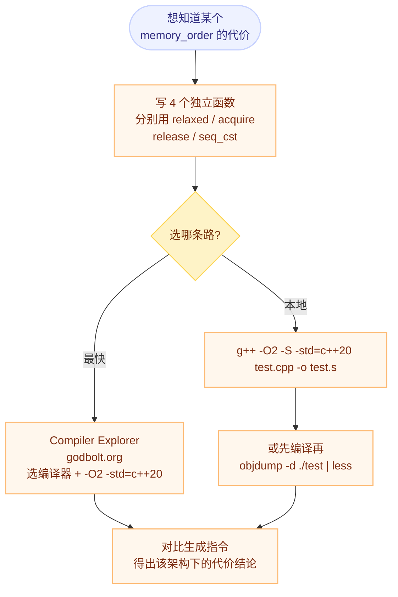

# 各架构的内存模型与屏障指令

> 前置：[以为的顺序不成立](./01-reordering-and-cache-coherence.md)（重排的三个来源）、[C++ 六种内存顺序全景](./02-six-memory-orders.md)（语义层）。

## 一句话理解

**内存顺序的语义是 C++ 标准定的，但它的代价是 CPU 架构定的。** 同一段 C++ 代码，在 x86 上可能一条指令都不多，到 ARM 上就要插入屏障，到 PowerPC 上代价再翻倍。

原因：**强内存模型把复杂度放进硬件，弱内存模型把复杂度交给编译器（和程序员）。**

## 为什么重要

这解释了三件在实际工程里会碰到的事：

1. **"在 x86 上测得好好的代码，移植到 ARM 就偶发崩溃"** —— 不是代码写错了，是 x86 帮你兜住了；
2. **"我把 `seq_cst` 改成 `acq_rel`，性能没变"** —— 你可能在 x86 上测的，两者的汇编完全相同；
3. **`std::atomic` 的开销无法脱离平台讨论** —— "原子操作很慢"这句话在 x86 和 ARM 上指的不是同一件事。

---

## 一、强度谱：四种重排，各架构允许哪些

现代 CPU 的乱序可以归纳成四种重排类型：

| 重排类型 | 含义 |
|---|---|
| LoadLoad | 后一个读越过前一个读 |
| LoadStore | 读越过后面的写 |
| StoreStore | 后一个写越过前一个写 |
| **StoreLoad** | 写越过后面的读（**最贵、最难消除的一种**） |

| 架构 | 模型 | LoadLoad | LoadStore | StoreStore | StoreLoad |
|---|---|---|---|---|---|
| **x86** | TSO（强） | 禁止 | 禁止 | 禁止 | **允许** |
| **ARM** | 弱 | 允许 | 允许 | 允许 | 允许 |
| **PowerPC** | 超弱 | 允许 | 允许 | 允许 | 允许 |

> **StoreLoad 是分水岭**：它是唯一一个"连 x86 都允许"的重排，也是 [Store Buffer](./01-reordering-and-cache-coherence.md) 直接造成的后果。所以全世界的架构里，**`seq_cst` 的 store 都是最贵的那条指令**，无一例外。
>
> ARM 与 PowerPC 的差别不在"允许哪些重排"（两者都全允许），而在**硬件提供的屏障粒度与强度**——见下文。

---

## 二、x86：TSO（Total Store Order）

### 2.1 语义

- **所有写操作对所有核心有全局顺序（总序）**；
- **读操作可能绕过尚未提交的写操作**（即允许 StoreLoad 重排）。

### 2.2 直接后果：除 `seq_cst` store 外，几乎不需要额外指令

| C++ 操作 | x86-64 典型生成 | 原因 |
|---|---|---|
| `relaxed` load | `mov` | — |
| `acquire` load | `mov`（**与 relaxed 相同**） | 硬件已禁止后续读被重排到本次读之前，编译器只要自己别乱排即可 |
| `seq_cst` load | `mov`（**与 acquire 相同**） | 同上：x86 的 load 天然带 acquire 语义 |
| `relaxed` store | `mov` | — |
| `release` store | `mov`（**与 relaxed 相同**） | 硬件已禁止前面的写被重排到本次写之后 |
| `seq_cst` store | `xchg`（隐含 `lock` 前缀）或 `mov` + `mfence` | **必须清空 Store Buffer**，这才是真正昂贵的地方 |
| RMW（`fetch_add` / `CAS` / `exchange`） | `lock xadd` / `lock cmpxchg` | `lock` 前缀自带 full barrier |

**结论：x86 上 `acquire` / `release` 是"免费的"，昂贵的是 `seq_cst` 的 store。** 这也解释了为什么在 x86 上做性能对比，往往看不出 `seq_cst` → `acq_rel` 的收益。

### 2.3 硬件屏障指令

| 指令 | 类型 | 作用 |
|---|---|---|
| `sfence` | 写屏障 | 把 Store Buffer 中的写刷入 Cache |
| `lfence` | 读屏障 | 保证之前的读指令全部完成（也用于序列化指令流） |
| `mfence` | 全屏障 | 兼具读写屏障功能，是 `seq_cst` store 的保底实现 |

---

## 三、ARM：弱内存模型

### 3.1 语义

- 硬件**不对内存访问顺序做任何保证**；
- 编译器可以自由重排；
- **一切靠显式插入屏障指令**。

### 3.2 屏障指令族（强度递减）

| 指令 | 全称 | 作用范围 |
|---|---|---|
| `DMB` | Data Memory Barrier | 对内存访问排序（**最常用**） |
| `DSB` | Data Synchronization Barrier | 等待所有内存访问**完成**（比 DMB 更重） |
| `ISB` | Instruction Synchronization Barrier | 刷新指令流水线（上下文切换、自修改代码等） |

`DMB` 还有四种**作用域**：

| 作用域 | 覆盖范围 |
|---|---|
| `DMB sy` | 系统域：所有核心 + DMA 设备 |
| `DMB ish` | 内部共享域（inner shareable）：同簇核心——**用户态多线程最合适** |
| `DMB nsh` | 非共享域：仅当前核心 |
| `DMB osh` | 外部共享域：系统内所有处理器 |

> 用户态多线程选 `DMB ish`：既覆盖所有可能访问同一内存的核心，又不为 DMA 等场景付额外代价。

### 3.3 ARMv8 的 load-acquire / store-release 指令

ARMv8-A 提供了两条把"访存 + 屏障"合并成一条的指令：

| 指令 | 语义 | 对应 C++ |
|---|---|---|
| `LDAR`（Load-Acquire） | 读 + acquire 屏障 | `memory_order_acquire` |
| `STLR`（Store-Release） | 写 + release 屏障 | `memory_order_release` |

两个容易踩的坑：

1. **`LDAR` / `STLR` 不是 ARMv8.1 才有的**，它们在 **ARMv8-A**（即 v8.0）就已定义。ARMv8.1 新增的是 **LSE（Large System Extensions）原子指令**——`LDADD` / `CAS` / `SWP` 等，作用是把原本需要 `LDXR`/`STXR` 循环实现的 RMW 变成**单条指令**，与 load-acquire 是两回事。ARMv8.3 又新增了 `LDAPR`（RCpc 语义的 load-acquire）。
2. **`STLR` 单独只给 release 语义，不足以实现 `seq_cst` store**。在 AArch64 上，`memory_order_seq_cst` 的 store 通常需要 `stlr` 之后再跟一条 `dmb ish`，这个额外屏障正是 ARM 上 `seq_cst` 明显更贵的来源。

### 3.4 与 x86 的对照

| C++ 操作 | x86-64 | AArch64（典型映射） |
|---|---|---|
| `relaxed` load / store | `mov` | `ldr` / `str`（**无屏障**） |
| `acquire` load | `mov` | `ldar` |
| `release` store | `mov` | `stlr` |
| `seq_cst` load | `mov` | `ldar`（视实现可能需要额外处理） |
| `seq_cst` store | `xchg` / `mov`+`mfence` | `stlr` + `dmb ish` |
| RMW | `lock` 前缀指令 | LSE 单指令，或无 LSE 时 `LDXR`/`STXR` 循环 + 屏障 |

> 这张表是"典型映射"。**具体指令随编译器与版本变化**，务必用下文的方法自己实测一遍再下结论。

---

## 四、PowerPC：超弱模型

PowerPC 允许**所有类型**的乱序：LoadLoad、LoadStore、StoreStore、StoreLoad 全部可重排。极端一点说，它甚至允许**一个核心看到自己写的值以不同顺序被其他核心观察到**。

### 4.1 三种基础屏障

| 指令 | 名称 | 作用 |
|---|---|---|
| `sync` | 全屏障 | 等待所有之前的内存操作完成（**最重**） |
| `lwsync` | Light-Weight Sync | 比 `sync` 弱、性能更好 |
| `isync` | Instruction Sync | 指令流同步（例如实现 acquire load 的"读-比较-跳转-`isync`"模式） |

### 4.2 `lwsync` 的关键限制

> **`lwsync` 提供 LoadLoad + StoreStore + LoadStore 排序，但不提供 StoreLoad 排序。**

这意味着 `lwsync` **不能**用来实现 `seq_cst`（因为 `seq_cst` 必须约束 StoreLoad），只够实现 acquire / release 一类的语义。**要实现全序必须用 `sync`。**

这条限制很有代表性：它说明"屏障"不是一个笼统的概念，**每种屏障各自约束哪几类重排是要查表的**——这一点只有实际写过弱内存模型平台代码的人才会形成肌肉记忆。

### 4.3 代价

- PowerPC 上**每个非 `relaxed` 操作都要显式屏障**；
- `seq_cst` 需要**两次全屏障**（`sync`），代价非常高。

---

## 五、怎么确认自己这段代码生成了什么

不要凭记忆猜。用"四个函数对照法"实测：



**被测代码模板**（关键是四个函数必须**不能被内联掉**）：

```cpp
#include <atomic>

std::atomic<int> x{0};

void test_relaxed() { x.store(1, std::memory_order_relaxed); }
void test_release() { x.store(1, std::memory_order_release); }
void test_seq_cst() { x.store(1, std::memory_order_seq_cst); }
```

**实用技巧**：

- 在 Compiler Explorer 里把编译器切到 **AArch64 GCC**，同一段代码立刻能看到 `stlr` / `dmb ish`，比查文档可靠；
- 函数可能被内联/消除，必要时加 `__attribute__((noinline))` 或把它们放到不同的翻译单元；
- 想对比的是**指令**，不是运行时间——测时间的坑见 [检测、验证与查看真实指令](./05-detection-and-tools.md)。

---

## 我的理解

- 这张"强度谱"背后是一条很朴素的工程取舍：**硬件能替你保证的，软件就不用管；硬件不管的，就得由屏障一条条补上。** x86 选择了"硬件多做、指令少写但晶体管多花"，ARM/PowerPC 选择了"硬件简单省电、把责任交出去"。所以**"同一段 C++ 在不同平台代价不同"不是实现缺陷，而是设计目标不同**。
- 我原来会把"屏障"当成一个笼统的强弱等级，这篇最有价值的一点是 **PowerPC 的 `lwsync` 反例**：它比 `sync` 弱，但**不是"整体弱一点"**，而是**明确缺了 StoreLoad 这一类**。这让我意识到屏障必须按"约束哪几类重排"来查表，而不是按"强/弱"排序。
- `seq_cst` store 在所有架构上都是最贵的，而原因在三个架构里是**同一个**：它必须处理 Store Buffer（x86 用 `mfence`/`xchg` 清空、ARM 用 `stlr` + `dmb ish` 补足、PowerPC 用 `sync`）。**这说明 StoreLoad 是所有内存模型的真正难点**——它牵涉到"我的写什么时候算数"这个本质上需要等待的问题。
- 实践上我会记住一条纪律：**性能结论必须标注架构**。在 x86 上说"`acq_rel` 比 `seq_cst` 快 3%"是没有意义的（汇编相同）。

## Related

- [以为的顺序不成立：编译器重排、CPU 乱序执行与缓存一致性](./01-reordering-and-cache-coherence.md) — Store Buffer 与 Invalidate Queue 的硬件来源
- [C++ 六种内存顺序全景](./02-six-memory-orders.md) — 语义层：六种顺序各自承诺什么
- [无锁实战：自旋锁、SPSC 队列与 RCU](./04-lock-free-patterns.md) — 在弱内存模型平台写同步原语的注意点
- [检测、验证与查看真实指令](./05-detection-and-tools.md) — 实测工具与调试方法
- [C++ 专题总览](./index.md) — 本专题的定位与学习路径

## References

- 微信公众号《看不见的执行顺序：C++内存顺序详解》，Lion 莱恩呀：<https://mp.weixin.qq.com/s/X3gnwfz0hsfWi8Z-BDKRFA>
- Paul E. McKenney, *Memory Barriers: a Hardware View for Software Hackers*：<http://www.puppetmastertrading.com/images/hwViewForSwHackers.pdf>（`lwsync` 语义、StoreLoad 与 Store Buffer 关系的经典出处）
- Hennessy & Patterson, *Computer Architecture: A Quantitative Approach* 第 5 章 — 内存一致性模型
- [Compiler Explorer](https://godbolt.org/) — 在线对比各架构生成的指令
- **对原文的两处更正**（本人核对）：① `LDAR` / `STLR` 自 ARMv8-A 起就存在，ARMv8.1 新增的是 LSE 原子指令（`LDADD` / `CAS` / `SWP`）；② ARMv8 的 `STLR`/`LDAR` 单独不足以保证全局序，`seq_cst` store 需要 `stlr` 之后追加 `dmb ish`。
