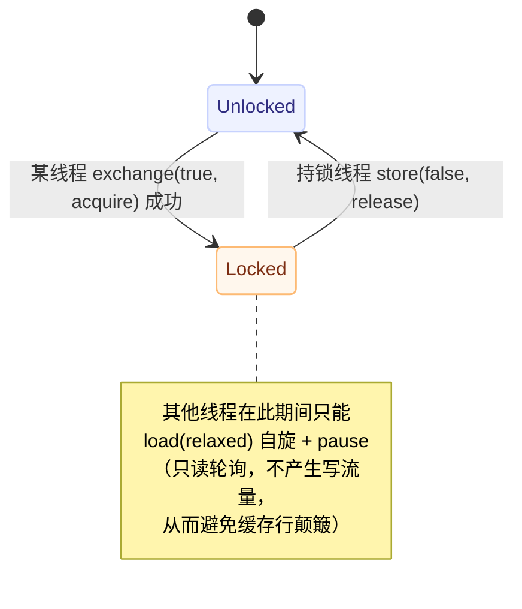
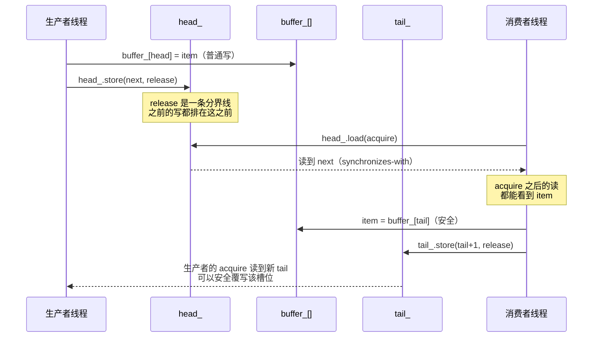

# 无锁实战：自旋锁、SPSC 环形队列与 RCU

> 前置：[C++ 六种内存顺序全景](./02-six-memory-orders.md)。本文只讲**每个原子变量该用哪个内存顺序、为什么**，以及每套代码里最容易写错的地方。

## 一句话理解

三种原语的难度是递增的，而它们的共同点是：**先想清楚"谁写这个变量、谁读这个变量"，再由数据流方向反推内存顺序**——而不是凭感觉加 `seq_cst`。

| 原语 | 写者数量 | 需要的同步原语 | 难度 |
|---|---|---|---|
| 自旋锁 | 多写者（争抢） | `exchange` / `CAS` + acquire/release | 低 |
| SPSC 环形队列 | **每端只有一个写者** | 纯 load/store + acquire/release，**不需要 CAS** | 中 |
| RCU | 单写者 + 任意多读者 | 原子指针 + 宽限期 | **高** |

---

## 一、自旋锁：从 TAS 到 TTAS

### 1.1 TAS（Test-And-Set）

```cpp
class SpinLock {
    std::atomic<bool> locked{false};
public:
    void lock() {
        while (locked.exchange(true, std::memory_order_acquire)) {
#if defined(__x86_64__) || defined(__i386__)
            __builtin_ia32_pause();   // x86 自旋提示
#endif
        }
    }

    void unlock() {
        locked.store(false, std::memory_order_release);
    }
};
```

**内存顺序的选择理由**（这是唯一需要推理的部分）：

| 操作 | 内存顺序 | 为什么 |
|---|---|---|
| `lock()` 的 `exchange` | `acquire` | 它是一个 RMW，既读又写，但**只需要 acquire 语义**：要看到上一个持锁者在 `unlock` 之前写的所有数据。**不需要 release**——本线程还没进临界区，没有东西要发布 |
| `unlock()` 的 `store` | `release` | 把本线程在临界区内写的所有数据发布出去 |

> 用 `acq_rel` 或 `seq_cst` 也能跑对，但会引入**不必要的开销**（见 [各架构的屏障指令](./03-barriers-by-architecture.md)：在 ARM 上 `seq_cst` 需要 `dmb.sy`，比 `acq_rel` 的一对 `dmb` 更贵）。

### 1.2 TAS 的严重问题：缓存行颠簸

**每次循环都执行 `exchange`，这是一个写操作。** 所有等待中的核心反复抢同一条缓存行：

- 每次写都要把该行置为 `Modified` → 其他核心的副本全部失效；
- 其他核心的下一轮 `exchange` 又要抢回该行；
- 结果是一条缓存线在核心之间**来回弹跳（cache line bouncing）**，争抢越激烈越慢。

### 1.3 TTAS（Test-Test-And-Set）：先读再写

```cpp
class TTASSpinLock {
    std::atomic<bool> locked{false};
public:
    void lock() {
        while (true) {
            // 第一阶段：只读自旋，不产生任何缓存行写流量
            while (locked.load(std::memory_order_relaxed)) {
#if defined(__x86_64__) || defined(__i386__)
                __builtin_ia32_pause();
#endif
            }
            // 第二阶段：看起来可用，才尝试抢占
            if (!locked.exchange(true, std::memory_order_acquire)) {
                return;
            }
        }
    }

    void unlock() {
        locked.store(false, std::memory_order_release);
    }
};
```

**两个关键设计点**：

1. **外层 `load` 用 `relaxed`**：它只是"偷看"一下锁是否还锁着。这里不需要 acquire——因为**`exchange` 成功时已经带了 acquire**，真正的同步发生在那一刻。这里用 `relaxed` 是为了让自旋阶段完全不产生屏障和写流量。
2. **`exchange` 用 `acquire`**：这才是真正"拿锁"的动作，必须看到临界区的数据。

### 1.4 `pause` 指令的作用

| 作用 | 说明 |
|---|---|
| 降低功耗 | 告诉 CPU 这是自旋等待 |
| 减少内存序冲突 | 避免流水线在循环中反复预测失败退出 |
| **让出 SMT 资源** | 在超线程 CPU 上，自旋的核会把执行单元让给兄弟核 |

> `pause` 在 Skylake 等较新微架构上延迟被显著拉长（约 100+ 周期），这实际上是**故意的**——就是为了减少自旋带来的总线压力。

### 1.5 自旋锁状态机



> ⚠️ 这个简化模块**不含退让/排队机制**：在超订（线程数 > 核数）场景下，一个被抢占的持锁线程会让所有自旋线程白烧 CPU。生产代码请优先用 `std::mutex`（它在进入内核前也会自旋），或专门的排队锁。

---

## 二、SPSC 无锁环形队列

### 2.1 为什么能这么简单

**单生产者、单消费者**意味着：

- `head_` **只有生产者写**；
- `tail_` **只有消费者写**。

既然每个变量只有一个写者，就**不需要 CAS**——单调递增 + 回绕即可，全部用 `load` / `store` 实现。

```cpp
template<typename T, size_t Capacity>
class SPSCQueue {
    static_assert(Capacity > 0, "Capacity must be positive");
    static_assert((Capacity & (Capacity - 1)) == 0, "Capacity must be power of 2");

    alignas(64) std::atomic<size_t> head_{0};
    alignas(64) std::atomic<size_t> tail_{0};
    alignas(64) T buffer_[Capacity];
    size_t mask_ = Capacity - 1;

public:
    bool try_push(const T& item) {
        const size_t head = head_.load(std::memory_order_relaxed);   // 自己写的，relaxed 足够
        const size_t tail = tail_.load(std::memory_order_acquire);   // 要看到消费者的最新进度
        const size_t next_head = (head + 1) & mask_;

        if (next_head == tail) return false;   // 满：牺牲一个槽位来区分"满"和"空"

        buffer_[head] = item;                                     // 普通写，靠下面的 release 发布
        head_.store(next_head, std::memory_order_release);        // 发布这个 item
        return true;
    }

    bool try_pop(T& item) {
        const size_t tail = tail_.load(std::memory_order_relaxed);   // 自己写的，relaxed 足够
        const size_t head = head_.load(std::memory_order_acquire);   // 要看到生产者的最新进度

        if (tail == head) return false;   // 空

        item = buffer_[tail];                                     // 普通读
        tail_.store((tail + 1) & mask_, std::memory_order_release); // 发布"槽位已释放"
        return true;
    }
};
```

### 2.2 内存顺序逐行推理

这是本文最值得记住的部分——**每个 `relaxed` / `acquire` / `release` 都有明确理由**：

| 位置 | 顺序 | 为什么 |
|---|---|---|
| `try_push` 读 `head_` | `relaxed` | 生产者是 `head_` 的唯一写者，读到自己上次写的值即可，无需跨线程顺序 |
| `try_push` 读 `tail_` | `acquire` | 要看到消费者的最新进度。消费者的 `tail_.store(release)` 与这里的 acquire 配对 |
| `try_push` 写 `head_` | `release` | **发布 `buffer_[head] = item` 这次普通写**——消费者 acquire 读 `head_` 之后才能安全读该槽位 |
| `try_pop` 读 `tail_` | `relaxed` | 消费者是 `tail_` 的唯一写者 |
| `try_pop` 读 `head_` | `acquire` | 要看到生产者的最新进度，与生产者的 release 配对 |
| `try_pop` 写 `tail_` | `release` | **发布"我已经读完这个槽位"**——防止生产者过早覆写。release 会把之前对 `buffer_[tail]` 的**读**也排到 store 之前 |

### 2.3 两个容易漏掉的工程细节

**① `alignas(64)` 避免伪共享（false sharing）**

`head_` 由生产者写、`tail_` 由消费者写。如果它们落在**同一条缓存行**里，每次一方写都会让另一方的缓存行失效 —— 两个核互相拖慢，性能可能比单线程还差。

用 `alignas(64)` 把它们分到不同缓存行。**64 是 x86 / 多数 ARM 的缓存行大小**（个别架构为 128），跨平台代码可用 `std::hardware_destructive_interference_size`。

**② 容量必须是 2 的幂**

用 `(idx + 1) & mask_` 代替 `% Capacity`。取模是除法，在热路径上是实打实的开销。

**③ 牺牲一个槽位**

`next_head == tail` 判"满"，意味着容量为 N 的队列实际只能存 **N−1** 个元素。这是为了不额外引入一个 `size_` 计数器（那会变成第二个共享写点，破坏单写者前提）。

### 2.4 release / acquire 建立的 happens-before 链



---

## 三、RCU（Read-Copy-Update）

### 3.1 思想

RCU 是 Linux 内核里最重要的同步机制之一。核心思路是**把"修改"变成"替换"**，从而让读者**完全不用加锁**：

| 步骤 | 动作 |
|---|---|
| 1 | 写者创建一个**新副本**，在副本上做修改（此时旧数据仍对所有读者可用） |
| 2 | 写者用**原子指针交换**把旧指针换成新指针 |
| 3 | 写者**等待所有正在读旧数据的读者完成**（这段时间叫**宽限期 / grace period**） |
| 4 | 宽限期结束后，才释放旧数据 |

**关键收益**：读者的代价几乎为零——通常只是"一次原子 load + 进入临界区标记"，没有任何写、没有 CAS、不阻塞、不在读者之间争用缓存行。

### 3.2 简化实现（教学用）

```cpp
template<typename T>
class RCUProtected {
    struct Node {
        T data;
        std::atomic<int> readers{0};
        Node(const T& d) : data(d), readers(0) {}
    };

    std::atomic<Node*> current_;

public:
    explicit RCUProtected(const T& initial) : current_(new Node(initial)) {}

    class ReadGuard {
        Node* node_;
    public:
        explicit ReadGuard(RCUProtected& rcu) {
            node_ = rcu.current_.load(std::memory_order_acquire);      // 读侧：一次 acquire load
            node_->readers.fetch_add(1, std::memory_order_relaxed);
        }
        const T& operator*()  const { return node_->data;  }
        const T* operator->() const { return &node_->data; }
        ~ReadGuard() {
            node_->readers.fetch_sub(1, std::memory_order_release);    // 声明"我读完了"
        }
    };

    ReadGuard read() { return ReadGuard(*this); }

    void update(const T& new_data) {
        Node* new_node = new Node(new_data);
        Node* old_node = current_.load(std::memory_order_relaxed);

        current_.store(new_node, std::memory_order_release);           // 发布新副本

        while (old_node->readers.load(std::memory_order_acquire) > 0) { // 等宽限期结束
            std::this_thread::yield();
        }
        delete old_node;                                               // 此时才释放旧数据
    }
};
```

**内存顺序要点**：

- 读者 `current_.load(acquire)` ↔ 写者 `current_.store(release)`：保证读者看到新指针后，**新副本的内容也可见**；
- 写者等待 `readers` 归零时用 `acquire`：确保看到各读者 `fetch_sub(release)` 的结果。

### 3.3 ⚠️ 这个简化版有两个真实的不安全点

**这非常重要**——RCU 是"看起来简单、实现极难"的典型。上面的代码**不能用于生产**：

**① 读者登记存在竞态（use-after-free）**

`ReadGuard` 是"先 load 指针，再 `fetch_add` 计数"。在这两步之间，写者可能已经完成了交换、发现 `readers == 0`、并 `delete` 掉旧节点。读者接下来对一个**已释放对象**做 `fetch_add` → 访问已释放内存。

真实 RCU 不用"逐节点读者计数"，而用**静默状态（quiescent state）**来判定宽限期：只要能确认所有 CPU 都已发生过一次上下文切换/系统调用/空闲，就说明没有读者仍持有旧引用。用户态实现常用 QSBR（Quiescent State Based Reclamation）。

**② 写者之间没有互斥**

上面的 `update()` 省掉了原文章里的 `global_lock_`。真实场景下并发写者需要额外的序列化机制（或者约定"RCU 只保护读侧，写侧仍用锁"）。

> 生产建议：用户态直接用成熟实现（如 `liburcu`），不要手写。

---

## 四、模式速查表（本文核心收获）

**从"谁写"反推"用什么顺序"**：

| 模式 | 原子变量 | 写侧 | 读侧 | 本质 |
|---|---|---|---|---|
| 自旋锁 加锁 | `locked_` | `exchange(true, acquire)` | — | 读旧状态 + 获得临界区可见性 |
| 自旋锁 解锁 | `locked_` | `store(false, release)` | — | 发布临界区内的写 |
| 自旋锁 自旋 | `locked_` | — | `load(relaxed)` | 只偷看，不参与同步 |
| SPSC `head_` | 生产者唯一写 | `store(release)` | 生产者 `relaxed` / 消费者 `acquire` | 发布新元素 |
| SPSC `tail_` | 消费者唯一写 | `store(release)` | 消费者 `relaxed` / 生产者 `acquire` | 发布"槽位已释放" |
| RCU 指针 | 写者唯一写 | `store(release)` | `load(acquire)` | 发布新副本 |

**两条通用规律**：

1. **"自己写、自己读"的变量用 `relaxed`**（不需要跨线程顺序）；
2. **"给别人读"的写用 `release`，"读别人写的"的读用 `acquire`**。

---

## 我的理解

- 三种原语让我看到同一条主线：**并发设计的核心不是"哪里加锁"，而是"谁是写者"**。SPSC 之所以能用最简单的 `relaxed` + 一对 acquire/release 完成，纯粹是因为它把写者数量压到了 1；RCU 之所以读者免费，是因为它让读者**永远不写**。**只要能消灭写者争用，就不需要 CAS。**
- TTAS 的启发是"**读写分离的优化**"：把"探测"和"抢占"拆成两个阶段，探测阶段完全不产生写流量。这个思路在别处也反复出现（例如乐观并发控制里的"先读校验再提交"）。
- `alignas(64)` 这条我以前会当成"玄学优化"，现在能说清机理了：**伪共享的代价不是"多几次内存访问"，而是两个核互相让对方的缓存行失效**——它在缓存一致性协议层面制造了跨核的乒乓，跟访存次数无关。
- 最反直觉的是 RCU 那两行风险标注：**这段代码看起来非常干净，读者侧确实"零开销"，但它有一个真实的 use-after-free**。这让我意识到"无锁"不等于"简单"——**RCU 的复杂度从"加锁"转移到了"何时可以安全释放内存"**，而后者更难验证。
- 一个可以复用的判断法：**先把每个原子变量的"唯一写者"标出来，用不了这一条的设计（比如多写者计数器）就必须引入 CAS 或锁。**

## Related

- [C++ 六种内存顺序全景](./02-six-memory-orders.md) — 各顺序的完整语义与选择决策树
- [以为的顺序不成立：编译器重排、CPU 乱序执行与缓存一致性](./01-reordering-and-cache-coherence.md) — 伪共享与缓存行的硬件背景
- [各架构的内存模型与屏障指令](./03-barriers-by-architecture.md) — 这些原语在 ARM / PowerPC 上要多付什么
- [检测、验证与查看真实指令](./05-detection-and-tools.md) — 怎么验证自己写对了
- [一致性、共识与故障恢复](../../distributed-systems/distributed-storage/consistency-consensus-failure.md) — 单机内存顺序 vs 分布式一致性的跨层对照
- [C++ 专题总览](./index.md) — 本专题的定位与学习路径

## References

- 微信公众号《看不见的执行顺序：C++内存顺序详解》，Lion 莱恩呀：<https://mp.weixin.qq.com/s/X3gnwfz0hsfWi8Z-BDKRFA>
- Paul E. McKenney, *Is Parallel Programming Hard, And, If So, What Can You Do About It?* — RCU 与宽限期的权威参考
- [liburcu](https://liburcu.org/) — 用户态 RCU 的成熟实现
- 本笔记相对原文的补充：删去 benchmark 脚手架、给每处内存顺序补上推理理由、TTAS 两阶段设计的动机、SPSC 的伪共享与 2 的幂取模细节、RCU 简化版的两处不安全点（读者登记竞态与写者互斥），为本人整理。
