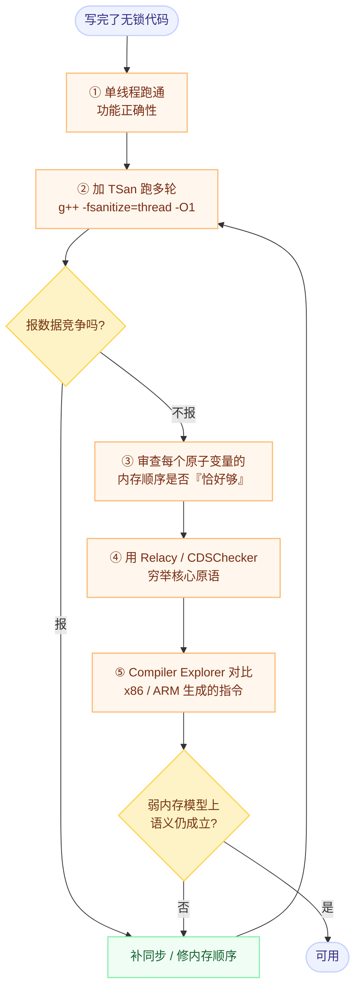

# 检测、验证与查看真实指令

> 前置：[C++ 六种内存顺序全景](./02-six-memory-orders.md)、[无锁实战](./04-lock-free-patterns.md)。

## 一句话理解

内存顺序错误**出了名的难复现**——它依赖架构、编译器版本、线程交错时序。所以"靠观察程序行为来判断对不对"这条路基本走不通，必须换三件工具：

| 手段 | 回答什么问题 | 能力边界 |
|---|---|---|
| **ThreadSanitizer（TSan）** | 有没有**数据竞争**（遗漏的同步） | **不检查内存顺序选得对不对** |
| **形式化验证**（CDSChecker / Relacy） | 在所有合法执行下，这个内存顺序组合是否都正确 | 需要专门改写成可枚举的形式 |
| **Compiler Explorer / `objdump`** | 我这段代码实际生成什么指令 | 只看代码，不看运行行为 |

---

## 一、ThreadSanitizer（TSan）

目前最强大的动态检测工具，基于 **happens-before** 关系工作。

### 1.1 能检测什么

- **数据竞争**（data race）：两个线程并发访问同一内存位置，至少一个写，且之间没有 happens-before 关系；
- 不正确的原子操作使用（部分）；
- 缺失的同步。

### 1.2 怎么用

```bash
# 编译：必须带 -g -fsanitize=thread
g++ -fsanitize=thread -g -O1 -std=c++20 test.cpp -o test
./test
```

**实用建议**：

- 用 **`-O1`** 而不是 `-O2`/`-O0`：`-O0` 会掩盖编译器重排类的问题，`-O2` 会让行号信息失真；
- 不要与其他 sanitizer 混用（如 `-fsanitize=address,thread` 不兼容）；
- 通常需要 `-fPIE -pie`（部分平台）。
- 线程数越多、运行轮次越多越容易命中。

### 1.3 ⚠️ 能力边界（最重要的一条）

> **TSan 检测的是"数据竞争"，不是"内存顺序正确性"。**

具体表现：

- 用 `relaxed` 构建同步原语（比如 `relaxed` 的锁）——代码是**错的**，但 TSan **不会报错**。因为所有访问都是原子的，不存在 data race；
- 反过来，TSan 报出的竞争**只覆盖实际执行到的路径**，没跑到的交错就检测不到；
- TSan 有明确的运行时开销（CPU 约 5–15×、内存约 5–10×），因此不适合在生产环境常开。

**所以 TSan 能回答"我有没有漏掉同步"，但不能回答"我选的 `memory_order` 对不对"。** 后者要靠 happens-before 推理 + 形式化工具。

---

## 二、形式化验证工具

这类工具会**枚举** C++11 内存模型下所有合法的执行，穷举线程交错与重排组合，因此能发现"在这个架构上碰巧正常、在那个架构上会错"的问题。

| 工具 | 特点 |
|---|---|
| **CDSChecker** | 针对 C11/C++11 原子操作的模型检查器，专门验证内存顺序组合 |
| **Relacy Race Detector** | 把代码改写成可被调度的形式，穷举交错与内存重排 |

**代价**：需要把代码适配成工具要求的写法（替换线程/原子原语的封装），且有状态爆炸问题（交错数随线程数和操作数指数增长），**只适合验证小的核心原语**——比如一个 SPSC 队列的 `try_push` / `try_pop`，而不是整个程序。

**这也说明了一条实践路径**：把无锁代码**隔离成尽量小的、可单独验证的核心**，再用形式化工具穷举。

---

## 三、查看真实生成的指令

不要在脑子里推演汇编，直接看。

### 3.1 Compiler Explorer（godbolt.org）

最方便的工具，尤其是**跨架构对比**——同一段代码切到 AArch64 / PowerPC 立刻就能看到差异。

用法：

1. 打开 <https://godbolt.org/>；
2. 选择编译器（如 `x86-64 gcc 13`、`ARM64 gcc 13`）；
3. 加上 `-O2 -std=c++20`；
4. 输入代码，看右侧汇编。

### 3.2 本地查看

```bash
# 直接生成汇编
g++ -O2 -S -std=c++20 test.cpp -o test.s

# 或者先编译再反汇编
g++ -O2 -std=c++20 test.cpp -o test
objdump -d ./test | less
```

### 3.3 对照模板（四个函数法）

```cpp
#include <atomic>

std::atomic<int> x{0};

void test_relaxed() { x.store(1, std::memory_order_relaxed); }
void test_release() { x.store(1, std::memory_order_release); }
void test_seq_cst() { x.store(1, std::memory_order_seq_cst); }
```

**预期结论（x86-64）**：`relaxed` 与 `release` 都是 `mov`；`seq_cst` 是 `xchg` 或 `mov` + `mfence`。详细对照见 [各架构的内存顺序与屏障指令](./03-barriers-by-architecture.md)。

**两个坑**：

- 函数可能被**内联**，或被优化成一条空指令 → 加 `__attribute__((noinline))`，或分散到不同翻译单元；
- `-O0` 下的汇编没有参考价值（编译器重排没发生）。

### 3.4 性能测量的正确姿势

想测"不同 `memory_order` 的代价"，微基准本身很容易测错：

```cpp
template <std::memory_order Order>
void benchmark_store() {
    std::atomic<int> x{0};
    const int N = 100'000'000;

    auto start = std::chrono::steady_clock::now();
    for (int i = 0; i < N; ++i) {
        x.store(i, Order);      // 原子 store 不会被优化掉
    }
    auto end = std::chrono::steady_clock::now();
    // 注意用编译器屏障或 atomic_signal_fence 防止循环被过度优化
}
```

**四条纪律**：

1. **单线程测出的是"指令代价"，不是"一致性代价"。** `seq_cst` 真正贵的地方（清空 Store Buffer、等待 ACK）只在**多核争抢**时才显现。要测一致性代价，必须让多个核心争抢同一缓存行。
2. **必须标注架构。** 在 x86 上 `acq_rel` 和 `seq_cst` 汇编相同，测出"没有差别"是**正确结果**，不是测错了。
3. **要 warmup + 固定频率。** 第一次运行包含频率爬升、页表预热、分支预测器冷启动。
4. **尽量绑核（`taskset` / `sched_setaffinity`）**，否则测量噪声可能大于你要测的效应。

---

## 四、把三类工具组合成流程



**这条流程的关键是第 ③ 步在 TSan 之后**：TSan 说"没有竞争"不代表"顺序选对了"，必须人工（或借助形式化工具）再过一遍每个原子变量的选择理由。

---

## 五、一个务实的降级流程

结合 [六种内存顺序](./02-six-memory-orders.md) 的建议：

1. **先全部用 `seq_cst`**，跑通 + TSan 干净；
2. **profiler 找到真正的热点**（不要凭感觉降级）；
3. **只对热点的原子操作降级**，按决策树选 `acquire` / `release` / `acq_rel` / `relaxed`；
4. **回到第 ③ 步重新做 happens-before 推理**，并在目标架构上实测指令；
5. 记录这次降级"为什么安全"——否则半年后没人敢动这段代码。

---

## 我的理解

- 这三类工具的定位其实构成了一个互补三角形：**TSan 管"有没有漏同步"、形式化工具管"顺序选对没有"、Compiler Explorer 管"代价是多少"**。我以前容易把它们混成"测并发 bug 的工具"，实际上它们回答的是三个不同的问题，**缺任何一个都会留下盲区**。
- 最值得记住的一条是 **TSan 检不出 `relaxed` 锁**。这打破了我"有 sanitizer 兜底就不怕"的假设：**原子操作之间的顺序错误在语言层面不是"竞争"，因此工具没有理由报它**。所以"用了 `std::atomic` 就安全"是一个双重错误——第一重是原子性不等于线程安全，第二重是工具也帮不了你。
- `-O0` 下看汇编没意义、`-O0` 下测并发也掩盖问题——这两件事是同一条道理：**编译器的重排是问题的一部分，把它关掉就等于把问题关掉了**。所以我以后测/看并发代码会固定用 `-O1`/`-O2`。
- 最有工程价值的是最后那个"降级流程"：它把一件很抽象的事（内存顺序选型）变成了有明确检查和回退点的流程。**特别是"记录为什么安全"这一步**——内存顺序代码的最大风险从来不是写错，而是**后人不敢改**。

## Related

- [C++ 六种内存顺序全景](./02-six-memory-orders.md) — 第 ③ 步要审查的对象
- [无锁实战：自旋锁、SPSC 队列与 RCU](./04-lock-free-patterns.md) — 最适合拿来做形式化验证的小核心
- [各架构的内存模型与屏障指令](./03-barriers-by-architecture.md) — Compiler Explorer 里该对比哪些指令
- [以为的顺序不成立：编译器重排、CPU 乱序执行与缓存一致性](./01-reordering-and-cache-coherence.md) — 为什么"多跑几遍看看"不管用
- [C++ 专题总览](./index.md) — 本专题的定位与学习路径

## References

- 微信公众号《看不见的执行顺序：C++内存顺序详解》，Lion 莱恩呀：<https://mp.weixin.qq.com/s/X3gnwfz0hsfWi8Z-BDKRFA>
- [ThreadSanitizer 文档](https://clang.llvm.org/docs/ThreadSanitizer.html)
- [CDSChecker](https://github.com/computersforpeace/model-checker) — C11/C++11 原子操作的模型检查器
- [Relacy Race Detector](https://github.com/dvyukov/relacy)
- [Compiler Explorer](https://godbolt.org/)
- 本笔记相对原文的补充：三类工具的能力边界对照、"TSan 检不出 `relaxed` 锁"这一盲区、微基准的四条纪律（单线程测不到一致性代价）、以及组合成流程图的完整验证路径，为本人整理。
