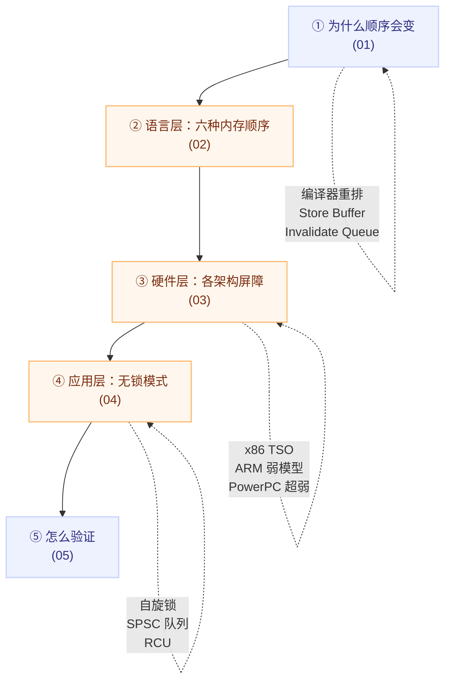

# C++ 内存顺序专题：从重排来源到无锁实战

## 一句话理解

`std::atomic` 解决的是**原子性**，`memory_order` 解决的是**可见性**与**有序性**——两者是三件不同的事：

```text
原子性  std::atomic          → 这次读写不会撕裂
可见性  release / acquire    → 我写的，别人什么时候能看到
有序性  seq_cst / 屏障       → 多个内存操作之间能不能被重排
```

**日常 bug 大多不是"原子性没做对"，而是"以为做了原子操作就顺带解决了可见性"。**

## 为什么单独建这个专题

C++ 内存顺序是"**语法只有五六个字、语义要读一章标准、错误还极难复现**"的典型：

1. **错误不可见**：在 x86 上写错的代码往往"看起来完全正常"，到 ARM 上才偶发崩溃；
2. **工具帮不上关键的一把**：[TSan](./05-detection-and-tools.md) 只能检测数据竞争，**检测不出内存顺序选错**；
3. **细节极易忘**：哪种屏障约束哪几类重排、`seq_cst` 在各架构上贵多少，都属于"查一次用一次"的知识，值得沉淀成速查表。

另外它和本仓库已有的两个主题形成有趣的跨层对照：

- [分布式存储的一致性、共识与故障恢复](../../distributed-systems/distributed-storage/consistency-consensus-failure.md)：多机之间的"顺序一致性 / 线性一致性"与单机内存顺序**同名但不同层**，对照着看能避免概念混淆；
- **GPU 侧也有同类问题**（CUDA 的弱内存模型与 `__threadfence()`）：本仓库目前没有专门笔记，属于待补的知识缺口。

## 全景图



## 速查表：六种内存顺序

| 内存顺序 | 保证什么 | 相对代价 | 典型用法 |
|---|---|---|---|
| `relaxed` | 只有原子性（含单对象修改顺序一致） | 最快 | 计数器、独立标志位 |
| `consume` | 数据依赖链（**已弃用**，P3475R2 对齐到 `acquire`） | — | **不要用**，用 `acquire` 代替 |
| `acquire` | 读到 release 之前的**所有**写入 | 较低 | 订阅数据 |
| `release` | 之前的**所有**写入对其他 acquire 可见 | 较低 | 发布数据 |
| `acq_rel` | acquire + release | 中等 | RMW：自旋锁、队列指针推进 |
| `seq_cst` | 全局单一顺序 | 最慢 | Peterson 锁、复杂无锁结构 |

**两条通用规律**（推理时反复用）：

1. **"自己写、自己读"的变量 → `relaxed`**（不需要跨线程顺序）；
2. **"给别人读"的写 → `release`；"读别人写的"的读 → `acquire`**。

> 默认值是 `seq_cst`——最贵的那一档。选型决策树见 [02 笔记](./02-six-memory-orders.md)。

## 学习路径


**如果只有 10 分钟**：直接读 [02 的速查表与决策树](./02-six-memory-orders.md)，遇到"为什么"再回头看 01 和 03。

## 本专题笔记

| # | 笔记 | 解决什么 |
|---|---|---|
| 01 | [以为的顺序不成立：编译器重排、CPU 乱序执行与缓存一致性](./01-reordering-and-cache-coherence.md) | 为什么需要内存顺序：三层"看不见的执行顺序"、`volatile` 为什么没用 |
| 02 | [C++ 六种内存顺序全景](./02-six-memory-orders.md) | `relaxed / acquire / release / acq_rel / seq_cst / consume` 的语义、选择决策树与误用清单 |
| 03 | [各架构的内存模型与屏障指令](./03-barriers-by-architecture.md) | x86 TSO / ARM / PowerPC；同一段 C++ 各生成什么指令；怎么实测 |
| 04 | [无锁实战：自旋锁、SPSC 环形队列与 RCU](./04-lock-free-patterns.md) | 三套原语的内存顺序逐行推理、伪共享、RCU 简化版的两处不安全点 |
| 05 | [检测、验证与查看真实指令](./05-detection-and-tools.md) | TSan / Relacy / CDSChecker / Compiler Explorer 的能力边界与组合流程 |

## 五条最该记住的结论

1. **"写入的生效顺序" ≠ "代码的执行顺序"**，原因是编译器重排 + Store Buffer + Invalidate Queue 三层叠加。
2. **`volatile` 对多线程没用**：它只保证单个对象的访问顺序，建立不了跨线程的 happens-before。
3. **原子操作 ≠ 线程安全**：`relaxed` 的锁能原子地设置标志，但临界区内外的数据不可见。
4. **`acquire` / `release` 必须在同一个原子变量上成对使用**，否则不构成 synchronizes-with。
5. **性能结论必须标注架构**：x86 上 `acq_rel` 与 `seq_cst` 汇编相同，"改成 `acq_rel` 更快"在 x86 上测不出来。

## Related

- [一致性、共识与故障恢复](../../distributed-systems/distributed-storage/consistency-consensus-failure.md) — 分布式一致性 vs 单机内存顺序的跨层对照
- [Engineering](../) — 工程主题入口
- [C++ 内存顺序详解（原文）](https://mp.weixin.qq.com/s/X3gnwfz0hsfWi8Z-BDKRFA) — 本专题的起点

## References

- 微信公众号《看不见的执行顺序：C++内存顺序详解》，Lion 莱恩呀：<https://mp.weixin.qq.com/s/X3gnwfz0hsfWi8Z-BDKRFA>
- [cppreference: `std::memory_order`](https://en.cppreference.com/w/cpp/atomic/memory_order)
- C++ 标准草案 [\[atomics.order\]](http://eel.is/c++draft/atomics.order)；WG21 [N3716](http://www.open-std.org/jtc1/sc22/wg21/docs/papers/2013/n3716.html)
- Anthony Williams, *C++ Concurrency in Action*（第 2 版）第 5 章
- Paul E. McKenney, *Is Parallel Programming Hard, And, If So, What Can You Do About It?*
- Hennessy & Patterson, *Computer Architecture: A Quantitative Approach* 第 5 章
- 本专题相对原文的变化：拆成 5 篇原子笔记 + 本总览；补充 `relaxed` 的单对象修改顺序保证、`acq_rel` 与 `seq_cst` 的架构差异、SPSC 伪共享与取模细节、RCU 简化版的两处不安全点、工具能力边界；更正原文两处 ARMv8 表述（见 [03 笔记](./03-barriers-by-architecture.md)）。
