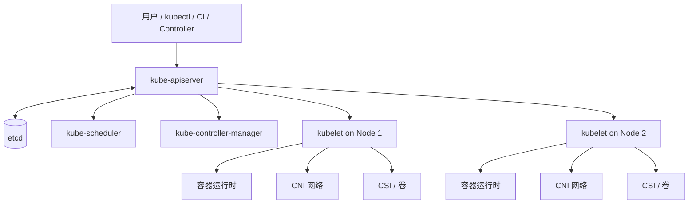

# Kubernetes 02：集群架构与声明式控制循环

## 一句话理解

> Kubernetes 是一个以 API Server 为中心、以 etcd 保存状态、以多个控制器不断调谐（reconcile）实际世界的控制系统。

## 集群由什么组成



### 控制平面

- **kube-apiserver**：所有组件访问 Kubernetes 状态的统一 HTTP API 入口，负责认证、授权、准入和对象持久化协调；
- **etcd**：一致性的键值存储，保存 Kubernetes 控制面状态；它不是业务数据库，也不直接运行 Pod；
- **kube-scheduler**：为尚未绑定节点的 Pod 选择合适节点；它做的是决策，不负责启动容器；
- **kube-controller-manager**：运行多个控制器，例如 Node、Job、Deployment/ReplicaSet 相关控制逻辑；
- **cloud-controller-manager**：在云环境中把节点、负载均衡和路由等云资源接入控制循环，可选。

### 工作节点

- **kubelet**：节点代理，观察被分配到本节点的 Pod，调用容器运行时并报告状态；
- **容器运行时**：通过 CRI 接口拉取镜像、创建/启动/停止容器；
- **kube-proxy 或等价实现**：协助实现 Service 流量转发（具体实现取决于集群网络方案）；
- **CNI 插件**：负责 Pod 网络接口、地址、路由和网络策略等；
- **CSI 插件**：把卷的创建、挂载和卸载接到外部存储系统。

## 声明式与命令式

命令式思维是：「现在执行创建三个容器」。声明式思维是：「系统应当有三个可用副本」。Kubernetes 更偏向后者：对象的 `spec` 表达目标，控制器根据当前 `status` 推进系统。

```text
期望状态 spec ─┐
               ├─ Controller reconcile → 创建 / 更新 / 删除资源
实际状态 status ┘                         ↑
               ←──── API Server / kubelet / 事件反馈 ────
```

控制循环并不只运行一次。节点重启、镜像失败、Pod 被驱逐、网络短暂中断后，控制器仍会再次观察和调谐。这种「持续纠偏」是 Kubernetes 自愈能力的来源。

## 一个 Deployment 的简化链路

1. 用户向 API Server 提交 Deployment；
2. API Server 校验请求并将对象写入 etcd；
3. Deployment 控制器观察到对象，创建/更新 ReplicaSet；
4. ReplicaSet 控制器确保 Pod 数量符合副本数；
5. Scheduler 为 Pending Pod 选择节点并写入绑定结果；
6. 节点 kubelet 观察到分配给自己的 Pod，调用容器运行时；
7. CNI 配置网络，镜像被拉取，容器启动；
8. kubelet 把 Pod 状态、探针结果等回报 API Server；
9. Service、Ingress、HPA 等其他控制器根据状态继续工作。

```text
Deployment → ReplicaSet → Pod → Scheduler binding → kubelet → runtime
     ↑                                                   ↓
     └────────────── status / events / probes ───────────┘
```

## API Server 为什么是中心

组件之间通常不直接互相调用来共享状态，而是通过 API Server 读写 API 对象。这样可以统一：

- 认证（你是谁）；
- 授权（你能做什么）；
- 准入（请求是否符合策略）；
- 版本转换和默认值；
- 观察机制（watch）和事件传播。

`kubectl` 只是调用这个 API 的一个客户端。控制器、Operator 和 CI 也可以使用同一套 API。

## Node 与 Namespace 的区别

| 概念 | 维度 | 用途 |
|---|---|---|
| Node | 物理/虚拟机器 | 提供 CPU、内存、网络和存储，运行 Pod |
| Namespace | API 对象的逻辑边界 | 隔离名称、权限、配额和团队/环境 |
| Cluster | 所有控制面与节点的整体 | 提供一套 Kubernetes API 和控制循环 |

Namespace 不是虚拟机，也不是强安全边界。集群级资源（如 Node、PersistentVolume、ClusterRole）不属于普通 Namespace；跨命名空间网络访问还要看 Service DNS 和 NetworkPolicy。

## Container Runtime Interface（CRI）

Kubelet 不应直接依赖某一种容器实现，而是通过 CRI 与运行时交互。典型路径是：

```text
kubelet → CRI → containerd / CRI-O → OCI runtime（如 runc）→ Linux 进程
```

同理，CNI 和 CSI 以插件接口连接网络与存储生态。接口化让 Kubernetes 控制面不必实现每一种云厂商网络、磁盘或容器运行时。

## 学习时如何观察架构

```bash
kubectl get nodes -o wide
kubectl get pods -A
kubectl get --raw='/readyz?verbose'
kubectl get events --all-namespaces --sort-by=.lastTimestamp
```

没有权限访问控制平面组件时，不要把「看不到 kube-apiserver Pod」误认为它不存在；托管集群往往隐藏控制面节点。应以集群提供的 API、节点状态和事件为观察入口。

## 常见误区

- **Scheduler 启动容器**：Scheduler 只做节点选择，kubelet 和运行时负责执行。
- **etcd 存业务数据**：etcd 保存 Kubernetes 对象状态；业务数据应使用合适的数据库或持久卷。
- **控制器是一次性脚本**：控制器会持续 watch/reconcile，故障后还能重新推进。
- **Pod 被删除就是控制器失效**：如果由 Deployment 管理，删除 Pod 往往正是控制器创建替代 Pod 的正常触发。
- **Namespace 能隔离所有东西**：它主要是 API 组织和权限/配额边界，不自动隔离网络或节点。

## 我的理解

Kubernetes 的复杂度主要来自「多个控制循环叠加」，不是来自某个 YAML 文件。理解一条对象链路比背诵几十个组件名更重要：对象进入 API，控制器把意图分解成更具体的对象，节点代理把对象转成进程，状态再回到 API。

## Related

- [03 kubectl、对象与 YAML](./03-kubectl-objects-and-yaml.md)
- [05 Workload：Deployment、StatefulSet 与 Job](./05-workloads-deployments-and-jobs.md)
- [13 CRD、Operator 与生产下一步](./13-crd-operators-and-production-next-steps.md)
- [分布式系统核心理论基础](../../distributed-systems/distributed-systems-foundations.md)

## References

- [Kubernetes Components](https://kubernetes.io/docs/concepts/overview/components/)
- [Kubernetes API Concepts](https://kubernetes.io/docs/reference/using-api/api-concepts/)
- [CRI](https://kubernetes.io/docs/concepts/architecture/cri/)
- [Kubernetes Cluster Architecture](https://kubernetes.io/docs/concepts/architecture/)
