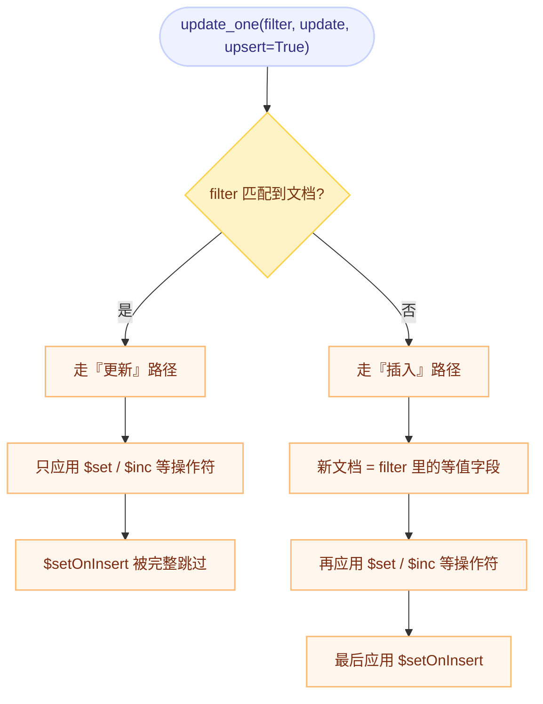

# MongoDB 与 PyMongo 入门指南

## 一句话理解

MongoDB 是一个**面向文档的数据库**：它不把数据拆成固定列的表格，而是把一条记录保存成类似 Python 字典的 BSON 文档。

如果你主要使用 Python，可以先学习官方驱动 **PyMongo**，暂时不用接触 MongoDB Shell 的复杂用法。

---

## 1. 先建立基本概念

MongoDB 和关系型数据库的概念大致可以这样对应：

| MongoDB | 关系型数据库 | Python 中的直觉 |
|---|---|---|
| Database | Database | 一个业务或应用的数据空间 |
| Collection | Table | 一组同类对象 |
| Document | Row | 一个 `dict` |
| Field | Column | 字典中的键 |
| `_id` | Primary Key | 每个文档的唯一标识 |

例如，一个用户文档可以是：

```python
{
    "_id": ObjectId("..."),
    "name": "Alice",
    "age": 25,
    "skills": ["Python", "MongoDB"],
    "profile": {
        "city": "Shanghai",
        "active": True,
    },
}
```

MongoDB 的文档可以包含字符串、数字、布尔值、日期、数组、嵌套文档和 `ObjectId` 等 BSON 类型。

> MongoDB 的“灵活结构”不等于“完全不需要结构”。实际项目仍然应该约定字段、类型和必填规则。

---

## 2. 准备 MongoDB

可以选择以下任一种方式：

1. **MongoDB Atlas**：官方云服务，适合不想管理本地数据库时使用。
2. **本地安装 MongoDB Community Server**。
3. **使用 Docker**：适合本地学习和开发。

本地 Docker 示例：

```bash
docker run --name mongodb \
  -p 127.0.0.1:27017:27017 \
  -d mongo:8
```

本地服务默认监听 `localhost` 的 `27017` 端口。Atlas 会在控制台提供连接字符串，复制后将其保存到 `MONGODB_URI` 环境变量即可。

不要把真实用户名、密码或连接字符串提交到 Git；应通过环境变量传入。

---

## 3. 安装 PyMongo 并连接

```bash
python -m pip install pymongo
```

检查连接：

```python
import os

from pymongo import MongoClient

uri = os.getenv("MONGODB_URI")
client = (
    MongoClient(uri, serverSelectionTimeoutMS=5_000)
    if uri
    else MongoClient(host="localhost", port=27017, serverSelectionTimeoutMS=5_000)
)

try:
    client.admin.command("ping")
    print("MongoDB connected")
finally:
    client.close()
```

`MongoClient` 通常是线程安全的。Web 应用一般应在进程启动时创建一个客户端并复用它，而不是每次请求都重新连接。

---

## 4. 选择 Database 和 Collection

MongoDB 不要求你先手动创建数据库和集合。第一次写入数据时，它们会被自动创建。

```python
from pymongo import MongoClient

client = MongoClient(host="localhost", port=27017)
db = client["learning"]
users = db["users"]
```

这里：

- `learning` 是 database
- `users` 是 collection
- 后续所有 CRUD 都可以通过 `users` 完成

---

## 5. Create：插入文档

### 插入一条

```python
from datetime import datetime, timezone

result = users.insert_one(
    {
        "name": "Alice",
        "email": "alice@example.com",
        "age": 25,
        "skills": ["Python", "SQL"],
        "profile": {"city": "Shanghai"},
        "created_at": datetime.now(timezone.utc),
    }
)

print(result.inserted_id)
```

如果没有提供 `_id`，MongoDB 会自动生成一个 `ObjectId`。

### 插入多条

```python
result = users.insert_many(
    [
        {"name": "Bob", "age": 30, "skills": ["Go"]},
        {"name": "Carol", "age": 28, "skills": ["Python", "Rust"]},
    ]
)

print(result.inserted_ids)
```

---

## 6. Read：查询文档

### 查询一条

```python
user = users.find_one({"email": "alice@example.com"})
print(user)
```

按 `_id` 查询时要使用 `ObjectId`，而不是普通字符串：

```python
from bson import ObjectId

user = users.find_one({"_id": ObjectId("64f000000000000000000001")})
```

### 查询多条

```python
cursor = users.find({"age": {"$gte": 25}})

for user in cursor:
    print(user["name"])
```

`find()` 返回的是惰性读取的游标，不会立即把所有结果放进内存。数据量不确定时，不要随意写 `list(users.find({}))`。

### 常用查询操作符

```python
# 年龄大于等于 25
{"age": {"$gte": 25}}

# 年龄在 20 到 30 之间
{"age": {"$gte": 20, "$lte": 30}}

# 名字属于给定集合
{"name": {"$in": ["Alice", "Bob"]}}

# 同时满足两个条件；点号访问嵌套字段
{"age": {"$gte": 25}, "profile.city": "Shanghai"}

# 数组中包含 Python
{"skills": "Python"}

# 字段存在
{"email": {"$exists": True}}
```

常见比较操作符：

| 操作符 | 含义 |
|---|---|
| `$eq` / `$ne` | 等于 / 不等于 |
| `$gt` / `$gte` | 大于 / 大于等于 |
| `$lt` / `$lte` | 小于 / 小于等于 |
| `$in` / `$nin` | 在 / 不在给定集合中 |
| `$exists` | 字段是否存在 |

### 只返回需要的字段

第二个参数叫 projection：

```python
for user in users.find(
    {"age": {"$gte": 25}},
    {"name": 1, "age": 1, "_id": 0},
):
    print(user)
```

输出只包含 `name` 和 `age`。减少不需要的字段可以降低网络传输和内存开销。

### 排序和限制数量

```python
from pymongo import DESCENDING

recent_users = (
    users.find({})
    .sort("created_at", DESCENDING)
    .limit(10)
)
```

---

## 7. Update：更新文档

### 更新一条

```python
result = users.update_one(
    {"email": "alice@example.com"},
    {
        "$set": {"age": 26, "profile.city": "Beijing"},
        "$addToSet": {"skills": "MongoDB"},
    },
)

print(result.matched_count, result.modified_count)
```

### 更新操作符全景

MongoDB 的更新操作符分四组，**先按"改什么"选组，再按"怎么改"选操作符**：

#### 一、字段类（作用于标量或整个嵌套文档）

| 操作符 | 作用 | 字段不存在时 | 备注 |
|---|---|---|---|
| `$set` | 直接赋值 | 创建该字段 | 最常用；可用点号写嵌套字段 `"profile.city"` |
| `$setOnInsert` | **只在 upsert 导致插入时**赋值 | 创建该字段 | 匹配到已有文档时**完全跳过**，详见下文「`$set` 与 `$setOnInsert`」 |
| `$unset` | 删除字段 | 无副作用 | 值随便给（`""` 或 `1` 都行） |
| `$inc` | 数值加减（可负） | 以该值作为初值 | **只能用于数值字段**，否则报错 |
| `$mul` | 数值乘法 | **设为 0**（不是乘以该值！） | 反直觉点，见下方提醒 |
| `$min` | 仅当指定值**更小**时更新 | 设为该值 | 用于"只降不升"的字段 |
| `$max` | 仅当指定值**更大**时更新 | 设为该值 | 用于"只升不降"的字段 |
| `$rename` | 重命名字段 | 无副作用 | **不能用于数组元素** |
| `$currentDate` | 设为当前时间 | 创建该字段 | `{"$currentDate": {"updated_at": true}}` 存 Date；`{"$type": "timestamp"}` 存 Timestamp |

```python
# 赋值（含嵌套字段）
{"$set": {"name": "Alice Chen", "profile.city": "Beijing"}}

# 自增（可负）
{"$inc": {"login_count": 1, "balance": -10}}

# 删除字段
{"$unset": {"temporary_field": ""}}

# 只降不升 / 只升不降
{"$min": {"lowest_price": 99}}
{"$max": {"highest_score": 88}}

# 改名
{"$rename": {"nickname": "display_name"}}

# 服务端时间（避免应用与数据库时钟不一致）
{"$currentDate": {"updated_at": True}}
```

> ⚠️ **`$mul` 的坑**：如果字段**不存在**，`$mul` 会把字段设为 **0**，而不是"乘以乘数"。所以 `{"$mul": {"price": 1.1}}` 在 `price` 缺失时得到 `0`——想做"涨价 10% 且缺省给初值"，应先 `$set` 或用聚合管道式更新。

> ⚠️ **`$set` 作用于数组字段会整体替换数组**。想只改数组里的某个元素，要用定位符（见下）。

#### 二、数组类

| 操作符 | 作用 | 典型写法 |
|---|---|---|
| `$push` | 追加元素 | `{"$push": {"skills": "Docker"}}` |
| `$addToSet` | **不存在才**追加 | `{"$addToSet": {"skills": "Python"}}` |
| `$pop` | 删首 / 删尾 | `{"$pop": {"queue": -1}}` 删首个；`1` 删末尾 |
| `$pull` | 按**条件**删除所有匹配元素 | `{"$pull": {"scores": {"$lt": 60}}}` |
| `$pullAll` | 删除所有**等于给定值**的元素 | `{"$pullAll": {"scores": [0, 5]}}` |

**定位符**（修改数组中的特定元素，而不是整个数组）：

```python
# $  ：第一个匹配查询条件的元素
users.update_one(
    {"email": "alice@example.com", "skills": "Python"},
    {"$set": {"skills.$": "Python 3"}},
)

# $[] ：数组中的所有元素
users.update_one({"email": "alice@example.com"}, {"$inc": {"scores.$[]": 1}})

# $[<identifier>] + arrayFilters ：按条件筛选要改的元素
users.update_one(
    {"email": "alice@example.com"},
    {"$set": {"addresses.$[elem].is_default": False}},
    array_filters=[{"elem.city": "Beijing"}],
)
```

>`$addToSet` 判断的是**整体是否相等**（对子文档不做字段级比较），且**只保证不新增重复项，不会清理已有的重复项**。

#### 三、数组修饰符（只挂在 `$push` 上）

| 修饰符 | 作用 |
|---|---|
| `$each` | 追加多个元素（`$addToSet` 也支持） |
| `$position` | 指定插入位置 |
| `$slice` | 追加后把数组**截断**到指定长度（可用于实现固定长度的"最近 N 条"列表） |
| `$sort` | 追加后对数组排序（注意排序的是**整个数组**） |

```python
# 保留最近 10 条日志：追加 + 倒序 + 截断，一步完成
{"$push": {
    "logs": {
        "$each": [{"at": now, "msg": "login"}],
        "$sort": {"at": -1},
        "$slice": 10,
    }
}}
```

> `$slice` / `$sort` / `$position` **必须和 `$each` 一起使用**，否则报错。

#### 四、聚合管道式更新：当"新值依赖旧值"时

如果新值需要**基于当前字段值计算**，或者要**引用同文档的其他字段**，普通操作符就不够用了（`$inc` 只能加减）。这时把第二个参数写成**聚合管道**（一个 list）：

```python
users.update_one(
    {"email": "alice@example.com"},
    [
        {"$set": {
            "full_name": {"$concat": ["$first_name", " ", "$last_name"]},
            "level": {"$cond": [{"$gte": ["$age", 18]}, "adult", "minor"]},
        }},
    ],
)
```

| 能力 | 普通操作符 | 聚合管道式更新 |
|---|---|---|
| 赋值 / 自增 / 数组操作 | ✅ | ✅ |
| 引用同文档其他字段 | ❌ | ✅ |
| 条件分支（`$cond`）、字符串拼接（`$concat`） | ❌ | ✅ |
| `$setOnInsert` | ✅ | ❌ **不支持** |

> 注意：管道里的 `$set` 是**聚合阶段**，语义和同名的更新操作符不同——它是"按表达式算出新值"，而不是"直接赋这个字面量"。

#### 选择口诀

```text
直接给值            → $set
只在"出生那一刻"给值 → $setOnInsert
在旧值基础上加减乘   → $inc / $mul
只在更小/更大时改   → $min / $max
往数组里放          → $push（要限长/排序就配 $each + $slice + $sort）
往数组里放且不重复   → $addToSet
从数组里拿          → $pop / $pull / $pullAll
新值要靠旧值算出来   → 聚合管道式更新
```

### Upsert

“存在就更新，不存在就插入”：

```python
users.update_one(
    {"email": "dave@example.com"},
    {"$set": {"name": "Dave", "age": 24}},
    upsert=True,
)
```

> 不要把新文档直接作为第二个参数传给 `update_one()`；通常应明确使用 `$set`、`$inc` 等更新操作符。混合会出现两种错误之一：把 `$set` 这类键当成普通字段写进文档（`The dollar ($) prefixed field ... is not valid for storage`），或与替换语义冲突。

**怎么知道这次是插入还是更新**：看 `upserted_id`。

```python
result = users.update_one(filter_, update, upsert=True)

if result.upserted_id is not None:
    print("插入了新文档，_id =", result.upserted_id)
else:
    print("命中了已有文档")
```

（插入路径下 `matched_count == 0`、`modified_count == 0`，只有 `upserted_id` 非空。）

**并发注意：`upsert=True` 不是"原子的查找或插入"。** 在没有任何唯一约束时，两个并发请求可能各自找不到文档、各自插入，于是产生两条重复文档。正确做法是让**唯一索引**把这件事变成确定性的：

```python
from pymongo.errors import DuplicateKeyError

try:
    users.update_one({"email": email}, {"$setOnInsert": {"created_at": now}}, upsert=True)
except DuplicateKeyError:
    # 另一个请求刚刚插入了同一 email，重试一次即可命中并走更新路径
    users.update_one({"email": email}, {"$set": {"last_login": now}}, upsert=True)
```

> `update_many` + `upsert`：只有在**一条都没匹配到**时才插入一条新文档，不会为每条不存在的记录各插一条。

### `$set` 与 `$setOnInsert`：一次写入 vs 只在插入时写入

这两个操作符的区别**只在 upsert 场景下才显现**，但它是"创建时间/初始状态"这类字段唯一正确的写法。

| | `$set` | `$setOnInsert` |
|---|---|---|
| 生效时机 | **插入 + 更新**，两条路径都生效 | **只在 upsert 真的插入时**生效 |
| 匹配到已有文档时 | 正常写入 | **完全跳过**（官方原文：*Has no effect on update operations that modify existing documents*） |
| 没开 `upsert` 时 | 正常写入 | **永远不生效** |

**一句话**：`$set` 是"无条件写"，`$setOnInsert` 是"只在新生儿身上写一次"。

#### upsert 的两条路径



#### 最典型的用法：`created_at` 用 `$setOnInsert`，`updated_at` 用 `$set`

```python
from datetime import datetime, timezone

now = datetime.now(timezone.utc)

users.update_one(
    {"email": "alice@example.com"},
    {
        "$set":         {"last_login": now},                       # 每次访问都刷新
        "$setOnInsert": {"created_at": now, "status": "active"},   # 只在首次注册写
    },
    upsert=True,
)
```

- 第一次调用 → 插入文档，`created_at` / `status` / `last_login` 都有值；
- 之后每次调用 → 只有 `last_login` 刷新，`created_at` **保持不动**。

**如果用 `$set` 写 `created_at`**，它每次都会被刷成当前时间——见 §12 的静默错误提醒。

#### PyMongo 实操要点

**① 可以在 `$setOnInsert` 里指定 `_id`**，用业务自己生成的 ID，而不是让 MongoDB 生成 `ObjectId`：

```python
users.update_one(
    {"email": email},
    {"$setOnInsert": {"_id": my_object_id, "created_at": now}},
    upsert=True,
)
```

**② 支持它的方法**：

| 方法 | 支持 `$setOnInsert` |
|---|---|
| `update_one` / `update_many`（带 `upsert=True`） | ✅ |
| `find_one_and_update`（带 `upsert=True`） | ✅ |
| `replace_one` | ❌ 替换式文档不能用任何更新操作符 |
| 聚合管道式更新 | ❌ 管道里没有 `$setOnInsert` |

**③ 它必须和唯一索引配套，才能真正做到"只初始化一次"**：

> **唯一索引负责"只能有一条"，`$setOnInsert` 负责"只初始化一次"。** 两个职责不能互相替代。并发场景、`DuplicateKeyError` 重试写法与 `upserted_id` 判据见上一节「Upsert」。

#### 两个容易踩的坑

**① 不要让同一字段同时出现在 `$set` 和 `$setOnInsert` 里。**

```python
# ⚠️ 不要这样写
{"$set": {"a": 1}, "$setOnInsert": {"a": 2}}
```

这属于"多个操作符修改同一路径"，会触发错误码 **40**：

```text
MongoServerError: Updating the path 'a' would create a conflict at 'a'
```

**稳妥原则**：一个字段只归一个操作符管——`created_at` 归 `$setOnInsert`、`updated_at` 归 `$set`，天然不冲突。

**② filter 里的等值字段也会进入新文档。**

```python
users.update_one(
    {"email": email, "age": {"$gt": 18}},        # $gt 是操作符条件，不会进新文档
    {"$setOnInsert": {"created_at": now}},
    upsert=True,
)
```

- **等值条件**（`email: ...`）会被复制进新文档；
- **操作符条件**（`$gt` / `$in` 等）不会。

所以别在 filter 和更新操作符里写同一字段去赌谁赢——这种写法即使当前版本能跑，语义也不值得依赖。

### 更新操作符的冲突与限制

| 限制 | 说明 |
|---|---|
| **同一路径只能被一个操作符修改** | 否则错误码 40：`Updating the path 'x' would create a conflict at 'x'`。例：`{"$set": {"a": 1}, "$inc": {"a": 1}}`、`{"$set": {"a": 1}, "$setOnInsert": {"a": 2}}` |
| **不能用"嵌套操作符"来规避冲突** | 更新文档是"操作符 → 字段"的**扁平映射**，没有优先级或执行顺序可以依赖 |
| **`$inc` / `$mul` 只能用于数值字段** | 对非数值字段会报错 |
| **`$rename` 不能用于数组元素** | 只对文档字段有效 |
| **替换式更新不能混用操作符** | `replace_one` 的第二个参数是完整文档；聚合管道式更新（list）里也不能用更新操作符 |
| **5.0 起字段处理顺序按字典序** | 字符串字段名按字典序、数字字段名按数值序；这影响 `$rename` 等多字段操作的中间状态，但**不要依赖它来实现逻辑** |

排查冲突的实用做法：**把一次更新拆成"操作符 → 目标路径"两列写出来，逐一检查同一路径是否出现两次**。

## 8. Delete：删除文档

```python
result = users.delete_one({"email": "dave@example.com"})
print(result.deleted_count)
```

删除多条：

```python
result = users.delete_many({"active": False})
```

谨慎使用：

```python
users.delete_many({})
```

空过滤条件代表删除集合中的所有文档。

---

## 9. 索引：让查询更快，也能保证唯一性

如果经常按 `email` 查询，可以创建唯一索引：

```python
from pymongo import ASCENDING

users.create_index(
    [("email", ASCENDING)],
    unique=True,
)
```

复合索引示例：

```python
from pymongo import DESCENDING

users.create_index(
    [("profile.city", ASCENDING), ("created_at", DESCENDING)]
)
```

索引的核心权衡：

- 优点：查询和排序更快；唯一索引还能阻止重复数据。
- 代价：占用额外存储；写入时需要同步维护索引。
- 原则：根据真实查询模式创建索引，不要给每个字段都建索引。

遇到“查询越来越慢”时，先检查过滤、排序字段是否有合适索引，而不是直接增加机器资源。

---

## 10. 聚合管道：在数据库中完成统计

聚合管道把数据依次传给多个阶段：

```python
pipeline = [
    {"$match": {"age": {"$gte": 18}}},
    {"$unwind": "$skills"},
    {
        "$group": {
            "_id": "$skills",
            "user_count": {"$sum": 1},
        }
    },
    {"$sort": {"user_count": -1}},
]

for row in users.aggregate(pipeline):
    print(row)
```

这段代码统计每项技能对应的用户数量。

初学阶段先认识四个常用阶段即可：

- `$match`：过滤
- `$project`：选择或计算字段
- `$group`：分组统计
- `$sort`：排序

---

## 11. 如何设计文档

MongoDB 建模最关键的问题之一是：**嵌入还是引用？**

### 嵌入（Embedding）

```python
{
    "name": "Alice",
    "address": {
        "city": "Shanghai",
        "street": "...",
    },
}
```

适合：

- 子数据只属于父文档
- 通常需要一起读取
- 子数据规模有限

### 引用（Reference）

```python
# users
{"_id": ObjectId("..."), "name": "Alice"}

# orders
{"user_id": ObjectId("..."), "amount": 99}
```

适合：

- 数据会被多个对象共享
- 子数据数量可能持续、无限增长
- 子数据需要独立查询和更新

一个实用原则：

> 一起读取、一起更新且规模可控的数据，优先嵌入；独立增长、独立访问或多处共享的数据，考虑引用。

不要机械地把关系型数据库的每张表一比一搬成 collection，也不要把无限增长的列表全部塞进一个文档。

---

## 12. Python 中的常见坑

### 1）`ObjectId` 不是字符串

从 HTTP 路径收到的 ID 通常是字符串，查询前要转换并验证：

```python
from bson import ObjectId
from bson.errors import InvalidId

try:
    user_id = ObjectId(raw_id)
except InvalidId:
    raise ValueError("Invalid user id")
```

向 JSON 响应返回数据时，通常要把 `_id` 转成字符串：

```python
user["_id"] = str(user["_id"])
```

### 2）时间统一使用 UTC

```python
from datetime import datetime, timezone

now = datetime.now(timezone.utc)
```

存储时统一 UTC，在展示层再转换时区，可以减少时间比较和跨时区问题。

### 3）注意缺失字段

MongoDB 文档结构可以不同，因此：

```python
city = user.get("profile", {}).get("city")
```

通常比直接访问多层键更安全。正式项目可以在应用层使用 Pydantic 等工具做数据校验。

### 4）区分“没匹配”和“值为空”

```python
user = users.find_one({"email": email})
if user is None:
    print("not found")
```

### 5）捕获数据库异常

```python
from pymongo.errors import DuplicateKeyError, PyMongoError

try:
    users.insert_one({"email": "alice@example.com"})
except DuplicateKeyError:
    print("email already exists")
except PyMongoError as exc:
    print(f"database operation failed: {exc}")
```

在真实服务中应记录异常并返回合适的业务错误，不要把数据库连接信息直接暴露给客户端。

### 6）用 `$set` 写 `created_at`：一个静默错误

```python
# ⚠️ created_at 每次都会被刷新，但字段名写着 created
users.update_one(
    {"email": email},
    {"$set": {"created_at": now, "last_login": now}},
    upsert=True,
)
```

这个写法**不会报错、不会崩**，只是"创建时间"悄悄变成了"最后访问时间"。等发现时，历史数据已经无法恢复。

正确写法是把两类时间分给两个操作符（详见 §7）：

```python
users.update_one(
    {"email": email},
    {
        "$set":         {"last_login": now},
        "$setOnInsert": {"created_at": now},
    },
    upsert=True,
)
```

同类静默错误还有几个，值得在 code review 时盯一眼：

| 写法 | 实际行为 | 应该怎么写 |
|---|---|---|
| `$set` 写 `created_at` | 每次被刷新 | `$setOnInsert` |
| `$mul` 一个可能不存在的字段 | 缺失时得到 **0** | 先 `$set` 初值，或改用聚合管道式更新 |
| `$set` 写整个数组字段 | **整体替换**，旧元素全丢 | 用定位符 `$` / `$[]` / `$[elem]` 改单个元素 |
| 以为 `$addToSet` 能去重 | 只保证不**新增**重复，不清理已有重复 | 先清理历史重复项 |

---

## 13. 一个可直接运行的小练习

```python
import os
from datetime import datetime, timezone

from pymongo import ASCENDING, MongoClient


def main() -> None:
    uri = os.getenv("MONGODB_URI")
    client = (
        MongoClient(uri, serverSelectionTimeoutMS=5_000)
        if uri
        else MongoClient(host="localhost", port=27017, serverSelectionTimeoutMS=5_000)
    )

    try:
        client.admin.command("ping")

        db = client["mongodb_tutorial"]
        tasks = db["tasks"]
        tasks.create_index([("title", ASCENDING)], unique=True)

        tasks.update_one(
            {"title": "Learn PyMongo"},
            {
                "$set": {
                    "done": False,
                    "updated_at": datetime.now(timezone.utc),
                }
            },
            upsert=True,
        )

        tasks.update_one(
            {"title": "Learn PyMongo"},
            {"$set": {"done": True}},
        )

        for task in tasks.find({"done": True}, {"title": 1, "_id": 0}):
            print(task)
    finally:
        client.close()


if __name__ == "__main__":
    main()
```

运行：

```bash
python tutorial.py
```

你可以继续尝试：

1. 给任务增加 `tags` 和 `priority`。
2. 查询某个标签下未完成的任务。
3. 按 `priority` 和 `updated_at` 排序。
4. 为真实查询创建复合索引。
5. 用聚合管道统计每个标签的任务数量。

---

## 14. 异步 Python 程序怎么办

如果项目基于 FastAPI 等异步框架，可以进一步学习 PyMongo 自带的异步 API；但初学时建议先掌握同步 CRUD、索引和文档建模，因为两种 API 的数据库概念相同。

基本形式如下：

```python
from pymongo import AsyncMongoClient

client = AsyncMongoClient(host="localhost", port=27017)
await client.admin.command("ping")

db = client["learning"]
user = await db["users"].find_one({"name": "Alice"})
```

新项目应优先查看当前 PyMongo Async API 的官方文档，再决定是否引入旧的第三方异步驱动。

---

## 15. 推荐学习顺序

```text
文档 / Collection 基础
        ↓
PyMongo 连接与 CRUD
        ↓
查询操作符与数组、嵌套字段
        ↓
索引与 explain
        ↓
文档建模：嵌入 vs 引用
        ↓
聚合管道
        ↓
事务、复制集、分片和生产运维
```

入门阶段最值得掌握的是：

1. 能用 PyMongo 完成 CRUD。
2. 理解 `_id`、`ObjectId`、数组和嵌套文档。
3. 能根据查询模式设计基本索引。
4. 知道灵活 Schema 仍然需要应用层校验。
5. 能判断什么时候嵌入、什么时候引用。

---

## 16. MongoDB 不一定适合什么场景

MongoDB 很适合结构自然呈文档形态、需要灵活迭代或包含嵌套数据的应用，但它不是所有问题的默认答案。

如果系统具有以下特点，应认真比较 PostgreSQL 等关系型数据库：

- 大量复杂关联和跨表查询
- 非常依赖强约束与关系完整性
- 数据天然是高度规范化的关系模型
- 团队已有成熟的 SQL 工具链和经验

正确的学习目标不是“用 MongoDB 替代 SQL”，而是理解文档数据库的模型，并能根据访问模式选择合适的数据库。

---

## 官方资料

- [PyMongo Driver 文档](https://www.mongodb.com/docs/languages/python/pymongo-driver/)
- [MongoDB CRUD 文档](https://www.mongodb.com/docs/manual/crud/)
- [MongoDB 索引文档](https://www.mongodb.com/docs/manual/indexes/)
- [MongoDB 数据建模文档](https://www.mongodb.com/docs/manual/data-modeling/)
- [MongoDB 聚合文档](https://www.mongodb.com/docs/manual/aggregation/)
