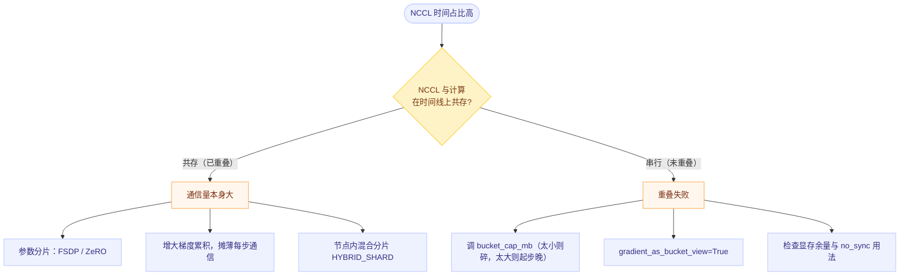

# PyTorch 分布式训练性能分析：straggler、通信与重叠

## 一句话理解

分布式训练的 step time **不是各 rank 的平均值，而是最大值**：

$$T_{\text{step}} = \max_{r} T_{\text{step}}^{(r)}$$

因为每一步都要等齐所有 rank（集合通信的本质），**最慢的那个 rank 决定整队速度**。所以分布式性能分析的第一原则是：

> **先找"谁最慢"，再问"为什么慢"；绝不要看平均值。**

而"为什么慢"的答案基本只有三类：

```text
① Straggler      某个 rank 天生比别人慢（数据不均 / 硬件不均 / CPU 不均）
② 通信量本身大    参数量 × 算法 × 卡数 → 通信时间超过了计算时间
③ 重叠失败        通信本该与计算并行，实际却串行 → 总时间 ≈ 计算 + 通信
```

## 为什么单卡方法论在这里会失效

[单卡的工具链](04-pytorch-latency-profiling.md) 直接搬到分布式会踩四个坑：

| 问题 | 后果 |
|---|---|
| 只看 rank 0 或看平均值 | **straggler 被完全掩盖**，而那正是瓶颈 |
| 把 NCCL kernel 当成"普通 kernel" | 它在时间线上长得像 kernel，实际是通信 |
| profiler 开销 × rank 数 | 各 rank 时序漂移，反而制造出"伪 straggler" |
| [ncu](06-nsight-compute-ncu.md) 在集合通信上不可用 | kernel replay 会挂死；必须改用 `--replay-mode application` 或剥离出单卡 microbenchmark |

---

## 一、先修正观测口径：max，不是 mean

### 1.1 正确的测量方式

```python
import time, torch, torch.distributed as dist

def timed_step(step_fn, warmup=5, measure=20):
    # ① warmup：跳过 autotune / 编译 / 分配器预热
    for _ in range(warmup):
        step_fn()

    # ② 只在测量窗口的首尾同步，中间不要同步
    torch.cuda.synchronize()
    t0 = time.perf_counter()
    for _ in range(measure):
        step_fn()
    torch.cuda.synchronize()
    t1 = time.perf_counter()

    return (t1 - t0) / measure          # 每步平均（窗口内）
```

> ⚠️ **最容易犯的错：在每一步前后都 `torch.cuda.synchronize()`。**
> 那会把 CPU 与 GPU、计算与通信之间本该重叠的部分**强制串行化**，测出来的 step time 系统性偏大。正确做法是**只在测量窗口的边界同步**。

### 1.2 收集到一张表再判断

```python
local_t = torch.tensor([my_step_time], device="cuda")
gathered = [torch.zeros_like(local_t) for _ in range(world_size)]
dist.all_gather(gathered, local_t)                  # 注意：所有 rank 都要调用

times = torch.stack(gathered).flatten().tolist()
if dist.get_rank() == 0:
    print(f"mean={sum(times)/len(times):.3f}s  "
          f"max={max(times):.3f}s  min={min(times):.3f}s  "
          f"max/mean={max(times)/(sum(times)/len(times)):.3f}")
```

**判据**：

| `max/mean` | 含义 |
|---|---|
| ≈ 1.00 ~ 1.05 | 各 rank 均衡，瓶颈在通信或计算本身 |
| > 1.1 | **存在 straggler**，先解决它（第十节的第四节） |
| ≫ 1.2 | 严重的负载不均或硬件差异，此时优化算法毫无意义 |

### 1.3 并行效率：唯一有意义的"快慢"指标

固定**全局 batch 与序列长度**，比较单卡与多卡：

$$T_1 = \text{单卡 step time} \quad(\text{同全局 batch}),\qquad
\eta_{\text{scale}} = \frac{T_1}{N \cdot T_N}$$

| 效率 | 说明 |
|---|---|
| ~1.0 | 线性扩展，通信被完全掩盖 |
| 0.7 ~ 0.9 | 正常范围，通信有一定占比 |
| < 0.5 | 通信或 straggler 问题严重 |

> **比较必须同条件**：全局 batch、seq len、精度、并行策略、warmup 步数、数据顺序全部固定。改了任何一项，效率数字都不可比。

---

## 二、快速判断"是不是通信瓶颈"

### 2.1 三个可测量的量

**① 时间线占比**（最直接）

用 [torch.profiler](04-pytorch-latency-profiling.md) 或 [nsys](05-nsight-systems-nsys.md)，把所有 `nccl*` / `ncclDevKernel_*` 的 CUDA 时间加起来，除以总时间：

```text
通信占比 < 10%   →  通信不是你现在的瓶颈
通信占比 20~40%  →  看是否重叠失败（第三节）
通信占比 > 40%   →  通信量本身太大，考虑分片或降低同步频率
```

**② 去掉通信再看**（对照实验）

| 做法 | 得到什么 |
|---|---|
| 用 `model.no_sync()` 包住若干步（只在累积的最后一步同步） | 纯计算 + 少量同步的 step time |
| 单卡跑同样的全局 batch（micro-batch 放大） | 计算侧的理论下界 $T_1$ |
| 把 `DistributedSampler` 换成普通 sampler（只测不训） | 排除数据侧干扰 |

**③ 通信量的理论值**（先算清楚再优化）

DDP 每步的 **ring all-reduce** 通信量（每个 rank 的收发字节数）：

$$V_{\text{comm}} = \frac{2S(N-1)}{N}\ \text{bytes}$$

其中 $S$ = 参与同步的参数总字节数，$N$ = world size。于是通信时间下界：

$$T_{\text{comm}} \gtrsim \frac{V_{\text{comm}}}{\text{BW}_{\text{eff}}}$$

> **这一步的价值**：如果你算出 $T_{\text{comm}} = 8$ ms 而实际观测到 40 ms，那就不是"通信量大"，而是**重叠失败或链路没用对**——两者是完全不同的修法。

### 2.2 链路层面的检查

```bash
nvidia-smi topo -m        # 卡间是 NVLink / PCIe / SYS（跨 NUMA）
nvidia-smi nvlink -s      # NVLink 链路状态
```

| 现象 | 影响 |
|---|---|
| 卡间走 `SYS`（跨 NUMA / 跨 socket） | 带宽可能只有 NVLink 的零头 |
| 多机时 NCCL 走了错误的网卡 | 用 `NCCL_SOCKET_IFNAME` 指定 |
| 应该走 IB/RoCE 却退化成 TCP socket | 检查 `NCCL_DEBUG=INFO` 里的传输层选择 |

---

## 三、通信与计算重叠：分布式最大的"白拿"性能

### 3.1 两种时间结构

先要能在时间线上"看"出差别：

```text
重叠良好 → 总时间 ≈ max(计算, 通信)
  计算  ██████████████████████████████
  通信      ████████████████████            ← 与计算在时间轴上共存

重叠失败 → 总时间 ≈ 计算 + 通信
  计算  ██████████████████████████████
  通信                              ██████  ← 严格串行在计算之后
```

**判读方法**：看 NCCL kernel 是否与计算 kernel **在时间上共存**（nsys 里表现成两行同时有内容）。

而"通信占比高"之后的决策路径是：



**这两条路的修法是相反的**：`C` 要**减少通信**，`D` 要**改善调度**。选错方向会越调越慢。

### 3.2 DDP 的重叠机制（以及它为什么会失败）

DDP 的实现思路是：

```text
① 把梯度按 bucket 分组（默认 bucket_cap_mb = 25）
② 在 autograd 上挂 hook，某 bucket 的梯度全部就绪 → 立刻对该 bucket 发起 allreduce
③ 因为 backward 是逆序执行的，所以通信可以与**后续层的 backward** 重叠
```

**它失败的常见原因**：

| 原因 | 表现 | 对策 |
|---|---|---|
| bucket 太小 | NCCL kernel 碎成一堆小 kernel，启动开销占比高 | 调大 `bucket_cap_mb`（25 → 50/100，需权衡首包延迟与显存） |
| bucket 太大 | 第一个 bucket 要等很久才就绪，通信起步晚 | 调小；或让 bucket 边界对齐"先算完的层" |
| 每步都有 `no_sync()` 之外的全量同步 | 通信被挤到最后 | 检查是否有额外的手动 `all_reduce`（如指标统计） |
| 显存压力 | 无法同时容纳通信缓冲与激活值 → 调度器被迫串行 | 降 micro-batch、开 gradient checkpointing |
| `find_unused_parameters=True` | 额外图遍历 + 额外通信 | 若图是静态的（所有参数都参与），关掉它；或用 `static_graph=True` |
| 梯度不是 bucket view | 多一次拷贝 | `gradient_as_bucket_view=True` |

### 3.3 FSDP 的重叠机制

FSDP 与 DDP 的通信模式完全不同：

```text
forward   每层前 all-gather 参数分片 → 用完即释放
backward  每层后 reduce-scatter 梯度
```

因此 FSDP 天然是"**逐层通信 + 逐层计算**"，重叠机会更多，但需要**显式的预取**：

| 参数 | 作用 |
|---|---|
| `backward_prefetch=BACKWARD_PRE` | backward 时提前 all-gather 下一层的参数（重叠更好，显存要求更高） |
| `limit_all_gathers=True` | 限制并发 all-gather 数量，防止把显存吃光（以少量重叠换取稳定） |
| `ShardingStrategy.SHARD_GRAD_OP` | 只分片梯度与优化器状态，通信量比 FULL_SHARD 小 |
| `HYBRID_SHARD` | 节点内 FULL_SHARD + 节点间 DDP，减少跨机通信 |

> **注意**：FSDP 的通信量比 DDP **更大**（每层都要 all-gather 参数 + reduce-scatter 梯度），
> 但它把通信**打散并与计算交织**，所以在参数放不进单卡时，FSDP 往往是净收益。**这不是"通信更少所以更快"，而是"通信可以被掩盖"。**

---

## 四、Straggler 定位

### 4.1 四类来源

| 类别 | 典型原因 | 检查方法 |
|---|---|---|
| **数据不均** | 用普通 `DataLoader` 而非 `DistributedSampler`；样本长度差异大（变长 seq） | 各 rank 每步的样本数 / token 数是否相同 |
| **硬件不均** | 混用不同型号的卡；某卡降频；拓扑不对称（部分卡走 PCIe） | `nvidia-smi -q -d PERFORMANCE`、`nvidia-smi topo -m` |
| **CPU 侧不均** | DataLoader worker 数、CPU 核绑定、NUMA、共享机器被抢占 | [01 号笔记](01-system-level-observability.md) 的机器层工具，逐台看 |
| **显存 / 分配器状态不均** | 某些 rank 先触发碎片或 retry | [03 号笔记](03-pytorch-memory-profiling.md) 的 `num_alloc_retries` |

### 4.2 定位流程

```text
1. 每 rank 记录 step time（第一节），算 max/mean
2. max/mean > 1.1 → 找出最慢的 rank 编号
3. 该 rank 上：
   a. 看 GPU 利用率是否比别人低 → 若是，问题在 CPU / 数据侧
   b. 看显存是否比别人高 → 若是，问题在分配不均
   c. 用 py-spy dump 看它卡在哪个调用栈 → 常见于集合通信等待或数据加载
   d. 看它所在机器的 htop / iostat / sar → 机器层干扰
4. 若所有 rank 都慢且均匀 → 不是 straggler，回到"通信 vs 计算"的判断
```

> **重要区分**：如果 `max/mean ≈ 1`，那"某个 rank 慢"这条线索可以直接排除，不要浪费时间在逐机排查上。

---

## 五、工具与开关

### 5.1 `torch.profiler` 多 rank 采集

```python
import torch.distributed as dist
from torch.profiler import profile, ProfilerActivity, schedule

rank = dist.get_rank()

def trace_handler(p):
    p.export_chrome_trace(f"./traces/trace_rank{rank}.json")   # ← 文件名带 rank

with profile(
    activities=[ProfilerActivity.CPU, ProfilerActivity.CUDA],
    schedule=schedule(wait=2, warmup=2, active=3),
    on_trace_ready=trace_handler,
    with_stack=False,          # 分布式下建议关掉，开销会叠加
) as prof:
    for step, batch in enumerate(loader):
        train_step(batch)
        prof.step()
```

**建议只 profile 少量 rank**（例如 rank 0 与最慢的那个），否则 I/O 与开销会互相干扰。

### 5.2 `nsys` 多 rank

```bash
# 让 nsys 跟住 torchrun 派生的子进程（注意 fork/child 相关选项）
nsys profile -o prof_%p -t cuda,nvtx,osrt,nccl \
     --capture-range=cudaProfilerApi \
     torchrun --nproc_per_node=8 train.py
```

分析要点（详见 [05 号笔记](05-nsight-systems-nsys.md)）：**NCCL kernel 与计算 kernel 是否共存**，以及每个 rank 的 GPU 空洞时长。

### 5.3 卡死 / 挂起的诊断

分布式最常见的故障不是"慢"，而是"**挂住不动**"。

```python
# 带监控的屏障：超时后报告哪个 rank 没到
torch.distributed.monitored_barrier(timeout=datetime.timedelta(seconds=60))
```

> 需要 `init_process_group(..., timeout=...)` 设置超时；并且**每个 rank 都要用 try/except 包住**，否则第一个抛出的异常会让其他 rank 永远等下去（这正是挂起的典型成因）。

环境变量：

| 变量 | 作用 |
|---|---|
| `TORCH_DISTRIBUTED_DEBUG=DETAIL` | 打印集合通信的调用栈与耗时，定位"谁没跟上" |
| `TORCH_NCCL_ASYNC_ERROR_HANDLING=1` | 集合通信超时后抛异常而不是永久阻塞（新版默认开启） |
| `NCCL_DEBUG=INFO` | NCCL 初始化细节：选了哪条链路、哪种算法、哪种协议 |
| `NCCL_DEBUG_SUBSYS=INIT,NET,COLL` | 只打印关心的子系统 |

较新版本的 PyTorch 还提供 **Flight Recorder**（`TORCH_NCCL_TRACE_BUFFER_SIZE` / `TORCH_NCCL_DUMP_ON_TIMEOUT`），能在超时后 dump 出各 rank 的集合通信序列，用于定位线上挂死——具体变量名与行为请以所用版本的文档为准。

### 5.4 纯通信压测：先测出硬件的天花板

**把通信性能和训练框架分开测**，是判断"是不是通信瓶颈"最快的办法：

```bash
# nccl-tests
./build/all_reduce_perf -b 8 -e 8G -f 2 -g 8      # 8 卡，从 8B 到 8G
./build/reduce_scatter_perf -b 8 -e 8G -f 2 -g 8
./build/all_gather_perf    -b 8 -e 8G -f 2 -g 8
```

它直接给出**不同消息大小下的有效带宽（busbw）**。用途：

```text
训练里观测到的通信时间 / 理论带宽 →  若远高于 nccl-tests 的结果
                                    说明问题在重叠或调用方式，不在链路
若 nccl-tests 本身就慢 →  问题在链路 / 拓扑 / NCCL 配置
```

常用 NCCL 调参（先用 `NCCL_DEBUG=INFO` 看默认选择，再对症调整）：

| 变量 | 作用 |
|---|---|
| `NCCL_SOCKET_IFNAME=eth0` | 指定网卡（多网卡机器上最常见的错误来源） |
| `NCCL_IB_DISABLE=0/1` | 是否启用 InfiniBand / RoCE |
| `NCCL_P2P_DISABLE=1` | 关闭 P2P（用于排查 NVLink 相关问题） |
| `NCCL_ALGO=Ring\|Tree` / `NCCL_PROTO=Simple\|LL\|LL128` | 强制算法/协议（大消息偏好 Ring+Simple，小消息偏好 Tree） |
| `NCCL_MAX_NCHANNELS` / `NCCL_MIN_NCHANNELS` | 通道数，影响 SM 占用与并发度 |
| `CUDA_DEVICE_MAX_CONNECTIONS=1` | 减少计算流与通信流的抢占，常用于改善重叠（Megatron 的经验做法） |

---

## 六、常见瓶颈与对策速查

| 现象 | 最可能的原因 | 对策 |
|---|---|---|
| `max/mean > 1.1` | straggler | 先修 straggler，别做别的 |
| NCCL 时间占比高，且与计算**串行** | 重叠失败 | 调 `bucket_cap_mb`、开 `gradient_as_bucket_view`、检查显存余量 |
| NCCL 时间占比高，但与计算**重叠良好** | 通信量本身大 | 参数分片（FSDP/ZeRO）、增大梯度累积、节点内混合分片 |
| 大量极小的 NCCL kernel | bucket 太小 / 频繁手动同步 | 调大 bucket；把指标统计等小同步合并 |
| 每步都有一次大 all-reduce 但不该有 | 代码里有额外同步（如 `all_reduce` 统计 loss） | 降低频率或改为本地累计 |
| 卡间带宽只有 PCIe 水平 | 拓扑不对 / 走了 `SYS` | 调 rank↔GPU 映射；检查 `nvidia-smi topo -m` |
| 单卡快、8 卡慢到不成比例 | 全局 batch 没变导致每卡计算量过小 | 保持全局 batch；或增大 per-GPU batch |
| 训练挂住不动 | 某个 rank 在集合通信前就抛异常了 | `monitored_barrier` + `TORCH_DISTRIBUTED_DEBUG=DETAIL` + NCCL Flight Recorder |

> **最后一行值得单独强调**：`DDP` 场景下"某个 rank 先抛异常 → 其他 rank 永远等在 all_reduce 里"是**最常见的挂死模式**。
> 遇到挂死，先怀疑"不是通信的问题，而是有人提前退出了"。

---

## 七、诊断流程 checklist

```text
□ 0. 固定全局 batch / seq len / 精度 / 并行策略，建立可复现的 baseline
□ 1. 每 rank 记录 step time，算 max / mean / min       → 有 straggler 吗？
□ 2. 有 straggler → 走第四节，先解决它
□ 3. 无 straggler → 用 torch.profiler 看 NCCL 时间占比
□ 4. NCCL 占比低  → 瓶颈在计算侧，回到单卡方法论（04 → 06）
□ 5. NCCL 占比高  → 在时间线上看它是否与计算共存
      ├─ 未重叠 → 调 bucket / 预取 / 显存余量（第三节）
      └─ 已重叠 → 通信量本身大，量化后考虑分片（FSDP / ZeRO）
□ 6. 用 nccl-tests 测出链路天花板，判断是"链路问题"还是"用法问题"
□ 7. 复测并行效率 η_scale，确认改动是净收益（有时通信快了但吞吐没变）
```

---

## 八、常见误区

1. **用平均 step time 判断性能** → 分布式下只有 **max** 有意义；平均值会把 straggler 稀释掉。
2. **只在 rank 0 上 profile** → rank 0 常常正好不是最慢的那个。
3. **每步都 `torch.cuda.synchronize()` 再计时** → 会破坏重叠，测出偏大的"串行化"时间。
4. **看到 NCCL kernel 占比高就去调 NCCL 环境变量** → 先分清是"通信量大"还是"重叠失败"，两者修法相反（前者要减少通信，后者要改善调度）。
5. **在集合通信上跑 ncu** → kernel replay 会挂住；必须剥离成单卡 microbenchmark，或用 `--replay-mode application`。
6. **把全局 batch 改成 per-GPU batch 固定** → 那样卡数越多每卡计算越少，scale 效率必然崩，结论无效。
7. **认为 FSDP 通信更少** → 恰恰相反，FSDP 通信量更大，它的优势是**通信可被重叠**。
8. **各 rank 上开 `with_stack=True` 做 profiler** → 开销叠加导致时序漂移，反而制造出假的 straggler。
9. **训练挂死时死盯通信** → 绝大多数挂死是"某个 rank 提前抛异常"，通信只是受害者。
10. **改了 NCCL 参数就认为一定更快** → 很多参数只在特定消息大小/拓扑下有效，必须用 nccl-tests 或端到端复测验证。

## Related

- [Profiling 专题总览](./) — 工具地图与决策树
- [PyTorch latency profiling：torch.profiler](04-pytorch-latency-profiling.md) — 本笔记的基础工具与时间线三模式
- [Nsight Systems（nsys）](05-nsight-systems-nsys.md) — 判断 NCCL 与计算是否重叠的主要手段
- [Nsight Compute（ncu）](06-nsight-compute-ncu.md) — 通信已排除后，回到单 kernel 分析
- [PyTorch 显存 profiling](03-pytorch-memory-profiling.md) — 显存压力会迫使重叠失败
- [系统层观测：htop、nvidia-smi 与 IO / 网络](01-system-level-observability.md) — 逐台机器排查 straggler
- [PyTorch 分布式训练](../../ai/systems/pytorch/pytorch-distributed.md) — DDP / FSDP / Reducer 的框架实现
- [PyTorch Reducer](../../ai/systems/pytorch/pytorch-reducer.md) — DDP 的 bucket 与梯度归约机制
- [GPU 算子优化方法论：计算、通信、存储](../../ai/systems/gpu-kernel-optimization-methodology.md) — 通信层的理论框架

## References

- PyTorch, [DistributedDataParallel](https://pytorch.org/docs/stable/generated/torch.nn.parallel.DistributedDataParallel.html)（`bucket_cap_mb`、`gradient_as_bucket_view`、`static_graph`）
- PyTorch, [FSDP 文档](https://pytorch.org/docs/stable/fsdp.html)（`ShardingStrategy`、`backward_prefetch`、`limit_all_gathers`）
- PyTorch, [`torch.distributed.monitored_barrier`](https://pytorch.org/docs/stable/distributed.html#torch.distributed.monitored_barrier)
- PyTorch, [Distributed 调试指南](https://pytorch.org/docs/stable/distributed.html#debugging-torch-distributed-applications)（`TORCH_DISTRIBUTED_DEBUG`）
- NVIDIA, [NCCL 环境变量](https://docs.nvidia.com/deeplearning/nccl/user-guide/docs/env.html)
- NVIDIA, [nccl-tests](https://github.com/NVIDIA/nccl-tests)（`all_reduce_perf` 等带宽压测工具）
- 通信量公式（ring all-reduce 的 $2S(N-1)/N$）见 NCCL / 集合通信的经典分析
