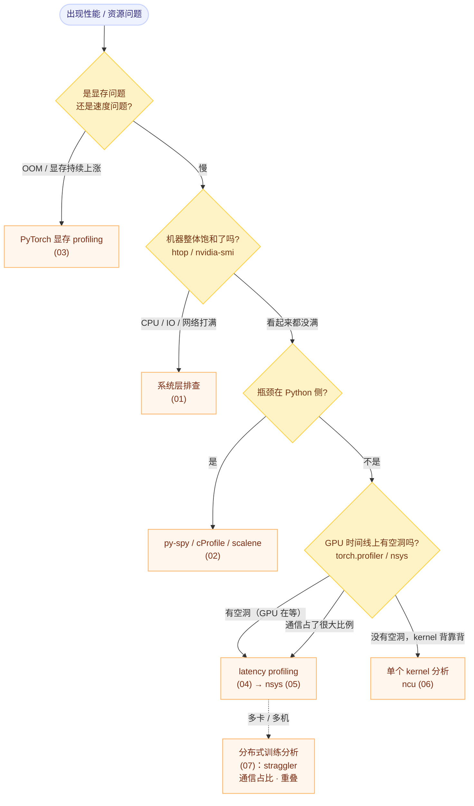

# Profiling 专题：性能问题的分层排查工具箱

## 一句话理解

性能问题**不是靠猜，而是靠逐层缩小范围**。每一层工具有明确的**适用粒度**和**测量代价**：

```text
机器    →   进程（Python）   →   训练 job（op 级）   →   GPU 时间线   →   单个 kernel
htop         py-spy              torch.profiler          nsys              ncu
秒级         函数级               op / kernel 级          时间线            硬件计数器
~零开销      低开销               中等开销                 低开销            极高开销
```

**核心纪律：先用便宜的工具把范围缩小，再用昂贵的工具做定点分析。** 反过来（一上来就 ncu）通常既慢又找错方向。

## 为什么单独建这个专题

优化和测量是两件事，但常常被混为一谈：

- [GPU 算子优化方法论](../../ai/systems/gpu-kernel-optimization-methodology.md) 讲**该往哪优化**（计算 / 通信 / 存储）；
- [GPU 全局内存访存模型](../../ai/systems/gpu-memory-access-model.md) 讲**硬件为什么这么慢**（sector / transaction）；
- 本专题讲**怎么把这一步测出来**——没有可靠的测量，前两篇的结论落不了地。

另一个理由：profiling 工具的**语法细节和坑**（开关、开销、采样 vs 插桩、忘了 warmup）极容易忘，值得单独沉淀成可随手查的速查表。

## 工具地图

| 层级 | 工具 | 粒度 | 开销 | 回答什么问题 |
|---|---|---|---|---|
| 机器 | `htop` / `atop` / `nvidia-smi` / `dcgmi` / `iostat` / `sar` | 秒 | **极低** | 机器是否饱和？谁占的？CPU / 显存 / IO / 网络哪个打满？ |
| 进程内 Python | `cProfile` / `py-spy` / `scalene` / `line_profiler` | 函数 / 行 | 低 ~ 中 | Python 侧的热点在哪？时间花在自己算还是在等？ |
| 训练 job 显存 | `torch.cuda.memory_*` / `_record_memory_history` | 分配事件 | 低 | 显存去哪了？是需求大、碎片，还是泄漏？ |
| 训练 job 时间 | `torch.profiler`（Kineto） | op / kernel | 中 | 时间花在哪些 op？通信占比多少？有没有同步打断？ |
| GPU 时间线 | `nsys` | CUDA API / kernel / 同步 / NCCL | 低（API 级插桩） | 有没有 GPU 空洞？CPU 瓶颈？通信与计算重叠了吗？ |
| 单个 kernel | `ncu` | 硬件计数器（需 kernel 重放） | **极高** | 这个 kernel 为什么慢：算力受限、带宽受限还是延迟/occupancy 受限？ |

## 决策树：从现象出发



## 四条排查原则

1. **先粗后细，先便宜后昂贵。** 顺序永远是 机器 → 进程 → job → 时间线 → 单 kernel。跳过前面几层直接上 ncu，最常见的结局是"分析了半天一个本来就不该被调用的 kernel"。
2. **先建立 baseline 和稳态。** 第一次迭代包含 cuDNN autotune、kernel 编译（Triton / NVRTC）、显存分配器预热——**这些都不代表稳态**。只测量"跑了几十步之后"的窗口。
3. **区分"变慢"与"变慢的原因在别处"。** 一个 kernel 慢，可能是因为它前面有个同步把它拖住了，也可能是它拿到的数据布局不对。**单 kernel 指标只有在时间线确认它是热点之后才有意义。**
4. **优化前后必须同条件复测。** 固定 batch、seq len、精度、并行策略、warmup 步数、随机种子；报告 wall-clock 而不是只报 step time（kernel 变快但通信变慢是常见结果）。

## 采样 vs 插桩：先想清楚代价

| 方式 | 代表工具 | 代价特征 | 能看到什么 | 看不到什么 |
|---|---|---|---|---|
| **采样** | `py-spy`、`htop`、`perf`、nsys 的 CPU 采样 | 开销 ~ 与采样频率成正比，可线上 | 长时间运行的真实分布；不改变程序行为 | 比采样间隔更短的事件 |
| **确定性插桩** | `cProfile`、`torch.profiler`、`nsys` 的 CUDA trace | 每次调用都记录，开销随调用次数增长 | 精确的调用次数与嵌套关系 | 插桩本身会扭曲时序（对大量小函数尤其严重） |
| **硬件计数器 + 重放** | `ncu` | 每个 kernel 重放多遍，慢几个数量级 | 硬件级真相（sector、stall 原因、occupancy） | 端到端时间（时序已被完全改变） |

## 分布式训练的三个额外注意点

1. **每个 rank 都要看。** 全局平均会掩盖"某个 rank 慢"（straggler）——它往往是整个 job 的瓶颈。
2. **通信要单独计量。** NCCL kernel 会以 kernel 的形式出现在时间线上，要单独看它的占比，并确认它与计算是否**重叠**（重叠失败会让总时间 ≈ 计算 + 通信）。
3. **便宜的工具要在每台机器上跑。** `htop` / `nvidia-smi` 在训练中周期性采集（例如每 10 秒一行日志）成本极低，能抓到偶发的网络抖动、CPU 抢占、显存爬升。

## 本专题笔记

| # | 笔记 | 解决什么 |
|---|---|---|
| 01 | [系统层观测：htop、nvidia-smi 与 IO / 网络](01-system-level-observability.md) | 零成本确认机器是否饱和、资源被谁占用 |
| 02 | [Python profiling：cProfile、py-spy、scalene、memray](02-python-profiling.md) | 定位 Python 侧热点、阻塞与内存增长 |
| 03 | [PyTorch 显存 profiling](03-pytorch-memory-profiling.md) | 区分"需求大 / 碎片 / 泄漏"，读懂显存快照 |
| 04 | [PyTorch latency profiling：torch.profiler](04-pytorch-latency-profiling.md) | op 级时间线与 CPU/GPU 空心化诊断 |
| 05 | [Nsight Systems（nsys）](05-nsight-systems-nsys.md) | 系统级时间线：空洞、同步、通信重叠 |
| 06 | [Nsight Compute（ncu）](06-nsight-compute-ncu.md) | 单 kernel 的硬件计数器：是带宽、算力还是延迟受限 |
| 07 | [PyTorch 分布式训练性能分析](07-pytorch-distributed-profiling.md) | straggler、通信占比、通信与计算重叠；DDP / FSDP 的调优旋钮 |

## Related

- [GPU 算子优化方法论：计算、通信、存储](../../ai/systems/gpu-kernel-optimization-methodology.md) — 测出瓶颈之后该往哪优化
- [GPU 全局内存访存模型：向量化与合并访存](../../ai/systems/gpu-memory-access-model.md) — ncu 里 `Sectors Per Request` 的理论依据
- [CUTLASS / CuTe 专题](../../ai/systems/cutlass/) — 被 profile 的对象：GEMM kernel 的三级 Tiling 与 TiledCopy
- [PyTorch 专题](../../ai/systems/pytorch/) — 被 profile 的对象：框架、编译栈与分布式
- [Engineering](../) — 工程工具主题入口

## References

- PyTorch, [torch.profiler](https://pytorch.org/docs/stable/profiler.html) 与 [CUDA memory 管理](https://pytorch.org/docs/stable/torch_cuda_memory.html)
- PyTorch, [Understanding GPU Memory](https://pytorch.org/blog/understanding-gpu-memory-1/)（memory snapshot 与 memory_viz 官方教程）
- NVIDIA, [Nsight Systems 用户手册](https://docs.nvidia.com/nsight-systems/) 与 [Nsight Compute 用户手册](https://docs.nvidia.com/nsight-compute/)
- [py-spy](https://github.com/benfred/py-spy)、[scalene](https://github.com/plasma-umass/scalene)、[memray](https://github.com/bloomberg/memray)
- [nvitop](https://github.com/XuehaiPan/nvitop) — 终端里的 GPU 进程监视器
