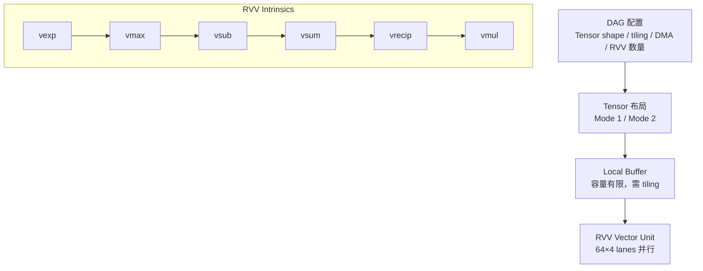

# RVV 算子设计大赛备考指南（Softmax 实战案例）

## 一句话理解

在带 **Local Buffer + DMA + 定制 RVV Intrinsic** 的 AI 加速器上写算子，核心不是背 Softmax 公式，而是把 **DAG 配置 → Tensor 布局（Mode 1/2）→ Local Buffer → DMA → 多 RVV 并行** 这条数据流打通。本笔记基于大赛提供的三张设计图（Local Buffer Layout / Available Intrinsics / DAG Info），完整梳理概念并给出 Softmax 的标准实现与 FP16 3D 版本。

## 大赛背景与整体架构

大赛提供的三张图其实是在描述一个 **基于 RVV 的 3D Softmax kernel 开发环境**：

> **第一张**：数据在 Local Buffer 里怎么排（Memory Layout）。
> **第二张**：你手里有哪些 RVV 向量指令/封装可以用（Intrinsics）。
> **第三张**：DAG 告诉 kernel 应该处理多大的 Tensor、怎么切 tile、怎么 DMA、用多少个 RVV。



写 kernel 时需同时考虑：

```
1. Tensor 是什么 shape？            2. Tensor 在 Local Buffer 中怎么排？
3. reduction axis 是哪一个？        4. 哪个维度最适合 vectorize？
5. Local Buffer 能不能一次放下？     6. 放不下怎么 tile？
7. DMA 怎么搬？                     8. 用几个 RVV？
9. RVV intrinsic 怎么组合？
```

## 一、Local Buffer Layout（数据怎么放）

### 坐标约定

```text
x = w  → width
y = h  → height
z = c  → channel
```

一个 3D Tensor `[H, W, C]` 在此理解成 `[Y, X, Z]`。

### Mode 1 / Mode 2 布局定义

```text
2D mode 1: [xn][zn][x64][z4]
2D mode 2: [zn][xn][z64][x4]
3D mode 1: [yn][xn][zn][y8][x8][z4]
3D mode 2: [zn][yn][xn][z64][x4]
```

这是 **blocked / tiled memory layout**：每个逻辑维度被拆成 outer part 和 hardware-friendly inner block。以 2D Mode 1 `[xn][zn][x64][z4]` 为例，假设 $X=100, Z=130$：

```text
xn ≈ ceil(100/64) = 2
zn ≈ ceil(130/4)  = 33
```

同一个 Tensor，Mode 1 与 Mode 2 的**物理地址完全不同**，kernel 不能随便假设 layout。

### 关键：reduction axis 决定 layout

```text
softmax_3d_reduce_h  → 3D mode 2
softmax_3d_reduce_w  → 3D mode 2
softmax_3d_reduce_c  → 3D mode 1   ← 因为 Mode 1 内层有 z4 block，适合 C 方向 reduction
```

**为什么 reduce C 用 Mode 1？** 因为内层 `z4` 使 C/Z 方向访问规整，硬件可以高效做 `load → vector op → reduce`。

## 二、Available RVV Intrinsics（数据怎么算）

| Intrinsic | 语义 | 对应标准 RVV | Softmax 中的角色 |
|---|---|---|---|
| `vexp(a)` | $y_i=e^{a_i}$ | 无标准指令，需自实现/硬件提供 | 核心：$\exp(x)$ |
| `vmax(a,b)` | element-wise max | `vfredmax` 或逐元素 | 求最大值 |
| `vmax(a)` | reduction max（vector→scalar） | `vfredmax_vs` | $m=\max_i(x_i)$ |
| `vsub(a,b)` | $y_i=a_i-b_i$ | `vfsub` | $x_i - m$（防溢出） |
| `vsum(a)` | reduction sum | `vfredsum_vs` | $\sum \exp(x_i-m)$ |
| `vrecip(a)` | $1/a$ | `vfrec7`+refinement | $1/\sum$ |
| `vmul(a,h)` | $y_i=a_i \times h_i$ | `vfmul` | 归一化 |
| `vadd(a,b,sum)` | element-wise add（含累加器） | `vfadd` | 累加 |
| `to_vdfp16(a)` | FP32 转 FP16 | `vfncvt` | 精度/容量权衡 |
| `vbc_splt16(x)` | 标量广播成向量 | `vfmv.v.f` | max 广播后做减法 |
| `vs2d(a, mask, b)` | sublane 拷贝（mask 承担 sublane 选择） | 定制 | 数据重排 |

### 关键：64 × 4 lanes 结构

```text
vdfp16 data type: 64 x 4 lanes parallel   = 64 个 lane，每个 4 个 sublane = 256 个 FP16
vsfp16 data type: 64 lanes parallel
```

而 `vsum(a)` 是 **Reduce [64][4] subtiles to [64]**：把每个 lane 的 4 个 sublane 归约成一个值。

```text
[64][4]
   │  vsum
   ▼
 [64]
```

## 三、DAG 配置（硬件怎么调度）

### rvv_mask / dma_mask

```text
rvv_mask: 15 = 00001111  → 使用 4 个 RVV（RVV0~RVV3）
dma_mask: 15             → DMA 数据搬运到 4 个 RVV
```

- `rvv_mask`：计算资源启用哪些 RVV
- `dma_mask`：DMA 数据发送到哪些 RVV / buffer

### 其他关键字段

| 字段 | 含义 | 示例 |
|---|---|---|
| `vm_mode` | 当前 Tensor 按哪个 Vector Memory Layout 解释 | 1 → Mode 1 |
| `tile_w / tile_h / tile_c` | Tensor 切 tile 后各方向大小 | 64/32/64 |
| `dma_splitting_direction` | DMA 沿哪个方向切分 | 0→disable, 1→C, 2→H, 3→W |
| `dma_split_size` | 沿指定方向拆成多大的 sub-tensor | 16 |
| `padding_val` | tile 对齐填充值 | **必须符合算法语义** |

### padding_val 的坑

Softmax 有 max / exp / sum。若随便 padding 0：

- 对 max：padding 值若比真实数据大 → max 错误
- 对 sum：padding 会影响 $\sum e^{x-m}$

所以 padding 必须考虑算法语义（如 max reduction 用 $-\infty$，sum 用 0）。

### 大赛保证（降低难度）

```text
For simplicity, the provided test cases guarantee no tiling
is required on the reduction dimension.
```

即 reduction dimension 可以一次性放进 Local Buffer（如 reduce C 时 `tile_c == C`），无需做 partial max / global max 两遍归约。

## 四、Softmax 标准实现（float32）

标准 RVV 实现，先把数据流跑通（标准 RVV 没有 `vexp` 指令，先用 `std::exp` 做 reference）：

```cpp
#include <riscv_vector.h>
#include <cmath>
#include <cstddef>
#include <algorithm>

void softmax_rvv_f32(const float* input, float* output, size_t C)
{
    if (C == 0) return;

    // ===== Step 1: max(x) =====
    float max_val = -INFINITY;
    size_t offset = 0;
    while (offset < C) {
        size_t vl = __riscv_vsetvl_e32m1(C - offset);
        vfloat32m1_t vx = __riscv_vle32_v_f32m1(input + offset, vl);
        vfloat32m1_t vzero = __riscv_vfmv_v_f_f32m1(max_val, vl);
        vfloat32m1_t vmax = __riscv_vfredmax_vs_f32m1(vx, vzero, vl);
        max_val = __riscv_vfmv_f_s_f32m1(vmax);
        offset += vl;
    }

    // ===== Step 2: sum(exp(x - max)) =====
    float sum_exp = 0.0f;
    offset = 0;
    while (offset < C) {
        size_t vl = __riscv_vsetvl_e32m1(C - offset);
        vfloat32m1_t vx = __riscv_vle32_v_f32m1(input + offset, vl);
        vfloat32m1_t vx_shift = __riscv_vfsub_vf_f32m1(vx, max_val, vl);
        float tmp[256];
        __riscv_vse32_v_f32m1(tmp, vx_shift, vl);
        for (size_t i = 0; i < vl; ++i) {
            tmp[i] = std::exp(tmp[i]);
            sum_exp += tmp[i];
        }
        offset += vl;
    }

    // ===== Step 3: inv_sum = 1 / sum =====
    float inv_sum = 1.0f / sum_exp;

    // ===== Step 4: output = exp(x - max) * inv_sum =====
    offset = 0;
    while (offset < C) {
        size_t vl = __riscv_vsetvl_e32m1(C - offset);
        vfloat32m1_t vx = __riscv_vle32_v_f32m1(input + offset, vl);
        vfloat32m1_t vx_shift = __riscv_vfsub_vf_f32m1(vx, max_val, vl);
        float tmp[256];
        __riscv_vse32_v_f32m1(tmp, vx_shift, vl);
        for (size_t i = 0; i < vl; ++i) tmp[i] = std::exp(tmp[i]);
        vfloat32m1_t vexp = __riscv_vle32_v_f32m1(tmp, vl);
        vfloat32m1_t vy = __riscv_vfmul_vf_f32m1(vexp, inv_sum, vl);
        __riscv_vse32_v_f32m1(output + offset, vy, vl);
        offset += vl;
    }
}
```

### 大赛 Intrinsic 版本（伪代码）

```cpp
void softmax_rvv(const vdfp16_t* input, vdfp16_t* output, int size)
{
    // Pass 1: max
    float max_val = -INFINITY;
    for (int offset = 0; offset < size; ) {
        int vl = get_vl(size - offset);
        vdfp16_t x = vload(input + offset);
        max_val = std::max(max_val, vmax(x));   // vmax 是 reduction
        offset += vl;
    }

    // Pass 2: sum(exp(x - max))
    float sum = 0.0f;
    for (int offset = 0; offset < size; ) {
        int vl = get_vl(size - offset);
        vdfp16_t x = vload(input + offset);
        x = vexp(vsub(x, max_val));
        sum += vsum(x);                          // [64][4] → [64] → 再累加
        offset += vl;
    }

    // Pass 3: normalize
    float inv_sum = vrecip(sum);
    for (int offset = 0; offset < size; ) {
        int vl = get_vl(size - offset);
        vdfp16_t x = vload(input + offset);
        x = vmul(vexp(vsub(x, max_val)), inv_sum);
        vstore(output + offset, x);
        offset += vl;
    }
}
```

### 三遍 vs 两遍 exp

- **方法 A（保存 exp）**：多一个 `exp_buffer[C]`，exp 只算一遍
- **方法 B（重算 exp）**：不占 buffer，但 exp 算两遍

```text
         Pass1: max
input ── Pass2: exp + sum ── 需要保存 exp 或第三遍重算
         Pass3: normalize
```

大赛强调 **Local RAM 容量有限**，所以方法 B（重算 exp）更合理，除非 C 很小。

## 五、FP16 + 3D Tensor + Reduce-C 版本

### 推荐设计

> **输入/输出 FP16，但 reduction 累加用 FP32。**

```text
Input FP16 → convert → FP32 → max / exp / sum → FP32 → convert → FP16 output
```

原因是 FP16 的 sum(exp(x)) 容易 overflow / underflow / 精度损失。

### 核心代码（FP16 3D reduce-C）

```cpp
void softmax_3d_reduce_c_fp16(
    const __fp16* input, __fp16* output,
    int H, int W, int C)
{
    for (int h = 0; h < H; ++h) {
        for (int w = 0; w < W; ++w) {
            const __fp16* x = input + ((size_t)h * W + w) * C;
            __fp16* y = output + ((size_t)h * W + w) * C;

            // ===== PASS 1: max =====
            float max_val = -INFINITY;
            int offset = 0;
            while (offset < C) {
                int vl = get_vl_fp16(C - offset);
                vfp16_t vx = vload_fp16(x + offset, vl);
                float local_max = (float)vmax(vx, vl);
                max_val = std::max(max_val, local_max);
                offset += vl;
            }

            // ===== PASS 2: sum = Σ exp(x - max)（FP32 累加）=====
            float sum = 0.0f;
            offset = 0;
            while (offset < C) {
                int vl = get_vl_fp16(C - offset);
                vfp16_t vx = vload_fp16(x + offset, vl);
                vx = vexp(vsub(vx, (__fp16)max_val, vl), vl);
                sum += (float)vsum(vx, vl);
                offset += vl;
            }

            // ===== PASS 3: inv_sum =====
            float inv_sum = 1.0f / sum;

            // ===== PASS 4: output = exp(x-max) * inv_sum =====
            offset = 0;
            while (offset < C) {
                int vl = get_vl_fp16(C - offset);
                vfp16_t vx = vload_fp16(x + offset, vl);
                vx = vsub(vx, (__fp16)max_val, vl);
                vx = vexp(vx, vl);
                vx = vmul(vx, (__fp16)inv_sum, vl);
                vstore_fp16(y + offset, vx, vl);
                offset += vl;
            }
        }
    }
}
```

### 结合 64×4 的更硬件化版本

```cpp
void softmax_3d_reduce_c_fp16(const vdfp16* input, vdfp16* output, int H, int W, int C)
{
    for (int h = 0; h < H; ++h) {
        for (int w = 0; w < W; ++w) {
            vdfp16* x = input + (h * W + w) * C;
            vdfp16* y = output + (h * W + w) * C;

            // Step 1: max（按 64 步进加载）
            vdfp16 vmax_acc = ...;
            for (int c = 0; c < C; c += 64) {
                vdfp16 vx = vload(x + c);
                vmax_acc = vmax(vmax_acc, vx);
            }
            __fp16 max_value = reduce_max(vmax_acc);

            // Step 2: exp + sum
            __fp16 sum = 0;
            for (int c = 0; c < C; c += 64) {
                vdfp16 vx = vload(x + c);
                vx = vexp(vsub(vx, max_value));
                vsfp16 partial = vsum(vx);        // [64][4] → [64]
                sum += reduce_sum(partial);
            }

            // Step 3/4: reciprocal + normalize
            __fp16 inv_sum = vrecip(sum);
            for (int c = 0; c < C; c += 64) {
                vdfp16 vx = vload(x + c);
                vx = vmul(vexp(vsub(vx, max_value)), inv_sum);
                vstore(y + c, vx);
            }
        }
    }
}
```

### `vrecip` 精度问题

若硬件 `vrecip()` 精度不够，可用 Newton-Raphson 修正：

$$r_0 \approx \frac{1}{x}, \quad r_1 = r_0(2 - x r_0), \quad r_2 = r_1(2 - x r_1)$$

## 六、FP16 Softmax 最容易踩的坑

1. **直接 `exp(x)` 而非 `exp(x - max)`**：$x=100$ 时 overflow
2. **用 FP16 做 sum**：$C$ 大时精度不够，应 FP32 累加
3. **C 不是 VL 整数倍**：用 `vl = vsetvl(C - offset)` 自动处理 tail（RVV 优势，无需手写大量 mask）
4. **padding 值影响算法**：max reduction 别 padding 正值
5. **reduction dimension 上的 tiling**：需要 partial max/global max 两遍，大赛已保证不用做

## 七、深入研究的 6 个知识点（按顺序）

1. **RVV Vector Architecture**：VL / VLMAX / SEW / LMUL / mask
2. **Vector Memory Layout**：contiguous / strided / blocked / interleaved / tile / sublane
3. **Reduction**：vector reduction / horizontal / tree / partial —— Softmax、LayerNorm、RMSNorm、Mean、MaxPool 全部依赖
4. **Tiling**：Global → DMA → Local Buffer → RVV，及 tile_h/w/c 选择
5. **Data Layout Transformation**：Mode 1 ↔ Mode 2 本质是 layout transform
6. **Roofline**：Compute Bound vs Memory Bound——kernel 慢不一定是 RVV 指令少，可能是 DMA / Local Buffer 带宽 / layout / cache miss / vector utilization

## 八、标准 RVV ISA 与项目定制的分界线

**不要把 `Mode 1/2`、`vdfp16`、`vsfp16`、`vs2d`、`rvv_mask` 当成标准 RISC-V Vector ISA。**

```
标准 RVV ISA（vadd/vmul/vsetvl/mask/SEW/LMUL/load-store）
   ↓
硬件厂商/项目自己的 Vector abstraction（vdfp16/vs2d/VM）
   ↓
Local Buffer / DMA / DAG 配置
```

这是读这个项目源码时最重要的一条分界线。

## 我的理解

这个大赛的题目设计得很巧妙：**Softmax 的数学只有 5 步（max → sub → exp → sum → recip → mul），但它逼你把 AI 加速器 kernel 开发的完整链路走一遍**——从 DAG 读配置、按 Mode 布局解释内存、用 DMA 搬运、用多 RVV 并行、处理 tiling 与 padding。这比单纯写一个标准 RVV softmax 有价值得多。

核心思维转变：**不要先想"怎么写 C/C++"，而要先想数据流**——

```text
Tensor → Shape → Reduction Axis → Memory Layout → Vectorization Axis
       → Tile → DMA → Register → Intrinsic
```

先设计数据流，再写代码。这和我之前总结的"先理解数据布局，再写算子"是同一个方法论。

## Related

- [RVV 算子开发必备基础知识](./rvv-operator-development.md) — 标准 RVV 的 SEW/LMUL/stripmining 基础，与本文的定制硬件抽象互补
- [AI 开源项目源码精读指南](../ai/systems/ai-open-source-source-reading.md) — Triton/llama.cpp 等项目的 kernel 优化方法论

## References

- [ChatGPT 对话原文](https://chatgpt.com/share/6a7d3d75-6da4-83e8-baaa-04c6e761b73a)
- [RISC-V "V" Vector Extension 1.0 Specification](https://github.com/riscv/riscv-v-spec)
- [RISC-V Vector Intrinsics Documentation](https://dzaima.github.io/rvv-intrinsics/)
