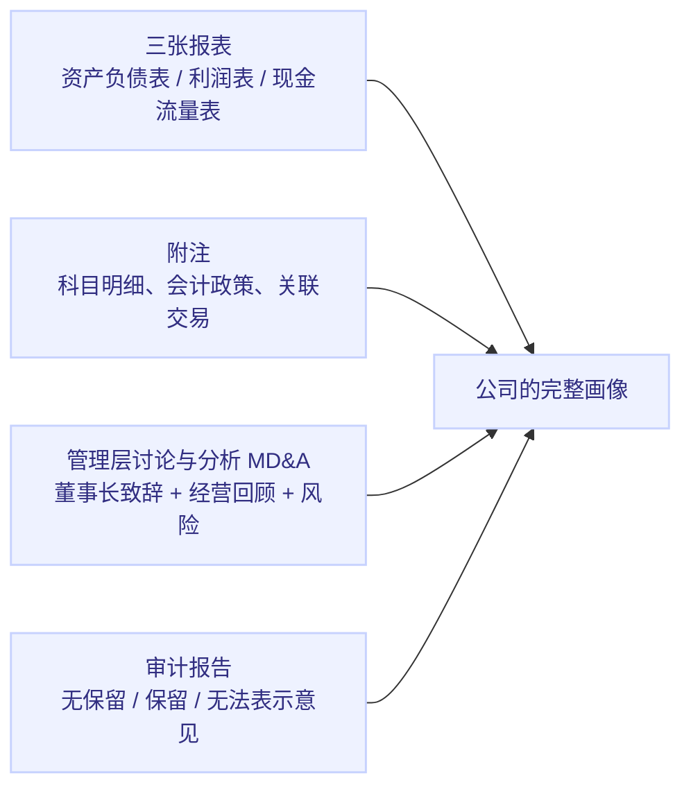
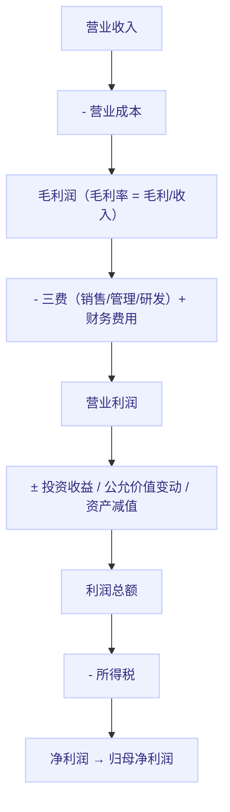

# 上市公司财报阅读指南

## 一句话理解

财报是上市公司面向股东的"成绩单 + 体检报告"：它把一年（或一季度）的经营活动压缩成三张相互勾稽的表格。读懂财报，不是记住每个科目的定义，而是**沿着"钱从哪来 → 钱去哪了 → 赚没赚钱 → 赚的是不是真钱"这条主线，识别企业的生意质量和数字的真伪**。

> 免责声明：本文是个人学习笔记，**不构成任何投资建议**。

## 为什么重要

- 财报是投资者和企业之间唯一强制、可比、有审计背书的信息来源（相比传闻和研报）
- 绝大多数财务造假最终都写在报表里，只是藏得深——会读报表相当于有了"X 光机"
- 它是估值（内在价值、安全边际）的输入基础：不懂报表，估值就是空中楼阁

## 财报全家桶：不止三张表

一份完整年报包含（按阅读优先级）：

- **三张报表**：核心数字
- **附注**：数字的"说明文档"，很多雷藏在明细里（应收账款账龄、商誉减值测试、关联交易）
- **MD&A（管理层讨论与分析）**：管理层自己怎么讲故事，最有信息量也最需警惕
- **审计意见**：独立会计师的背书等级，**"无法表示意见"≈ 直接拉黑**

## 第一张表：资产负债表（家底）

### 一句话

**某一时刻（如 12 月 31 日）公司有多少东西（资产），其中多少是自己的（股东权益），多少是借的（负债）。**

$$
\text{资产} = \text{负债} + \text{所有者权益}
$$

### 关键科目逐个看

**资产侧（钱去哪了）**

| 科目 | 通俗含义 | 怎么看 |
|---|---|---|
| 货币资金 | 账上现金 | 多≠好事（可能闲置），与有息负债同时高=异常（"存贷双高"是造假经典红旗） |
| 应收账款 | 卖了货没收回的钱 | 增速 > 营收增速 = 放松信用换收入，利润含金量下降 |
| 存货 | 仓库里的货 | 增速 > 营收 + 毛利率走高 = 可能是滞销或虚增（利润藏在存货里） |
| 固定资产/在建工程 | 厂房设备 | 重资产公司的命脉；在建工程长期不转固是藏费用的手法 |
| 商誉 | 收购多付的溢价 | 没有实物，减值即暴雷；商誉/净资产 > 30% 要警惕 |
| 其他应收款/其他流动资产 | "其他"类 | **数字异常的"其他"= 资金可能被占用或体外循环**，造假高发地 |

**负债侧（钱从哪来）**

| 科目 | 通俗含义 | 怎么看 |
|---|---|---|
| 短期借款/长期借款 | 借的钱 | 有息负债总量与利息费用匹配 |
| 应付账款/预收款项 | 欠供应商的 / 客户先付的 | 大 = 对上下游有话语权（好生意，如茅台预收高） |
| 合同负债 | 收了钱还没交货 | 增长 = 未来收入的蓄水池，是"未来营收"的先行指标 |

**权益侧**：实收资本（本金）、资本公积、未分配利润（历年攒下的利润）。未分配利润高但常年不分红 + 账面现金少 = 钱可能"被做成利润"了。

### 最值得做的三件事

1. **看有息负债 vs 货币资金**："存贷双高"（现金多 + 借款多）违反常识，十有八九现金是假的
2. **看应收账款 + 存货增速 vs 营收增速**：连续多年显著快于营收，利润可能是纸面的
3. **看商誉与"其他"科目**：有没有藏雷

## 第二张表：利润表（生意）

### 一句话

**一段时间（如一年）赚了多少、在哪一步赚的。**

$$
\text{净利润} = \text{营业收入} - \text{营业成本} - \text{费用} \pm \text{其他损益}
$$

### 从收入到净利的"漏斗"

### 关键观察点

- **毛利率**：第一道护城河。连续提升 = 有定价权；逐年下滑 = 竞争加剧或被客户拿捏
- **三项费用率**：销售费用率暴涨 = 靠烧钱换收入；研发费用率（科技公司）高低看赛道
- **非经常性损益**：卖资产、政府补贴、公允价值变动。**"扣非净利润"（扣掉这些一次性项目）才是核心盈利**——经常看到"利润暴涨 300%"，扣非后其实是负的
- **归母净利润 vs 净利润**：差额来自少数股东。差额异常大 = 利润可能被安排在少数股东那头（子公司持股结构异常）
- **利润 vs 经营现金流**：见第三张表，是"利润是不是真的"的照妖镜

## 第三张表：现金流量表（真金白银）

### 一句话

**一段时间内，钱在经营、投资、融资三个活动中真实的进出。**

### 三分类

| 活动 | 内容 | 好生意特征 |
|---|---|---|
| **经营活动** | 卖货收钱、买料付钱、发工资缴税 | **经营现金流 > 净利润**（利润有真钱支撑） |
| **投资活动** | 买设备、收购、理财 | 长期资本开支合理，不盲目扩张 |
| **融资活动** | 借款、还债、发股、分红、回购 | 好公司常年是"融得少、分得多" |

### 最核心的一个对比

$$
\text{净利润} \text{ vs } \text{经营活动现金流净额}
$$

| 情况 | 含义 |
|---|---|
| 经营现金流 ≈ 净利润 | 正常，利润有真钱 |
| 经营现金流 **常年远小于** 净利润 | 利润是纸面的（应收账款、存货堆出来的），严重时要怀疑造假 |
| 经营现金流 **远大于** 净利润 | 可能预收多/折旧大，通常是健康的（如平台公司、白酒） |

第二个对比：**净现比 = 经营现金流 / 净利润**，连续多年 < 0.7 就该认真查原因了。

## 三张表怎么串起来：杜邦分析

不满足于"ROE 高不高"，要看 ROE 从哪来。杜邦分解：

$$
ROE = \frac{\text{净利润}}{\text{净资产}} = \underbrace{\frac{\text{净利润}}{\text{营业收入}}}_{\text{净利率（赚得狠不狠）}} \times \underbrace{\frac{\text{营业收入}}{\text{总资产}}}_{\text{周转率（转得快不快）}} \times \underbrace{\frac{\text{总资产}}{\text{净资产}}}_{\text{杠杆（借得多不多）}}
$$

三张表在这里交汇：净利率看利润表，周转率看资产负债表，杠杆看资产负债表两侧。

| 高 ROE 来源 | 类型 | 例子 | 风险 |
|---|---|---|---|
| 高净利率 | 品牌/垄断型 | 茅台、微软 | 低（护城河） |
| 高周转率 | 薄利多销型 | 沃尔玛、永辉 | 中（易被电商冲击） |
| 高杠杆 | 借钱滚雪球型 | 银行、地产 | 高（负债端波动致命） |

## 读财报的实操步骤（新手友好）

1. **先看审计意见**：不是"无保留意见"直接放弃（5 分钟）
2. **再看 MD&A 与董事会报告**：管理层自己怎么讲（注意和上一年对比，说了没做到 = 红旗）
3. **三张表看三年**：单年数字没意义，趋势才有意义（营收/利润/现金流/负债各自的方向）
4. **算关键比率**：毛利率、净利率、ROE、净现比、有息负债率（套表格，30 分钟）
5. **找异常**：任何"增速与同行背离、科目与常识矛盾"的点
6. **下钻附注**：对异常科目看明细（应收账龄、存货构成、商誉减值测试假设、关联交易）
7. **写一页纸结论**：这公司的钱从哪来、去哪了、赚不赚钱、赚的是不是真钱、最大的雷在哪

## 财务造假识别：经典红旗清单

| 红旗 | 背后手法 |
|---|---|
| **存贷双高**（现金多 + 借款多） | 现金可能是假的（被大股东占用或体外） |
| 经营现金流长期远小于净利润 | 利润靠应收账款/存货堆出 |
| 应收账款增速持续 > 营收增速 | 放宽信用冲收入，甚至虚构客户 |
| 存货异常增长 + 毛利率逆势上升 | 成本藏在存货里，虚增利润 |
| 在建工程长期不转固 | 利息与成本资本化，美化利润 |
| 其他应收款/其他流动资产异常大 | 资金被关联方占用 |
| 频繁收购 + 商誉不断累积 | 高溢价收购输送利益，日后减值暴雷 |
| 毛利率显著高于同行且无解释 | 收入造假（大客户、新市场） |
| 高管/大股东持续减持 | 内部人知道真相 |
| 审计师更换频繁 / 频繁更换会计事务所 | 事务所不敢出具干净意见 |

一句话：**所有造假都在回答同一个问题——"利润是真的吗？"，而答案几乎总在"现金流 + 应收/存货 + 其他应收款"里。**

## 常见误区

| 误区 | 澄清 |
|---|---|
| 财报是精确的 | 大量科目依赖估计与判断（减值、折旧年限），是"艺术"不是"科学" |
| 净利润 = 赚到的钱 | 净利润是权责发生制的账本，现金流才是银行卡 |
| 每股收益高 = 好公司 | 可以靠回购、靠杠杆、靠一次性收益堆出来 |
| 只读最新一期 | 必须看 3-5 年趋势，单期数字会骗人 |
| 数字符合预期就没问题 | 更要看"数字怎么来的"（会计政策、附注明细） |
| 同行业公司报表可直接比 | 会计政策、杠杆、业务结构不同，先统一口径 |

## My Understanding

- 财报阅读的捷径只有一个：**用常识检验数字**。任何一个"不合常理"的数字背后，要么是生意特殊（需要搞懂），要么是账有问题（需要远离）
- 三张表是同一件事的三种投影：资产负债表是"存量的家底"，利润表是"增量的成果"，现金流量表是"成果的真伪"。只看一张必被骗，三张对不上必有鬼
- 对公司质量判断最有用的三个组合：**毛利率趋势 + ROE 来源（杜邦）+ 净现比**
- 下一步打算：找 3-5 家熟悉的公司年报实操一遍，建立自己的检查清单（checklist）

## Open Questions

- 新收入准则（合同负债 vs 预收款）对互联网/软件公司收入确认的影响
- 如何识别关联方之间的"体外循环"收入造假（如康美、瑞幸案）
- 港股/A 股/美股财报格式差异与披露习惯
- 如何用现金流贴现（DCF）把财报数字接到估值上

## Related Knowledge

- [价值投资入门](./value-investing-intro.md) — 财报是估值与安全边际的输入；指标速查（ROE/ROIC/FCF 等）详见该笔记
- [数学知识](../mathematics/) — 复利、期望值思维

## References

- 中国证监会/上交所/深交所：上市公司年报编制与披露准则
- 张新民，《从报表看企业——数字背后的秘密》
- 唐朝，《手把手教你读财报》
- Penman, *Financial Statement Analysis and Security Valuation*
- Buffett, *The Essays of Warren Buffett*（财务分析章节）
- CFA Level I, FSA（财务报告分析）考纲
