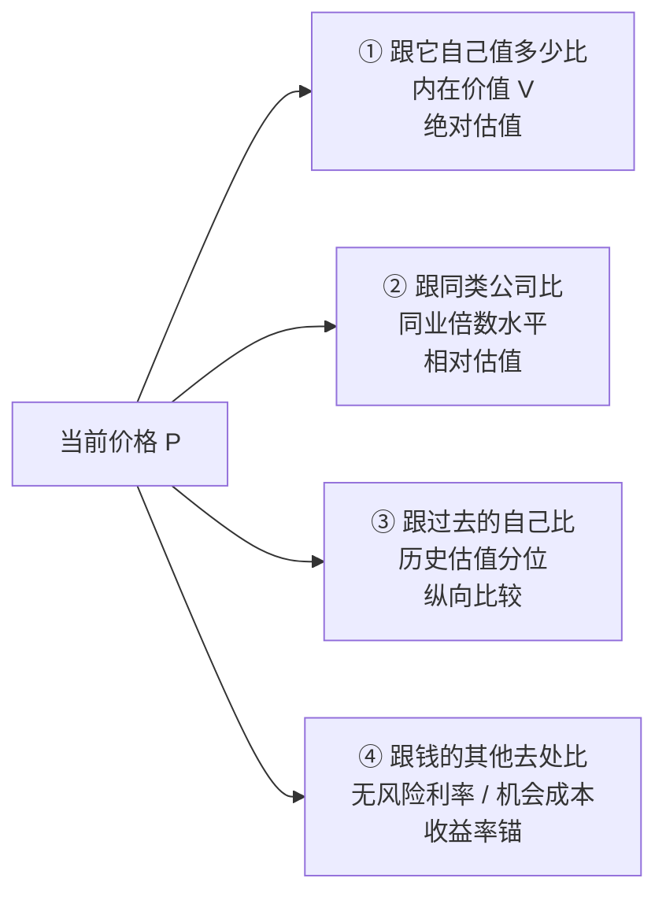

# 什么是"贵"：比较才有意义

> 免责声明：本文是个人学习笔记，**不构成任何投资建议**。

## 一句话理解

股价本身没有"贵贱"这个属性，**价格只有在放进参照系之后才有意义**。说一只股票"贵"，其实是在说：在某个参照系里，它的价格显著高于该参照系给出的合理水平。所以判断贵不贵的第一步不是算指标，而是**选定参照系**——不同参照系会得出不同甚至相反的结论，而它们各自只回答一种问题。

## 为什么重要

- 大多数错误的买入，不是"买了坏公司"，而是"用了错误的参照系给一个好公司定了价"（2000 年科网、2021 年核心资产）
- "PE 低 = 便宜"之类的错觉，本质是把"相对历史的参照系"错当成了"绝对的真理"
- 同一只股票在同一时刻，用不同参照系会得到"很贵/合理/很便宜"三种答案——理解这一点，才能解释为什么有人买、有人卖、且都觉得自己理性

## 四个参照系：跟谁比？

| 参照系 | 问的问题 | 代表方法 | 典型失效场景 |
|---|---|---|---|
| ① 内在价值 | 这家公司未来现金流折回来值多少？ | DCF、FCF yield、DDM | 增长/折现假设难定；轻资产高增长公司 |
| ② 同类公司 | 市场给类似生意定多少钱？ | 同业 PE/PB/EV-EBITDA 中位数 | 整个板块被高估（2000 科网）；"同类"其实不类 |
| ③ 过去的自己 | 比它自己历史贵还是便宜？ | 5-10 年估值分位 | 基本面（增速/ROE/利率）已经变了，历史中枢失效 |
| ④ 机会成本 | 同样的钱买国债/存银行能赚多少？ | 盈利收益率、股息率 vs 无风险利率 | 需要额外承担股权的风险溢价，不能只比名义数字 |

**关键认知**：四个参照系不是"四选一"，而是**四个正交的角度**。任何一个单独使用都会骗人，交叉使用才逼近真相。参见 [05 交叉验证](./05-cross-checks-and-checklist.md)。

## 最本质的一问：现价隐含了什么假设？

这是把"贵不贵"从口号变成可证伪判断的唯一工具。

**观察**：市场出价 $P$ 不是随机的，它隐含了一整套对未来盈利/现金流的假设。任何 DCF 都可以反向求解：给定当前价格、已知的近期现金流，反推出市场要求的隐含增长率为多少。

$$
P = \sum_{t=1}^{\infty} \frac{E[\text{FCF}_t]}{(1+r)^t} \;\Longrightarrow\; \text{反解出隐含的 } g^*, r^*
$$

### 简化版直觉（稳定增长）

若公司进入稳定期，Gordon 增长模型给出：

$$
P = \frac{D_1}{r - g} \qquad\Longleftrightarrow\qquad \frac{D_1}{P} = r - g
$$

即：**股息/盈利收益率（$\frac{D_1}{P}$ 或 $\frac{E}{P}$）≈ 要求的回报率 $r$ 减去永续增长 $g$**。

于是"贵不贵"变成了一道可以做判断题：

| 你的判断 | 结论 |
|---|---|
| 我认为它未来增长 $g=5\%$，而市场隐含 $g=2\%$ | 便宜（市场比我悲观） |
| 我认为它未来增长 $g=3\%$，而市场隐含 $g=12\%$ | 贵（市场比我乐观得多） |
| 我认为 $r$ 应该要 10%（风险高），市场只要求 7% | 贵（市场给的折现率太低=定价太高） |

> **一句话方法论**：贵的本质 = "市场为未来支付的假设，比我愿意相信的更乐观"。便宜的本质反过来。于是价值投资的全部动作收敛为两步——① 认真做出自己的保守假设；② 只在"市场假设比我的更悲观"（现价低于我的保守估值）时出手。

（详细计算与反推方法见 [02 绝对估值](./02-absolute-valuation.md) 与 [05 交叉验证](./05-cross-checks-and-checklist.md)。）

## 宏观版本：整个市场贵不贵 = 隐含股权风险溢价（ERP）

对指数层面同样可以反推：用标普 500 的指数点位、当前分红+回购、预期盈利增速，反解出"买整个市场"的隐含收益率 IRR，再减去 10 年期国债利率，得到**隐含股权风险溢价（Implied ERP）**。

- 参考（Damodaran，2026-01-01）：标普 500 隐含收益率 8.41%，美国 10Y 国债 4.18%，ERP ≈ **4.23%**，与 1960–2025 年均值几乎持平；而 1999 年末 ERP 低至 ~2.05%，是典型的泡沫信号
- 中文市场的通俗版本是"**股债性价比（FED 差值）**"：$\frac{E}{P}$（如万得全A 或沪深300 市盈率倒数）− 10 年期国债收益率。差值为正是"股票比债券多赚的溢价"，历史分位越高说明股票相对越便宜

用途：ERP/股债性价比是**择时与仓位**层面的"贵不贵"（什么时候该多配权益），个股层面的"贵不贵"仍需回到前四个参照系。

## 必须警惕的三个直觉陷阱

1. **股价低 ≠ 便宜，股价高 ≠ 贵**：2 元的股票可以比 200 元的贵十倍——比较的是倍数，不是单价
2. **倍数小 ≠ 便宜**：低 PE 可能只是"盈利正处于周期顶部"或"盈利即将崩塌"的假象（价值陷阱，详见 [04](./04-multiples-by-business-type.md)）
3. **历史分位低 ≠ 便宜**：如果公司的成长中枢、ROE 中枢已经系统性下移，历史分位这把"镜子"本身就失效了

## My Understanding

- "贵不贵"在数学上是一个**比较运算**，缺少参照系时问"贵不贵"等于问"3 大不大"——没有答案。散户最常见的错误是偷偷把参照系设成"隔壁那只股票/它去年价格"，然后不自知
- 最可靠的参照系顺序是：**机会成本（④）做下限，内在价值（①）做核心，同类（②）与历史（③）做证伪**。①② 告诉我"值多少"，③④ 告诉我"现在是不是便宜时机"
- 隐含预期反推是这套思维里最锋利也最反直觉的一招：它把"贵不贵"从主观感觉变成**可以被我的假设证伪**的问题——这正是它比所有倍数都高级的地方

## Open Questions

- 对高增长、远期现金流占比巨大的公司，隐含增长率反推几乎对任何"合理假设"都不敏感——这类公司的"贵不贵"是否本质上不可判定？
- 如何区分"市场隐含假设比我乐观"（贵）与"我根本不了解这个行业所以无法形成假设"（超出能力圈）？两者在决策上应同样处理为"不买"吗？

## Related Knowledge

- [绝对估值](./02-absolute-valuation.md) — 如何用自己的假设算出参照系①
- [相对估值：倍数工具箱](./03-relative-multiples.md) — 参照系②③的具象工具
- [价值投资入门](../value-investing-intro.md) — 价格 vs 价值、市场先生、安全边际的概念底座
