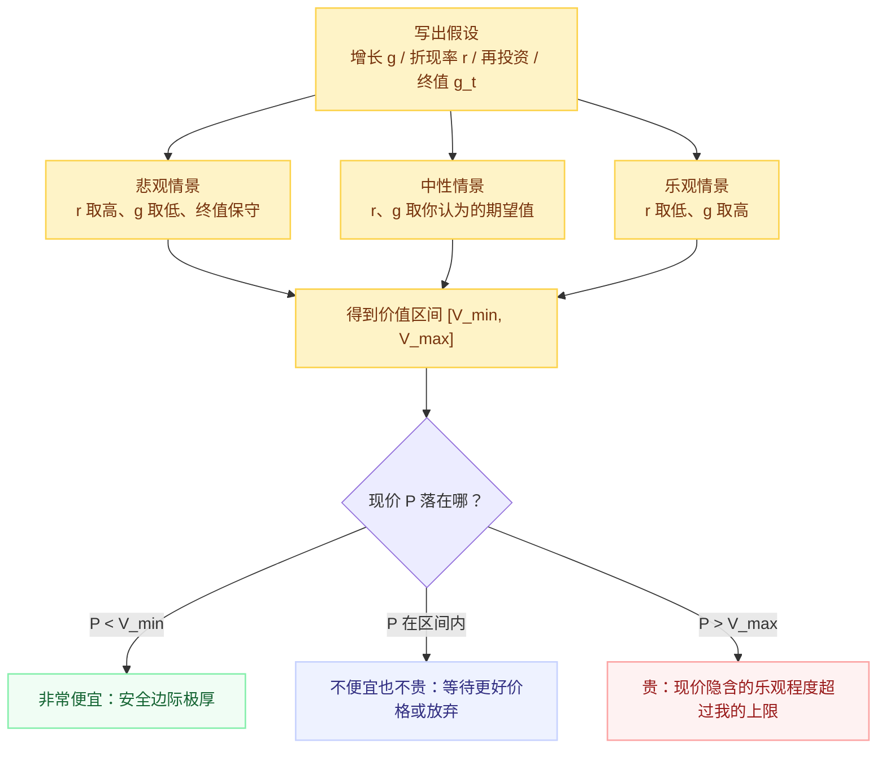

# 绝对估值：跟"它自己值多少"比

> 免责声明：本文是个人学习笔记，**不构成任何投资建议**。

## 一句话理解

绝对估值回答的是"如果我把这家公司整个买下来，它未来能给我的全部现金流，折算到今天值多少"——它**不参考市场给别人的价格**。它真正的产出不是一个"目标价"，而是一个**在悲观/中性/乐观三套假设下的价值区间**，用来回答一个问题：**当前价格，是否低到即使我的假设错得离谱也不会亏？**

## 为什么重要

- 它是唯一"以我自己的判断为锚"的方法：市场给同类的高估值不会传染它（相对估值在系统性泡沫里会跟着一起错，绝对估值不会）
- 它**强迫你写下假设**——增长率、折现率、再投资需求。写下来的假设可以被证伪、被复盘，这正是它比黑箱倍数高级的地方
- 巴菲特定义的内在价值就是绝对估值：*"一家企业在其余下生命里可以取出的现金的折现值"*
- 缺点也必须说在前面：它要求最多的输入，而这些输入可以被分析者操纵来"凑出任何想要的结论"——**质量取决于你是否诚实地写下并检验假设**（Damodaran：所有估值都有偏，问题只是偏多少、往哪个方向）

## 核心工具 1：DCF（自由现金流折现）

### 两阶段 DCF 的骨架

$$
V = \underbrace{\sum_{t=1}^{n} \frac{\text{FCF}_t}{(1+r)^t}}_{\text{显式预测期 } n \text{ 年}} + \underbrace{\frac{\text{Terminal Value}}{(1+r)^n}}_{\text{终值}}
$$

三个变量决定了几乎全部答案：

1. **自由现金流 $\text{FCF}$** = 经营现金流 − 资本开支 = 维持并发展生意后**真正能分给股东的钱**
   - 比净利润诚实：净利润是"账本"，FCF 是"银行卡"（赊销可以做大利润，做不大现金）
   - 巴菲特称之为 **Owner Earnings**：净利润 + 折旧摊销等非现金项 − 维持性资本开支（**注意**：只扣维持性的，成长性的资本开支应视为再投资而非成本）
2. **折现率 $r$** ≈ 无风险利率 + 股权风险溢价 + 该公司的特异性风险溢价。它是"机会成本"：同样的钱不买它、去买国债+承受平均股市风险能拿多少，它就至少该要求多少
3. **终值（Terminal Value）**：占典型 DCF 价值的 60-80%，却由你最后假设的"永续增长率 $g$"决定——这是 DCF 最大的脆弱点，也是被操纵的重灾区

### 一个对"贵不贵"更有用的用法：反推

DCF 的正向用法（算一个 V 出来）充满幻觉。更稳的用法是**反过来**：给定现价 $P$，反解市场隐含的 $g^*$ 或隐含收益率（IRR），然后问自己：

> "为了支持今天的价格，这家公司未来十年平均每年要增长这么多、同时还要能自由分配这么多现金——**我信吗？**"

这一步把估值变成了一道判断题（详细展开见 [01](./01-what-is-expensive.md) 与 [05](./05-cross-checks-and-checklist.md)）。

## 核心工具 2：收益率锚（把股票当"浮动利率债券"看）

把估值翻过来看，问题就从"该给多少倍"变成"**这笔投资每年给我多少收益率**"，直接与无风险利率、理财、存款比大小。

| 指标 | 定义 | 对照物 | 通俗语言 |
|---|---|---|---|
| 盈利收益率（Earnings Yield） | $\dfrac{E}{P} = \dfrac{1}{\text{P/E}}$ | 10 年期国债收益率 | "按当前盈利，这笔股权每年赚百分之几" |
| 自由现金流收益率（FCF Yield） | $\dfrac{\text{FCF}}{\text{市值}}$ | 同上，且更能抗会计粉饰 | "每年真金白银落袋百分之几" |
| 股息率（Dividend Yield） | $\dfrac{D}{\text{每股股价}}$ | 存款/债券票息 | "不卖股票，每年拿到手的现金" |

### 一个常用的直觉基准（股债对照）

在无风险利率为 $r_f$ 时，一个"确定性接近国债"的永续资产，合理倍数约为：

$$
\text{合理 P/E} \approx \frac{1}{r_f} \qquad (\text{当 } g=0,\ r=r_f)
$$

- 例：2026-07 中国 10 年期国债收益率约 1.74%，则"无风险资产"的理论 P/E ≈ $1/0.0174 \approx 57$ 倍
- **推论**：无风险利率从 3% 降到 1.74%，优质稳定资产的合理估值中枢应当上移——这不是泡沫，而是贴现率下行导致的资产重定价
- **但**股权有风险，真实要求的 $r$ 要加风险溢价，所以合理倍数远低于 57。这个"理论上限"的作用是提醒：**当无风险利率极低时，用历史平均 PE 当标尺会系统性低估优质资产**

### Graham 式机会成本比较

盈利收益率（$E/P$）应显著高于无风险利率，多出来的部分才是你承担股权风险的补偿。机构常用的量化版本是"股债性价比"：$E/P - r_f$（如沪深 300 盈利收益率 − 10 年国债收益率），历史上该差值处于极低分位时通常对应股市昂贵、极高分位时对应股市便宜。**同样逻辑可下放到单只股票**：某银行 PE 6.6 倍 → 盈利收益率 ~15%，即便打对折也远超国债 1.74%，说明市场认为它的盈利风险/衰减风险极大——便宜不便宜，取决于你信不信这个折扣。

## 核心工具 3：正常化盈利（Normalized Earnings）

盈利会波动，而 DCF/PE 假设的"盈利水平"应该是一个**穿越周期的平均水平**，不是某一年（尤其不是周期顶/底）的瞬时值：

- Graham 的做法：用 5-10 年平均盈利（牛市顶部不用当年的暴利，熊市底部不用当年的亏损）
- 周期股、大宗商品、金融股尤其需要：顶部利润被商品价格/景气推高 → 直接套 PE 会得出"便宜得离谱"的错误结论
- 指数层面对应 Shiller 的 **CAPE（周期调整市盈率）**：价格 / 十年平均实际盈利。2025 年底美国 CAPE 已到 ~40，仅次于 2000 年——"比过去便宜"与"绝对值高"可以同时为真，前者救不了后者

## 三情景估值：怎么用才不会变成数字游戏

正确用法不是"算一个值"，而是：

- 买点在**下沿附近**（$P \le V_{\min}$）才值得动手——这就是安全边际的量化形态
- 若 $P$ 落在区间中部甚至上沿之外，说明现价已经包含"我认为的乐观情形"，继续持有或买入都不再是价值投资，而是赌行情

## 局限性（诚实清单）

- **终值主导**：多数 DCF 里 60-80% 的价值在终值，而终值对最后一年假设的永续增长率极其敏感——两套都"合理"的假设可以差出两倍价值
- **轻资产/高增长公司失真**：SaaS、平台型公司早期 FCF 为负或很小，价值全在远期，DCF 退化为"终值猜谜"
- **可操纵性**：Damodaran 直言，分析师水平往往体现在"多擅长把假设调到想要的结果"
- **折现率是"要求回报"而非"实际回报"**：算得再精细，如果公司实际盈利比假设差，一切归零——所以永远先做 [财报与生意质量](../financial-statement-reading.md) 的检查，再做估值

## My Understanding

- 绝对估值对我的价值不在"算出 42.3 元"，而在两件事：**逼我写假设**（写下来才能被复盘、被证伪），以及**让我拿到一个可以承受错误的下沿**（V_min 附近买入 = 把错误空间买下来）
- FCF 比净利润诚实，但"维持性 vs 成长性资本开支"的划分在现实中模糊——这正是会计粉饰的空间，需要用 [财报笔记](../financial-statement-reading.md) 的红旗清单去对冲
- 中国语境下无风险利率下移（10Y 国债 ~1.74%）意味着：**用"茅台历史上 30 倍 PE 是中枢"这类静态锚做判断，会系统性看错很多稳定资产的合理价**；收益率锚（盈利收益率/FCF yield vs 国债）比历史 PE 更不容易过时

## Open Questions

- 两阶段 DCF 的"显式预测期 n"取多少年最合理？短了终值占比太高，长了预测本身变成噪音
- 对"利润 ≈ FCF"的现金奶牛（如高端白酒），能否用"盈利收益率 + 分红再投资"做一个不依赖增长率假设的下限估值？
- 我的折现率 $r$ 该不该随无风险利率同步下调？如果不下调，DCF 会得出"什么都没便宜"；如果全下调，又会把一切泡沫都合理化为"低利率时代"

## Related Knowledge

- [什么是"贵"：比较才有意义](./01-what-is-expensive.md) — 隐含预期反推的地基
- [相对估值：倍数工具箱](./03-relative-multiples.md) — 与绝对估值互相证伪的另一条腿
- [上市公司财报阅读指南](../financial-statement-reading.md) — FCF/ROIC/造假红旗的输入来源
- [价值投资入门](../value-investing-intro.md) — 内在价值与安全边际的概念底座

## References

- Buffett, 致股东信（1986 Owner Earnings、内在价值定义）
- Damodaran, *An Introduction to Valuation* (Spring 2025)；*The Dark Side of Valuation*
- Graham, *Security Analysis*（正常化盈利）；*The Intelligent Investor*
- Shiller, CAPE；中国货币网基准利率（2026-07-21：10Y 国债 1.7405%）
