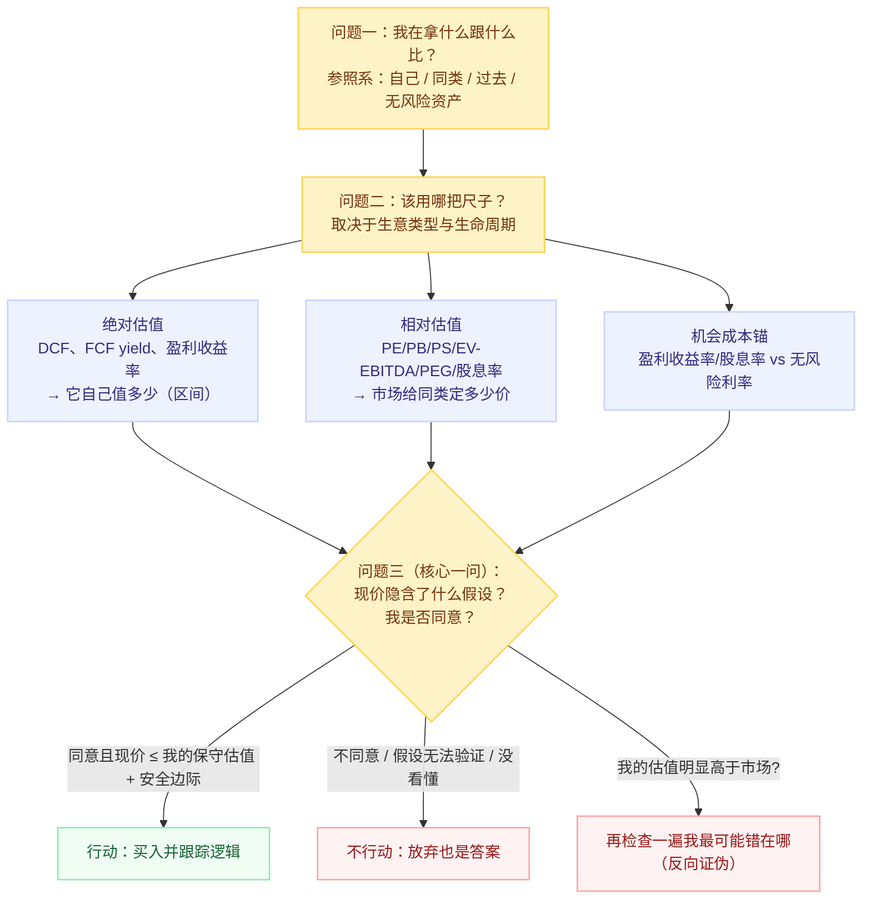

# 判断一只股票贵不贵：估值方法地图

> 免责声明：本文及本目录下所有笔记是个人学习笔记与思维框架，**不构成任何投资建议**。

## 一句话理解

**"贵"和"便宜"从来不是股价数字大小，也不是某个倍数的高低**，而是"当前价格"相对于三个参照系比较后的结论：① 它自己内在值多少（绝对估值）；② 同类公司在市场上卖多少钱（相对估值）；③ 同样的钱放在别处（国债等无风险资产）能赚多少（机会成本锚）。判断贵不贵 = 想清楚**跟谁比、用什么尺子、现价隐含了怎样的未来假设、我是否同意这个假设**。

## 为什么"贵不贵"值得单独深挖

- "贵不贵"是投资决策里唯一由你定价的部分：生意好不好（护城河、ROE）是客观事实，**为它付多少钱**才是主观判断，也是盈利/亏损的主要来源
- 好公司 ≠ 好股票：2021 年 A 股"核心资产"回撤、2000 年纳斯达克崩盘，都死于"公司很好但买得太贵"
- 市场上 85% 的研报用倍数（相对估值）做结论（Damodaran），但倍数是最容易被情绪和口径操纵的工具——不拆开看，就会被表面数字骗
- 贵不贵**没有绝对答案**，但有相对可靠的**方法**：判断过程的质量决定了判断质量

## 总框架：先回答三个问题

## 两条路线 + 一个必须的收尾

| | 绝对估值（Intrinsic） | 相对估值（Relative/Pricing） |
|---|---|---|
| 回答的问题 | 这家公司**自己**值多少 | 市场现在给**同类公司**定多少价 |
| 代表方法 | DCF、FCF/盈利收益率、DDM | PE、PB、PS、EV/EBITDA、PEG、股息率 |
| 优点 | 逼近"价值"，不受市场情绪传染，倒逼你写下假设 | 简单、快、贴近市场真实定价，天然处理了"市场共识" |
| 致命弱点 | 对增长率/折现率极敏感，输入可被操纵 | 可能整个市场都高估（2000 年科网），且缺少透明假设 |
| 核心心法 | 要"区间 + 敏感性"，不要"精确目标价" | 必须拆解倍数背后的驱动因子，不能只看横截面 |

> 收尾：两条路线交叉验证 + 机会成本对照，最后回到唯一重要的那个问题——**这个价格隐含了怎样的增长/盈利假设？如果我不同意，凭什么？**

## 本目录笔记地图

1. [什么是"贵"：比较才有意义](./01-what-is-expensive.md) — 先建立正确的参照系和"隐含预期"思维，这是后面所有工具的地基
2. [绝对估值：跟"它自己值多少"比](./02-absolute-valuation.md) — DCF、盈利收益率/FCF yield 锚、正常化盈利；怎么算区间而不是数字
3. [相对估值：倍数工具箱](./03-relative-multiples.md) — PE/PB/PS/EV-EBITDA/PEG/股息率 的逐个拆解、适用与陷阱、历史分位与 PB-ROE
4. [按生意类型选尺子](./04-multiples-by-business-type.md) — 生命周期 × 行业适配表：周期股、金融、成长股、亏损公司各用什么标尺
5. [交叉验证与实操检查清单](./05-cross-checks-and-checklist.md) — 多方法三角验证、隐含假设反推、一张可以直接用的决策清单

## 前置与相邻知识

- [价值投资入门](../value-investing-intro.md) — 内在价值、安全边际、护城河的概念底座；本文是其中"估值倍数速查"的深入版
- [上市公司财报阅读指南](../financial-statement-reading.md) — 本目录所有方法的输入来源（三张报表、ROE/ROIC/FCF、造假红旗）
- [价值投资学习路线图](../value-investing-learning-roadmap.md) — 把概念转化为分阶段练习

## References

- Damodaran, *An Introduction to Valuation* (NYU Stern, Spring 2025)；*Relative Valuation* 讲义；*The Dark Side of Valuation* (2nd ed.)
- Graham & Dodd, *Security Analysis* (1934)；Graham, *The Intelligent Investor* (1949)
- Buffett, 致股东信（Owner Earnings、内在价值定义）
- Shiller, *CAPE* 与长期市盈率研究
- 中文市场实务参考：行业研报（开源证券 PB-ROE 研究等）、雪球/东财估值方法讨论、中国货币网基准利率（2026-07-21：10 年期国债 1.7405%）

## Open Questions

- 无风险利率长期下移（中国 10Y 国债 ~1.74%）对 A 股合理估值中枢的系统性影响如何量化？
- 如何把"隐含预期反推"做成每个人都能算的简化版（而不必建完整 DCF）？
- PB-ROE 框架在非金融行业（消费/制造）的适用边界？
