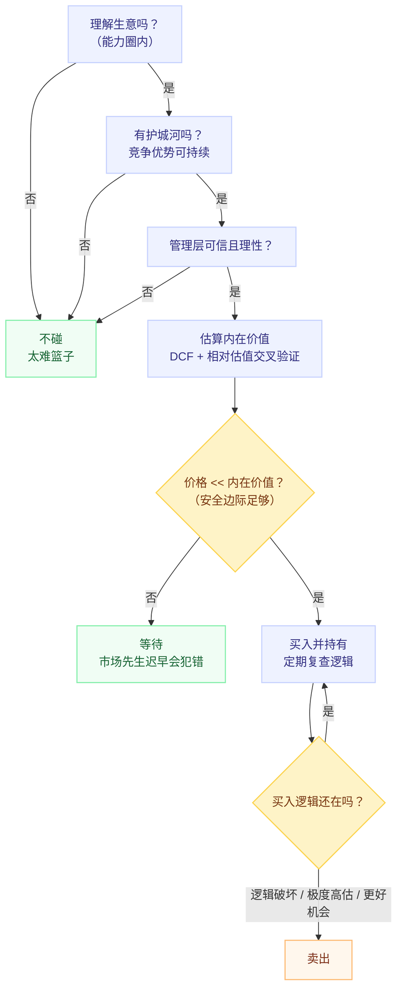

# 价值投资入门

## 一句话理解

价值投资 = **把股票当作企业所有权的一部分**，以"内在价值"为锚，只在价格显著低于价值（安全边际）时行动，并让市场情绪（市场先生）为你服务而不是指挥你。

它不是一种"选股技巧"，而是一套关于**如何面对不确定性做决策**的完整哲学。

## 为什么重要

- 它是少数经过近百年实盘检验、逻辑自洽的投资体系（Graham → Buffett → 当代实践者）
- 它的核心概念（内在价值、安全边际、能力圈、概率思维）可以迁移到任何决策场景，不只是买股票
- 它明确区分"投资"与"投机"：投资是基于对企业未来现金流的分析，投机是基于对他人行为的猜测

> 免责声明：本文是个人学习笔记与思维框架，**不构成任何投资建议**。

## 起源与传承

| 阶段 | 人物 | 贡献 |
|---|---|---|
| 奠基（1930s-40s） | Benjamin Graham、David Dodd | 《Security Analysis》(1934)、《The Intelligent Investor》(1949)；提出"股票是企业所有权"、市场先生、安全边际 |
| 进化（1950s-） | Warren Buffett、Charlie Munger | 从"烟蒂股"（便宜但平庸的公司）进化到"以合理价格买伟大企业"；引入**护城河**与商业模式质量 |
| 当代 | Seth Klarman、Howard Marks、Li Lu、Walter Schloss 等 | 安全边际的机构化实践、周期与风险认知、跨市场应用 |

Buffett 的自我总结："我是 85% 的 Graham，15% 的 Fisher"（Fisher 代表对成长与商业质量的重视）。

## 四大基石

### 1. 股票是企业所有权的一部分

买股票不是买一个会跳动的代码，而是买企业未来现金流的一部分索取权。这个视角转换是全部体系的起点：**价格是你付出的，价值是你得到的**（Price is what you pay, value is what you get）。

### 2. 市场先生（Mr. Market）

Graham 的寓言：市场是一个情绪化的合伙人，每天给你报价。他亢奋时出高价、抑郁时出低价。

- 报价是**机会**，不是**指令**
- 你可以利用他的情绪，但不能被他感染
- 短期内市场是投票机（情绪），长期是称重机（价值）

### 3. 内在价值（Intrinsic Value）

Buffett 的定义：**一家企业在其存续期间可以被取出的现金的折现值**。

$$
V = \sum_{t=1}^{\infty} \frac{CF_t}{(1 + r)^t}
$$

其中 $CF_t$ 是第 $t$ 年的（所有者）现金流，$r$ 是折现率。注意：

- 这是"模糊的正确"，不是精确的数字——它首先是**思维框架**
- 未来现金流不可精确预知，所以必须配合下一条：安全边际

### 4. 安全边际（Margin of Safety）

用 4 毛钱买价值 1 块钱的东西。折扣的作用：

- 为你的**错误**（估值偏差、信息不全）提供缓冲
- 为**坏运气**（行业逆风、宏观冲击）提供缓冲
- 同时提供向上的收益空间

Graham 称之为"投资的核心秘密"。没有安全边际，就不是价值投资。

## 决策流程总览

## 关键概念工具箱

### 能力圈（Circle of Competence）

- 只投资你能理解其商业模式与未来现金流来源的企业
- 圈子大小不重要，**知道边界在哪里**才重要
- 对"太难"的标的（如早期科技、生物医药）直接放入"太难篮子"，不是损失

### 护城河（Moat）

让竞争对手难以侵蚀的结构性优势（Morningstar 的五分类）：

1. **无形资产**：品牌、专利、牌照（如高端白酒、药企专利）
2. **成本优势**：规模、工艺、资源（如低成本矿产、极致供应链）
3. **转换成本**：客户换供应商代价高（如企业软件、银行核心系统）
4. **网络效应**：用户越多价值越大（如支付网络、平台）
5. **有效规模**：市场小到新进入者无利可图（如区域机场、 niche 工业品）

护城河判断的核心问题：**这家企业 10 年后还能保持高 ROIC 吗？为什么竞争对手抢不走？**

### 复利与长期主义

$$
FV = PV \times (1 + r)^n
$$

- 复利的关键变量是**时间 n** 和**不中断**（避免大亏损：亏 50% 需要涨 100% 才回本）
- 长期持有是"逻辑未变 + 估值未极端"的**结果**，不是目的本身

### 概率思维

- 不预测市场，只评估赔率：在赢面大、赔率好时下注
- 承认无知 → 用安全边际和分散（适度）管理错误
- Howard Marks：你无法预测，但可以**准备**（理解周期位置）

## 如何看一家企业：财务指标速览

### 三张报表各看什么

| 报表 | 回答的问题 | 重点科目 |
|---|---|---|
| 资产负债表 | 家底与风险 | 现金、有息负债、应收/存货质量、商誉 |
| 利润表 | 赚钱能力 | 营收增速、毛利率、净利率、费用结构 |
| 现金流量表 | 利润的含金量 | 经营现金流 vs 净利润、资本开支、自由现金流 |

### 核心指标

- **ROE（净资产收益率）**：$ROE = \frac{\text{净利润}}{\text{净资产}}$。巴菲特最看重，长期稳定 > 15% 是好生意的信号；用杜邦分解看它来自利润率、周转率还是杠杆（杠杆堆出的 ROE 是危险的）
- **毛利率 / 净利率**：毛利率高且稳定 ≈ 有定价权 ≈ 可能有护城河
- **自由现金流（FCF）**：$FCF = \text{经营现金流} - \text{资本开支}$。企业真正能分给股东的钱
- **负债率 / 流动比率**：活下来比赚得多更重要；警惕高杠杆 + 短债长投
- **ROIC（投入资本回报率）**：比 ROE 更干净地衡量生意本身回报，> WACC 才创造价值

### 估值倍数（相对估值）

- **P/E（市盈率）**：回本年限的粗略近似；适合盈利稳定的企业
- **P/B（市净率）**：适合重资产/金融类；轻资产公司意义小
- **P/FCF**：比 P/E 更难被会计手法扭曲
- **盈利收益率 vs 无风险利率**：$\frac{E}{P}$ 与 10 年期国债收益率比较，是 Graham 式的"机会成本"视角

Graham 防御型投资者的经验参考线（仅作历史参照，非规则）：P/E < 15、P/B < 1.5、且 P/E × P/B < 22.5。

## 估值：两条腿走路

### 绝对估值（DCF）

- 概念上唯一"正确"的方法：价值 = 未来现金流折现
- 但对增长率、折现率极敏感——"输入是垃圾，输出也是垃圾"
- 正确用法：**敏感性分析 + 保守假设**，看"在悲观情形下当前价格是否仍便宜"，而不是追求精确目标价

### 相对估值

- 与自身历史估值百分位比（注意：基本面变了，历史中枢也失效）
- 与同行比（注意：护城河不同的公司不该同倍数）
- 与债券比（盈利收益率 vs 无风险利率）

两者交叉验证，且永远先问：**这个价格隐含了怎样的增长假设？我是否同意？**

## 股票指标与概念速查（通俗版）

### 估值类：贵不贵？

- **市值** = 股价 × 总股数，买下整家公司的标价。大盘股稳、小盘股波动大。
- **市盈率 P/E** = 市值 / 净利润。通俗版："按现在的盈利水平，多少年回本"。P/E=10 ≈ 10 年赚回本金。
  - 静态用去年利润、动态用预测、**TTM 用最近 4 个季度**（最常用）。
  - 坑：利润是一次性的（卖资产、补贴）或周期顶点时，P/E 会骗人——周期股常常"低 P/E 是顶、高 P/E 是底"。
- **市净率 P/B** = 股价 / 每股净资产，为 1 块钱"家底"付多少钱。适合银行、钢铁等重资产；互联网公司净资产是人和代码，P/B 几乎无意义。
- **市销率 P/S** = 市值 / 营收。还没盈利但营收在涨的公司（早期成长股）看这个。
- **PEG** = P/E ÷ 预期利润增速（百分数）。Lynch 的爱用指标：P/E=30 但增速 30% → PEG=1，不算贵；<1 偏便宜。坑：增速是"预测"，故事越动人 PEG 越好看。
- **股息率** = 每股年度分红 / 股价，类似"存款利率"：不卖股票每年拿回多少现金。长期稳定 4-5% 已经不错。
- **EV/EBITDA** = 企业价值 / 息税折旧摊销前利润。把"负债结构、折旧政策"差异抹掉后的 P/E，重资产、高折旧、并购多的行业常用。
- **估值百分位**：当前 P/E 在自己历史区间里的位置，"比历史上 80% 的时间便宜"。坑：基本面变了，历史镜子就失效。

### 用数字说话：估值倍数示例

**例 1｜P/E：两家同样赚钱的公司，价格差在哪**

假设两家公司去年都赚 **10 亿**，但市值不同：

| | A 公司 | B 公司 |
|---|---|---|
| 净利润 | 10 亿 | 10 亿 |
| 市值 | 100 亿 | 500 亿 |
| P/E | **10** | **50** |

- A 的 P/E=10：按现在的赚钱速度，**10 年回本**。
- B 的 P/E=50：要 **50 年**才回本——市场之所以愿意等，是赌它以后赚更多。
- 结论：P/E 高不高没有绝对答案，它**隐含了一个增速预期**。B 贵不贵，取决于"以后每年多赚多少"这个预测有多靠谱。

**例 2｜P/E 的坑：周期股恰恰相反**

一家钢铁公司，市场好时利润 100 亿（周期顶部），差时利润 5 亿（周期底部），市值 500 亿：

- 顶部：P/E = 500/100 = **5**，看起来"便宜得离谱"
- 底部：P/E = 500/5 = **100**，看起来"贵得吓人"

真实情况恰好反过来：**顶部低 P/E 是"快卖"信号（利润马上要跌），底部高 P/E 才是"便宜"信号（利润马上要涨）**。所以周期股不能用 P/E 高低直接判断贵贱，要问"现在利润处于周期的哪一段"。

**例 3｜P/B：给"家底"付多少钱**

- 银行股 P/B = 0.7：净资产 100 亿的银行，只卖 70 亿——用 7 折买它的家底（常见于市场恐慌时）。
- 轻资产公司 P/B = 20：净资产本来就少（钱都在人脑子和软件里），倍数高不代表贵。
- 用法：P/B < 1 时问自己："如果把公司清算变卖，卖到的钱是不是比市值还多？"——这也是 Graham"烟蒂"思路的核心。

**例 4｜PEG：把"贵"和"快"放在一起比**

- 公司 C：P/E=30，预期增速 30%/年 → PEG = 30/30 = **1**，估值和增速匹配，不算贵。
- 公司 D：P/E=30，预期增速 10%/年 → PEG = 30/10 = **3**，买贵了（或增速预测过于乐观）。
- 坑：增速是"预测"。讲故事的公司在牛市中 PEG 永远好看，因为它把增速吹得足够高。

**例 5｜股息率：不卖股，每年拿回多少**

- 股价 100 元、每股年分红 5 元 → 股息率 **5%**，比很多存款利息高，而且分红还可以再买入（复利）。
- 坑：a) 高股息率有时是"股价跌出来的"（分母变小），要确认分红是否可持续；b) 公司把本该再投资的钱全分光，可能说明没有增长机会了。

**例 6｜EV/EBITDA：抹掉"借债和折旧"的差异**

- 甲公司：市值 100 亿、净负债 50 亿（借了很多钱）、利润 10 亿（P/E=10）
- 乙公司：市值 100 亿、净现金 50 亿（现金比债多）、利润 10 亿（P/E=10）

两家 P/E 一样，但甲的真实"购买价"是 100+50=**150 亿**（要连债务一起背），乙是 100−50=**50 亿**（买它还白得现金）。用 EV/EBITDA（分子含净负债）就能看出乙便宜得多——这也是并购和重资产行业最常用的倍数。

> 一句话方法论：**任何倍数都只是"快照"，先用它做初筛，再用"这个倍数隐含了什么假设"做判断。** 便宜不是"数字小"，而是"你对未来的判断比市场乐观得有理有据"。

### 盈利能力：生意好不好？

- **毛利率** =（营收 − 营业成本）/ 营收，产品的加价空间。茅台 >90% = 极强定价权；组装厂几个点 = 辛苦钱。
- **净利率** = 净利润 / 营收，扣完所有费用和税剩下多少。毛利高但净利低 = 被费用或竞争吃掉了。
- **ROE** = 净利润 / 净资产，股东每 1 块钱一年赚回多少。长期 >15% 是好生意。坑：借钱多（高杠杆）也能推高 ROE，用杜邦分解拆开看。
- **ROA** = 净利润 / 总资产，把借的钱也算进来的效率，"去杠杆版 ROE"。
- **ROIC** = 税后经营利润 / 投入资本，生意本身的回报率，最干净的指标，巴菲特式投资者最看重。

### 成长性：在变好吗？

- **营收/利润增速**：同比（YoY，比去年同期）比环比有意义，排除季节性。
- **CAGR 复合年均增长率**：多年的平均年化增速，抹平单年暴增。"3 年 CAGR 20%"比"今年 +50%"可信。
- 坑：基数效应——1 亿翻到 2 亿容易，1000 亿涨 10% 很难；高增速不可线性外推。

### 安全性：会不会死？

- **资产负债率** = 总负债 / 总资产，多少是借来的。>70% 要警惕（银行天然高，行业不同标准不同）。
- **流动比率** = 流动资产 / 流动负债，能快速变现的资产够不够还一年内到期的债；<1 有短期偿债压力。
- **利息保障倍数** = 经营利润 / 利息费用，赚的钱够不够付利息；<1.5 危险。
- **商誉**：收购别的公司时多付的溢价。收购不达预期就要"减值"= 一次性大亏，年报里的雷。

### 现金流：利润是真的吗？

- **经营现金流**：经营上真实收到/付出的现金。净利润是"账本"，这个是"银行卡"。
- **自由现金流 FCF** = 经营现金流 − 资本开支，维持和扩大生产后真正能分给股东的钱，价值的真正来源。
- 红旗：净利润常年为正、经营现金流常年为负 = 利润停留在纸面（应收账款堆出来的），警惕造假或提前确认。

### 交易与市场术语

- **牛市 / 熊市**：持续上涨 / 下跌的行情。
- **成交量 / 换手率**：交易活跃度；换手率 = 当日成交股数 / 流通股数，高换手 = 分歧大、筹码交换快。
- **涨停 / 跌停**：A 股单日涨跌幅限制（主板 ±10%，创业板/科创板 ±20%）。
- **除权 / 除息**：分红或送转股后股价相应下调——分红当天并没有"多赚"，长期靠公司持续赚钱填权。
- **仓位术语**：建仓（开始买）、加仓、减仓、清仓（全部卖出）、持仓、满仓 / 空仓。
- **左侧 / 右侧**：下跌途中提前买（左侧，"接飞刀"，靠安全边际保护）vs 等趋势确认再买（右侧）。价值投资者通常偏左侧。
- **定投**：固定间隔投入固定金额，便宜时自动多买、贵时少买；适合宽基指数，**救不了个股价值陷阱**。
- **杠杆 / 融资**：借钱买股，盈亏同倍放大，且有强制平仓风险——价值投资最大禁忌：**即使你对了，也可能活不到市场对的那一天**。

### 易混淆概念对

- **股价低 ≠ 便宜**：2 元的股票可能比 200 元的更贵，贵不贵看估值倍数，不看单价。
- **分红 ≠ 白拿钱**：除息日股价会扣掉分红额；真正重要的是公司能否持续赚出并派发分红。
- **回购 vs 分红**：都是把现金还给股东；回购减少股数、抬高每股含金量，税务上更灵活。
- **成长 vs 价值**：不是对立——成长本来就是价值公式里"未来现金流"的一部分；真正对立的是**为成长付出的价格**。

## 入门行动清单

1. **读书**（按顺序）：《The Intelligent Investor》→《巴菲特致股东的信》→《Poor Charlie's Almanack》→《Margin of Safety》/《The Most Important Thing》
2. **建能力圈**：从你所在行业、日常消费得起劲的产品开始，写"一页纸商业逻辑"
3. **读年报**：至少完整读 3 份目标公司年报（三张报表 + 管理层讨论 + 审计意见），对照 5 年前的年报验证管理层说过的话
4. **四问清单**：我理解生意吗？有护城河吗？管理层可信且理性吗？价格有安全边际吗？——四个都是"是"才行动
5. **仓位纪律**：不用杠杆、不用短期要用的钱；单一个仓上限想清楚；分批买不追求抄到底
6. **决策日志**：写下买入理由与预期，定期对照——复盘自己的错误比看行情重要
7. **卖出纪律**：逻辑破坏、估值极端泡沫、有显著更好机会时卖；**不因"跌了"而卖，也不因"涨了"而卖**

## 常见误区

| 误区 | 澄清 |
|---|---|
| 低 P/E = 价值投资 | 低倍数可能是"价值陷阱"：盈利即将崩塌 |
| 跌得多 = 便宜 = 安全 | 价格下跌本身不创造安全边际，价值锚才创造 |
| 长期持有 = 价值投资 | 持有是结果不是目的；逻辑变了就该卖 |
| 买蓝筹/白马 = 价值投资 | 好公司买贵了照样亏钱（2021 年核心资产回撤） |
| 价值投资 = 不碰科技股 | 关键是"能否理解现金流"，不是行业标签 |

## 局限与风险（诚实清单）

- **价值陷阱**：便宜但基本面持续恶化（技术替代、治理崩坏），越跌越买越错
- **长期跑输的可能**：2010s 成长股大幅跑赢价值，价值因子可能多年不表现——体系要能扛住"不赚钱的几年"
- **错过结构性成长**：纯深度价值框架天然回避高不确定高回报的早期成长
- **市场差异**：A 股/港股/美股在公司治理、做空机制、退市制度上差异巨大，同一框架的适用性不同
- **学术视角**：Fama-French 的 HML（价值因子）说明"价值溢价"部分可被因子化，也存在因子拥挤问题

## My Understanding

- 价值投资本质是**概率思维 + 风险纪律**在资本市场的应用：承认无知（所以要安全边际）、利用情绪（市场先生）、专注可控（能力圈）
- 安全边际不是"贪便宜"，而是对"我会错"这一事实的制度化承认——这一点和工程里的冗余设计、机器学习里的正则化是同构的
- 最难的不是估值数学，而是** temperament**（性情）：在别人恐惧时保持理性，在无聊时保持耐心
- 我目前的状态：框架入门阶段，尚未形成自己的估值手感；下一步是精读年报 + 建立自己的决策日志

## Open Questions

- 轻资产/高成长公司（互联网、SaaS）如何可靠地估内在价值？DCF 假设怎么设才不变成数字游戏？
- A 股语境下（政策驱动、散户占比高）价值框架需要做哪些修正？
- 如何把价值框架与量化因子（HML、质量因子）结合做初筛？
- 护城河的"半衰期"在技术加速时代是否系统性变短？

## Related Knowledge

- [价值投资学习路线图](./value-investing-learning-roadmap.md) — 将本文的概念框架转化为分阶段学习和公司研究练习
- [上市公司财报阅读指南](./financial-statement-reading.md) — 三张报表、杜邦分析、造假红旗，估值的输入基础
- 暂无站内关联笔记；后续可与 [数学知识](../mathematics/)（复利、期望值、凯利公式）建立连接

## References

- Graham, *The Intelligent Investor* (1949)
- Graham & Dodd, *Security Analysis* (1934)
- *The Essays of Warren Buffett*（Lawrence Cunningham 编）
- Munger, *Poor Charlie's Almanack*
- Klarman, *Margin of Safety* (1991)
- Marks, *The Most Important Thing* (2011)
- Morningstar, *Why Moats Matter*
- Fama & French, *Common Risk Factors in the Returns on Stocks and Bonds* (1993)
