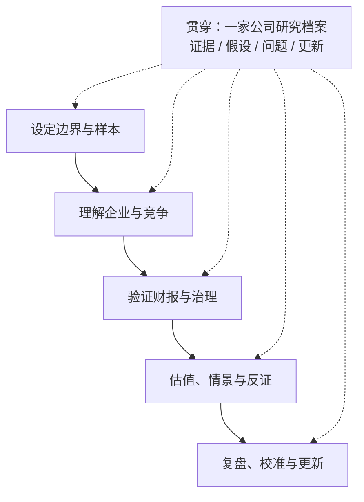

# 价值投资学习路线图

## 一句话理解

价值投资的学习目标，不是预测下一段股价，也不是背熟一组估值倍数，而是学会基于公开资料理解一家企业，形成一份**证据可追溯、判断可反驳、会随新信息更新**的研究结论。

这是一条从“理解自己”开始，经由企业分析、财报验证和估值，最后回到复盘与校准的路线。路线图负责安排顺序；具体概念仍以相关专题笔记为准。

> 免责声明：本文是个人学习路线与研究框架，**不构成任何投资建议**，不提供个股推荐、买卖指令或收益承诺。

## 这份路线图解决什么问题

只读投资书容易停留在熟悉名词，只看财务指标容易把企业简化成一张表，只做估值又容易把不可靠的假设包装成精确数字。这份路线图把学习过程改成一条可验证的链路：

```text
概念
  → 选定能力圈内的公司
  → 从原始披露提取证据
  → 解释企业如何赚钱
  → 检查财务质量与治理
  → 建立估值情景
  → 写出反证与失效条件
  → 在新信息出现后复盘
```

学习阶段不按“读完几本书”推进，而按能力验收推进。可以暂时停在任何一个阶段；“信息不足”“不在能力圈”和“暂不判断”都是有效结论。

## 学习完成后应该能做什么

- 用自己的话解释投资、投机、内在价值、安全边际、能力圈和护城河；
- 说明一家企业靠什么赚钱、关键客户和竞争约束是什么；
- 独立阅读一份上市公司年报，并把关键数字追溯到报表或附注；
- 区分利润、现金流、资本投入和股东归属口径，识别需要继续核验的信号；
- 使用合适的估值方法给出区间、情景和敏感性，而不是伪造一个精确目标价；
- 写出包含支持证据、反方证据和失效条件的投资研究备忘录；
- 根据新披露修正旧判断，并复盘自己的推理过程，而不是只用股价涨跌评价对错。

## 使用边界与资料原则

### 研究对象边界

默认以中国投资者阅读 A 股或港股上市公司为练习场景。第一家公司建议选择：

- 业务相对容易理解；
- 年报、审计报告和附注连续可得；
- 经营历史足够长，能观察多个年度；
- 暂不选择银行、保险、券商等金融企业作为第一个完整案例，因为其报表和估值逻辑需要额外的行业知识。

这不是筛选“好公司”的规则，只是降低初学阶段的认知负担。

### 资料优先级

1. 交易所和监管机构披露；
2. 公司年报、审计报告、财务报表附注和正式公告；
3. 公司投资者关系材料和管理层公开交流；
4. 研报、访谈、新闻和市场讨论，作为线索而不是结论。

对每条关键数据记录公司、证券代码、市场、报告期、币种、合并口径、披露日期和原始页码。不同公司或不同年份的数据，不应在没有核对口径的情况下直接拼接比较。

## 总体路线



## 贯穿项目：一家公司研究档案

不要为每个阶段重新开始。选择一家能力圈内的非金融上市公司，持续维护同一份研究档案。路线图本身不预先创建额外模板，先用下面的字段建立最小版本：

| 模块 | 要记录的内容 |
|---|---|
| 研究边界 | 公司、市场、报告期、业务范围、研究原因、暂不研究的部分 |
| 证据表 | 主张、原始资料位置、支持证据、反对证据、我的解释、未知项 |
| 经营与行业图 | 收入来源、成本结构、客户/供应商、竞争者、关键驱动因素和风险 |
| 财务观察 | 原始数据及口径、趋势、计算过程、异常、需要回查的附注 |
| 估值假设 | 现金流或盈利口径、悲观/基准/乐观情景、敏感性和估值范围 |
| 更新日志 | 当时判断、新披露事实、是否修改观点、修改原因、下一步问题 |

每次写下判断时，都同时写下“什么证据会让我改变看法”。这样研究档案记录的是思考过程，而不只是事后看起来合理的结论。

## 分阶段学习路径

### 第一阶段：设定边界与样本

**核心问题**：我在研究什么？我为什么可能理解它？哪些问题现在还不能回答？

**学习内容**：

- 阅读[价值投资入门](./value-investing-intro.md)，建立股票是企业所有权、市场先生、内在价值、安全边际和能力圈的基本框架；
- 写出自己的投资目标、时间范围、资金约束和不能接受的风险；
- 选择一家资料连续、业务相对可理解的非金融上市公司，不从热门程度或短期涨跌选择；
- 建立原始资料清单，明确报告期、市场、币种和合并口径。

**练习与输出**：

1. 写一页“研究范围说明”：公司做什么、不做什么、我为什么认为自己可能看得懂；
2. 列出至少五个当前未知的问题；
3. 建立年报、公告、审计报告和附注的资料目录；
4. 将暂时太难的问题放入“太难篮子”，而不是用猜测填空。

**阶段验收**：不看股价走势图，也能说明研究对象的业务边界、资料来源和自己的能力圈边界；能明确说出至少一个暂不判断的问题。

### 第二阶段：理解企业与竞争

**核心问题**：公司如何把投入变成收入和现金？为什么客户选择它？竞争者怎样削弱它？

**学习内容**：

- 从年报业务章节、管理层讨论与分析（MD&A）、风险提示和行业资料还原商业模式；
- 梳理产品/服务、客户、供应商、渠道、成本和资本投入之间的关系；
- 识别护城河的来源，并为“优势可持续”寻找证据与反证；
- 对管理层的目标、承诺和资本配置行为保留可验证记录。

**练习与输出**：

- 画一张经营地图：钱从哪里来、主要成本是什么、现金在哪些环节被占用；
- 写出三条可检验的商业判断，每条都附支持证据、反例和未知信息；
- 选择两家可比公司，比较商业模式和竞争位置，而不是只比较估值倍数；
- 建立“管理层说过什么—后来发生了什么”的对照表。

**阶段验收**：能够用不依赖术语的语言解释公司如何赚钱、竞争优势可能来自哪里、什么变化会侵蚀优势；能够把年报事实与自己的因果解释分开。

### 第三阶段：验证财报与治理

**核心问题**：企业叙事是否得到三张表、附注和治理信息的支持？利润是否有现金和资产质量支撑？

**学习内容**：

- 使用[上市公司财报阅读指南](./financial-statement-reading.md)阅读审计意见、资产负债表、利润表、现金流量表和附注；
- 至少观察连续五年的营收、利润、归母净利润、扣非口径、经营现金流、资本开支、自由现金流、负债和回报率趋势；
- 核对应收账款、存货、商誉、有息负债、关联交易、担保、资产减值和并购等需要下钻的项目；
- 在中国上市公司语境下，特别检查非经常性损益、补贴、资产处置、公允价值变动、控股股东事项和股权结构；
- 遇到归母净利润与净利润的差异时，核对少数股东损益、持股结构和合并范围，而不是直接下结论。

**练习与输出**：

1. 制作一张五年财务数据表，并在每个关键数字旁记录来源页码和口径；
2. 写一页财务证据：哪些经营判断被数据支持，哪些被削弱；
3. 列出红旗、反证和必须继续核验的附注；
4. 对利润与经营现金流、增长与资本投入、回报率与杠杆分别写出解释。

**阶段验收**：所有关键数字都能回溯到年报或附注；能够解释三张表如何互相勾稽；能够指出至少一个不能仅凭指标解决、必须继续查原始资料的问题。

### 第四阶段：估值、情景与反证

**核心问题**：在什么假设下，当前价格才有意义？如果我的判断错了，结论会怎样变化？

**学习内容**：

- 理解所有者收益、自由现金流、DCF、正常化盈利和相对估值的适用条件；
- 将企业分析中的增长、利润率、资本开支、再投资和竞争优势翻译成有限的假设；
- 用悲观、基准、乐观情景和敏感性分析表达不确定性；
- 进行反向估值：当前价格隐含了怎样的增长、利润率或持续期假设？
- 认识到安全边际是对估值误差、商业变化和信息不足的缓冲，不是固定折扣比例。

**练习与输出**：

- 写一份估值备忘录，说明选择某种方法的理由和不适用之处；
- 为关键变量建立三种情景，并列出每种情景的证据与反证；
- 记录估值区间、敏感性和当前价格可能隐含的市场预期；
- 写出“暂不估值”或“暂不判断”的条件，例如关键数据缺失、商业模式变化过快或假设无法被证据约束。

**阶段验收**：能够解释估值变化由哪些经营假设驱动；能够展示关键变量变化如何改变结论；不会把模型输出当成事实，也不会把单一倍数当成价值本身。

### 第五阶段：复盘、校准与更新

**核心问题**：我的判断是如何形成的？后来哪些事实证明它需要修正？

**学习内容**：

- 在新年报、业绩公告或重大披露出现后，回到旧研究档案逐条检查；
- 区分事实遗漏、数据口径错误、因果解释错误、估值假设错误和执行纪律问题；
- 用经营事实而不是短期股价涨跌评价研究过程；
- 允许撤回结论，记录观点改变的原因和仍未解决的问题。

**练习与输出**：

| 复盘字段 | 要回答的问题 |
|---|---|
| 原主张 | 当时我认为企业会发生什么？依据是什么？ |
| 新事实 | 后续披露了什么？哪些信息当时已经可获得？ |
| 误差类型 | 是信息遗漏、口径错误、模型错误、判断错误还是纪律问题？ |
| 观点更新 | 我保留、修改还是撤回原判断？为什么？ |
| 下一步 | 还需要什么证据？什么条件会再次改变观点？ |

**阶段验收**：能够根据新证据修订旧判断；复盘中能明确指出自己错在何处，而不是只写“涨了所以对、跌了所以错”；研究档案具有时间顺序，别人可以理解当时的信息集与推理过程。

## 中国上市公司语境下的特别提醒

- 合并报表、母公司报表、归母净利润和扣非归母净利润不是可以随意替换的口径；比较前先写清楚分子是什么。
- 补贴、资产处置、公允价值变动和非经常性损益可能改善当期利润，但不一定代表主营业务能力改善。
- 低市盈率可能来自周期高点利润、一次性收益或市场对未来下滑的预期；先判断利润处于周期的哪个位置。
- A 股、港股和不同公司在治理、披露、退市、做空机制、币种和监管环境上存在差异；跨市场比较要显式记录这些边界。
- 控股并不等于持有全部经济利益；阅读重要子公司时要同时看控制关系、持股比例、少数股东损益和合并范围变化。
- “高 ROE”“高股息”或“便宜倍数”都只是待解释的现象，不是脱离商业质量和资产负债表的结论。

## 推荐阅读与实践顺序

| 顺序 | 学习材料或动作 | 目的 | 最小输出 |
|---|---|---|---|
| 1 | [价值投资入门](./value-investing-intro.md) | 建立哲学、能力圈、护城河与安全边际框架 | 用自己的话解释四个基石 |
| 2 | 选择一家能力圈内公司并收集原始披露 | 把抽象概念落到真实对象 | 研究范围说明与资料清单 |
| 3 | [上市公司财报阅读指南](./financial-statement-reading.md) | 学会从三张表和附注验证经营叙事 | 五年数据表与一页财务证据 |
| 4 | 阅读业务、行业和管理层披露 | 理解竞争优势和风险 | 经营地图、判断、反证 |
| 5 | 做三情景估值和反向估值 | 暴露假设与不确定性 | 估值区间与敏感性表 |
| 6 | 等待新披露并复盘 | 校准研究过程 | 更新日志与错误分类 |

书籍可以作为建立框架的入口，但不必追求“读完书单”才开始研究。建议优先选择能帮助自己解释和反驳的材料，并把书中的观点回到真实年报中验证。

## 每周学习循环

一次学习循环可以保持简单：

1. **提出问题**：本周只研究一个具体问题，例如“收入增长来自提价还是销量？”；
2. **读取原始资料**：先查年报、附注和公告，再看二手材料；
3. **提取证据**：记录原文位置、数字口径、支持证据和反证；
4. **形成暂时判断**：写清楚假设、置信程度和会推翻它的条件；
5. **输出与复盘**：将结果写入公司研究档案，并回顾上周判断是否仍成立。

每次只改变一个主要问题，避免同时修改公司、行业、估值模型和数据口径，否则很难知道结论为什么变化。

## 里程碑与验收

| 里程碑 | 可观察成果 | 验收问题 |
|---|---|---|
| 能读懂概念 | 能解释价值、价格、安全边际和能力圈 | 能否举出一个“便宜但不值得买”的反例？ |
| 能读懂企业 | 有经营地图和竞争假设 | 能否解释公司未来现金流的主要来源？ |
| 能读懂财报 | 有可追溯的五年数据和附注问题 | 任一关键数字能否在原始报告中定位？ |
| 能做估值 | 有三情景、敏感性和反向估值 | 改变一个关键假设，结论会怎样变化？ |
| 能做研究 | 有完整备忘录、反方论证和失效条件 | 什么事实出现时，我会承认原判断错了？ |
| 能持续学习 | 有新信息更新后的复盘日志 | 我复盘的是过程质量，还是只看股价结果？ |

## 常见误区

| 误区 | 澄清 |
|---|---|
| 把读完书单当作学会投资 | 阅读是输入，能否解释真实企业并接受反证才是能力证据 |
| 先找低 P/E、低 P/B，再补故事 | 先理解生意和利润质量，再解释倍数代表的预期 |
| 先做 DCF，再寻找支持假设的资料 | 估值输入来自企业与财报分析；不能让模型替代理解 |
| 把公司叙事当作事实 | 每条重要叙事都要回到披露、数据和反方证据 |
| 用短期股价验证研究质量 | 市场价格短期可能与经营事实脱节，先复盘信息和推理过程 |
| 以真实交易作为学习验收 | 纸面研究和历史盲测可以完成主要训练；真实资金应受到独立的风险约束 |
| 过早扩展到所有行业 | 银行、保险、周期股、早期科技等需要不同的会计和估值框架，先建立一个可迁移的基本流程 |

## 当前进度与下一步

- 当前路线图状态：已建立，尚未替代真实案例练习；
- 推荐下一步：选择一家自己能理解、披露资料连续的非金融上市公司，完成第一阶段的研究范围说明和资料清单；
- 下一次更新路线图时，优先补充真实案例中暴露出来的困难，而不是继续增加书单。

## My Understanding

### 已确认的事实

- 价值投资的核心概念、财报阅读和估值方法已经分别记录在相关 Investing 笔记中；本路线图主要负责安排依赖关系和实践闭环。
- 阅读公开披露时，数据来源、口径和时间点会直接影响判断是否可复查。

### 我的解释

- 我目前认为，财报与企业分析应先于复杂估值：估值公式并不难，难的是判断输入是否有证据、是否可持续、是否已经被价格反映。
- 学习价值投资更像训练一套研究与决策系统，而不是收集一套“买入信号”。因此“暂不判断”比没有依据的精确结论更有价值。

### 当前能力边界

- 目前路线图覆盖普通上市公司研究的基本流程；金融企业、复杂并购、早期高成长企业和跨市场会计差异仍需要单独学习。
- 具体公司的研究结论必须依赖当时可获得的原始披露，不能由这份路线图直接推出。

## Open Questions

- 如何为高成长、轻资产企业建立既不过度精确、又能被证据约束的长期现金流假设？
- 周期行业的正常化盈利应如何结合供需、资本开支和资产负债表判断？
- 如何把治理质量、控股股东行为和资本配置系统地纳入企业价值判断，而不把单个事件过度外推？
- A 股与港股双重上市公司的披露、币种、股本和估值口径如何稳定统一？
- 如何通过更多历史盲测，校准自己的预测区间和对不确定性的信心？

## Related Knowledge

- [价值投资入门](./value-investing-intro.md) — 价值、价格、能力圈、护城河、安全边际和估值框架
- [上市公司财报阅读指南](./financial-statement-reading.md) — 三张报表、杜邦分析、财报实操与造假红旗
- [如何学习：方法地图](../learning/how-to-learn-systematically.md) — 用可验证输出、反馈和复盘替代熟悉感

## References

- Graham, *The Intelligent Investor* (1949)
- Graham & Dodd, *Security Analysis* (1934)
- Buffett, *The Essays of Warren Buffett*
- Munger, *Poor Charlie's Almanack*
- Klarman, *Margin of Safety* (1991)
- Marks, *The Most Important Thing* (2011)
- 中国证监会、上海证券交易所、深圳证券交易所和香港交易所公开披露规则及上市公司定期报告
