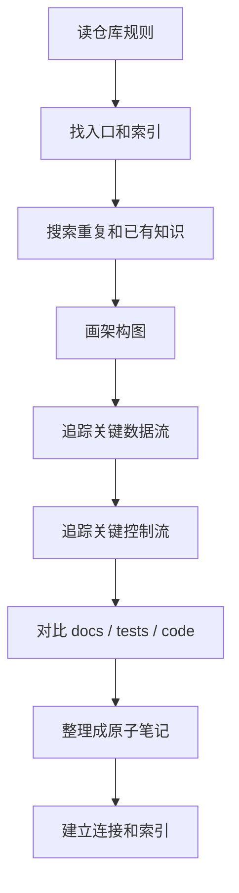

# 新代码库阅读导览

## 一句话理解

这篇笔记总结的是一套通用的源码阅读流程：
先找规则和入口，再找结构和状态，再找核心链路和热路径，最后把读到的东西沉淀成可复用的笔记。

它的目标不是针对某一个项目，而是让以后我读任何新代码库时，都能先有一套稳定的起手式。

## 适合什么时候看

- 刚接触一个新仓库时
- 想把阅读路径标准化时
- 想把“先搜再读、先图后细节”的习惯固定下来时
- 想把源码阅读结果沉淀为可复用知识时

## 通用流程

## 第一轮必须看的东西

1. `README`
2. `CLAUDE.md` / `AGENTS.md` / 项目规则
3. 构建脚本和测试入口
4. 目录结构
5. 现有文档索引
6. 关键入口文件

## 读代码时的默认顺序

### 1. 先找“系统图”

先回答：

- 这个仓库在解决什么问题？
- 主要模块有哪些？
- 哪些文件是入口？
- 哪些状态是全局关键状态？

### 2. 再找“接口”

先看公开 API、包装层、模块层、配置层，再看内部实现。

### 3. 再找“核心链路”

重点追踪：

- 数据怎么进来
- 状态怎么保存
- 控制流怎么分支
- 结果怎么出去
- 回传时哪些状态要重建

### 4. 再看“热路径和边界条件”

重点看：

- 性能敏感路径
- fallback 路径
- error handling
- 兼容性分支
- 测试中定义的行为

## 输出模板

读完一个新代码库后，最有用的总结一般是：

- Repository overview
- Architecture map
- Entry points
- Key files
- Key abstractions
- Key states / terms
- Reading order
- Open questions
- Suggested notes to create
- Next actions

## 如果要把理解变成笔记

优先拆成这几类：

- 系统地图
- 接口 / 入口笔记
- 核心内部实现
- 术语表 / 状态表
- 阅读导览 / 路线图

这样以后回看时，不会只有零碎片段，而是有一条完整的认知路径。

## 我自己的默认心法

- 先搜索，再精读
- 先画图，再抠细节
- 先找重复，再建新概念
- 先保留原子笔记，再做连接
- 先判断训练态 / 推理态 / 编译态 / 运行态，再进入具体实现

## 关联

- [FlashAttention 阅读导览](../../ai/systems/flash-attention/flash-attention-reading-guide.md)
- [FlashAttention 术语表与关键状态表](../../ai/systems/flash-attention/flash-attention-glossary-and-state-table.md)
- [FlashAttention 系统地图](../../ai/systems/flash-attention/flash-attention-system-map.md)
- [FlashAttention 源码精读](../../ai/systems/flash-attention/flash-attention-source-reading.md)
