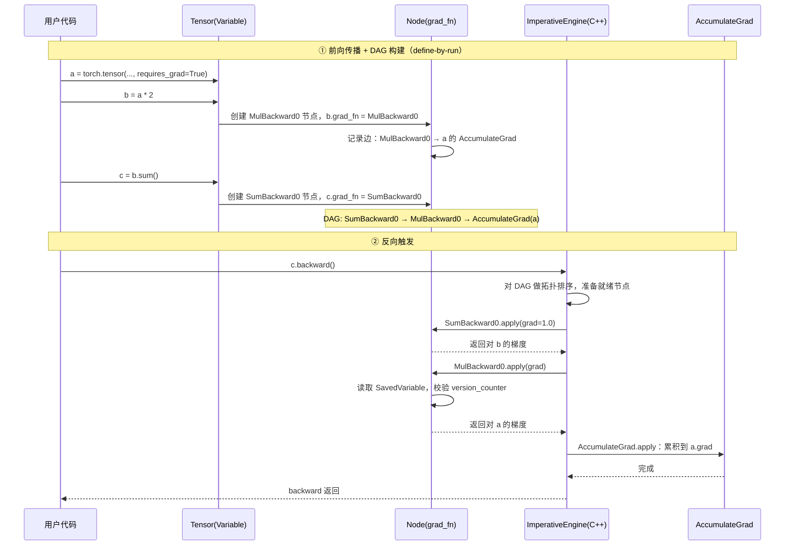

# torch.autograd — 自动微分

## 一句话理解

> PyTorch 的自动微分是基于 **tape（运行时记录）** 的反向模式（reverse-mode）自动微分：每个 eager 算子在执行时透明地构建反向计算图（DAG），调用 `backward()` 时由 C++ 引擎拓扑遍历该 DAG 累积梯度。

## 为什么重要

autograd 是 PyTorch "define-by-run"（动态图）设计哲学的基石。它让用户可以用普通 Python 控制流（`if`/`for`）写模型，每次前向都重新构建计算图，无需像静态图框架那样预先编译——既保留了 NumPy 般的灵活性，又能自动求导。没有 autograd，`torch.nn` 的 `.backward()` 训练循环、`torch.optim` 的梯度更新都无从谈起；现代编译栈（Dynamo/Inductor）也通过捕获 autograd 边来编译反向传播。

## 核心概念

| 概念 | 说明 | 关键位置 |
| ---- | ---- | ---- |
| `Tensor`（即 `Variable`） | 携带梯度跟踪信息的张量。`Variable` 现已与 `Tensor` 合并，`VariableMeta.__instancecheck__` 使任何 `Tensor` 都是 `Variable` 实例 | `torch/autograd/variable.py` |
| `grad_fn` / `Node` | 反向图节点，记录某个前向算子对应的反向公式。每个 `requires_grad` 张量操作产生一个 `Node` | `torch/autograd/graph.py`、`torch/csrc/autograd/function.h` |
| `Function` | 用户可扩展的自定义 autograd 算子，重写静态 `forward`/`backward`，用 `save_for_backward` 保存反向所需张量 | `torch/autograd/function.py` |
| `ImperativeEngine` | 反向传播执行引擎，Python 侧绑定到 `torch._C._ImperativeEngine`，实现在 C++ | `torch/csrc/autograd/engine.cpp` |
| `AccumulateGrad` | 特殊叶子节点，把梯度写入 `Tensor.grad` | `torch/csrc/autograd/functions/accumulate_grad.cpp` |
| `SavedVariable` | 反向节点保存的前向张量快照，配合版本计数器检测就地修改 | `torch/csrc/autograd/saved_variable.cpp` |
| 梯度模式上下文 | `no_grad`、`enable_grad`、`inference_mode`、`set_grad_enabled` 控制是否记录图 | `torch/autograd/grad_mode.py` |
| `VariableVersion` | 张量携带的原子版本计数器，就地操作自增，供 autograd 检测已保存变量被修改 | `c10/core/TensorImpl.h` |

## 工作原理

### 反向模式 AD 的数学基础

对复合函数 $L = f(g(x))$，反向模式先算输出对输出的梯度（种子 $=1$），再沿 DAG 逆拓扑序用链式法则回传：

$$\frac{\partial L}{\partial x} = \sum_{i} \frac{\partial L}{\partial y_i} \cdot \frac{\partial y_i}{\partial x}$$

每个 `Node::apply` 实现的就是局部雅可比 $ \partial y_i / \partial x $ 与上游梯度 $ \partial L / \partial y_i $ 的乘积。一次反向只需遍历图一遍，成本与输出数无关、与图规模成正比，特别适合标量损失→大量参数的训练场景。

### Python / C++ 分工

autograd 是性能热点，重活在 C++。每种关键类型都有 C++ 实现与 Python 包装：`Variable`↔`THPVariable`、`Node`↔`THPFunction`/`PyNode`。`PyNode` 让 C++ 引擎能回调用户写的 Python `Function.backward`。算子的导数公式在 `tools/autograd/derivatives.yaml` 中声明，由 `torchgen` 生成 `torch/csrc/autograd/generated/` 下的 `VariableType_*.cpp`（自动注入 grad_fn 构建）与 `Functions.cpp`（反向节点实现）。

### 前向 → DAG 构建 → 反向 → 引擎执行

引擎的关键点：

1. **拓扑排序 + 就绪队列**：`engine.cpp` 多线程调度，节点所有输入梯度到齐后入队执行。
2. **就地修改检测**：`SavedVariable` 在反向时比对保存时的 `version_counter_`，不一致则报错（防止用错梯度）。
3. **梯度累积**：同一个张量被多个节点使用时，`InputBuffer` 把多路梯度相加后再传给下游节点。
4. **图释放**：默认 `retain_graph=False`，反向后释放 DAG（节省内存）；二次反向需重新前向重建图。

### 辅助工具

- `gradcheck` / `gradgradcheck`（`torch/autograd/gradcheck.py`）：用有限差分数值验证解析梯度。
- `detect_anomaly`（`torch/autograd/anomaly_mode.py`）：反向产生 NaN 时打印前向栈，定位出错算子。
- `forward_ad`（`torch/autograd/forward_ad.py`）：前向模式 AD，适合输入少、输出多的雅可比计算。
- `saved_tensors_hooks`（`torch/autograd/graph.py`）：自定义 SavedVariable 的打包/解包，用于 CPU↔GPU 换出换入节省显存。

## 我的理解

- autograd 的"动态图"本质是：**前向即建图，反向即消费图**。图不是预编译产物，而是每次前向的副产物，这与 TensorFlow 1.x 的静态 Graph 形成对比，也解释了为何 PyTorch 调试体验更好（栈跟踪对应真实执行路径）。
- `Variable` 与 `Tensor` 合并是历史性决定：早期 `Variable` 包 `Tensor`，API 繁琐；现在 `Tensor` 直接持有 `AutogradMeta`（grad_fn、版本号），`Variable` 仅作类型别名与文档概念存在。理解代码时把二者等同即可。
- `requires_grad` 默认不放入张量的 `DispatchKeySet`，而是由 autograd dispatch key 在算子分发时拦截——这是"惰性启用"设计：`no_grad` 上下文只是跳过 grad_fn 记录，不影响前向数值。
- 引擎多线程化的意义在于：现代模型反向图中大量算子互相独立（不同分支），并行执行能显著缩短反向时间；但 `AccumulateGrad` 写 `.grad` 仍需加锁或原子操作。
- 新编译栈并未绕过 autograd：`torch._dynamo/compiled_autograd.py` 会捕获 autograd 反向图本身并编译它，相当于把"建图+解释"升级为"建图+编译"。

## Related

- [torch.nn](./pytorch-nn/) — Module 通过 Parameter + autograd 实现可训练模型
- [torch.optim](./pytorch-optim/) — 消费 autograd 产出的 `.grad` 更新参数
- [torch.jit](./pytorch-jit/) — TorchScript 捕获含 autograd 边的模型 IR
- [torch.fx](./pytorch-fx/) — FX 图可捕获 autograd 前向，供编译器变换
- [torch.compile 编译栈](./pytorch-compile/) — compiled_autograd 编译反向图

## References

- `torch/autograd/`（Python 侧）、`torch/csrc/autograd/`（C++ 侧）
- `torch/csrc/autograd/README.md` — Python/C++ 分工说明
- `torch/csrc/autograd/engine.cpp`、`torch/csrc/autograd/function.h`
- `tools/autograd/derivatives.yaml` — 导数公式声明
- `c10/core/TensorImpl.h` — `VariableVersion`、`AutogradMetaInterface`
