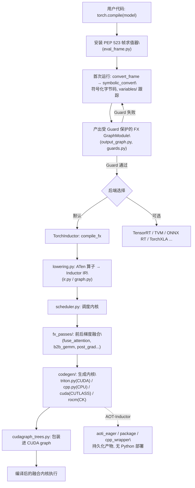

# torch.compile 编译栈（Dynamo + Inductor）

## 一句话理解

> torch.compile 通过 TorchDynamo 钩入 CPython 帧求值 API（PEP 523）把 PyTorch 程序的字节码符号化为受 Guard 保护的 FX 图，再由默认后端 TorchInductor 将其 lower 成融合的 Triton/C++ 内核，构成 PyTorch 新一代 Python 级 JIT 编译栈。

## 为什么重要

- **取代 TorchScript**：Dynamo/Inductor 在训练与推理优化上基本取代了 TorchScript，成为 PyTorch 主流的编译加速路径；TorchScript 现主要作为 C++ 运行时的部署 IR 保留。
- **未修改程序即可加速**：Dynamo 的目标是"让未修改的 PyTorch 程序更快"，无需用户重写模型。
- **算子融合 + 通信/计算重叠**：Inductor 通过融合 pass 与内核生成大幅减少内核启动与访存开销，是大规模训练性能的关键。
- **可定制后端**：后端可插拔（Inductor、TensorRT、TVM、ONNX Runtime、TorchXLA、cuDGRAPH 等），同一套捕获机制服务多种目标。

## 核心概念

### TorchDynamo —— 捕获层
- **PEP 523 帧求值钩子**：Dynamo 安装自定义帧求值器，在执行前动态修改 Python 字节码（`torch/_dynamo/eval_frame.py`）。
- **符号字节码解释**：`symbolic_convert.py` 用 `variables/` 下的变量跟踪器（tensor、nn_module、builder、user_defined、higher_level_ops、optimizer 等）遍历字节码，把 PyTorch 算子序列提取成 FX `GraphModule`（`convert_frame.py`、`output_graph.py`）。
- **Guard（守卫）**：`guards.py` 为生成的图附加假设（形状、dtype、Python 值等）；假设失败时触发重编译或回退 eager，这是 Dynamo 安全性的基石。
- **Graph break**：遇到不支持的构造时拆分图，混合 Python 执行与编译后端，而非整体失败。
- **compiled_autograd**：`compiled_autograd.py` 可编译反向传播，把 autograd 图也纳入编译。

### TorchInductor —— 默认后端
- **入口**：`torch/_inductor/__init__.py` 暴露 `compile(gm, example_inputs, options)`，委托 `compile_fx.compile_fx`。
- **IR 与调度**：`lowering.py` 把 ATen 算子 lower 到 Inductor IR（`ir.py`），`graph.py` 构建计算图，`scheduler.py` 调度内核。
- **融合 pass**：`fx_passes/` 提供前/后梯度融合模式（`fuse_attention.py`、`b2b_gemm.py`、`post_grad.py`、`fsdp.py`、`ddp_fusion.py`、`quantization.py` 等）。
- **代码生成**：`codegen/` 按后端生成内核——`triton.py`（CUDA）、`cpp.py`（CPU）、`cuda/`（CUTLASS 模板）、`rocm/`（CK 模板）、`mps.py` 等。
- **专用内核族**：`kernel/` 含 `mm.py`、`bmm.py`、`conv.py`、`flex/`（flex_attention）等高优内核。
- **CUDA graph**：`cudagraph_trees.py` 管理 CUDA graph replay，减少启动开销。
- **自动调优**：`runtime/` 含 coordinate-descent tuner 与 triton 启发式；`autoheuristic/` 学习 matmul 启发式（A100/H100 排名）。
- **AOT-Inductor**：`aoti_eager.py`、`package/`、`cpp_wrapper_*.py` 可持久化编译产物，用于无 Python 部署。

### FX 作为 IR 基质
Dynamo 产出 FX 图，Inductor 消费 FX `GraphModule`。FX 也是独立的图变换工具（量化、图手术、形状传播）。其 Python 原生 IR 人类可读且可往返源码，对开发者和编译器都理想。

## 工作原理

torch.compile 的端到端流水线如下：用户调用 `torch.compile(model)` 后，Dynamo 安装 PEP 523 帧求值器；首次运行时符号化字节码产出受 Guard 保护的 FX 图；FX 图交给后端（默认 Inductor），Inductor 做 lowering → 调度 → 融合 pass → 生成 Triton/C++ 内核，并常包装进 CUDA graph；AOT-Inductor 还可把产物持久化用于无 Python 部署。

## 我的理解

- Dynamo 的核心难点是**正确性**：要在不改变语义的前提下把 Python 控制流、副作用、闭包等"剥"成纯 FX 图，Guard + graph break 是它妥协与安全的机制——宁可拆图或回退，也不编错。
- Inductor 的核心收益是**融合**：把多个点乘/激活/归约合成一个内核，省访存与启动开销；Triton 让 GPU 内核生成不需要手写 CUDA。
- FX 作为统一 IR 是整个新栈的"脊梁"：Dynamo、Inductor、量化、export 都建立在 FX 之上，这也是为什么 `torch.export` 与 `torch.compile` 共享大量基础设施。
- AOT-Inductor 与 `torch.export` 是互补的部署故事：export 负责"捕获稳定 IR"，Inductor 负责"把 IR 编成快内核"。

## Related

- [torch.fx 图捕获与变换](./pytorch-fx.md) — FX 是 Dynamo/Inductor 的 IR 基质，编译栈的"脊梁"
- [torch.distributed 分布式训练](./pytorch-distributed.md) — Inductor 的 `fx_passes/fsdp.py`、`ddp_fusion.py` 与分布式训练协同优化
- [torch.export 程序导出](./pytorch-export.md) — 共享 FX IR，export 产出可被 Inductor AOT 编译的稳定图
- [Reducer 类设计详解](./pytorch-reducer.md) — DDP 梯度归约协调器，与编译栈在分布式训练中互补

## References

- 源码目录 `torch/_dynamo/`、`torch/_inductor/`
- `torch/_dynamo/eval_frame.py`、`convert_frame.py`、`symbolic_convert.py`、`guards.py`、`output_graph.py`
- `torch/_inductor/compile_fx.py`、`lowering.py`、`ir.py`、`scheduler.py`、`codegen/triton.py`、`fx_passes/`
