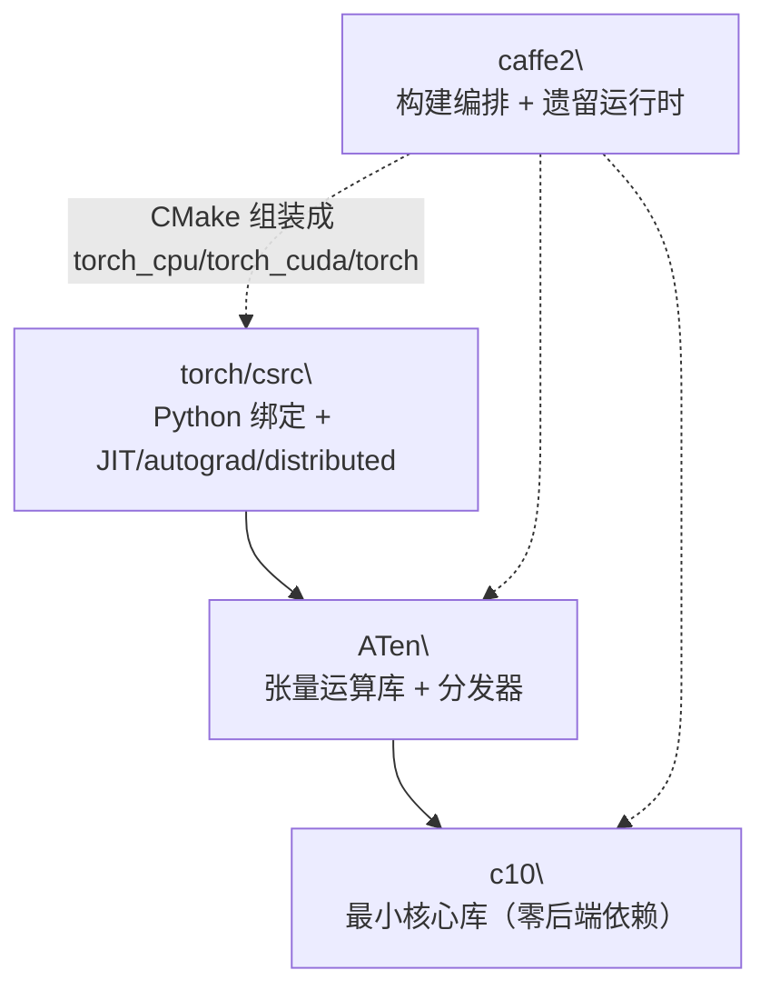

# PyTorch C++ 核心模块

## 一句话理解

> PyTorch 的 C++ 侧由四个模块构成：`c10`（后端无关的最小核心库）、`ATen`（算子实现 + 分发器）、`caffe2`（构建编排 + 遗留运行时）、`torch/csrc`（Python 绑定 + JIT/autograd/distributed 顶层子系统），自底向上层层依赖。

## 为什么重要

这四个模块是整个 PyTorch 的 C++ 地基。Python 侧的所有 API 最终都下沉到这里的 C++ 实现。理解它们的职责边界，是阅读源码、调试性能、扩展自定义算子/后端的前提。其中 `c10::TensorImpl` 是 "张量" 这个概念在 C++ 中的物理表示，几乎所有上层抽象都建立其上。

## 核心概念

四个模块的依赖关系（实线 = 运行时依赖，虚线 = 构建时编排）：

### 1. c10 — 最小 C++ 核心库

**职责**：PyTorch 所有上层模块依赖的最小、后端无关的 C++ 核心库。它故意保持零依赖（`c10/CMakeLists.txt` 明确规定不得依赖任何实现/后端特定库，也不依赖生成的 protobuf 头文件）。

**子目录**：

| 子目录 | 职责 |
| ---- | ---- |
| `core/` | 核心抽象：`TensorImpl`、`Storage`/`StorageImpl`、`Device`/`DeviceType`、`ScalarType`、`DispatchKey`/`DispatchKeySet`、`Allocator`、`Layout`、`MemoryFormat`、`SymInt`/`SymBool`（符号整数，用于动态形状）、`InferenceMode`、`TensorOptions`、`VariableVersion` |
| `core/impl/` | 实现细节：`SizesAndStrides`（张量尺寸/步长的小向量内联存储）、`PyObjectSlot`（延迟 Python 对象绑定） |
| `util/` | 工具类型：`ArrayRef`、`Optional`、`SmallVector`、`intrusive_ptr`、`Exception`、`Half`/`BFloat16`/`Float8_*` 数值类型、`complex`、量化整数类型、安全算术 |
| `mobile/` | 移动端（lite interpreter）支持 |
| `cuda/`、`hip/`、`xpu/` | 后端特定扩展（条件编译） |

**关键类（聚焦职责而非字段）**：

- **`c10::TensorImpl`**（`c10/core/TensorImpl.h`）：张量的底层表示。持有 `Storage`（数据 + dtype/device）及视图元数据（sizes、strides、storage_offset）；侵入式引用计数支持跨语言边界及时释放；`DispatchKeySet key_set_` 决定算子路由；`VariableVersion version_counter_` 供 autograd 检测就地修改。通过 `AutogradMetaInterface`/`AutogradMetaFactory` 间接层，让 libc10.so 能持有由 libtorch.so 拥有的 autograd 元数据而无需硬依赖。结构体大小有编译期预算检查（生产环境张量数量可达数亿）。
- **`c10::Storage`**（`c10/core/Storage.h`）：对 `intrusive_ptr<StorageImpl>` 的薄包装，表示底层数据缓冲。
- **`c10::Device`**（`c10/core/Device.h`）：`final` 结构体，配对 `DeviceType`（枚举：CPU、CUDA、HIP、XPU、MPS、Meta、Vulkan、Metal 等）与 `DeviceIndex`（`int8_t`，-1 表示"当前设备"）。可从字符串如 `"cuda:0"` 构造。
- **`c10::ScalarType`**（`c10/core/ScalarType.h`）：数据类型系统。枚举所有 dtype（含 Half/BFloat16/Float8 低精度与量化类型），提供编译期 `ScalarType`↔C++ 类型双向映射、类型分类与提升/转换规则。
- **`c10::ArrayRef`**（`c10/util/ArrayRef.h`）：改编自 LLVM，对连续数组的非拥有引用（指针 + 长度），可平凡拷贝、按值传递。关键别名 `IntArrayRef = ArrayRef<int64_t>` 被广泛用于张量尺寸/步长。

### 2. ATen — 张量运算库

**职责**：ATen（A Tensor Library）是 C++ 张量运算库，提供算子实现与分发机制。每个张量算子（`add`、`mul`、`conv2d` 等）的各后端内核（CPU、CUDA、HIP、MPS、XPU 等）在此实现，分发器在此路由调用。总头文件是 `aten/src/ATen/ATen.h`。

**子目录**：

| 子目录 | 职责 |
| ---- | ---- |
| `core/` | 分发器与核心类型：`boxing/`（内核参数装箱/拆箱）、`dispatch/`（c10 分发器 `Dispatcher`/`DispatchTable`）、`Tensor.h`/`TensorBase.h`、`TensorAccessor.h`、`ivalue.h`（TorchScript 动态值类型）、`function_schema.h`、`Library.h`（`TORCH_LIBRARY` 注册 API） |
| `native/` | "原生"算子实现，在 `native_functions.yaml` 中声明，按主题组织（Activation、Convolution、Loss、ReduceOps、SoftMax、TensorFactories、TensorShape、TensorIterator、BinaryOps、RNN、LinearAlgebra、QuantizedLinear 等）。含 `DispatchStub.h`、`CPUFallback.h`。`cuda/` 子目录放 CUDA 内核，`quantized/` 放量化内核 |
| `cuda/` | CUDA 后端：`CUDAContext`、`CUDABlas`、`CUDAGeneratorImpl`、`CUDAGraph`、`Atomic.cuh`、`jiterator`（NVRTC 运行时 JIT）、`tunable/`（TunableOp 自动调优） |
| `cpu/` | CPU 向量化：`vec/` 含 `vec128/`、`vec256/`、`vec512/`、`sve/` SIMD 向量类型 |
| `mps/`、`metal/` | Apple Metal Performance Shaders / Metal 后端 |
| `cudnn/`、`miopen/`、`mkl/` | cuDNN/MIOpen（RNN 包装）、MKL（稀疏 BLAS） |
| `functorch/` | functorch（vmap、变换）C++ 实现：`TensorWrapper`、`DynamicLayer`、`Interpreter`、`BatchedFallback` |
| `detail/` | 守卫实现与非 CUDA 后端钩子接口 |

**关键文件**：

- **`at::Tensor`/`TensorBase`**：用户可见的张量句柄，持有 `intrusive_ptr<TensorImpl>`。
- **`TensorIterator`**（`aten/src/ATen/TensorIterator.h`）：元素级/二元/归约算子的核心抽象，处理广播、类型提升、内核分发。
- **`AT_DISPATCH_*` 宏**（`Dispatch.h`）：内核内类型切换。
- **`SparseTensorImpl`/`SparseCsrTensorImpl`/`NestedTensorImpl`/`OpaqueTensorImpl`**：`TensorImpl` 子类，用于非密集布局。
- **`DLConvertor.h` + `dlpack.h`**：DLPack 张量交换格式支持。

### 3. caffe2 — 构建编排与遗留运行时

**职责**：历史上 Caffe2 是独立框架，现已并入 PyTorch。`caffe2/` 目录现在主要作为**顶层构建编排层**，将 ATen、Caffe2 核心工具和 `torch/csrc` 组装成 `torch_cpu`、`torch_cuda`/`torch_hip`、`torch_xpu` 与伞形 `torch` 库。残留运行时代码是一小组核心工具（序列化、线程池、性能内核），用于移动端/边缘端和遗留路径。

**关键证据**：`caffe2/CMakeLists.txt`（约 2000 行）：
- 调用 ATen 构建（`add_subdirectory(../aten aten)`），把 `ATen_CPU_SRCS`、`ATen_CUDA_CPP_SRCS` 等折入 `Caffe2_*` 源列表；
- 通过 `tools/setup_helpers/generate_code.py` 从 `native_functions.yaml` + `tags.yaml` + autograd 模板生成 Torch 源码（`VariableType_*.cpp`、`TraceType_*.cpp`、`Functions.cpp`、`python_functions_*.cpp`、lazy TS backend、AOTI shim）；
- 构建 `torch_cpu`、`torch_cuda`（或 `torch_hip`/`torch_xpu`）与伞形 `torch`；接入分布式（NCCL/Gloo/MPI/UCC）、Flash Attention、MPS/Metal、XPU、LLVM、Kineto、ONNX、移动端构建。

**目录结构**：

- **`core/`**：最小核心（遗留 Caffe2 的重型 `Tensor`/`Blob`/`Net`/`Operator` 类已基本移除或吸收）。
- **`serialize/`**：文件/IO 适配器（`file_adapter`、`istream_adapter`、`in_memory_adapter`、`inline_container`、`crc`），用于模型序列化（尤其是基于 flatbuffer 的移动端格式）。
- **`utils/`**：`string_utils`、`fixed_divisor`，以及 **`threadpool/`**（`ThreadPool`、`WorkersPool`、`pthreadpool`）——提供 inter/intra-op 线程池。
- **`perfkernels/`**：性能内核（`embedding_lookup_idx` 含 AVX2/SVE 变体、`batch_box_cox` AVX512）。

**角色总结**：构建编排（CMakeLists.txt 是组装主库并运行代码生成的中心）+ 边缘/移动端运行时（serialize、perfkernels、移动端 lite-interpreter）+ 线程原语（pthreadpool 线程池供 ATen 并行）+ 遗留兼容（`caffe2::TypeMeta` 仍是 `TensorImpl::data_type_` 的类型擦除对象）。

### 4. torch/csrc — Python↔C++ 绑定层

**职责**：包含所有与 Python 集成相关的代码（与 `lib` 中与 Python 无关的 Torch 库相对）。通过 CPython 和 pybind11 将 C++ 库（c10、ATen、JIT、autograd、distributed）暴露给 Python，并托管 JIT 编译器、autograd 引擎、分布式运行时、AOTI/inductor 与 C++ 前端 API。

**子目录**：

| 子目录 | 职责 |
| ---- | ---- |
| `autograd/` | autograd 引擎与 Python 绑定：`engine.cpp`（反向传播执行引擎）、`function.cpp`/`graph_task.h`/`edge.h`（autograd 图数据结构）、`saved_variable.cpp`、`custom_function.cpp`（`torch.autograd.Function`）、`forward_grad.cpp`（前向模式 AD）、`FunctionsManual.cpp`（手写导数）、`generated/`（代码生成输出：`VariableType_*.cpp`、`Functions.cpp` 等） |
| `jit/` | TorchScript（JIT 编译器/解释器）：`api/`（公共 API）、`ir/`（SSA 中间表示：`Node`/`Value`/`Block`/`Graph`）、`passes/`（优化与 lowering pass）、`codegen/`（fuser）、`frontend/`（解析器/前端）、`serialization/`（pickler、flatbuffer）、`mobile/`（lite 移动端解释器）、`backends/`（自定义后端委托：coreml/nnapi/xnnpack）、`operator_upgraders/`（版本化算子升级器） |
| `api/` | libtorch C++ 前端 API（与 Python 无关）：`include/torch/`（`nn.h`/`optim.h`/`autograd.h`/`data.h` 等公共头）、`src/`（nn/modules、optim、data 实现） |
| `distributed/` | 分布式训练与 RPC：`c10d/`（`ProcessGroup` 后端、`Store`、NCCL/Gloo/UCC、`reducer` DDP 梯度 reducer、`symm_mem/`）、`autograd/`（分布式 autograd 引擎）、`rpc/`（`rpc_agent`、`rref_impl`、`message`） |
| `cuda/` | CUDA Python 绑定：`Stream`、`Event`、`Graph`、`MemPool`、`nccl`、`memory_snapshot`、`GdsFile`（GPUDirect Storage）、可插拔分配器 |
| `dynamo/` | TorchDynamo C++ 支持：`eval_frame.c`/`eval_frame_cpp.cpp`（PEP 523 帧求值）、`guards`、`cache_entry`、`compiled_autograd` |
| `inductor/` | AOTI（Ahead-of-Time Inductor）与 Inductor 运行时：`aoti_torch/`（C shim + 每设备生成的 `c_shim_*.cpp`）、`aoti_runner/`、`aoti_package/`、`aoti_runtime/`、`cpp_wrapper/`、`inductor_ops.cpp` |
| `export/`、`functorch/`、`fx/`、`cpu/`、`mps/`、`mtia/` | 导出工具、functorch init、`torch.fx.Node` C++ 后端、CPU/MPS/MTIA 绑定 |

**`torch/csrc/Module.cpp`**：中央 Python 扩展初始化文件。前 100 行几乎全是 `#include`，拉入所有要暴露给 Python 的子系统，确立其作为将所有 C++ 子系统接入 `_C` Python 扩展模块的单一注册点。

## 工作原理

C++ 侧的运行时数据流可概括为：

1. **Python 调用** → `torch._C` 扩展模块（由 `torch/csrc/Module.cpp` 注册）→ 调入 ATen 算子；
2. **ATen 分发**：算子调用进入 `Dispatcher`，读取输入张量的 `DispatchKeySet`（由 `c10::TensorImpl` 持有），按优先级匹配注册的内核（Autograd 层先剥离，再到后端层 CPU/CUDA/…）；
3. **内核执行**：路由到 `native/` 中的具体实现，元素级算子通常经 `TensorIterator` 处理广播与类型提升后执行；
4. **autograd 记录**：若张量 `requires_grad`，Autograd 分发键层在前向时记录 `Node` 到 DAG，反向时由 `torch/csrc/autograd/engine.cpp` 拓扑遍历执行。

构建时，`caffe2/CMakeLists.txt` 编排一切：调用 `torchgen` 从 YAML 生成 `torch/csrc/autograd/generated/`、`torch/csrc/aten/` 下的代码，再把 c10 + ATen + torch/csrc 源码编译链接为 `torch_cpu`/`torch_cuda`/`torch` 库。

## 我的理解

- **c10 的 "零依赖" 是刻意的工程约束**，不是巧合。它确保核心数据结构可被移动端、推理引擎、独立工具复用，而不会被后端或 Python 拖入。`AutogradMetaInterface` 间接层是这种约束的典型产物——为了让 libc10.so 不硬依赖 libtorch.so 中的 autograd 元数据，引入了工厂接口做类型擦除。
- **ATen 的 `TensorIterator` 是被低估的抽象**。绝大多数元素级/二元/归约算子的复杂度不在数学而在广播、类型提升、内存布局——`TensorIterator` 把这些统一收口，使新算子只需写 "对单个元素做什么"。
- **caffe2 的 "退化" 是架构演化的胜利**：当一个框架的功能被更通用的实现吸收后，把它降级为构建脚手架比维持两套运行时更健康。残留的 `caffe2::TypeMeta` 仍活在 `TensorImpl` 里，是历史包袱的最小化留存。
- **`Module.cpp` 作为单一注册点**是把 "复杂依赖图" 压成 "线性初始化序列" 的实用手法：所有子系统各自提供 `init` 函数，由一个文件统一调用，避免分散注册带来的链接顺序与符号可见性问题。
- **`torch/csrc/api/` 是常被忽略的 libtorch C++ 前端**：它让用户能纯 C++ 写训练脚本（`torch::nn::Module`、`torch::optim::Adam`），不依赖 Python，这是 PyTorch 服务端/C++ 部署的根基。

## Related

- [PyTorch 项目概述](./pytorch-overview/)
- [PyTorch 整体架构](./pytorch-architecture/)
- [Python 包结构](./pytorch-python-package/)

## References

- 源码仓库 `pytorch-main`，版本 `2.9.0a0`
- `c10/CMakeLists.txt`（零依赖约束）
- `c10/core/TensorImpl.h`（张量底层表示）
- `aten/src/ATen/ATen.h`（ATen 总头文件）
- `caffe2/CMakeLists.txt`（构建编排入口）
- `torch/csrc/Module.cpp`（Python 扩展单一注册点）
- `torch/csrc/README.md`（csrc 与 lib 的职责区分）
