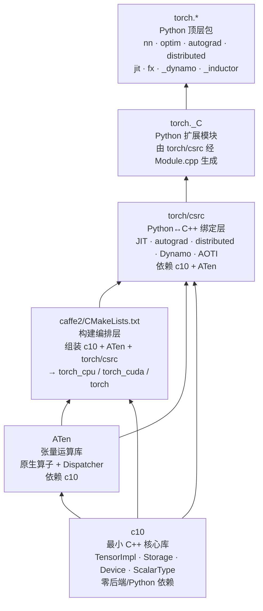

# PyTorch 依赖关系

## 一句话理解

> PyTorch 的依赖是严格自底向上的六层链：c10（零依赖核心）→ ATen（算子+分发）→ caffe2/CMakeLists（构建编排）→ torch/csrc（绑定层）→ torch._C（Python 扩展）→ torch.*（Python 包）；每一层只能依赖下层，编译时再叠加可选后端与第三方库。

## 为什么重要

理解依赖链是阅读 PyTorch 源码的前提。它解释了三件事：

1. **为什么 c10 不能依赖任何后端**：c10 是基石，所有上层都依赖它，如果它依赖 CUDA 或 Python，整个库就被污染。`c10/CMakeLists.txt` 明确规定不得依赖任何实现特定或后端特定库。
2. **改一个算子会牵动哪些层**：schema 改动经 torchgen 生成代码，落到 ATen native、autograd generated、Python 绑定——四层都会重新编译。
3. **如何裁剪构建**：通过 `USE_*` 选项关闭不需要的后端，可以大幅减少编译时间和二进制体积（移动端、边缘端尤其重要）。

## 核心概念

### 模块依赖链（自底向上）

链路要点：

| 层 | 依赖 | 产物 |
| ---- | ---- | ---- |
| **c10** | 无（零后端/Python 依赖） | `libc10.so`：TensorImpl、Storage、Device、ScalarType、DispatchKey、intrusive_ptr、SmallVector |
| **ATen** | c10 | `libATen.so`：`at::Tensor`、`TensorIterator`、Dispatcher、`native/` 算子、各后端内核 |
| **caffe2/CMakeLists.txt** | c10 + ATen + torch/csrc 源码 | `torch_cpu`、`torch_cuda`（或 `torch_hip`/`torch_xpu`）、伞形 `torch` 库；同时触发 torchgen 代码生成 |
| **torch/csrc** | c10 + ATen + JIT/autograd/distributed 库 | Python 扩展模块 `_C`（单一入口 `torch/csrc/Module.cpp` 注册所有子系统） |
| **torch._C** | torch/csrc 编译产物 | CPython 扩展模块，被 `torch/__init__.py` 导入 |
| **torch.\*** | torch._C | 用户可见的 Python 包（nn、optim、autograd 等） |

注意 caffe2 这一层**不是运行时依赖**，而是构建编排：它的 `CMakeLists.txt` 把 c10 + ATen + torch/csrc 的源码组装成最终库并运行代码生成。残留的运行时代码（序列化、线程池、性能内核）只服务移动端/边缘端。

### 编译时第三方依赖

通过 git 子模块管理（见 `setup.py` 中 `get_submodule_folders()`）。关键子模块：

- **通信/系统**：`gloo`（CPU 集合通信）、`cpuinfo`（CPU 探测）、`pthreadpool`（线程池）
- **算子库**：`fbgemm`（量化 8 位服务器算子）、`cutlass`（CUDA 矩阵乘模板）
- **格式**：`onnx`（ONNX 导出）

其他重要第三方库：Eigen、FP16、psimd、FXDIV、sleef、protobuf、pybind11、fmt、nlohmann_json、moodycamel、mimalloc、valgrind-headers。

### 可选后端依赖

通过 `USE_*` CMake 选项控制（见 `CMakeLists.txt` 与 `setup.py` 顶部注释）：

| 选项 | 依赖 |
| ---- | ---- |
| `USE_CUDA` | NVIDIA CUDA、cuDNN（`USE_CUDNN`）、cuSPARSELt、cuDSS、cuFile、NCCL、NVRTC、cuPTI/NVTX、Flash Attention、mem-eff Attention |
| `USE_ROCM` | AMD ROCm、MIOpen、RCCL、aotriton |
| `USE_XPU` | Intel GPU（SYCL/oneAPI）、XCCL |
| `USE_MPS` | Apple Metal Performance Shaders |
| `USE_MKLDNN` | Intel oneDNN（MKLDNN/DNNL） |
| `USE_FBGEMM` | FBGEMM（量化 8 位服务器算子） |
| `USE_DISTRIBUTED` | Gloo、MPI、TensorPipe、UCC、NVSHMEM |
| `USE_KINETO` | libkineto profiler |
| `USE_VULKAN` | Vulkan GPU 后端 |
| `USE_NUMPY` | NumPy 绑定 |
| `USE_OPENMP` | OpenMP 并行 |

### Python 运行时依赖

来自 `setup.py` 的 `install_requires` 与 `requirements.txt`：

- **核心**：`filelock`、`typing-extensions>=4.10.0`、`sympy>=1.13.3`、`networkx>=2.5.1`、`jinja2`、`fsspec>=0.8.5`
- **开发**：`build[uv]`、`expecttest>=0.3.0`、`hypothesis`、`lintrunner`、`optree>=0.13.0`、`psutil`、`wheel`、`typing-extensions>=4.13.2`
- **可选**：`triton`（用于 `torch.compile`/Inductor）、`numpy`（`USE_NUMPY`）、`mkl-static`/`mkl-include`（Linux/macOS BLAS）、`magma`（CUDA LAPACK）、`libuv`（macOS/Windows 分布式）

### Python 版本要求

Python 3.9 或更高（见 `setup.py` 的 `python_min_version = (3, 9, 0)` 与 `pyproject.toml` 的 `requires-python`）。需要完全支持 C++17 的编译器（Linux 上 gcc 9.4.0+）。

## 工作原理

依赖链之所以能严格自底向上，靠的是三个机制：

1. **c10 的零依赖约束**：`c10/CMakeLists.txt` 显式禁止依赖任何实现特定或后端特定库，也不依赖生成的 protobuf 头文件。autograd 元数据通过 `AutogradMetaInterface`/`AutogradMetaFactory` 间接层处理，让 `libc10.so` 能持有由 `libtorch.so` 拥有的 autograd 元数据而无需硬依赖。
2. **侵入式引用计数跨越语言边界**：`c10::intrusive_ptr` 让 `TensorImpl`、`StorageImpl` 等核心对象可在 C++ 与 Python 间共享所有权并及时释放，而不需要每一层都引入对方的类型。
3. **代码生成消除手写胶水**：torchgen 从 YAML schema 生成各层所需的绑定，避免了人工在多层间同步签名——这既保证一致性，也让依赖方向始终是"声明 → 生成 → 消费"。

## 我的理解

PyTorch 的依赖设计有几个值得记住的点：

- **c10 是不可动摇的底座**：它的零依赖不是洁癖，而是工程必需。一旦 c10 依赖了某个后端，所有不使用该后端的构建（移动端、纯 CPU、自定义硬件）都会被拖累。`TensorImpl` 甚至有编译期大小检查，强制结构体大小预算在约 26 个 `int64_t` 字内，因为生产环境张量数量可达数亿。
- **caffe2 名存实亡，只剩 CMake**：历史上 Caffe2 是独立框架，现在 `caffe2/` 目录只剩构建编排（`CMakeLists.txt`）和少量移动端运行时（序列化、线程池、性能内核）。但它仍是构建的"中央调度室"——ATen 的 `add_subdirectory`、torchgen 的触发、主库的组装都在这里发生。
- **torch._C 是唯一的 Python↔C++ 边界**：所有 C++ 子系统通过 `torch/csrc/Module.cpp` 这一个文件注册到 `_C` 扩展模块。这意味着 Python 侧只能通过 `_C` 访问 C++，依赖方向清晰，没有散落的绑定入口。
- **可选后端是正交的**：`USE_*` 选项让 CUDA、ROCm、XPU、MPS 等后端可以独立开关。这不仅是为了支持多硬件，也是为了给移动端/边缘端裁剪出最小构建。`selective_build/` 进一步在算子级别做注册裁剪。

## Related

- [整体架构](./pytorch-architecture/) — 依赖链对应五层分层架构
- [C++ 核心模块](./pytorch-cpp-core/) — c10、ATen、caffe2、torch/csrc 各层详解
- [代码生成 torchgen](./pytorch-torchgen/) — torchgen 在构建时由 caffe2/CMakeLists.txt 触发
- [构建与运行](./pytorch-build-run/) — `USE_*` 环境变量与第三方子模块的实践用法

## References

- 模块依赖：`c10/CMakeLists.txt`、`caffe2/CMakeLists.txt`、`torch/csrc/Module.cpp`
- 第三方子模块：`third_party/`（见 `setup.py` 中 `get_submodule_folders()`）
- 编译选项：`CMakeLists.txt` 与 `setup.py` 顶部注释
- Python 依赖：`requirements.txt`、`pyproject.toml`
