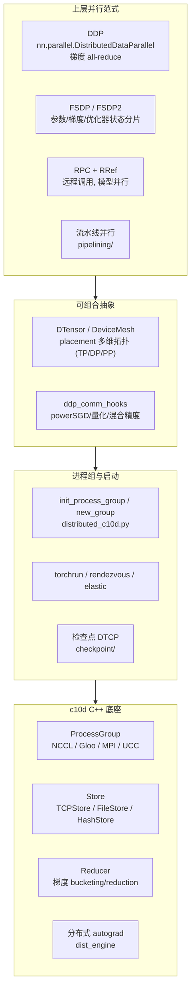

# torch.distributed 分布式训练

## 一句话理解

> torch.distributed 在 c10d（C++ 底座：ProcessGroup + Store）之上构建了 DDP、FSDP、RPC、DTensor/DeviceMesh、弹性训练等上层并行原语，是多进程/多节点训练的统一栈。

## 为什么重要

- 大模型训练离不开分布式；PyTorch 把通信后端（NCCL/Gloo/MPI/UCC）、数据/模型/流水线/张量并行、弹性容错都收敛到 `torch.distributed` 一套体系。
- c10d 是 C++ 性能底座，Python 层提供易用 API 与可组合并行策略，二者协作兼顾性能与灵活性。
- FSDP2 与 DTensor/DeviceMesh 代表了"可组合、逐参数"的新一代设计方向，正在替代 FSDP1 与遗留分片 API。

## 核心概念

### c10d —— C++ 底座（`torch/csrc/distributed/c10d/`）
- **ProcessGroup**：collective 通信抽象基类，实现有 `ProcessGroupGloo`、`ProcessGroupNCCL`、`ProcessGroupMPI`、`ProcessGroupUCC`。
- **Store**：rendezvous/发现服务，含 `TCPStore`、`FileStore`、`HashStore`、`PrefixStore`。
- **Reducer**：DDP 的梯度 bucketing/reduction 引擎（`reducer.cpp`/`reducer_cuda.cpp`），详见 [Reducer 类设计详解](./pytorch-reducer.md)。
- **CommHook**：`default_comm_hooks.cpp`/`python_comm_hook.cpp` 允许替换 allreduce 策略（压缩、量化）。
- **分布式 autograd / RPC 运行时**：`autograd/` 支持跨 RPC 边界的反向（`engine/dist_engine.cpp`、`context/container.cpp`、`sendrpc/recvrpc_backward`）；`rpc/`（tensorpipe_agent、rref_context、python_call）实现远程调用与 RRef。

### Python 关键部分（`torch/distributed/`）
- **核心 API**：`distributed_c10d.py` 提供 `init_process_group`、`new_group`、`destroy_process_group`、collective 包装、`Backend` 解析。
- **启动器**：`rendezvous.py`、`run.py`、`launch.py` 实现 rendezvous + `torchrun`（`setup.py` 的 `entry_points` 注册 `torchrun` → `torch.distributed.run:main`）。
- **DDP**：`torch.nn.parallel.DistributedDataParallel` 包装模型，委托 C++ Reducer 在反向期按桶 all-reduce。
- **FSDP**：`fsdp/`（v1，基于 `_flat_param`）与 `fsdp/_fully_shard/`（FSDP2，可组合逐参数设计，与 DTensor 集成）。
- **DTensor / DeviceMesh**：`tensor/` 与 `device_mesh.py` 提供多维拓扑（TP/DP/PP）+ placement 抽象，支撑 FSDP2 与新的 `tensor.parallel` API。
- **RPC**：`rpc/`（api.py、functions.py、rref_proxy.py）启用远程函数调用与 RRef，用于模型并行。
- **弹性训练**：`elastic/`（local_elastic_agent、rendezvous 的 etcd/c10d/static、metrics、events、timer、control_plane）。
- **检查点**：`checkpoint/`（DTCP：state_dict、planner、storage、filesystem、hf_storage 支持 HF safetensors）。
- **分布式优化器**：`optim/`（`zero_redundancy_optimizer`、`apply_optimizer_in_backward`、`post_localSGD_optimizer`）。
- **流水线并行**：`pipelining/`（schedules、stage、microbatch、_IR、_backward）。
- **算法钩子**：`algorithms/ddp_comm_hooks/`（powerSGD、混合精度、量化）、`join.py`、`model_averaging/`、`_optimizer_overlap/`。
- **对称内存**：`_symmetric_memory/`（节点内 NVSHMEM/triton）。

### c10d / DDP / RPC / FSDP 协作
- c10d 后端提供 `ProcessGroup` + `Store`；`reducer` 是 DDP 的归约引擎。
- DDP 包装模型，Reducer 在反向期 bucket 梯度并经 ProcessGroup 启动 all-reduce；comm hook 可自定义 reduction（如 powerSGD 压缩）。
- RPC + RRef 支持跨进程模型并行与分布式 autograd。
- FSDP 跨 rank 分片参数/梯度/优化器状态；FSDP2 用逐参数可组合设计与 DTensor 集成。
- DTensor/DeviceMesh 是 FSDP2/TP 的高层抽象基底。

## 工作原理

整个分布式栈自底向上分为四层：c10d 通信底座（ProcessGroup + Store + Reducer）→ 进程组/rendezvous 与 torchrun 启动 → DDP/FSDP/RPC 三大并行范式 → DTensor/DeviceMesh 可组合抽象 + 弹性/检查点/流水线工程能力。

## 我的理解

- **DDP 解决数据并行**：每个 rank 持完整模型，反向时 Reducer 把梯度按桶 all-reduce，通信与反向计算重叠；FSDP 解决"模型太大单卡装不下"，把参数/梯度/优化器状态都分片，前向/反向按需 all-gather。
- **FSDP2 的设计转向**：从 FSDP1 的"扁平化大参数"转向"逐参数可组合"，更易与 DTensor、activation checkpointing、编译栈组合，是未来主推方向。
- **DTensor/DeviceMesh 是统一抽象**：把"张量在多维设备网格上的分布"显式化，让 TP/DP/PP 能用同一套 placement 语言表达，FSDP2 与 `tensor.parallel` 都建立在它之上。
- **Reducer 是 DDP 性能与正确性的核心**：跨 rank 桶顺序一致、按序归约避免死锁，是其最精巧之处（详见 Reducer 笔记）。

## Related

- [Reducer 类设计详解](./pytorch-reducer.md) — DDP 的 C++ 心脏，梯度分桶与按序归约的深度解析
- [torch.compile 编译栈](./pytorch-compile.md) — Inductor 的 `fx_passes/fsdp.py`、`ddp_fusion.py` 与分布式协同
- [torch.export 程序导出](./pytorch-export.md) — 导出分布式模型用于部署

## References

- 源码目录 `torch/distributed/`（Python）、`torch/csrc/distributed/`（C++）
- `torch/distributed/distributed_c10d.py`、`rendezvous.py`、`run.py`、`device_mesh.py`、`tensor/`
- `torch/csrc/distributed/c10d/ProcessGroup.hpp`、`ProcessGroupNCCL.cpp`、`reducer.cpp`、`Store.hpp`
