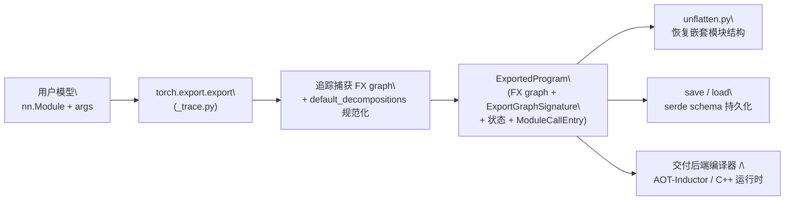

# torch.export 程序导出

## 一句话理解

> torch.export 把 PyTorch 模型捕获为可序列化、可部署的 `ExportedProgram` IR（FX graph + 签名 + 状态 + 动态形状），是提前编译（AOT）与新部署故事的基础，在导出方面取代了部分 TorchScript。

## 为什么重要

- 提供一个**稳定的、可序列化的全图 IR**，让模型脱离 Python 解释器部署到 C++、移动端、边缘设备或后端编译器。
- 与 `torch.compile` 共享 FX 基础设施，但 export 面向"AOT 捕获稳定图"，compile 面向"JIT 加速"——两者互补。
- 动态形状（`Dim`/`Constraint`）让导出图能适应变化的 batch/序列长度，而不必为每个形状重导出。

## 核心概念

### ExportedProgram —— 中心产物
- 定义于 `exported_program.py`，是导出的顶层对象，包含 FX graph、`ExportGraphSignature`、`ModuleCallEntry`/`ModuleCallSignature` 以及状态（参数/buffer/常量）。
- 可经 `save`/`load` 持久化，跨进程跨语言流转。

### ExportGraphSignature —— 图签名
- `graph_signature.py` 描述导出图中的输入/输出/参数/buffer/常量如何映射到 FX 图的 placeholder/输出节点，是"语义还原"的关键。还含 `ExportBackwardSignature` 描述反向签名。

### 动态形状
- `dynamic_shapes.py` 提供 `Dim`、`dims`、`Constraint`、`AdditionalInputs`、`ShapesCollection`，让用户声明哪些维度可变及其范围约束，避免为每个形状重导出。

### unflatten —— 恢复嵌套结构
- `unflatten.py` 的 `FlatArgsAdapter`、`unflatten`、`UnflattenedModule` 把扁平化的导出图还原为嵌套模块调用结构，便于阅读与调试。

### 兄弟内部包 `_export/`
- 含 converter、pass_base、verifier、wrapper、serde schema、db，支撑导出后的图变换、验证与序列化。

## 工作原理

`torch.export.export(model, args)` 通过追踪（`_trace.py`）捕获模型为 FX graph，应用默认分解（`default_decompositions`）规范化算子，再附上签名与状态信息组装成 `ExportedProgram`。导出图可经 `_unlift`/`_swap` 处理 lift/unlift 语义；`unflatten` 还原嵌套模块；`save`/`load` 经 serde 持久化；`draft_export` 提供宽松的草稿导出用于迭代；`_safeguard` 做安全检查；`register_dataclass`/`custom_ops`/`custom_obj` 支持自定义类型。

## 我的理解

- export 的价值在于**稳定性与可移植性**：它产出一个"冻结"的图 IR，部署侧不再依赖 Python 与动态捕获，便于在 C++/移动端推理或交给 Inductor 做 AOT 编译。
- 动态形状是 export 区别于简单 trace 的关键能力——通过 `Dim`/`Constraint` 表达"这个维度可变"，让一张图覆盖一类形状，兼顾灵活性与编译优化。
- export 与 compile 的分工：export 负责"把程序变成稳定可部署的 IR"，compile/Inductor 负责"把 IR 编成快内核"；AOT-Inductor 正是二者交汇点。
- `ExportGraphSignature` 是理解导出图的钥匙：它把扁平的 FX 节点重新映射回参数/buffer/输入/输出的语义角色。

## Related

- [torch.fx 图捕获与变换](./pytorch-fx.md) — ExportedProgram 的内核是 FX graph，二者共享 IR
- [torch.compile 编译栈](./pytorch-compile.md) — 共享 FX IR，export 产出的稳定图可被 Inductor AOT 编译
- [torch.distributed 分布式训练](./pytorch-distributed.md) — 导出分布式模型用于部署
- [Reducer 类设计详解](./pytorch-reducer.md) — DDP 训练侧的梯度归约，与 export 的部署侧互补

## References

- 源码目录 `torch/export/`、兄弟内部包 `torch/_export/`
- `torch/export/__init__.py`、`exported_program.py`、`graph_signature.py`、`dynamic_shapes.py`、`unflatten.py`、`_trace.py`、`_unlift.py`
