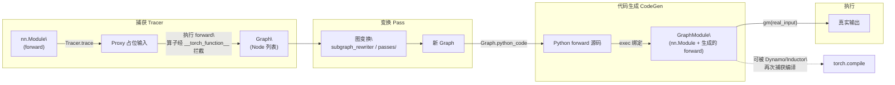

# torch.fx — 图捕获与变换工具

## 一句话理解

> `torch.fx` 是 **Python 到 Python** 的图变换工具包：用符号追踪器（Tracer）把 `nn.Module` 的前向执行记录为 `Graph`（`Node` 列表 IR），对图做变换后再用 CodeGen 发射回可读的 Python `forward` 源码——既是新编译栈（Dynamo/Inductor）的 IR 基质，也是量化、图手术、形状传播的通用底座。

## 为什么重要

FX 是现代 PyTorch 编译栈的"普通话"。`torch.compile`（Dynamo）产出 FX 图，Inductor 消费 FX `GraphModule`；量化（`torch.ao.quantization`）、`torch.export`、自定义后端都以 FX 为中间表示。它的关键优势是 **IR 即 Python 代码**：`Graph` 可往返（round-trip）为人类可读的 `forward` 源码，让开发者与编译器共享同一份可调试、可 diff 的表示。理解 FX 的三组件（Tracer / Graph-Node IR / CodeGen）是理解 PyTorch 2.x 编译体系的前提。

## 核心概念

### 三大组件

| 组件 | 职责 | 关键类 | 位置 |
| ---- | ---- | ---- | ---- |
| **符号追踪器** | 向 `nn.Module` 喂入 `Proxy` 对象运行 `forward`，把算子调用记录为 `Node` 写入 `Graph` | `Tracer`、`symbolic_trace`、`Proxy` | `torch/fx/_symbolic_trace.py`、`torch/fx/proxy.py` |
| **中间表示（IR）** | `Graph`（`Node` 列表）+ `GraphModule`（持有 `Graph` 且 `forward` 由图生成的 `nn.Module`） | `Graph`、`Node`、`GraphModule` | `torch/fx/graph.py`、`torch/fx/node.py`、`torch/fx/graph_module.py` |
| **Python 代码生成** | 把 `Graph` 发射为合法 Python 源码，绑定到 `GraphModule.forward` | `PythonCode`、`CodeGen` | `torch/fx/graph.py`（`Graph.python_code`） |

### Node 的六种 op

`Node` 是 IR 的原子单元，含 `op`（类型）、`target`（被调用对象）、`args`/`kwargs`、`name`、`users`（反向引用）。合法 `op` 取值固定为六种：

| op | 语义 | 典型 target |
| ---- | ---- | ---- |
| `placeholder` | 图输入（函数参数） | 参数名 str |
| `call_function` | 调用无状态函数 | `torch.add`、`F.relu` |
| `call_method` | 调用张量方法 | `"view"`、`"relu"` |
| `call_module` | 调用子模块 | 模块限定名 str |
| `get_attr` | 取模块属性（参数/buffer） | 属性名 str |
| `output` | 图输出 | 输出值（可元组） |

这种受限 op 集合让图变换（模式匹配、重写）可机械处理，又因 args 可含嵌套结构而表达力足够。

### 关键类

- **`Tracer`**：`trace(root)` 创建 `Proxy` 作为输入，`__torch_function__` 协议拦截算子调用并 emit `Node`，最终返回 `Graph`。`symbolic_trace` 是其便捷包装。
- **`Graph`**：`Node` 的有序容器，提供 `nodes` 迭代器、`create_node`/`call_function`/`call_module` 等 emit API、`lint`（合法性检查）、`python_code`（CodeGen）、`eliminate_dead_code`、`on_generate_code`（注入自定义 codegen 钩子）。
- **`Node`**：单个算子记录，`users` 字段给出"谁用了我"，构成 use-def 链；`args`/`kwargs` 中引用其他 `Node` 构成 def-use 链。
- **`GraphModule`**：`nn.Module` 子类，`__init__` 时把 `Graph` 发射为 `forward` 源码并 `exec` 绑定；同时从原模块拷贝 `call_module`/`get_attr` 引用的子模块与参数。它既是图容器又是可执行模块，可像普通 `nn.Module` 一样 `to(device)`、`forward(x)`。
- **`Proxy`**：追踪时的"占位张量"，任何对其调用的算子都被 Tracer 记录；自定义 `Proxy` 子类可扩展可追踪语义。
- **`Interpreter`**：逐 `Node` 执行 `Graph`，可注入自定义钩子（用于 shape propagation、调试、Profiling）。
- **`subgraph_rewriter`**：模式匹配图重写，把匹配的子图替换为另一子图——融合/分解 pass 的常用工具。

## 工作原理

### 三组件如何串联

1. **Tracer** 用 `Proxy` 替换模块的输入参数，调用 `forward`。每个 `Proxy` 上的算子通过 `__torch_function__` 被 Tracer 拦截，emit 一个对应 `Node` 到 `Graph`。`call_module` 路径记录子模块调用，`get_attr` 记录参数/buffer 读取。
2. **Graph** 此时是纯 IR，可被任意变换：删节点、改 target、重连 args、模式匹配替换。`passes/`（如 `shape_prop` 形状传播、`reinplace` 就地化）与外部 pass 在此操作。
3. **CodeGen** 调 `Graph.python_code`，把每个 `Node` 翻译成一行 Python（`call_function` → `_0 = torch.add(_x, 1)` 等），拼接成 `forward` 函数源码。
4. **GraphModule** 用 `exec` 编译该源码为 `forward` 方法，并从原模块拷贝被 `call_module`/`get_attr` 引用的子模块与参数。此后 `gm(x)` 即可真实执行，行为与原模块一致（若变换未改语义）。

### 为什么用 Proxy + `__torch_function__` 而非 AST 解析

TorchScript scripting 走 AST 解析，受限于 Python 子集；FX tracing 走"实际执行 + 算子拦截"，能用任意 Python 控制流（`if`/`for`），代价是**控制流被烧死**（与 jit.trace 同理）。对数据依赖分支，FX 同样需 `concrete_args` 或 `torch.fx.experimental.unification` 等手段处理。这种取舍让 FX 捕获率高于 scripting，但语义保真度依赖"前向无输入依赖分支"。

### GraphModule 的双向性

`GraphModule` 既是图容器又是 `nn.Module`：变换图后 `recompile()` 重新生成 `forward`；同时 `state_dict()`、`to()`、`eval()` 等 Module 协议照常工作。这意味着任何消费 `nn.Module` 的下游（优化器、DDP、JIT、Dynamo）都能直接消费 `GraphModule`——这是 FX 能无缝嵌入现有生态的关键。

## 我的理解

- FX 的设计哲学是 **"IR 即代码"**：不像 TorchScript IR 是 C++ 内部 SSA 图，FX `Graph` 可 1:1 发射回可读 Python。这让 pass 的正确性可用 `diff` 验证、让调试时能直接 `print(gm.code)` 看变换结果、让不写编译器的工程师也能写图变换。代价是表达力受限于"能被 Python 源码表达"，且 `call_module` 与 `get_attr` 需要把状态拷到 GraphModule。
- FX 与 TorchScript 的分工：TorchScript IR 为"脱离 Python 部署"而生（C++ 解释器可直接跑 SSA）；FX IR 为"Python 内的图变换"而生（可往返源码、可被 Python 编译器消费）。`torch.compile` 选 FX 而非 TorchScript IR，正是因为 Dynamo 本就在 Python 帧层工作，FX 的 Python 原生性让二者衔接天然。
- `Node` 的六种 op 是**精心收窄的指令集**：把异构的"函数调用/方法调用/子模块/属性读取/输入输出"统一为有限的 op 类别，使模式匹配（如 `subgraph_rewriter`）能写成对 op kind 的分派，而非对任意 Python 表达式的解析。这是 FX 可机械变换的根基。
- FX tracing 的"烧死控制流"与 `torch.jit.trace` 是同一类问题，解法也类似：对含控制流的模块用 `concrete_args` 固化部分输入、或改写为无分支形式。Dynamo 通过字节码符号解释解决了这一限制，是它相对 FX tracing 的核心进步。
- FX 在量化中的角色典型：`torch.ao.quantization` 的 FX 图模式量化先 `symbolic_trace` 得到图，插入 observer 节点、做 calibration、再把 `call_function` 的 float 算子替换为 quantized 算子（模式匹配重写），最后 `GraphModule` 重新编译为量化模型。整个过程对用户是"输入一个 Module，输出一个量化 Module"，FX 让这种"图变换即工具"的范式成为可能。
- `Interpreter` 是被低估的组件：逐节点执行 `Graph` 时插入钩子，就能做形状传播（`shape_prop`）、dtype 传播、内存估算、逐节点 Profiling——这些都是编译器与调试工具的基础能力，而 FX 让它们只需写一个 `Interpreter` 子类即可。

## Related

- [torch.jit](./pytorch-jit/) — TorchScript C++ IR，与 FX Python IR 互补
- [torch.compile 编译栈](./pytorch-compile/) — Dynamo 产出 FX 图、Inductor 消费 FX GraphModule
- [torch.autograd](./pytorch-autograd/) — FX 捕获前向图，autograd 在其上构建反向
- [程序导出 export](./pytorch-export/) — ExportedProgram 以 FX Graph 为底座
- [torch.nn](./pytorch-nn/) — symbolic_trace 的输入是 nn.Module，GraphModule 也是 nn.Module

## References

- `torch/fx/` 整个目录，`torch/fx/__init__.py` 文档字符串
- `torch/fx/_symbolic_trace.py` — `Tracer`、`symbolic_trace`
- `torch/fx/graph.py` — `Graph`、`PythonCode`/`CodeGen`
- `torch/fx/node.py` — `Node` 与六种 op
- `torch/fx/graph_module.py` — `GraphModule`
- `torch/fx/proxy.py` — `Proxy`
- `torch/fx/interpreter.py` — `Interpreter`
- `torch/fx/subgraph_rewriter.py` — 模式匹配重写
- `torch/fx/passes/` — `shape_prop`、`reinplace` 等变换 pass
