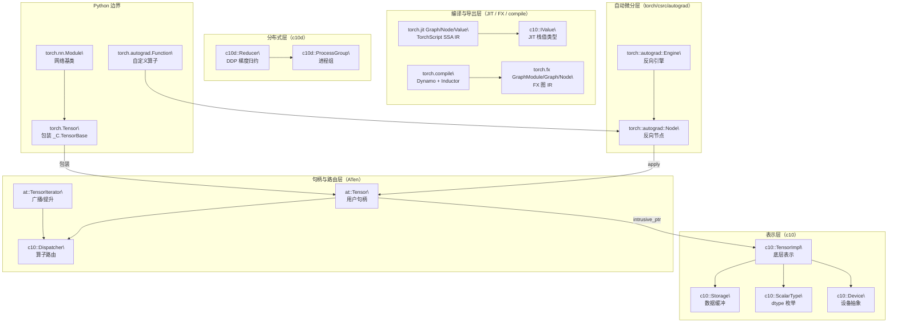

# PyTorch 关键类与函数参考

## 一句话理解

> 这是一张速查表：C++ 侧从 `TensorImpl`（底层表示）到 `at::Tensor`（用户句柄）再到 `Dispatcher`（路由）、`Engine`（autograd）、`Graph`（JIT IR）；Python 侧从 `torch.Tensor` 到 `nn.Module`、`autograd.Function`、`torch.compile`，两类通过 `torch._C` 这一边界对接。

## 为什么重要

阅读 PyTorch 源码时，记住这二十多个核心类/函数的职责与关系，就能在调用栈里快速定位："这一层在做什么、应该去哪里找实现"。它们是五层架构的骨架节点，也是调试与扩展时的主要抓手。

## 核心概念

### C++ 核心类

| 类 | 路径 | 说明 |
| ---- | ---- | ---- |
| `c10::TensorImpl` | `c10/core/TensorImpl.h` | 张量底层表示：持有 Storage、DispatchKeySet、VariableVersion、sizes/strides |
| `c10::Storage` | `c10/core/Storage.h` | 数据缓冲包装（`intrusive_ptr<StorageImpl>`） |
| `c10::Device` | `c10/core/Device.h` | 设备抽象（DeviceType + DeviceIndex） |
| `c10::ScalarType` | `c10/core/ScalarType.h` | 数据类型枚举与提升规则 |
| `c10::IntArrayRef` | `c10/util/ArrayRef.h` | 连续数组的非拥有引用（`ArrayRef<int64_t>`） |
| `at::Tensor` | `aten/src/ATen/core/Tensor.h` | 用户可见张量句柄（`intrusive_ptr<TensorImpl>`） |
| `at::TensorIterator` | `aten/src/ATen/TensorIterator.h` | 元素级/二元/归约算子核心抽象，处理广播与类型提升 |
| `c10::Dispatcher` | `aten/src/ATen/core/dispatch/Dispatcher.h` | 分发器，根据 DispatchKeySet 路由算子到内核 |
| `torch::autograd::Node` | `torch/csrc/autograd/function.h` | autograd 图中的反向节点基类 |
| `torch::autograd::Engine` | `torch/csrc/autograd/engine.h` | 反向传播执行引擎（多线程拓扑遍历 autograd 图） |
| `torch::jit::Graph`/`Node`/`Value`/`Block` | `torch/csrc/jit/ir/ir.h` | TorchScript SSA IR |
| `c10::ivalue::IValue` | `aten/src/ATen/core/ivalue.h` | TorchScript 栈式解释器用的标记联合动态值类型 |
| `c10d::ProcessGroup` | `torch/csrc/distributed/c10d/ProcessGroup.hpp` | 分布式进程组基类 |
| `c10d::Reducer` | `torch/csrc/distributed/c10d/reducer.cpp` | DDP 梯度 bucketing/reduction 引擎 |

### Python 核心类/函数

| 类/函数 | 路径 | 说明 |
| ---- | ---- | ---- |
| `torch.Tensor` | `torch/_tensor.py` | 用户可见张量类，包装 `torch._C.TensorBase` |
| `torch.autograd.Function` | `torch/autograd/function.py` | 自定义 autograd 算子（重写 forward/backward） |
| `torch.autograd.backward`/`grad` | `torch/autograd/__init__.py` | 计算梯度，调用 C++ ImperativeEngine |
| `torch.no_grad`/`enable_grad`/`inference_mode` | `torch/autograd/grad_mode.py` | 梯度模式上下文管理器 |
| `torch.nn.Module` | `torch/nn/modules/module.py` | 所有神经网络模块的基类 |
| `torch.nn.Parameter` | `torch/nn/parameter.py` | 注册为参数的张量 |
| `torch.nn.functional`（`F`） | `torch/nn/functional.py` | 无状态神经网络函数 |
| `torch.optim.Optimizer` | `torch/optim/optimizer.py` | 优化器基类 |
| `torch.jit.script`/`trace` | `torch/jit/_script.py`、`torch/jit/_trace.py` | TorchScript 捕获 |
| `torch.fx.GraphModule`/`Graph`/`Node` | `torch/fx/` | FX 图 IR |
| `torch.fx.symbolic_trace` | `torch/fx/_symbolic_trace.py` | 符号追踪 nn.Module |
| `torch.compile` | `torch/__init__.py` | Dynamo + Inductor 编译入口 |
| `torch.distributed.init_process_group` | `torch/distributed/distributed_c10d.py` | 初始化分布式进程组 |
| `torch.export.export` | `torch/export/__init__.py` | 导出 ExportedProgram |
| `torch.utils.data.DataLoader`/`Dataset` | `torch/utils/data/` | 数据加载管线 |
| `torch.utils.cpp_extension` | `torch/utils/cpp_extension.py` | 构建/加载自定义 C++/CUDA 扩展 |
| `torch.library.Library` | `torch/library.py` | 自定义算子注册 |

## 工作原理

### 如何理解这些类

这些类不是孤立的，它们沿着"表示 → 句柄 → 路由 → 执行 → 编译"五个层次组织。理解它们的关系，就能在调用栈里定位自己处于哪一层。

### 几条关键的"持有"与"调用"关系

1. **表示与句柄分离**：`c10::TensorImpl` 是真正的张量底层表示，`at::Tensor` 只是 `intrusive_ptr<TensorImpl>` 的薄句柄。Python 侧的 `torch.Tensor` 再包装 `torch._C.TensorBase`（由 `TensorImpl` 暴露）。三层共享同一份 `TensorImpl`，靠侵入式引用计数管理生命周期。
2. **Dispatcher 是算子的路由器**：每个 `at::Tensor` 携带 `DispatchKeySet`（在 `TensorImpl` 里），调用算子时 `Dispatcher` 据此查找内核。`TensorIterator` 是元素级算子的辅助抽象，内部仍走 `Dispatcher`。
3. **autograd 透明挂在 eager 路径上**：前向时每个算子记录一个 `Node`（grad_fn）和到输入的边，构建 DAG；`backward` 调用 `Engine` 拓扑排序逐节点 `apply`。Python `torch.autograd.Function` 通过 `PyNode` 让 C++ 回调 Python 的 `backward`。
4. **两套图 IR 并存**：`torch.jit` 的 `Graph`/`Node`/`Value`/`Block` 是 TorchScript 的 SSA IR（C++ 原生，用 `IValue` 做栈值）；`torch.fx` 的 `GraphModule`/`Graph`/`Node` 是 FX 的 Python 原生 IR。`torch.compile` 走 FX 路径：Dynamo 产出 FX 图，Inductor 消费它。
5. **分布式是叠加层**：`ProcessGroup` 是集合通信的抽象（NCCL/Gloo/UCC 后端），`Reducer` 在 DDP 反向时 bucket 梯度并通过 `ProcessGroup` 启动 all-reduce。它们不改变 `TensorImpl`/`at::Tensor` 的结构，只在反向时介入。

### C++ 与 Python 的对应

许多关键类型有"C++ 实现 + Python 包装"的双面性：

| C++ | Python | 关系 |
| ---- | ---- | ---- |
| `c10::TensorImpl` / `at::Tensor` | `torch.Tensor`（`torch._C.TensorBase`） | Python 包装 C++ 句柄，共享 `TensorImpl` |
| `torch::autograd::Node` | `torch.autograd.Function`（`THPFunction`/`PyNode`） | `PyNode` 让 C++ 引擎回调 Python `backward` |
| `torch::autograd::Engine` | `torch._C._ImperativeEngine` | Python `backward`/`grad` 调用 C++ 引擎 |
| `torch::jit::Graph`/`Node` | `torch.jit.ScriptModule` | script/trace 产出 C++ IR，Python 侧包装 |
| `c10d::ProcessGroup` | `torch.distributed.ProcessGroup` | Python 侧是 C++ 类的绑定 |

## 我的理解

记忆这张表的关键是抓住两条主线：

- **张量主线**：`TensorImpl`（表示）→ `at::Tensor`（句柄）→ `torch.Tensor`（Python 包装）。三者共享同一份 `TensorImpl`，靠 `intrusive_ptr` 跨语言持有。理解这条线就理解了"为什么 Python 里改张量、C++ 里能看到，反之亦然"。
- **执行主线**：eager 路径是 `at::Tensor` → `Dispatcher` → 后端内核 → `Node` 记录 → `Engine` 反向；编译路径是 `torch.compile` → Dynamo（FX 图）→ Inductor（Triton/C++ 内核）。两条主线在 `at::Tensor` 汇合——无论是 eager 还是编译，最终都要落到 `TensorImpl` 持有的数据上。

分布式（`ProcessGroup`/`Reducer`）和导出（`torch.export`）则是正交的叠加层：分布式在反向时介入通信，导出把 eager/编译后的图序列化。它们复用底层表示，但不改变核心数据结构。

## Related

- [整体架构](./pytorch-architecture/) — 这些类在五层架构中的位置
- [C++ 核心模块](./pytorch-cpp-core/) — c10、ATen、torch/csrc 各模块详解
- [自动微分 autograd](./pytorch-autograd/) — `Node`/`Engine`/`Function` 的深入工作机制
- [代码生成 torchgen](./pytorch-torchgen/) — C++ 表中 `TensorImpl`、`Dispatcher` 相关的注册代码由 torchgen 生成
- [依赖关系](./pytorch-dependencies/) — 这些类所属模块的依赖方向

## References

- C++ 头文件：见上表"路径"列，均为 `pytorch-main` 仓库内相对路径
- Python 源文件：见上表"路径"列
- 单一注册入口：`torch/csrc/Module.cpp`（所有 C++ 类经此暴露给 `torch._C`）
