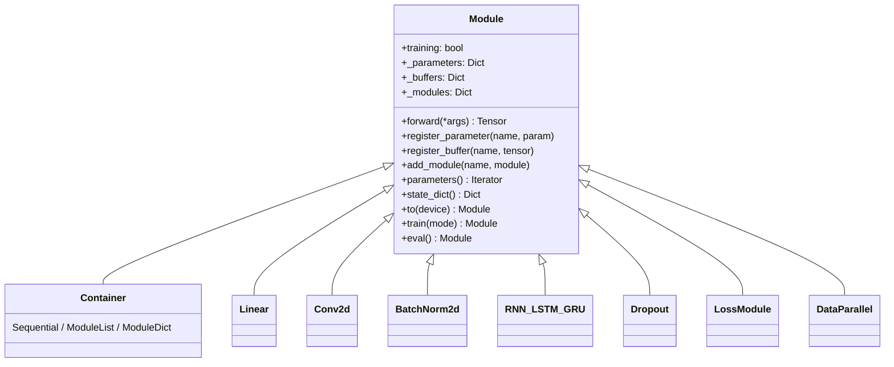
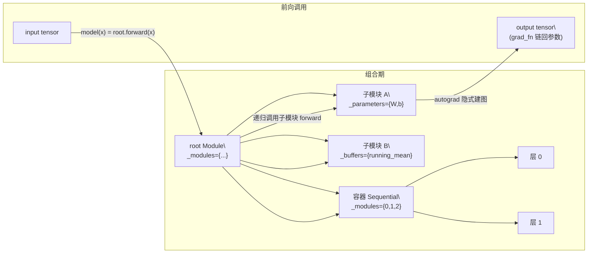

# torch.nn — 神经网络层

## 一句话理解

> `torch.nn` 是构建神经网络的积木箱：以 `Module` 基类表达"可组合的有状态计算单元"，以 `Parameter`/`Buffer` 管理张量状态，以 `functional`（`F`）提供无状态算子，与 autograd 深度集成实现"定义即训练"。

## 为什么重要

`torch.nn` 是用户接触最频繁的子包——几乎所有 PyTorch 模型都是 `nn.Module` 的子类组合。它把"参数容器 + 前向计算 + autograd 求导 + 序列化 + 设备迁移"封装成一致的 API（`model(x)`、`model.backward()`、`model.to(device)`、`model.state_dict()`），让用户专注于网络结构而非样板代码。理解 `Module` 的组合机制与 `Parameter` 的注册语义，是看懂任何 PyTorch 模型实现的前提。

## 核心概念

### Module 类层次

`Module` 的核心是三个字典：`_parameters`（`Parameter`）、`_buffers`（非梯度张量，如 BN 的 running mean/var）、`_modules`（子模块）。这种**递归组合**让任意复杂的网络都能以树形结构组织，`parameters()`/`state_dict()` 自动递归收集整棵树。

### 关键类

| 类 | 作用 | 位置 |
| ---- | ---- | ---- |
| `Module` | 所有网络模块基类，定义组合、参数注册、子模块管理、训练/推理模式、设备迁移、序列化钩子 | `torch/nn/modules/module.py` |
| `Parameter` | `Tensor` 子类，默认 `requires_grad=True`，注册到 `Module._parameters` 后会被优化器与 `state_dict` 识别 | `torch/nn/parameter.py` |
| `Buffer` | 非梯度但需随模块迁移/保存的张量（如 BN 统计量），注册到 `_buffers` | `torch/nn/parameter.py` |
| `UninitializedParameter`/`UninitializedBuffer` | 惰性张量，首次 forward 时才根据输入形状实例化（`LazyLinear` 等的基础） | `torch/nn/parameter.py` |
| `Sequential`/`ModuleList`/`ModuleDict` | 容器，按顺序/列表/字典组织子模块 | `torch/nn/modules/container.py` |
| `functional`（`F`） | 无状态算子命名空间（`F.relu`、`F.conv2d`、`F.cross_entropy`…），层模块通常是 `F` 算子的有状态包装 | `torch/nn/functional.py` |

### 典型层模块

| 类别 | 代表类 | 位置 |
| ---- | ---- | ---- |
| 全连接 | `Linear`、`LazyLinear`、`Bilinear`、`Identity` | `torch/nn/modules/linear.py` |
| 卷积 | `Conv1d`–`Conv3d`、转置卷积、`Fold`/`Unfold` | `torch/nn/modules/conv.py` |
| 归一化 | `BatchNorm1d`–`BatchNorm3d`、`SyncBatchNorm` | `torch/nn/modules/batchnorm.py` |
| 循环 | `RNN`、`LSTM`、`GRU` | `torch/nn/modules/rnn.py` |
| 池化/填充/Dropout | `pooling.py`、`padding.py`、`dropout.py` | `torch/nn/modules/` |
| 损失 | `MSELoss`、`CrossEntropyLoss`、`NLLLoss` 等 | `torch/nn/modules/loss.py` |
| 注意力 | `bias.py`、`_utils.py` | `torch/nn/modules/attention/` |
| 数据并行 | `DataParallel` | `torch/nn/modules/parallel/` |

### 配套工具

- `torch/nn/init.py`：权重初始化（`kaiming_uniform_`、`xavier_uniform_`、`zeros_` 等，约定尾下划线表示就地）。
- `torch/nn/grad.py`：梯度工具（如 `grad_norm`）。
- `torch/nn/utils/`：`clip_grad.py`（梯度裁剪）、`parametrize.py`（参数化，如权重归一化、正交约束）、`prune.py`（剪枝）、`weight_norm.py`、`rnn.py`（打包序列 `PackedSequence`）、`stateless.py`（无状态调用模块）、`fusion.py`（Conv+BN 融合）。
- `torch/nn/qat/`：量化感知训练模块。
- `torch/nn/parallel/`：`DataParallel`（单机多卡数据并行，模型复制 + 输出聚合）。

## 工作原理

### Module 的组合与调用模式

1. **组合期**：在 `__init__` 中通过 `self.layer = nn.Linear(...)` 赋值，`Module.__setattr__` 自动把 `Parameter`/`Module` 分别登记到 `_parameters`/`_modules`。这一约定让用户无需手写注册代码。
2. **前向调用**：`model(x)` 触发 `__call__` → `forward`。`__call__` 还负责执行前后钩子（`register_forward_pre_hook`/`forward_hook`）与 `full_backward_hook`。算子执行时 autograd 自动在后台建反向图，输出张量的 `grad_fn` 链最终回溯到所有 `Parameter`。
3. **训练循环**：`loss.backward()` 由 autograd 引擎把梯度写入各 `Parameter.grad`；`optimizer.step()` 读 `.grad` 更新参数；`optimizer.zero_grad()` 清空 `.grad`。

### Parameter 与 Buffer 的语义差异

- `Parameter`：默认 `requires_grad=True`，被 `optimizer` 跟踪，进入 `parameters()` 迭代器与 `state_dict()`。
- `Buffer`：`requires_grad=False`，不进优化器，但随 `model.to(device)` 迁移、随 `state_dict()` 保存——用于 BN running stats、位置编码等"需持久化但不可训练"的状态。

### 训练/推理模式

`model.train()` / `model.eval()` 切换 `self.training` 标志并递归设置所有子模块。`Dropout`、`BatchNorm` 等层据此改变前向行为（Dropout 在推理时恒等，BN 在推理时用 running stats 而非 batch stats）。这是新手常踩的坑：评估前忘调 `.eval()` 会导致指标异常。

## 我的理解

- `nn.Module` 的真正威力不在"提供了多少层"，而在**统一的组合/状态/迁移协议**。任何自定义层只要继承 `Module` 并在 `__init__` 里赋值子模块/参数，就自动获得序列化、设备迁移、钩子、参数迭代等能力——这是 PyTorch 生态可组合性的根基。
- `functional`（`F`）与 `Module` 的关系是"无状态算子 + 有状态包装"。`nn.Linear` 内部就是 `F.linear(input, self.weight, self.bias)`。需要可学习参数时用 `Module`，纯函数式变换时直接用 `F`，二者通过同一组底层算子（ATen）实现，无性能差异。
- `Module` 与 autograd 是**解耦但协作**的：`Module` 本身不懂求导，它只负责组织参数与调用 `forward`；autograd 在算子层面隐式工作。`optimizer` 则把二者粘合——它通过 `Module.parameters()` 拿到 `Parameter` 列表，再读 autograd 产出的 `.grad` 做更新。
- `Lazy*` 模块用 `UninitializedParameter` 推迟形状确定到首次前向，省去手动指定 `in_features`，但首次前向有额外开销，且对图捕获（JIT/FX）需特别处理。
- `DataParallel` 是单机多卡的轻量方案（线程级模型复制 + scatter/gather），多机训练应改用 `torch.nn.parallel.DistributedDataParallel`（见 [分布式训练](./pytorch-distributed/)），后者基于 c10d `Reducer` 做梯度 bucketing all-reduce，效率与可扩展性远优于前者。

## Related

- [torch.autograd](./pytorch-autograd/) — Module 的训练依赖 autograd 计算梯度
- [torch.optim](./pytorch-optim/) — 优化器消费 Module.parameters() 的 .grad
- [torch.jit](./pytorch-jit/) — script/trace 捕获 nn.Module 为可部署 IR
- [torch.fx](./pytorch-fx/) — symbolic_trace 把 nn.Module 转为 GraphModule
- [分布式训练](./pytorch-distributed/) — DistributedDataParallel 包装 Module

## References

- `torch/nn/` 整个目录
- `torch/nn/modules/module.py` — `Module` 基类
- `torch/nn/parameter.py` — `Parameter`/`Buffer`
- `torch/nn/functional.py` — `F` 命名空间
- `torch/nn/init.py` — 初始化函数
- `torch/nn/utils/` — 梯度裁剪、参数化、剪枝等工具
